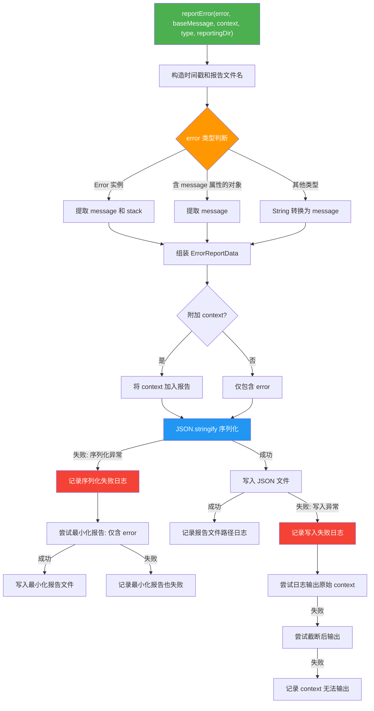

# errorReporting.ts

## 概述

`errorReporting.ts` 是 Gemini CLI 核心包中的错误报告工具模块。该模块的核心功能是将运行时发生的错误信息（包括错误对象本身和相关上下文，如聊天历史或请求内容）序列化为 JSON 文件并写入临时目录，同时通过调试日志记录器输出错误信息。该模块实现了多层容错机制，确保即使在报告生成过程本身出错时（如 JSON 序列化失败、文件写入失败），也能尽最大努力保留和输出有用的诊断信息。

**文件路径**: `packages/core/src/utils/errorReporting.ts`

## 架构图（Mermaid）



## 核心组件

### 1. 接口 `ErrorReportData`

```typescript
interface ErrorReportData {
  error: { message: string; stack?: string } | { message: string };
  context?: unknown;
  additionalInfo?: Record<string, unknown>;
}
```

定义错误报告的数据结构：

| 字段 | 类型 | 说明 |
|------|------|------|
| `error` | `{ message: string; stack?: string }` | 错误核心信息，必须包含消息，可选包含调用栈 |
| `context` | `unknown` (可选) | 错误发生时的上下文数据（如聊天历史、请求内容等） |
| `additionalInfo` | `Record<string, unknown>` (可选) | 额外的附加诊断信息 |

### 2. 函数 `reportError(error, baseMessage, context?, type?, reportingDir?): Promise<void>`

**功能**: 生成错误报告 JSON 文件并写入临时目录，同时通过调试日志输出相关信息。

**参数说明**:

| 参数 | 类型 | 默认值 | 说明 |
|-----|------|--------|------|
| `error` | `Error \| unknown` | - | 错误对象，支持任何类型 |
| `baseMessage` | `string` | - | 日志输出的基础消息前缀 |
| `context` | `Content[] \| Record<string, unknown> \| unknown[]` (可选) | - | 错误上下文，如聊天历史、请求内容等 |
| `type` | `string` | `'general'` | 错误类型标识符，用于报告文件命名（如 `'startChat'`、`'generateJson-api'`） |
| `reportingDir` | `string` | `os.tmpdir()` | 报告文件的输出目录（默认为系统临时目录，可通过参数覆盖以便测试） |

**执行流程**:

#### 步骤 1：生成报告文件路径
- 生成 ISO 格式时间戳，将 `:` 和 `.` 替换为 `-` 以确保文件名合法。
- 文件名格式: `gemini-client-error-{type}-{timestamp}.json`
- 完整路径: `{reportingDir}/gemini-client-error-{type}-{timestamp}.json`

#### 步骤 2：错误对象标准化
按优先级处理不同类型的错误输入：
1. **`Error` 实例**: 提取 `message` 和 `stack` 属性。
2. **含 `message` 属性的对象**: 仅提取 `message`（转为字符串）。
3. **其他类型**: 使用 `String()` 强制转换为消息字符串。

#### 步骤 3：组装报告数据
- 创建 `ErrorReportData` 对象，包含标准化的错误信息。
- 如果提供了 `context`，将其附加到报告数据中。

#### 步骤 4：JSON 序列化（带容错）
- 尝试使用 `JSON.stringify(reportContent, null, 2)` 美化序列化。
- **序列化失败时**（如 context 中包含 `BigInt` 等不可序列化类型）：
  - 记录序列化失败日志。
  - 尝试仅序列化 error 部分（排除 context）的最小化报告。
  - 若最小化报告也失败，记录最终失败日志。

#### 步骤 5：文件写入（带容错）
- 尝试使用 `fs.writeFile` 写入报告文件。
- **写入成功**: 输出报告文件路径。
- **写入失败**:
  - 记录写入失败日志和原始错误。
  - 尝试直接通过日志输出 context 对象。
  - 若日志输出也失败，尝试截断后输出（前 1000 个字符）。
  - 若截断输出也失败，记录 context 无法输出。

## 依赖关系

### 内部依赖

| 依赖模块 | 导入内容 | 用途 |
|---------|---------|------|
| `./debugLogger.js` | `debugLogger` | 调试日志记录器，用于输出错误信息到调试日志 |

### 外部依赖

| 依赖包 | 导入内容 | 用途 |
|-------|---------|------|
| `node:fs/promises` | `fs` | 异步文件系统操作，用于写入报告文件 |
| `node:os` | `os` | 获取操作系统临时目录路径 |
| `node:path` | `path` | 路径拼接操作 |
| `@google/genai` | `Content` (类型) | Google GenAI SDK 的内容类型定义，用于类型化 context 参数 |

## 关键实现细节

1. **多层容错机制**: 该模块是容错设计的典范。整个错误报告流程有多层 try-catch 保护：
   - 第一层：JSON 序列化可能失败（如 BigInt 类型）
   - 第二层：序列化失败后尝试最小化报告
   - 第三层：文件写入可能失败
   - 第四层：写入失败后尝试日志输出
   - 第五层：日志输出失败后尝试截断输出
   - 第六层：截断输出也失败时记录最终失败消息

   这种设计确保错误报告系统本身几乎不会因内部异常而丢失全部诊断信息。

2. **文件名时间戳处理**: ISO 时间戳中的 `:` 和 `.` 被替换为 `-`（使用正则 `/[:.]/g`），这确保了文件名在所有操作系统（特别是 Windows）上都是合法的。

3. **可测试性设计**: `reportingDir` 参数默认为 `os.tmpdir()`，但可通过参数注入自定义路径。注释中明确标注此设计是"for testing"，体现了良好的可测试性考量。

4. **错误类型标签化**: 通过 `type` 参数（如 `'startChat'`、`'generateJson-api'`、`'general'`）对错误进行分类，使得在临时目录中可以通过文件名快速识别不同类型的错误报告。

5. **上下文信息的渐进式降级输出**: 当文件写入失败时，模块不会直接放弃，而是尝试通过日志输出 context。如果 context 对象过大无法直接输出，则尝试序列化后截取前 1000 个字符。这种渐进式降级确保了在最恶劣情况下也能保留部分诊断信息。

6. **`additionalInfo` 字段预留**: `ErrorReportData` 接口中定义了 `additionalInfo` 字段，但在当前的 `reportError` 函数中并未使用。这是为未来扩展预留的字段，可用于携带额外的诊断数据。
