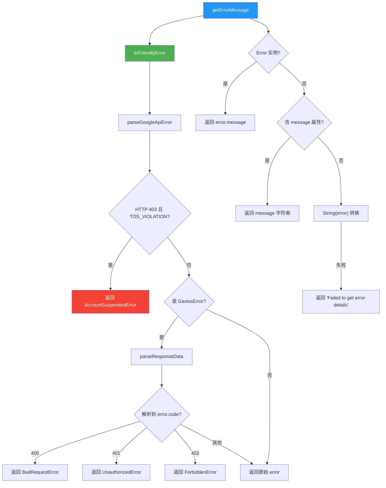

# errors.ts

## 概述

`errors.ts` 是 Gemini CLI 核心包中的错误定义与错误处理工具模块。该模块承担三大职责：

1. **自定义错误类体系**: 定义了一套完整的错误类层次结构，包括致命错误（`FatalError` 及其子类）、取消错误、权限错误、认证错误等，每种错误类型都有明确的语义和特定的退出码。
2. **错误类型判断工具函数**: 提供了多个类型守卫和判断函数，用于识别不同种类的错误（如 Node.js 错误、中止错误、认证错误等）。
3. **错误友好化转换**: 将底层 HTTP/API 错误（如 Gaxios 错误、Google API 错误）转换为语义更明确的自定义错误对象，方便上层统一处理。

**文件路径**: `packages/core/src/utils/errors.ts`

## 架构图（Mermaid）

```mermaid
classDiagram
    class Error {
        +string message
        +string name
        +string stack
    }

    class FatalError {
        +number exitCode
        +name = "FatalError"
    }

    class FatalAuthenticationError {
        +exitCode = 41
        +name = "FatalAuthenticationError"
    }

    class FatalInputError {
        +exitCode = 42
        +name = "FatalInputError"
    }

    class FatalSandboxError {
        +exitCode = 44
        +name = "FatalSandboxError"
    }

    class FatalConfigError {
        +exitCode = 52
        +name = "FatalConfigError"
    }

    class FatalTurnLimitedError {
        +exitCode = 53
        +name = "FatalTurnLimitedError"
    }

    class FatalToolExecutionError {
        +exitCode = 54
        +name = "FatalToolExecutionError"
    }

    class FatalCancellationError {
        +exitCode = 130
        +name = "FatalCancellationError"
    }

    class CanceledError {
        +name = "CanceledError"
    }

    class ForbiddenError {
        +name = "ForbiddenError"
    }

    class AccountSuspendedError {
        +string appealUrl
        +string appealLinkText
        +name = "AccountSuspendedError"
    }

    class UnauthorizedError {
        +name = "UnauthorizedError"
    }

    class BadRequestError {
        +name = "BadRequestError"
    }

    class ChangeAuthRequestedError {
        +name = "ChangeAuthRequestedError"
    }

    Error <|-- FatalError
    FatalError <|-- FatalAuthenticationError
    FatalError <|-- FatalInputError
    FatalError <|-- FatalSandboxError
    FatalError <|-- FatalConfigError
    FatalError <|-- FatalTurnLimitedError
    FatalError <|-- FatalToolExecutionError
    FatalError <|-- FatalCancellationError
    Error <|-- CanceledError
    Error <|-- ForbiddenError
    ForbiddenError <|-- AccountSuspendedError
    Error <|-- UnauthorizedError
    Error <|-- BadRequestError
    Error <|-- ChangeAuthRequestedError
```





## 核心组件

### 1. 接口定义

#### `GaxiosError`（内部接口）
```typescript
interface GaxiosError {
  response?: { data?: unknown; };
}
```
描述 Google 的 Gaxios HTTP 客户端返回的错误结构，包含一个可选的 `response.data` 字段。

#### `ResponseData`（内部接口）
```typescript
interface ResponseData {
  error?: { code?: number; message?: string; };
}
```
描述 API 响应中嵌套的错误数据结构，包含可选的错误码和错误消息。

### 2. 类型守卫函数

#### `isGaxiosError(error): error is GaxiosError`（内部函数）
判断错误对象是否为 Gaxios 错误（包含 `response` 对象属性）。

#### `isNodeError(error): error is NodeJS.ErrnoException`
判断错误是否为 Node.js 系统错误（`Error` 实例且包含 `code` 属性）。

#### `isAbortError(error): boolean`
判断错误是否为中止错误（`Error` 实例且 `name === 'AbortError'`）。

#### `isResponseData(data): data is ResponseData`（内部函数）
严格验证数据是否符合 `ResponseData` 结构，检查 `error` 对象及其 `code`（number）和 `message`（string）属性类型。

### 3. 错误信息提取函数

#### `getErrorMessage(error: unknown): string`
从任意错误对象中安全提取错误消息字符串：
1. 先通过 `toFriendlyError` 转换为友好错误。
2. 若为 `Error` 实例，返回 `message`。
3. 若为含 `message` 字符串属性的对象，返回该属性。
4. 尝试 `String()` 转换。
5. 最终回退返回 `'Failed to get error details'`。

#### `getErrorType(error: unknown): string`
获取错误的类型名称：
1. 非 `Error` 实例返回 `'unknown'`。
2. 优先使用 `error.name`（如果不是默认的 `'Error'`）。
3. 否则使用 `error.constructor.name`。
4. 去除前导下划线（bundler 如 esbuild 可能会重命名类以避免作用域冲突）。

### 4. 自定义错误类

#### 致命错误体系（FatalError 及子类）

| 错误类 | 退出码 | 语义说明 |
|-------|--------|---------|
| `FatalError` | 自定义 | 基类，表示不可恢复的致命错误，携带 `exitCode` |
| `FatalAuthenticationError` | 41 | 认证失败致命错误 |
| `FatalInputError` | 42 | 用户输入错误致命错误 |
| `FatalSandboxError` | 44 | 沙箱环境错误致命错误 |
| `FatalConfigError` | 52 | 配置错误致命错误 |
| `FatalTurnLimitedError` | 53 | 对话轮次超限致命错误 |
| `FatalToolExecutionError` | 54 | 工具执行错误致命错误 |
| `FatalCancellationError` | 130 | 取消操作致命错误（SIGINT 标准退出码） |

#### HTTP/API 错误类

| 错误类 | 继承自 | 语义说明 |
|-------|--------|---------|
| `ForbiddenError` | `Error` | 403 禁止访问错误 |
| `AccountSuspendedError` | `ForbiddenError` | 账户被暂停错误（因 TOS 违规），携带申诉 URL 和链接文本 |
| `UnauthorizedError` | `Error` | 401 未授权错误 |
| `BadRequestError` | `Error` | 400 错误请求错误 |

#### 其他错误类

| 错误类 | 继承自 | 语义说明 |
|-------|--------|---------|
| `CanceledError` | `Error` | 操作被取消（非致命），默认消息为 `'The operation was canceled.'` |
| `ChangeAuthRequestedError` | `Error` | 用户请求切换认证方式，固定消息 |

### 5. 错误转换函数

#### `toFriendlyError(error: unknown): unknown`
将底层错误转换为语义明确的自定义错误对象：

**处理优先级**:
1. **Google API 结构化错误解析**: 调用 `parseGoogleApiError` 解析，若为 403 错误且包含 `TOS_VIOLATION` 详情，返回 `AccountSuspendedError`（携带申诉 URL 元数据）。
2. **Gaxios 错误解析**: 若为 Gaxios 错误，解析响应数据并根据 HTTP 状态码映射：
   - 400 -> `BadRequestError`
   - 401 -> `UnauthorizedError`
   - 403 -> `ForbiddenError`
3. **回退**: 返回原始错误对象。

#### `isAccountSuspendedError(error: unknown): AccountSuspendedError | null`
便捷函数，通过 `toFriendlyError` 转换后判断是否为账户暂停错误。

#### `isAuthenticationError(error: unknown): boolean`
综合判断错误是否为 401 认证错误，多路径检测：
1. 检查错误对象是否有 `code === 401` 的数值属性（MCP SDK 的 `SseError`/`StreamableHTTPError`）。
2. 检查 `error.name === 'UnauthorizedError'`。
3. 检查是否为 `UnauthorizedError` 实例。
4. 回退：检查错误消息中是否包含字符串 `'401'`。

### 6. 内部辅助函数

#### `parseResponseData(error: GaxiosError): ResponseData | undefined`
从 Gaxios 错误中提取并解析响应数据：
- 获取 `error.response.data`。
- 若为字符串（Gaxios 有时不自动解析 JSON），尝试 `JSON.parse`。
- 用 `isResponseData` 类型守卫验证结构。
- 返回解析后的 `ResponseData` 或 `undefined`。

## 依赖关系

### 内部依赖

| 依赖模块 | 导入内容 | 用途 |
|---------|---------|------|
| `./googleErrors.js` | `parseGoogleApiError`, `ErrorInfo` (类型) | 解析 Google API 结构化错误，获取错误详情（如 TOS_VIOLATION） |

### 外部依赖

无外部第三方依赖。该模块仅使用 TypeScript/JavaScript 原生类型和 Node.js 内置类型。

## 关键实现细节

1. **显式设置 `this.name`**: 所有自定义错误类都在构造函数中显式设置 `this.name` 属性。这不仅是为了可读性，更是为了解决 bundler（如 esbuild）可能重命名类名的问题。通过显式设置 `name`，确保 `error.name` 在打包后仍然正确，这与 `getErrorType` 中去除前导下划线的逻辑相配合。

2. **退出码设计**: `FatalError` 的退出码有明确的语义划分：
   - 41-44：客户端/用户侧错误（认证、输入、沙箱）
   - 52-54：服务端/运行时错误（配置、轮次限制、工具执行）
   - 130：标准 Unix SIGINT 退出码

   这些退出码使得外部脚本和 CI/CD 系统可以根据退出码精确判断错误类型。

3. **TOS 违规特殊处理**: `toFriendlyError` 对 Google API 的 TOS_VIOLATION 错误进行了特殊处理，将其转换为 `AccountSuspendedError` 并提取申诉 URL 元数据。这使得 UI 层可以向用户显示申诉链接，而非仅展示通用的 403 错误。

4. **多路径认证错误检测**: `isAuthenticationError` 实现了四重检测策略以覆盖各种来源的 401 错误：MCP SDK 的结构化错误码、错误类名称、instanceof 检查、以及消息内容匹配。这种冗余设计确保了在跨库集成场景下的可靠检测。

5. **Gaxios 兼容性处理**: `parseResponseData` 中特别处理了 Gaxios 有时不自动将响应数据解析为 JSON 的情况，对字符串类型的 `data` 进行手动 `JSON.parse`。代码注释中使用了"Inexplicably"一词，暗示这是对第三方库不一致行为的被动适配。

6. **bundler 兼容性**: `getErrorType` 函数中使用 `name.replace(/^_+/, '')` 去除前导下划线，这是为了应对 esbuild 等 bundler 在打包时为避免作用域冲突而给类名添加下划线前缀的行为。
