# events.ts

## 概述

`events.ts` 是 Gemini CLI 核心包中的事件系统模块，是整个应用的核心事件总线。该模块基于 Node.js 的 `EventEmitter` 构建了一套类型安全的事件系统，定义了所有核心事件类型、事件载荷（Payload）接口，以及一个带缓冲机制的自定义事件发射器 `CoreEventEmitter`。事件系统用于在核心层（Core）与 UI 层之间实现松耦合通信，支持用户反馈、模型切换、控制台输出、MCP 进度、Hook 生命周期、配额变更等多种事件。

**文件路径**: `packages/core/src/utils/events.ts`

## 架构图（Mermaid）

```mermaid
graph TD
    subgraph 事件发射器 CoreEventEmitter
        A[CoreEventEmitter] -->|继承| B["EventEmitter&lt;CoreEvents&gt;"]
        A --> C[事件缓冲队列 _eventBacklog]
        A --> D[头指针 _backlogHead]
        A --> E["最大缓冲容量 MAX_BACKLOG_SIZE=10000"]
    end

    subgraph 核心方法
        F["_emitOrQueue(event, args)"] -->|有监听器| G["直接 emit 事件"]
        F -->|无监听器| H[加入缓冲队列]
        H --> I{队列已满?}
        I -->|是| J[淘汰最旧条目]
        J --> K{死条目超过半容量?}
        K -->|是| L[压缩数组]
        K -->|否| M[继续入队]
        I -->|否| M
        N["drainBacklogs()"] --> O[遍历缓冲队列并 emit]
    end

    subgraph 事件类型
        P[UserFeedback 用户反馈]
        Q[ModelChanged 模型变更]
        R[ConsoleLog 控制台日志]
        S[Output 标准输出/错误]
        T[MemoryChanged 记忆变更]
        U[HookStart/HookEnd 钩子生命周期]
        V[RetryAttempt 重试尝试]
        W[ConsentRequest 授权请求]
        X[McpProgress MCP 进度]
        Y[AgentsDiscovered 发现代理]
        Z[QuotaChanged 配额变更]
        AA[SlashCommandConflicts 命令冲突]
        BB[遥测事件]
    end

    A --> P
    A --> Q
    A --> R
    A --> S
    A --> T
    A --> U
    A --> V
    A --> W
    A --> X
    A --> Y
    A --> Z
    A --> AA
    A --> BB

    style A fill:#4CAF50,color:#fff
    style F fill:#2196F3,color:#fff
    style N fill:#FF9800,color:#fff
    style C fill:#9C27B0,color:#fff
```



## 核心组件

### 1. 类型定义

#### `FeedbackSeverity`
```typescript
export type FeedbackSeverity = 'info' | 'warning' | 'error';
```
用户反馈的严重程度级别，映射到 UI 层的消息类型（如不同颜色、图标）。

### 2. 事件载荷接口

| 接口名 | 对应事件 | 关键字段 | 说明 |
|--------|---------|---------|------|
| `UserFeedbackPayload` | `user-feedback` | `severity`, `message`, `error?` | 用户反馈消息，包含严重程度、消息文本和可选的原始错误对象 |
| `ModelChangedPayload` | `model-changed` | `model` | 模型变更通知，包含新模型名称 |
| `ConsoleLogPayload` | `console-log` | `type`, `content` | 控制台日志消息，`type` 为 `log/warn/error/debug/info` |
| `OutputPayload` | `output` | `isStderr`, `chunk`, `encoding?` | 标准输出/标准错误输出，支持 `Uint8Array` 或字符串 |
| `MemoryChangedPayload` | `memory-changed` | `fileCount` | 记忆变更通知，包含文件数量 |
| `HookPayload` | (基类) | `hookName`, `eventName` | Hook 事件基础载荷 |
| `HookStartPayload` | `hook-start` | `source?`, `hookIndex?`, `totalHooks?` | Hook 开始执行，扩展自 `HookPayload`，包含来源、索引、总数 |
| `HookEndPayload` | `hook-end` | `success` | Hook 执行结束，扩展自 `HookPayload`，包含是否成功 |
| `RetryAttemptPayload` | `retry-attempt` | `attempt`, `maxAttempts`, `delayMs`, `error?`, `model` | 重试尝试通知，包含当前次数、最大次数、延迟时间、错误信息、模型名 |
| `ConsentRequestPayload` | `consent-request` | `prompt`, `onConfirm` | 请求用户授权确认，`onConfirm` 为回调函数 |
| `McpProgressPayload` | `mcp-progress` | `serverName`, `callId`, `progressToken`, `progress`, `total?`, `message?` | MCP 工具调用进度通知 |
| `AgentsDiscoveredPayload` | `agents-discovered` | `agents` | 发现新代理通知，包含代理定义列表 |
| `SlashCommandConflict` | (数据结构) | `name`, `renamedTo`, `loser/winner*` | 斜杠命令冲突信息，描述冲突双方和重命名结果 |
| `SlashCommandConflictsPayload` | `slash-command-conflicts` | `conflicts` | 斜杠命令冲突列表 |
| `QuotaChangedPayload` | `quota-changed` | `remaining`, `limit`, `resetTime?` | 配额变更通知，包含剩余量、限额、重置时间 |
| `EditorSelectedPayload` | `editor-selected` | `editor?` | 编辑器选择通知 |

### 3. 枚举 `CoreEvent`

定义所有核心事件的字符串标识符：

```typescript
export enum CoreEvent {
  UserFeedback = 'user-feedback',
  ModelChanged = 'model-changed',
  ConsoleLog = 'console-log',
  Output = 'output',
  MemoryChanged = 'memory-changed',
  ExternalEditorClosed = 'external-editor-closed',
  McpClientUpdate = 'mcp-client-update',
  OauthDisplayMessage = 'oauth-display-message',
  SettingsChanged = 'settings-changed',
  HookStart = 'hook-start',
  HookEnd = 'hook-end',
  AgentsRefreshed = 'agents-refreshed',
  AdminSettingsChanged = 'admin-settings-changed',
  RetryAttempt = 'retry-attempt',
  ConsentRequest = 'consent-request',
  McpProgress = 'mcp-progress',
  AgentsDiscovered = 'agents-discovered',
  RequestEditorSelection = 'request-editor-selection',
  EditorSelected = 'editor-selected',
  SlashCommandConflicts = 'slash-command-conflicts',
  QuotaChanged = 'quota-changed',
  TelemetryKeychainAvailability = 'telemetry-keychain-availability',
  TelemetryTokenStorageType = 'telemetry-token-storage-type',
}
```

共 22 种核心事件，覆盖用户交互、系统状态、工具进度、遥测等多个维度。

### 4. 接口 `CoreEvents`

```typescript
export interface CoreEvents extends ExtensionEvents {
  [CoreEvent.UserFeedback]: [UserFeedbackPayload];
  [CoreEvent.ModelChanged]: [ModelChangedPayload];
  // ...
}
```

类型安全的事件映射表，继承自 `ExtensionEvents`，将每个事件名映射到其参数类型元组。这使得 `EventEmitter<CoreEvents>` 在 `emit` 和 `on` 时具有完整的类型推导能力。

### 5. 类型 `EventBacklogItem`

```typescript
type EventBacklogItem = {
  [K in keyof CoreEvents]: {
    event: K;
    args: CoreEvents[K];
  };
}[keyof CoreEvents];
```

缓冲队列条目的联合类型，通过映射类型从 `CoreEvents` 自动推导，确保每个缓冲条目都包含匹配的 `event` 和 `args`。

### 6. 类 `CoreEventEmitter`

继承自 `EventEmitter<CoreEvents>`，扩展了事件缓冲机制和类型安全的发射方法。

#### 内部状态

| 属性 | 类型 | 说明 |
|------|------|------|
| `_eventBacklog` | `EventBacklogItem[]` | 事件缓冲队列，存储无监听器时的待发送事件 |
| `_backlogHead` | `number` | 队列头指针，指向第一个有效条目的索引 |
| `MAX_BACKLOG_SIZE` | `10000` (静态常量) | 缓冲队列最大容量 |

#### 核心私有方法

##### `_emitOrQueue<K>(event, ...args): void`

**功能**: 智能事件发射——有监听器时直接发射，无监听器时加入缓冲队列。

**缓冲队列淘汰策略**:
1. 当队列大小达到 `MAX_BACKLOG_SIZE`（10000）时，淘汰最旧条目。
2. 淘汰使用头指针（`_backlogHead`）而非 `Array.shift()`，避免 O(n) 的数组重索引开销。
3. 当死条目（已淘汰条目）超过半容量（5000）时，执行一次 `slice` 压缩数组以回收内存。

#### 公开发射方法

**使用 `_emitOrQueue`（带缓冲）的方法**:

| 方法 | 事件 | 说明 |
|------|------|------|
| `emitFeedback(severity, message, error?)` | `UserFeedback` | 发送用户反馈，UI 可能尚未就绪时自动缓冲 |
| `emitConsoleLog(type, content)` | `ConsoleLog` | 广播控制台日志 |
| `emitOutput(isStderr, chunk, encoding?)` | `Output` | 广播标准输出/错误输出 |
| `emitConsentRequest(payload)` | `ConsentRequest` | 请求用户授权确认 |
| `emitAgentsDiscovered(agents)` | `AgentsDiscovered` | 通知发现新代理 |
| `emitSlashCommandConflicts(conflicts)` | `SlashCommandConflicts` | 通知斜杠命令冲突 |
| `emitTelemetryKeychainAvailability(event)` | `TelemetryKeychainAvailability` | 遥测：密钥链可用性 |
| `emitTelemetryTokenStorageType(event)` | `TelemetryTokenStorageType` | 遥测：令牌存储类型 |

**直接使用 `emit`（无缓冲）的方法**:

| 方法 | 事件 | 说明 |
|------|------|------|
| `emitModelChanged(model)` | `ModelChanged` | 模型变更通知 |
| `emitSettingsChanged()` | `SettingsChanged` | 设置变更通知 |
| `emitHookStart(payload)` | `HookStart` | Hook 开始执行 |
| `emitHookEnd(payload)` | `HookEnd` | Hook 执行结束 |
| `emitAgentsRefreshed()` | `AgentsRefreshed` | 代理刷新通知 |
| `emitAdminSettingsChanged()` | `AdminSettingsChanged` | 管理设置变更 |
| `emitRetryAttempt(payload)` | `RetryAttempt` | 重试尝试通知 |
| `emitMcpProgress(payload)` | `McpProgress` | MCP 进度通知（含数值校验） |
| `emitQuotaChanged(remaining, limit, resetTime?)` | `QuotaChanged` | 配额变更通知 |

#### `drainBacklogs(): void`

**功能**: 刷新（清空）缓冲队列，将所有缓冲的事件依次发射出去。

**调用时机**: 在 UI 主监听器完成订阅后立即调用，确保在 UI 就绪前产生的事件不会丢失。

**实现细节**:
1. 保存当前缓冲队列和头指针的引用。
2. 立即重置缓冲队列和头指针（避免重入问题）。
3. 从头指针位置开始遍历，跳过已淘汰的 `undefined` 条目。
4. 对每个有效条目调用 `emit` 发射事件。

#### `emitMcpProgress(payload): void`

**特殊逻辑**: 在发射前对 `progress` 值进行校验：
- 必须是有限数（`Number.isFinite`）。
- 必须非负（`>= 0`）。
- 不满足条件时记录调试日志并静默丢弃事件。

### 7. 全局单例 `coreEvents`

```typescript
export const coreEvents = new CoreEventEmitter();
```

模块级别的全局单例实例，作为整个应用的核心事件总线。所有核心模块通过此实例发射和监听事件。

## 依赖关系

### 内部依赖

| 依赖模块 | 导入内容 | 用途 |
|---------|---------|------|
| `../agents/types.js` | `AgentDefinition` (类型) | 代理定义类型，用于 `AgentsDiscoveredPayload` |
| `../tools/mcp-client.js` | `McpClient` (类型) | MCP 客户端类型，用于 `McpClientUpdate` 事件参数 |
| `./extensionLoader.js` | `ExtensionEvents` (类型) | 扩展事件接口，`CoreEvents` 继承自此接口 |
| `./editor.js` | `EditorType` (类型) | 编辑器类型，用于 `EditorSelectedPayload` |
| `../telemetry/types.js` | `TokenStorageInitializationEvent`, `KeychainAvailabilityEvent` (类型) | 遥测事件类型定义 |
| `./debugLogger.js` | `debugLogger` | 调试日志记录器，用于 `emitMcpProgress` 中的无效值日志 |

### 外部依赖

| 依赖包 | 导入内容 | 用途 |
|-------|---------|------|
| `node:events` | `EventEmitter` | Node.js 内置事件发射器基类 |

## 关键实现细节

1. **事件缓冲机制（Backlog）**: 这是该模块最核心的设计。在应用启动早期，核心层可能在 UI 层注册监听器之前就产生事件（如 `UserFeedback`、`ConsoleLog`）。通过 `_emitOrQueue` 方法，无监听器的事件会被自动缓冲，待 UI 层调用 `drainBacklogs()` 后统一发射。这避免了启动阶段的事件丢失问题。

2. **高效的环形缓冲淘汰策略**: 缓冲队列的淘汰使用头指针（`_backlogHead`）而非 `Array.shift()`。`shift()` 操作会导致 O(n) 的数组重索引，在大量事件场景下性能低下。头指针法将淘汰操作降为 O(1)。同时，当死条目超过半容量时执行一次 `slice` 压缩，在性能和内存之间取得平衡。

3. **有缓冲 vs 无缓冲的选择**: 并非所有事件都使用缓冲。分析可知：
   - **需要缓冲的事件**: `UserFeedback`、`ConsoleLog`、`Output`、`ConsentRequest`、`AgentsDiscovered`、`SlashCommandConflicts`、遥测事件等——这些事件在 UI 就绪前就可能产生，且信息不可丢失。
   - **不需要缓冲的事件**: `ModelChanged`、`SettingsChanged`、`HookStart/End`、`RetryAttempt`、`McpProgress`、`QuotaChanged` 等——这些事件通常发生在 UI 已就绪的运行时阶段，或丢失后无明显影响。

4. **类型安全的事件系统**: 通过 `EventEmitter<CoreEvents>` 泛型参数和 `CoreEvents` 接口，实现了完全类型安全的事件发射与监听。TypeScript 编译器可以在编译期检查事件名和参数类型是否匹配，大大减少运行时错误。

5. **`EventBacklogItem` 的联合类型推导**: 使用映射类型 `{ [K in keyof CoreEvents]: { event: K; args: CoreEvents[K] } }[keyof CoreEvents]` 自动从 `CoreEvents` 推导出缓冲条目的联合类型，确保每个条目的 `event` 和 `args` 类型一致，避免类型不匹配。

6. **`MCP Progress` 校验**: `emitMcpProgress` 方法在发射前校验 `progress` 值的合法性（有限数且非负），防止无效进度值传播到 UI 层导致渲染问题。

7. **`CoreEvents` 继承 `ExtensionEvents`**: 核心事件接口继承了扩展事件接口，使得扩展系统的事件可以通过同一事件总线传播，实现了核心和扩展事件的统一管理。

8. **`SlashCommandConflict` 冲突解决**: 当多个扩展或 MCP 服务器注册了同名的斜杠命令时，事件系统通过 `SlashCommandConflictsPayload` 通知 UI 层，包含冲突双方信息和自动重命名结果，帮助用户理解命令路由行为。

9. **全局单例模式**: `coreEvents` 作为模块级单例导出，确保整个应用使用同一个事件总线实例。所有需要事件通信的模块只需导入此实例即可。
