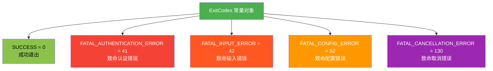

# exitCodes.ts

## 概述

`exitCodes.ts` 是 Gemini CLI 核心包中的一个工具模块，定义了程序退出时使用的标准退出码常量。该文件通过 TypeScript 的 `as const` 断言，将退出码定义为不可变的字面量类型，为整个应用程序提供统一的、类型安全的退出状态码。

退出码遵循 Unix/POSIX 惯例，使用不同的数值来表示不同类型的退出原因，便于调用方（如 shell 脚本、CI/CD 流水线等）判断程序运行结果。

## 架构图（Mermaid）

## 核心组件

### `ExitCodes` 常量对象

| 退出码名称 | 数值 | 含义 |
|---|---|---|
| `SUCCESS` | `0` | 程序正常退出，没有错误 |
| `FATAL_AUTHENTICATION_ERROR` | `41` | 致命认证错误，例如 API Key 无效、认证令牌过期等 |
| `FATAL_INPUT_ERROR` | `42` | 致命输入错误，例如用户传入了无效的命令行参数或输入内容 |
| `FATAL_CONFIG_ERROR` | `52` | 致命配置错误，例如配置文件格式错误、缺少必要配置项等 |
| `FATAL_CANCELLATION_ERROR` | `130` | 致命取消错误，通常对应用户通过 `Ctrl+C`（SIGINT 信号）中断程序的场景。数值 130 是 Unix 中 128 + 2（SIGINT 信号编号）的惯例 |

### 类型特性

该对象使用 `as const` 断言，这意味着：
- 对象本身是只读的（`readonly`），不可修改
- 每个属性的类型是字面量类型（如 `0`、`41`），而非宽泛的 `number` 类型
- 在使用时可以获得精确的类型推断和编译期检查

## 依赖关系

### 内部依赖

无。该文件是一个纯常量定义模块，不依赖项目中的其他模块。

### 外部依赖

无。该文件不使用任何第三方库。

## 关键实现细节

1. **退出码数值选择的惯例**：
   - `0` 是 Unix/POSIX 标准中表示成功的退出码。
   - `41` 和 `42` 是自定义的应用层退出码，位于常见保留范围（1-40）之后，避免与系统标准退出码冲突。
   - `52` 同样是自定义退出码，专用于配置相关错误。
   - `130` 遵循 Unix 惯例：当程序被信号终止时，退出码为 `128 + 信号编号`。SIGINT 的信号编号为 2，因此 `128 + 2 = 130`。

2. **`as const` 断言的作用**：使用 `as const` 确保 TypeScript 编译器将该对象视为深度只读的字面量类型。这在需要对退出码做类型判断或模式匹配时非常有用，例如可以将退出码的类型提取为联合类型 `0 | 41 | 42 | 52 | 130`。

3. **命名前缀 `FATAL_`**：除了 `SUCCESS` 外，所有错误退出码都以 `FATAL_` 为前缀，表明这些都是不可恢复的致命错误，程序遇到这些错误后必须终止运行。

4. **导出方式**：使用 `export const` 具名导出，允许消费者按需引入，也便于 tree-shaking 优化。
