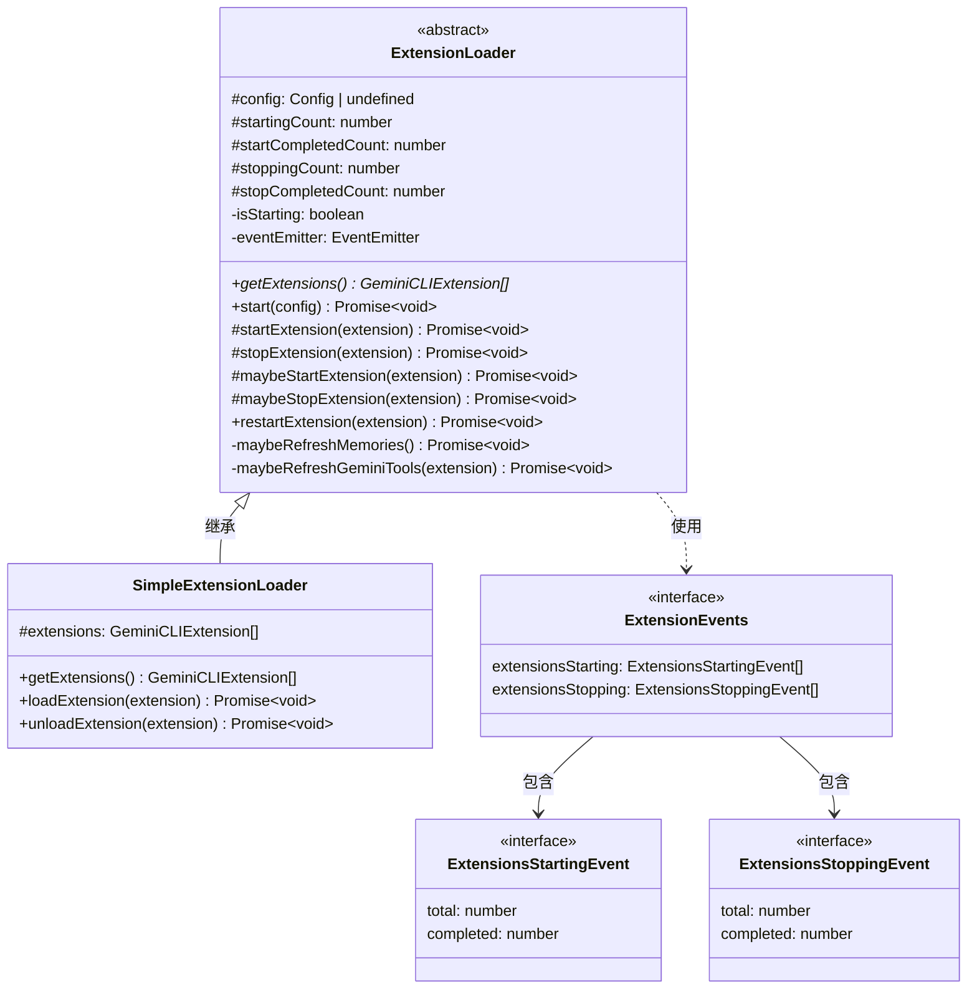
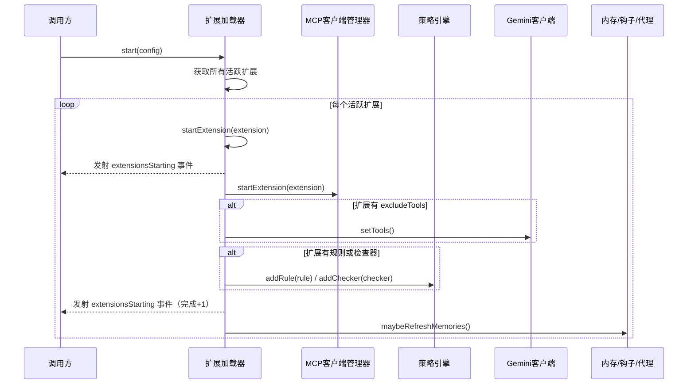

# extensionLoader.ts

## 概述

`extensionLoader.ts` 是 Gemini CLI 核心包中的扩展加载器模块，负责管理扩展（Extension）的生命周期，包括启动、停止和重启。该文件定义了一个抽象基类 `ExtensionLoader` 以及一个具体实现 `SimpleExtensionLoader`，提供了完整的扩展加载/卸载机制。

扩展加载器在启动扩展时，会将扩展的各项功能（MCP 服务器、策略规则、检查器、工具列表等）注册到系统中；在停止扩展时，会将这些功能从系统中移除。加载器还通过事件发射器（EventEmitter）向外部报告扩展启动/停止的进度。

## 架构图（Mermaid）

## 核心组件

### 1. `ExtensionLoader`（抽象类）

扩展加载器的基类，定义了扩展生命周期管理的核心逻辑。

#### 属性

| 属性 | 可见性 | 类型 | 说明 |
|---|---|---|---|
| `config` | `protected` | `Config \| undefined` | 配置对象，在 `start()` 中赋值 |
| `startingCount` | `protected` | `number` | 正在启动的扩展总数计数 |
| `startCompletedCount` | `protected` | `number` | 已完成启动的扩展计数 |
| `stoppingCount` | `protected` | `number` | 正在停止的扩展总数计数 |
| `stopCompletedCount` | `protected` | `number` | 已完成停止的扩展计数 |
| `isStarting` | `private` | `boolean` | 标记当前是否在执行首次 `start()` 调用 |
| `eventEmitter` | `private` | `EventEmitter<ExtensionEvents>` | 事件发射器，用于广播进度事件 |

#### 方法

| 方法 | 可见性 | 说明 |
|---|---|---|
| `getExtensions()` | `abstract` | 抽象方法，由子类实现，返回所有已知扩展列表 |
| `start(config)` | `public` | 初始化入口，并行启动所有活跃扩展。只能调用一次 |
| `startExtension(extension)` | `protected` | 无条件启动一个扩展，注册其所有功能到系统中 |
| `stopExtension(extension)` | `protected` | 无条件停止一个扩展，从系统中移除其所有功能 |
| `maybeStartExtension(extension)` | `protected` | 仅在启用了扩展重载且已初始化时启动扩展 |
| `maybeStopExtension(extension)` | `protected` | 仅在启用了扩展重载且已初始化时停止扩展 |
| `restartExtension(extension)` | `public` | 重启一个扩展（先停止后启动） |
| `maybeRefreshMemories()` | `private` | 当所有扩展启动/停止完成后，刷新层级记忆、钩子系统、代理注册表和技能 |
| `maybeRefreshGeminiTools(extension)` | `private` | 如果扩展配置了 `excludeTools`，刷新 Gemini 工具列表 |

### 2. `SimpleExtensionLoader`（具体类）

`ExtensionLoader` 的简单实现，内部维护一个扩展数组，并支持动态加载/卸载扩展。

#### 方法

| 方法 | 说明 |
|---|---|
| `getExtensions()` | 返回内部维护的扩展数组 |
| `loadExtension(extension)` | 将扩展添加到列表并尝试启动 |
| `unloadExtension(extension)` | 从列表移除扩展并尝试停止 |

### 3. 事件接口

#### `ExtensionEvents`

定义了扩展加载器可以发射的两种事件类型：

| 事件名 | 事件数据类型 | 触发时机 |
|---|---|---|
| `extensionsStarting` | `ExtensionsStartingEvent` | 扩展开始启动和启动完成时 |
| `extensionsStopping` | `ExtensionsStoppingEvent` | 扩展开始停止和停止完成时 |

#### `ExtensionsStartingEvent` / `ExtensionsStoppingEvent`

| 字段 | 类型 | 说明 |
|---|---|---|
| `total` | `number` | 需要启动/停止的扩展总数 |
| `completed` | `number` | 已完成启动/停止的扩展数量 |

## 依赖关系

### 内部依赖

| 模块 | 导入内容 | 用途 |
|---|---|---|
| `../config/config.js` | `Config`, `GeminiCLIExtension` (类型) | 配置对象和扩展接口定义 |
| `./memoryDiscovery.js` | `refreshServerHierarchicalMemory` | 刷新服务器层级记忆 |

### 外部依赖

| 模块 | 导入内容 | 用途 |
|---|---|---|
| `node:events` | `EventEmitter` (类型) | Node.js 原生事件发射器，用于进度广播 |

## 关键实现细节

1. **单次初始化保护**：`start()` 方法通过检查 `this.config` 是否已赋值来确保只能调用一次。重复调用会抛出异常。这保证了扩展系统的初始化逻辑不会被意外重复执行。

2. **并行启动，串行事件追踪**：`start()` 使用 `Promise.all` 并行启动所有活跃扩展以提高效率，但通过 `startingCount` 和 `startCompletedCount` 两个计数器精确追踪启动进度，并通过事件发射器实时广播。

3. **延迟刷新记忆策略**：`maybeRefreshMemories()` 方法实现了一个智能的延迟刷新机制。它只在以下条件全部满足时才执行刷新：
   - 不在首次 `start()` 调用期间（`!this.isStarting`）
   - 所有正在启动的扩展都已完成（`startingCount === startCompletedCount`）
   - 所有正在停止的扩展都已完成（`stoppingCount === stopCompletedCount`）

   这样做的目的是避免在批量加载/卸载扩展时频繁刷新记忆和上下文缓存，因为刷新操作"相当昂贵且会破坏上下文缓存"（代码注释原文）。

4. **计数器自动重置**：当某一批次的扩展全部启动（或停止）完成后，对应的计数器会被重置为 0。这确保了下一批次的操作可以使用干净的计数器。

5. **策略引擎集成**：启动扩展时，加载器会将扩展定义的 `rules`（策略规则）和 `checkers`（检查器）注册到策略引擎中。停止扩展时，通过收集所有规则和检查器的 `source` 标识，按来源批量移除，避免误删其他扩展的规则。

6. **工具列表动态刷新**：如果扩展配置了 `excludeTools`（要排除的工具列表），加载器会在扩展启动/停止后刷新 Gemini 客户端的工具列表，确保被排除的工具不会出现在可用工具中。

7. **`maybe` 方法模式**：`maybeStartExtension` 和 `maybeStopExtension` 方法实现了条件执行模式——只有在配置中启用了扩展重载（`getEnableExtensionReloading()`）且系统已初始化时才真正执行操作。这使得 `SimpleExtensionLoader` 的 `loadExtension` / `unloadExtension` 在系统尚未初始化时安全调用而不会出错。

8. **`finally` 块保证一致性**：`startExtension` 和 `stopExtension` 都使用 `try...finally` 块，确保即使扩展启动/停止过程中发生异常，计数器更新和事件发射仍然会执行，保持系统状态的一致性。
