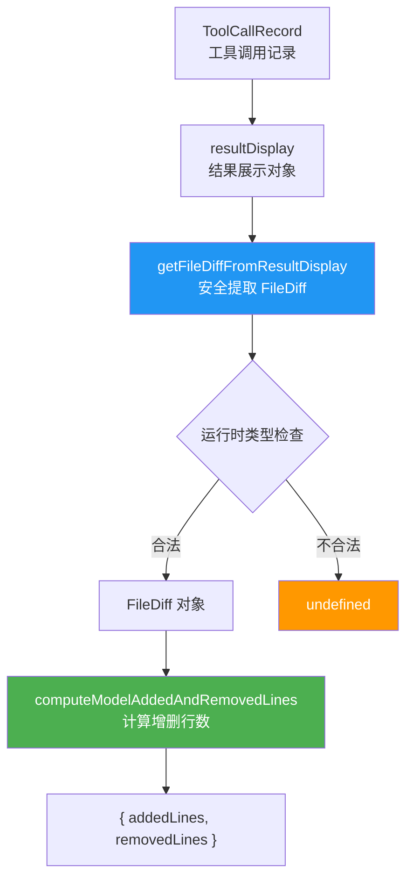
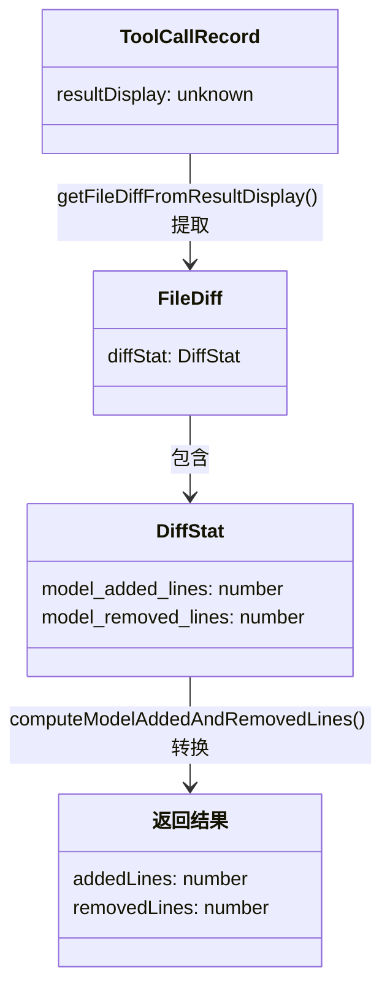

# fileDiffUtils.ts

## 概述

`fileDiffUtils.ts` 是 Gemini CLI 核心包中的文件差异工具模块，提供了从工具调用记录中安全提取文件差异信息（`FileDiff`）以及计算模型添加/删除行数统计的实用函数。

该模块是工具调用结果后处理流程的一部分，主要用于在记录或展示工具调用结果时，安全地获取文件变更的差异统计数据。它作为一个轻量级的"数据提取与转换"层，在工具调用记录的原始数据和上层消费者之间提供类型安全的桥梁。

## 架构图（Mermaid）

## 核心组件

### 1. `getFileDiffFromResultDisplay(resultDisplay): FileDiff | undefined`

从工具调用记录的 `resultDisplay` 属性中安全提取 `FileDiff` 对象。

**参数：**
| 参数 | 类型 | 说明 |
|---|---|---|
| `resultDisplay` | `ToolCallRecord['resultDisplay']` | 工具调用记录的结果展示属性 |

**返回值：**
- `FileDiff`：如果 `resultDisplay` 符合 `FileDiff` 结构
- `undefined`：如果 `resultDisplay` 为空、非对象，或不包含有效的 `diffStat` 属性

**运行时检查步骤：**
1. `resultDisplay` 非空（非 `null`/`undefined`）
2. `resultDisplay` 是对象类型（`typeof === 'object'`）
3. 对象包含 `diffStat` 属性（`'diffStat' in resultDisplay`）
4. `diffStat` 是对象类型（`typeof === 'object'`）
5. `diffStat` 非 `null`
6. `diffStat` 为真值（最终确认非空非零）

### 2. `computeModelAddedAndRemovedLines(stats): { addedLines, removedLines }`

从 `DiffStat` 对象中提取模型添加和删除的行数，并转换为统一的返回格式。

**参数：**
| 参数 | 类型 | 说明 |
|---|---|---|
| `stats` | `DiffStat \| undefined` | 差异统计对象，可能为 `undefined` |

**返回值：**
| 字段 | 类型 | 说明 |
|---|---|---|
| `addedLines` | `number` | 模型添加的行数。`stats` 为 `undefined` 时返回 `0` |
| `removedLines` | `number` | 模型删除的行数。`stats` 为 `undefined` 时返回 `0` |

**字段映射：**
- `stats.model_added_lines` -> `addedLines`
- `stats.model_removed_lines` -> `removedLines`

## 依赖关系

### 内部依赖

| 模块 | 导入内容 | 用途 |
|---|---|---|
| `../tools/tools.js` | `DiffStat`, `FileDiff` (类型) | 文件差异和差异统计的类型定义 |
| `../services/chatRecordingService.js` | `ToolCallRecord` (类型) | 工具调用记录的类型定义，用于获取 `resultDisplay` 的类型 |

### 外部依赖

无。该文件不使用任何第三方库。

## 关键实现细节

1. **运行时类型守卫**：`getFileDiffFromResultDisplay` 函数实现了一个手动的运行时类型守卫（runtime type guard）。由于 `resultDisplay` 的类型在编译期可能是 `unknown` 或较宽泛的联合类型，该函数通过一系列 `typeof` 检查和 `in` 操作符逐步收窄类型，最终安全地将其断言为 `FileDiff`。这种模式在处理来自外部（如 JSON 反序列化）的数据时非常常见。

2. **防御性空值处理**：`computeModelAddedAndRemovedLines` 对 `stats` 为 `undefined` 的情况返回全零值 `{ addedLines: 0, removedLines: 0 }`，而非抛出异常。这使得调用方可以无需预检查就安全调用，简化了上层代码逻辑。

3. **属性名称转换**：`computeModelAddedAndRemovedLines` 将 `DiffStat` 中的 snake_case 命名（`model_added_lines`、`model_removed_lines`）转换为 camelCase 命名（`addedLines`、`removedLines`）。这暗示 `DiffStat` 可能来源于外部 API 或 JSON 数据（使用 snake_case），而 TypeScript 代码内部遵循 camelCase 惯例。

4. **冗余检查的安全性**：`getFileDiffFromResultDisplay` 中对 `resultDisplay.diffStat` 的检查看似有冗余（先检查 `!== null`，再检查真值），但这种多重检查确保了在各种边界情况下（如 `diffStat` 为 `0`、空字符串等假值）的安全性。

5. **纯函数设计**：两个函数都是纯函数，无副作用、不修改输入、输出仅依赖输入。这使得它们易于测试和复用。

6. **仅类型导入**：所有从外部模块的导入都使用 `import type`，表明这些依赖仅在编译期使用，不会产生运行时的模块加载开销。这也意味着该模块的运行时依赖图非常轻量。
