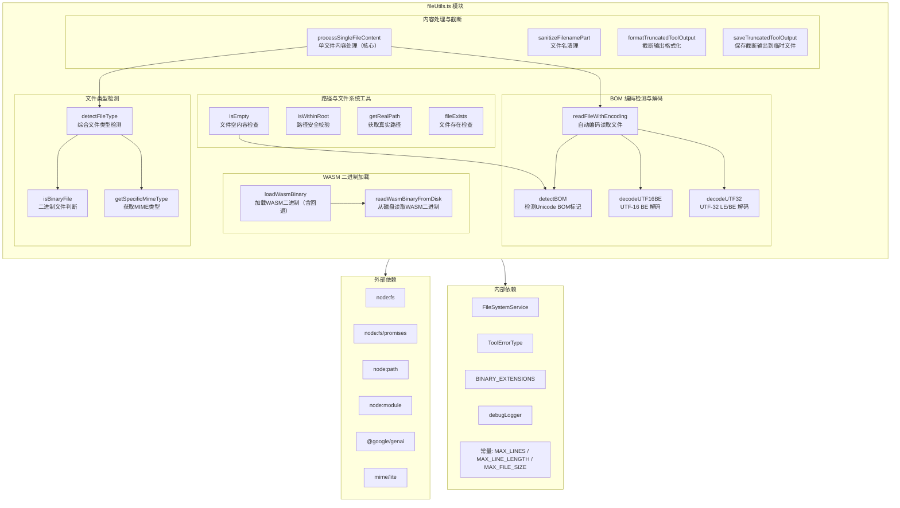

# fileUtils.ts

## 概述

`fileUtils.ts` 是 Gemini CLI 核心包中的文件操作工具模块，提供了一整套文件读取、编码检测、类型判断和内容处理的实用函数。该模块是 CLI 工具链中文件 I/O 操作的基石，支持多种 Unicode 编码（UTF-8/16/32）的自动检测与解码，能够智能区分文本文件与二进制文件，并为 LLM（大语言模型）提供格式化的文件内容输出。

该文件位于 `packages/core/src/utils/fileUtils.ts`，共约 648 行代码，是整个项目中最核心的文件处理工具之一。

## 架构图（Mermaid）



## 核心组件

### 1. WASM 二进制加载

#### `readWasmBinaryFromDisk(specifier: string): Promise<Uint8Array>`
- **功能**：从磁盘读取 WASM 二进制文件
- **参数**：`specifier` - 模块说明符，通过 `createRequire` 解析为实际路径
- **返回**：`Uint8Array` 格式的二进制数据
- **实现细节**：使用 `createRequire(import.meta.url)` 创建 CommonJS 风格的 `require.resolve` 来定位文件路径

#### `loadWasmBinary(dynamicImport, fallbackSpecifier): Promise<Uint8Array>`
- **功能**：加载 WASM 二进制模块，支持动态导入和磁盘回退两种策略
- **加载策略**：
  1. 首先尝试通过 `dynamicImport()` 动态加载模块
  2. 如果动态导入失败，回退到 `readWasmBinaryFromDisk` 从磁盘读取
  3. 如果动态导入成功但返回值不是 `Uint8Array`，同样尝试磁盘回退
  4. 所有方式均失败时抛出描述性错误

### 2. BOM 编码检测与解码

#### `detectBOM(buf: Buffer): BOMInfo | null`
- **功能**：检测 Buffer 前 4 字节中的 Unicode 字节序标记（BOM）
- **支持的编码**：
  | BOM 字节序列 | 编码 | BOM 长度 |
  |---|---|---|
  | `FF FE 00 00` | UTF-32 LE | 4 字节 |
  | `00 00 FE FF` | UTF-32 BE | 4 字节 |
  | `EF BB BF` | UTF-8 | 3 字节 |
  | `FF FE` (非 UTF-32) | UTF-16 LE | 2 字节 |
  | `FE FF` | UTF-16 BE | 2 字节 |
- **注意事项**：UTF-32 LE 的检测优先于 UTF-16 LE，因为 `FF FE` 是两者的共同前缀

#### `decodeUTF16BE(buf: Buffer): string`（内部函数）
- **功能**：将 UTF-16 BE Buffer 解码为 JS 字符串
- **实现**：由于 Node.js 原生只支持 `utf16le`，通过 `swap16()` 字节交换后再用 `utf16le` 解码

#### `decodeUTF32(buf: Buffer, littleEndian: boolean): string`（内部函数）
- **功能**：将 UTF-32 LE/BE Buffer 解码为 JS 字符串
- **实现细节**：
  - 每 4 字节读取一个码点，根据字节序拼装
  - 校验码点范围（0x0000-0x10FFFF，排除代理对区域 0xD800-0xDFFF）
  - 无效码点替换为 U+FFFD（替换字符）
  - 尾部不足 4 字节的数据被忽略

#### `readFileWithEncoding(filePath: string): Promise<string>`
- **功能**：智能编码读取文件，自动检测 BOM 并选择正确的解码方式
- **流程**：读取完整文件 -> 检测 BOM -> 根据编码类型解码 -> 剥离 BOM 字节后返回字符串
- **默认行为**：无 BOM 时按 UTF-8 处理

### 3. 文件类型检测

#### `getSpecificMimeType(filePath: string): string | undefined`
- **功能**：通过 `mime/lite` 库查找文件路径对应的 MIME 类型
- **返回**：MIME 类型字符串，如 `'text/python'`、`'application/javascript'`，查找失败返回 `undefined`

#### `isBinaryFile(filePath: string): Promise<boolean>`
- **功能**：启发式判断文件是否为二进制文件
- **检测算法**：
  1. 空文件视为非二进制
  2. 采样文件头部最多 4KB 数据
  3. 如果检测到 Unicode BOM，直接判定为文本文件（避免 UTF-16/32 中的空字节误判）
  4. 如果采样中出现空字节（`0x00`），立即判定为二进制
  5. 统计非可打印字符（ASCII < 9 或 13 < ASCII < 32）的比例，超过 30% 判定为二进制
- **资源管理**：使用 `try/finally` 确保文件句柄正确关闭

#### `detectFileType(filePath: string): Promise<'text' | 'image' | 'pdf' | 'audio' | 'video' | 'binary' | 'svg'>`
- **功能**：综合检测文件类型
- **检测优先级**：
  1. TypeScript 扩展名（`.ts`, `.mts`, `.cts`）强制为 `text`（避免被误识别为 MPEG 传输流）
  2. `.svg` 扩展名返回 `svg`
  3. 通过 MIME 查找判断图片、音视频、PDF
  4. 音视频类型会额外进行内容校验（解决 MIME 误识别问题 #16888）
  5. 已知二进制扩展名（`BINARY_EXTENSIONS`）直接返回 `binary`
  6. 最后通过内容采样进行二进制判断

### 4. 路径与文件系统工具

#### `isWithinRoot(pathToCheck: string, rootDirectory: string): boolean`
- **功能**：安全检查，验证给定路径是否在根目录内
- **用途**：防止路径穿越攻击
- **实现**：使用 `path.resolve` 规范化路径后进行 `startsWith` 比较

#### `getRealPath(filePath: string): string`
- **功能**：获取文件的真实路径（解析符号链接）
- **回退**：如果 `realpathSync` 失败（文件不存在等），回退到 `path.resolve`

#### `fileExists(filePath: string): Promise<boolean>`
- **功能**：异步检查文件是否存在
- **实现**：通过 `fsPromises.access` 配合 `F_OK` 标志检测

#### `isEmpty(filePath: string): Promise<boolean>`
- **功能**：检查文件是否为空或仅包含空白字符
- **优化策略**：
  1. 先检查文件大小，0 字节直接返回 `true`
  2. 只采样前 1KB 内容进行检查（对于大文件足够高效）
  3. BOM 感知：剥离 BOM 后再检查内容
  4. 读取失败时视为空/无效

### 5. 核心内容处理

#### `processSingleFileContent(filePath, rootDirectory, _fileSystemService, startLine?, endLine?): Promise<ProcessedFileReadResult>`
- **功能**：读取并处理单个文件，为 LLM 提供格式化内容。这是本模块最核心的函数。
- **返回类型 `ProcessedFileReadResult`**：
  ```typescript
  interface ProcessedFileReadResult {
    llmContent: PartUnion;      // 文本字符串或图片/PDF的Part对象
    returnDisplay: string;       // 用户友好的显示信息
    error?: string;              // 可选的错误描述
    errorType?: ToolErrorType;   // 结构化错误类型
    isTruncated?: boolean;       // 内容是否被截断
    originalLineCount?: number;  // 原始总行数
    linesShown?: [number, number]; // 实际显示的行范围（1-based）
  }
  ```
- **处理流程**：
  1. **存在性检查**：文件不存在返回 `FILE_NOT_FOUND` 错误
  2. **目录检查**：路径为目录返回 `TARGET_IS_DIRECTORY` 错误
  3. **大小检查**：超过 `MAX_FILE_SIZE_MB` 返回 `FILE_TOO_LARGE` 错误
  4. **类型分发**：
     - `binary`：返回跳过信息
     - `svg`：超过 1MB 跳过，否则作为文本读取
     - `text`：支持行范围截取、行长度截断、截断标记
     - `image`/`pdf`/`audio`/`video`：Base64 编码后封装为 `inlineData` Part
  5. **文本处理细节**：
     - 支持 `startLine` / `endLine` 参数进行行范围读取（1-based）
     - 未指定范围时默认读取前 `DEFAULT_MAX_LINES_TEXT_FILE` 行
     - 超长行（> `MAX_LINE_LENGTH_TEXT_FILE` 字符）会被截断并附加 `[truncated]` 标记

### 6. 输出截断与保存

#### `sanitizeFilenamePart(part: string): string`
- **功能**：清理字符串使其可安全用作文件名
- **规则**：仅保留字母、数字、下划线和连字符，其余替换为下划线

#### `formatTruncatedToolOutput(contentStr, outputFile, maxChars): string`
- **功能**：格式化截断的工具输出
- **截断策略**：保留前 20% 和后 80% 的内容，中间插入省略标记
- **输出格式**：包含完整输出文件路径的引导信息

#### `saveTruncatedToolOutput(content, toolName, id, projectTempDir, sessionId?): Promise<{outputFile: string}>`
- **功能**：将截断的工具输出保存到临时文件
- **文件组织**：`{projectTempDir}/tool-outputs/[session-{sessionId}/]{toolName}_{id}.txt`
- **文件名生成**：如果 id 已经以 toolName 开头，则不重复拼接

## 依赖关系

### 内部依赖

| 依赖模块 | 导入内容 | 用途 |
|---|---|---|
| `../services/fileSystemService.js` | `FileSystemService`（类型） | `processSingleFileContent` 函数签名中的参数类型（当前未实际使用） |
| `../tools/tool-error.js` | `ToolErrorType` | 文件处理错误的结构化错误类型枚举 |
| `./ignorePatterns.js` | `BINARY_EXTENSIONS` | 已知二进制文件扩展名列表，用于文件类型检测 |
| `./debugLogger.js` | `debugLogger` | 调试日志记录器，用于记录文件操作警告 |
| `./constants.js` | `DEFAULT_MAX_LINES_TEXT_FILE`, `MAX_LINE_LENGTH_TEXT_FILE`, `MAX_FILE_SIZE_MB` | 文件读取的各项限制常量 |

### 外部依赖

| 依赖包 | 导入内容 | 用途 |
|---|---|---|
| `node:fs` | `fs` | 同步文件操作（`existsSync`, `realpathSync`, `promises`） |
| `node:fs/promises` | `fsPromises` | 异步文件操作（`access`, `stat`, `open`, `mkdir`, `writeFile`） |
| `node:path` | `path` | 路径处理（`resolve`, `relative`, `extname`, `join`, `sep`） |
| `node:module` | `createRequire` | 创建 CommonJS `require` 函数用于 WASM 模块路径解析 |
| `@google/genai` | `PartUnion`（类型） | Gemini API 的内容部分联合类型 |
| `mime/lite` | `mime` | 轻量级 MIME 类型查找库 |

## 关键实现细节

1. **BOM 优先检测策略**：模块在多个位置（`readFileWithEncoding`, `isBinaryFile`, `isEmpty`）统一使用 `detectBOM` 进行 BOM 检测，确保 UTF-16/32 编码的文件不会因为包含空字节而被误判为二进制文件。

2. **TypeScript 扩展名特殊处理**：`.ts`, `.mts`, `.cts` 文件会被 MIME 库识别为 MPEG 传输流（`video/mp2t`），因此在 `detectFileType` 中对这些扩展名进行了硬编码处理，直接返回 `text` 类型。

3. **音视频 MIME 二次校验**：即使 MIME 库将文件识别为音视频类型，仍会通过 `isBinaryFile` 进行内容校验。如果内容实际为文本，则纠正为 `text` 类型（修复 issue #16888）。

4. **渐进式截断**：`processSingleFileContent` 对文本文件实现了两级截断 -- 行数截断（`DEFAULT_MAX_LINES_TEXT_FILE`）和行长度截断（`MAX_LINE_LENGTH_TEXT_FILE`），确保发送给 LLM 的内容不会过大。

5. **资源安全**：所有涉及文件句柄的操作都使用 `try/finally` 模式确保句柄释放，`isBinaryFile` 函数甚至在 `finally` 块中捕获了关闭句柄时的异常。

6. **路径安全**：`isWithinRoot` 函数通过规范化路径并添加路径分隔符后缀来防止路径穿越，例如防止 `/root/foo-bar` 被错误判定为在 `/root/foo` 目录下。

7. **常量 `DEFAULT_ENCODING`**：导出了默认编码 `utf-8`，供其他模块引用。

8. **WASM 加载的双重回退**：`loadWasmBinary` 实现了健壮的加载策略 -- 先尝试动态导入（适合打包后的环境），失败后回退到磁盘读取（适合开发环境），确保在不同运行环境下都能正常工作。
