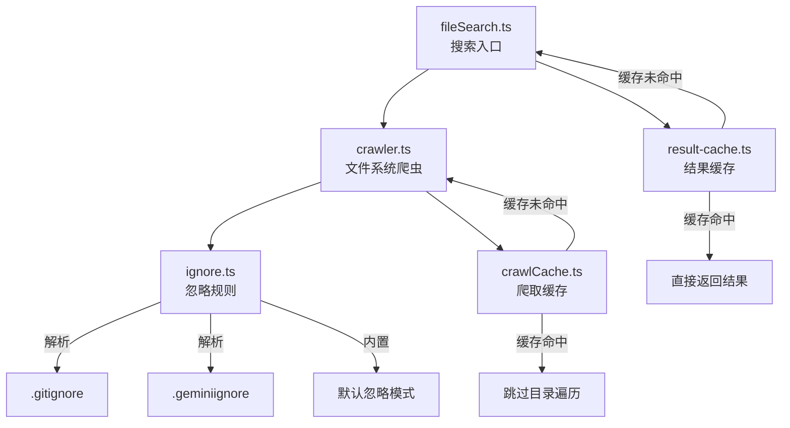

# filesearch (文件搜索子模块)

## 概述

`filesearch/` 子目录实现了 Gemini CLI 的高性能文件系统搜索引擎。它提供带缓存的文件爬取、基于忽略规则的过滤，以及搜索结果缓存能力，被 CLI 的 grep、glob 等搜索工具使用。

## 目录结构

```
filesearch/
├── fileSearch.ts              # 文件搜索入口（协调爬虫与缓存）
├── crawler.ts                 # 文件系统爬虫（递归目录遍历）
├── crawlCache.ts              # 爬取结果缓存
├── ignore.ts                  # 忽略规则处理（.gitignore 等）
├── result-cache.ts            # 搜索结果缓存
└── *.test.ts                  # 对应的单元测试文件
```

## 架构图



## 核心组件

### fileSearch.ts
- **职责**: 文件搜索的入口和协调器
- **功能**: 接收搜索请求，协调爬虫和缓存，返回匹配文件列表

### crawler.ts
- **职责**: 递归遍历文件系统目录树
- **特性**: 支持深度限制、文件类型过滤、符号链接处理
- **性能**: 与 crawlCache 配合避免重复遍历

### crawlCache.ts
- **职责**: 缓存文件系统爬取结果
- **场景**: 避免同一目录在短时间内被多次遍历

### ignore.ts
- **职责**: 解析和应用忽略规则
- **来源**: `.gitignore`、`.geminiignore`、内置默认模式（node_modules, .git 等）
- **匹配**: 支持 glob 模式匹配

### result-cache.ts
- **职责**: 缓存搜索查询结果
- **策略**: 基于查询参数的键值缓存

## 依赖关系

### 内部依赖
- `utils/gitIgnoreParser.ts` - .gitignore 解析
- `utils/ignorePatterns.ts` - 忽略模式定义

### 外部依赖
- `glob` - 文件模式匹配

## 数据流

1. 搜索请求进入 `fileSearch.ts`
2. 检查 `result-cache` 是否有缓存结果
3. 如无缓存，调用 `crawler.ts` 遍历文件系统
4. 爬虫通过 `crawlCache` 检查目录是否已缓存
5. 通过 `ignore.ts` 过滤不需要的文件和目录
6. 将结果存入 `result-cache` 并返回
