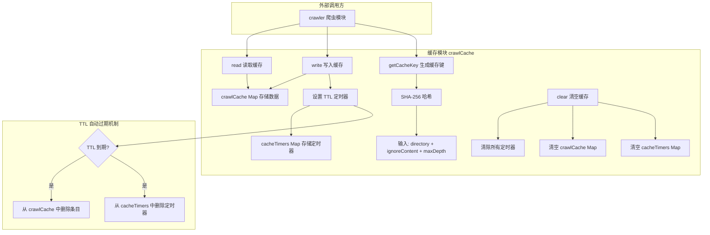
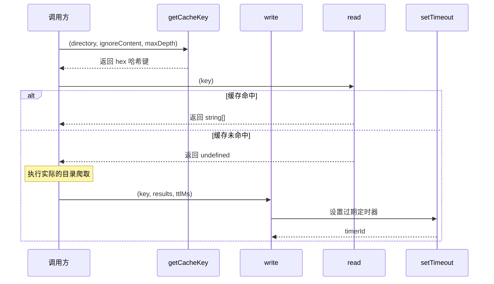

# crawlCache.ts

## 概述

`crawlCache` 是文件搜索子系统中的内存缓存模块，用于缓存目录爬取（crawl）的结果。它采用基于 TTL（Time-To-Live，存活时间）的自动过期机制，通过 SHA-256 哈希生成缓存键，确保当项目目录或忽略规则发生变化时缓存能自动失效。该模块以纯函数式 API 暴露，无需实例化即可直接使用。

## 架构图（Mermaid）

## 核心组件

### 模块级变量

| 变量 | 类型 | 说明 |
|------|------|------|
| `crawlCache` | `Map<string, string[]>` | 内存缓存的核心数据结构。键为哈希字符串，值为爬取结果（文件路径数组） |
| `cacheTimers` | `Map<string, NodeJS.Timeout>` | 存储每个缓存条目对应的 TTL 定时器句柄，用于在更新或清空时取消定时器 |

### 导出函数

#### `getCacheKey(directory, ignoreContent, maxDepth?): string`

生成唯一的缓存键。

- **参数**：
  - `directory: string` — 项目目录路径
  - `ignoreContent: string` — 忽略文件（如 `.gitignore`）的内容
  - `maxDepth?: number` — 可选的最大爬取深度
- **返回值**：SHA-256 哈希的十六进制字符串
- **实现**：将 `directory`、`ignoreContent`、`maxDepth`（如果有）依次更新到 SHA-256 哈希中，输出 hex 编码摘要
- **设计意图**：任何输入参数的变化都会导致不同的缓存键，从而实现自动缓存失效

#### `read(key): string[] | undefined`

从内存缓存中读取数据。

- **参数**：`key: string` — 缓存键
- **返回值**：命中时返回 `string[]`（文件路径列表），未命中时返回 `undefined`

#### `write(key, results, ttlMs): void`

写入缓存数据并设置自动过期。

- **参数**：
  - `key: string` — 缓存键
  - `results: string[]` — 要缓存的爬取结果
  - `ttlMs: number` — 缓存存活时间（毫秒）
- **行为**：
  1. 若该键已有定时器，先清除旧定时器（防止提前删除）
  2. 将数据存入 `crawlCache`
  3. 创建新的 `setTimeout` 定时器，到期后自动删除缓存条目和定时器句柄
  4. 将定时器句柄存入 `cacheTimers`

#### `clear(): void`

清空全部缓存和定时器。

- 遍历 `cacheTimers` 清除所有活跃的定时器
- 清空 `crawlCache` 和 `cacheTimers` 两个 Map
- 主要用于测试环境的清理

## 依赖关系

### 内部依赖

无内部模块依赖。本模块是一个自包含的缓存工具。

### 外部依赖

| 模块 | 导入内容 | 用途 |
|------|----------|------|
| `node:crypto` | `crypto`（默认导入） | 使用 `createHash('sha256')` 生成缓存键的哈希值 |

## 关键实现细节

1. **TTL 自动过期机制**：每个缓存条目在写入时都会关联一个 `setTimeout` 定时器。当 TTL 到期时，定时器回调自动从 `crawlCache` 和 `cacheTimers` 中同时删除对应条目。这避免了内存泄漏和使用过期数据。

2. **定时器更新安全性**：在 `write` 方法中，如果同一个 key 被再次写入，会先 `clearTimeout` 清除旧定时器，再设置新定时器。这确保了：
   - 不会出现重复定时器
   - 新数据写入后 TTL 从当前时刻重新计算

3. **纯模块级状态**：`crawlCache` 和 `cacheTimers` 作为模块级变量存在，在整个进程生命周期内共享。这是一种单例模式的简化实现，适合 CLI 工具的单进程运行场景。

4. **缓存键的确定性**：使用 SHA-256 哈希确保：
   - 相同输入始终产生相同的键（确定性）
   - 不同输入几乎不可能产生相同的键（抗碰撞）
   - 键的长度固定（64 字符十六进制），无论输入大小

5. **`maxDepth` 可选参数处理**：`getCacheKey` 中 `maxDepth` 为可选参数，仅在定义时才将其纳入哈希计算。这意味着不传 `maxDepth` 和传 `undefined` 产生相同的缓存键。

6. **清理函数的必要性**：`clear()` 函数虽然主要用于测试，但也是防止定时器泄漏的关键。如果不清除活跃定时器，它们会阻止 Node.js 进程优雅退出（`setTimeout` 会保持事件循环活跃）。
