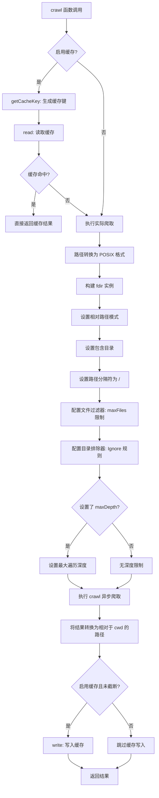
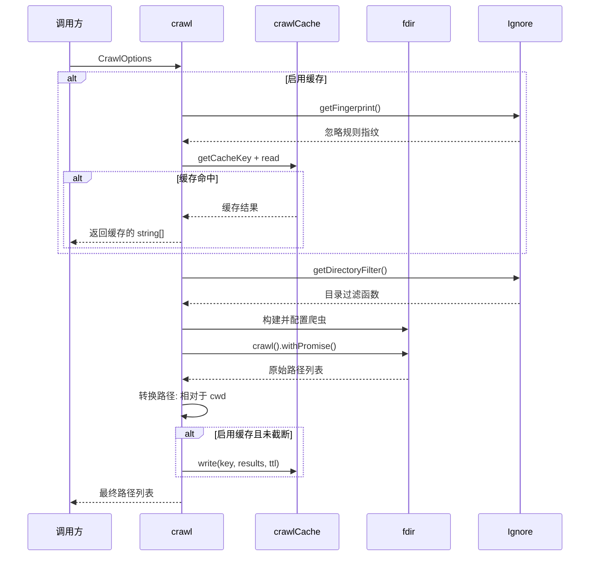

# crawler.ts

## 概述

`crawler.ts` 是文件搜索子系统中的核心爬虫模块，负责递归遍历指定目录下的所有文件和子目录。它基于高性能的 `fdir` 库实现目录遍历，结合 `Ignore` 模块过滤被忽略的目录，并集成 `crawlCache` 模块提供可选的结果缓存能力。爬虫返回相对于工作目录（`cwd`）的 POSIX 风格路径列表，并支持最大深度和最大文件数量限制。

## 架构图（Mermaid）

## 核心组件

### 接口定义

#### `CrawlOptions`

| 字段 | 类型 | 必选 | 说明 |
|------|------|------|------|
| `crawlDirectory` | `string` | 是 | 爬取的起始目录 |
| `cwd` | `string` | 是 | 项目根目录，用于计算相对路径 |
| `maxDepth` | `number` | 否 | 最大遍历深度限制（`fdir` 的 `maxDepth` 选项） |
| `maxFiles` | `number` | 否 | 最大返回文件数量限制 |
| `ignore` | `Ignore` | 是 | 预配置的忽略规则实例，用于过滤目录和文件 |
| `cache` | `boolean` | 是 | 是否启用缓存 |
| `cacheTtl` | `number` | 是 | 缓存 TTL（秒），写入时会乘以 1000 转为毫秒 |

### 辅助函数

#### `toPosixPath(p: string): string`

将平台特定的路径分隔符转换为 POSIX 风格（`/`）。在 Windows 上将 `\` 替换为 `/`，在 Unix 系统上是空操作。

### 主函数

#### `crawl(options: CrawlOptions): Promise<string[]>`

异步爬取目录，返回文件和目录的路径列表（相对于 `cwd`）。

**执行流程**：

1. **缓存读取阶段**：若启用缓存，生成缓存键并尝试读取。命中则直接返回。

2. **爬取准备阶段**：
   - 将 `cwd` 和 `crawlDirectory` 转换为 POSIX 路径
   - 初始化文件计数器和截断标志

3. **fdir 配置阶段**：
   - `withRelativePaths()`：输出相对于爬取目录的路径
   - `withDirs()`：结果中包含目录
   - `withPathSeparator('/')`：强制使用 Unix 风格路径分隔符
   - `filter(path, isDirectory)`：文件过滤器，仅统计非目录文件数量，超过 `maxFiles` 时拒绝后续文件
   - `exclude(_, dirPath)`：目录排除器，使用 `Ignore` 模块的目录过滤函数判断是否排除
   - 可选设置 `withMaxDepth()`

4. **执行爬取**：调用 `api.crawl(crawlDirectory).withPromise()` 执行异步爬取

5. **路径转换**：将相对于爬取目录的路径转换为相对于 `cwd` 的路径

6. **缓存写入阶段**：仅在启用缓存**且**结果未被截断时写入缓存（截断的不完整结果不应被缓存）

7. **异常处理**：整个爬取过程被 try-catch 包裹，若目录不存在等异常情况，静默返回空数组

## 依赖关系

### 内部依赖

| 模块 | 导入内容 | 用途 |
|------|----------|------|
| `./ignore.js` | `Ignore`（类型导入） | 忽略规则接口，提供 `getFingerprint()` 和 `getDirectoryFilter()` |
| `./crawlCache.js` | `cache`（命名空间导入） | 缓存读写操作：`getCacheKey`、`read`、`write` |

### 外部依赖

| 模块 | 导入内容 | 用途 |
|------|----------|------|
| `node:path` | `path`（默认导入） | 路径操作：`sep`、`posix.sep`、`posix.relative`、`posix.join` |
| `fdir` | `fdir` 类 | 高性能目录爬虫库，提供链式 API 配置和异步爬取能力 |

## 关键实现细节

1. **POSIX 路径统一**：无论操作系统如何，爬虫始终输出 POSIX 风格路径（使用 `/` 分隔符）。这通过 `toPosixPath` 辅助函数和 `fdir` 的 `withPathSeparator('/')` 选项双重保证，确保缓存键和路径比较的跨平台一致性。

2. **截断感知缓存策略**：当文件数量超过 `maxFiles` 导致结果被截断时，不会将不完整的结果写入缓存。这是因为被截断的结果缺乏完整性，如果被缓存，后续具有更大 `maxFiles` 的请求可能错误地使用不完整数据。

3. **maxFiles 实现机制**：文件数量限制通过两层实现：
   - `filter` 回调：在文件级别统计计数，超限时返回 `false` 拒绝文件
   - `exclude` 回调：在目录级别检查计数，超限时返回 `true` 排除整个目录（提前终止遍历）
   这种双层机制确保了在超过限制时尽早停止遍历，节省资源。

4. **目录过滤的路径处理**：`exclude` 回调中，先计算目录相对于爬取根目录的相对路径，然后追加 `/` 后缀再传给 `dirFilter`。这个尾部斜杠是 gitignore 风格忽略规则识别目录的关键标志。

5. **缓存键的组成**：缓存键由三部分组成——目录路径、忽略规则指纹、最大深度。忽略规则指纹通过 `Ignore.getFingerprint()` 获取，确保忽略规则变更时缓存自动失效。

6. **TTL 单位转换**：`CrawlOptions` 中的 `cacheTtl` 以秒为单位，写入缓存时乘以 1000 转为毫秒，与 `crawlCache.write` 的 `ttlMs` 参数对齐。

7. **异常静默处理**：爬取过程中的异常（如目录不存在、权限不足）被捕获后返回空数组，不会向上抛出。这种设计适合 CLI 场景，避免因单个目录问题导致整个搜索中断。

8. **路径相对化**：最终结果经过两次路径相对化处理：
   - `fdir` 输出相对于 `crawlDirectory` 的路径
   - 然后通过 `path.posix.join(relativeToCrawlDir, p)` 转换为相对于 `cwd` 的路径
