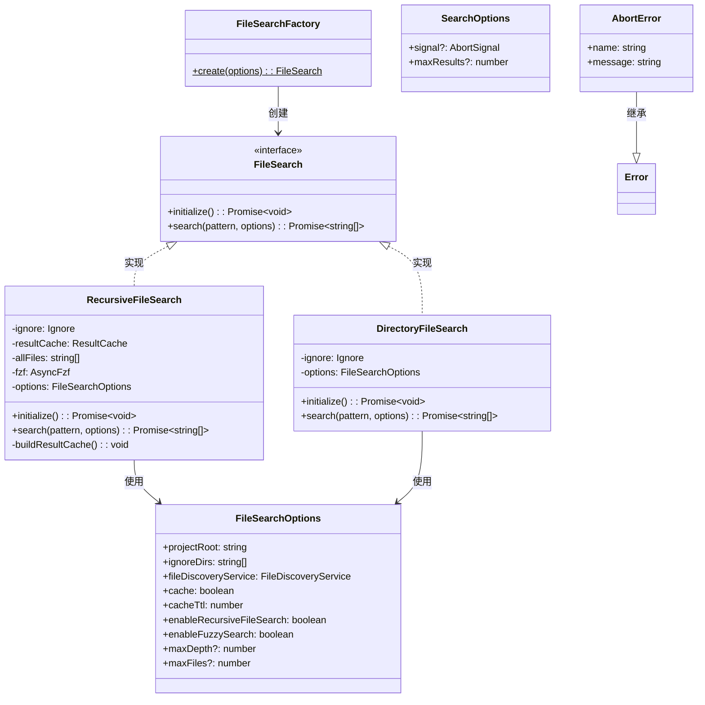

# fileSearch.ts

## 概述

`fileSearch.ts` 是文件搜索子系统的核心入口模块，提供基于模式匹配（glob / fuzzy）的文件搜索能力。它定义了两种搜索策略——**递归文件搜索**（`RecursiveFileSearch`）和**目录文件搜索**（`DirectoryFileSearch`），通过工厂类 `FileSearchFactory` 根据配置选择合适的策略。模块集成了 `picomatch`（glob 模式匹配）、`fzf`（模糊搜索）、`crawlCache`（缓存）和 `ResultCache`（搜索结果缓存）等多个子系统，是从用户搜索模式到文件路径列表的完整处理管线。

## 架构图（Mermaid）

```mermaid
flowchart TD
    subgraph FileSearchFactory
        A[create] --> B{enableRecursiveFileSearch?}
        B -->|是| C[RecursiveFileSearch]
        B -->|否| D[DirectoryFileSearch]
    end

    subgraph RecursiveFileSearch 初始化
        E[initialize] --> F[loadIgnoreRules: 加载忽略规则]
        F --> G[crawl: 爬取所有文件]
        G --> H[buildResultCache: 构建结果缓存]
        H --> I[创建 ResultCache]
        H --> J{enableFuzzySearch?}
        J -->|是| K[创建 AsyncFzf 实例]
        J -->|否| L[跳过 Fzf]
    end

    subgraph RecursiveFileSearch 搜索
        M[search] --> N[unescapePath: 反转义模式]
        N --> O[resultCache.get: 查询缓存]
        O --> P{精确命中?}
        P -->|是| Q[使用缓存结果]
        P -->|否| R{含通配符或无 Fzf?}
        R -->|是| S[filter: picomatch 过滤]
        R -->|否| T[fzf.find: 模糊搜索]
        S --> U[缓存新结果]
        T --> U
        Q --> V[fileFilter: 应用文件忽略规则]
        U --> V
        V --> W[返回最终结果]
    end

    subgraph DirectoryFileSearch 搜索
        X[search] --> Y[解析目录路径]
        Y --> Z[crawl: 仅爬取目标目录 maxDepth=0]
        Z --> AA[filter: picomatch 过滤]
        AA --> AB[fileFilter: 应用文件忽略规则]
        AB --> AC[返回最终结果]
    end
```

## 核心组件

### 排序比较器（Tiebreaker 函数）

这些函数作为 `fzf` 模糊搜索的排序决胜器，当多个结果的匹配分数相同时用于进一步排序：

| 函数 | 排序逻辑 |
|------|----------|
| `byLengthAsc` | 偏好更短的路径。路径越短，通常意味着层级越浅、越直接 |
| `byBasenamePrefix` | 偏好匹配位置在文件名（basename）开头的结果。先区分"文件名匹配"和"目录匹配"，文件名匹配优先；在同类匹配中，偏好匹配位置更靠近文件名起始处的结果 |
| `byMatchPosFromEnd` | 偏好匹配位置更靠近路径末尾的结果。末尾的匹配通常更相关（文件名比目录路径更重要） |

### 接口定义

#### `FileSearchOptions`

| 字段 | 类型 | 说明 |
|------|------|------|
| `projectRoot` | `string` | 项目根目录 |
| `ignoreDirs` | `string[]` | 额外的忽略目录列表 |
| `fileDiscoveryService` | `FileDiscoveryService` | 文件发现服务，用于读取忽略规则文件 |
| `cache` | `boolean` | 是否启用爬取缓存 |
| `cacheTtl` | `number` | 爬取缓存 TTL（秒） |
| `enableRecursiveFileSearch` | `boolean` | 是否启用递归搜索（决定使用哪种搜索策略） |
| `enableFuzzySearch` | `boolean` | 是否启用模糊搜索（仅对递归搜索有效） |
| `maxDepth` | `number`（可选） | 最大爬取深度 |
| `maxFiles` | `number`（可选） | 最大文件数量（默认 20000） |

#### `SearchOptions`

| 字段 | 类型 | 说明 |
|------|------|------|
| `signal` | `AbortSignal`（可选） | 用于取消搜索操作的中断信号 |
| `maxResults` | `number`（可选） | 最大返回结果数量 |

#### `FileSearch` 接口

| 方法 | 说明 |
|------|------|
| `initialize()` | 异步初始化搜索引擎（加载忽略规则、爬取文件等） |
| `search(pattern, options)` | 执行搜索，返回匹配的文件路径列表 |

### 类

#### `AbortError`

自定义错误类，当搜索被中断信号取消时抛出。`name` 属性显式设为 `'AbortError'`。

#### `RecursiveFileSearch`（递归文件搜索）

核心搜索策略，在初始化时一次性爬取所有文件，然后在内存中进行模式匹配。

**初始化流程** (`initialize`):
1. 调用 `loadIgnoreRules` 加载忽略规则
2. 调用 `crawl` 爬取项目根目录下的所有文件（默认最多 20000 个）
3. 调用 `buildResultCache` 构建 `ResultCache` 和可选的 `AsyncFzf` 实例

**搜索流程** (`search`):
1. 通过 `unescapePath` 反转义搜索模式，空模式默认为 `'*'`
2. 查询 `ResultCache`，若精确命中则直接使用缓存结果
3. 若未命中：
   - 模式含通配符（`*`）或未启用模糊搜索：使用 `filter` 函数（picomatch）
   - 否则：使用 `fzf.find` 进行模糊搜索
4. 将新结果缓存到 `ResultCache`（fzf 出错时跳过缓存）
5. 应用文件级忽略规则（`fileFilter`）过滤最终结果
6. 尊重 `maxResults` 和 `AbortSignal`

**构建缓存** (`buildResultCache`):
- 创建 `ResultCache` 实例
- 若启用模糊搜索，创建 `AsyncFzf` 实例，根据文件数量选择算法：
  - 超过 20000 个文件：使用 `v1` 算法（更快，只查找第一次出现）
  - 不超过 20000 个文件：使用 `v2` 算法（更精确）
- 配置 `forward: false`（从末尾开始匹配）和三个决胜器

#### `DirectoryFileSearch`（目录文件搜索）

简化的搜索策略，每次搜索只爬取目标目录（不递归）。

**初始化流程**：仅加载忽略规则

**搜索流程**：
1. 从搜索模式中提取目标目录（使用 `path.dirname` 或直接使用以 `/` 结尾的模式）
2. 调用 `crawl` 爬取目标目录，设置 `maxDepth: 0`（仅当前目录）
3. 通过 `filter` 函数应用 picomatch 模式匹配
4. 应用文件级忽略规则
5. 尊重 `maxResults` 限制

#### `FileSearchFactory`

工厂类，提供静态方法 `create`：
- `enableRecursiveFileSearch === true`：创建 `RecursiveFileSearch`
- `enableRecursiveFileSearch === false`：创建 `DirectoryFileSearch`

### 独立函数

#### `filter(allPaths, pattern, signal): Promise<string[]>`

基于 picomatch 的路径过滤函数：
- 使用 `picomatch` 配置：`dot: true`（匹配点文件）、`contains: true`（部分匹配）、`nocase: true`（不区分大小写）
- 每处理 1000 个路径通过 `setImmediate` 让出事件循环控制权，防止阻塞
- 结果排序：目录优先，然后按字典序（使用 `<`/`>` 比较，比 `localeCompare` 快 40%）

## 依赖关系

### 内部依赖

| 模块 | 导入内容 | 用途 |
|------|----------|------|
| `./ignore.js` | `loadIgnoreRules`, `Ignore`（类型） | 加载和应用忽略规则 |
| `./result-cache.js` | `ResultCache` | 搜索结果缓存，支持前缀匹配优化 |
| `./crawler.js` | `crawl` | 目录爬取 |
| `../paths.js` | `unescapePath` | 路径反转义处理 |
| `../../services/fileDiscoveryService.js` | `FileDiscoveryService`（类型） | 文件发现服务接口 |

### 外部依赖

| 模块 | 导入内容 | 用途 |
|------|----------|------|
| `node:path` | `path`（默认导入） | 路径操作：`dirname`、`join` |
| `picomatch` | `picomatch`（默认导入） | Glob 模式匹配引擎，用于 `filter` 函数 |
| `fzf` | `AsyncFzf`, `FzfResultItem`（类型） | 异步模糊搜索引擎 |

## 关键实现细节

1. **双层忽略过滤**：搜索过程分两层过滤——爬取阶段通过 `Ignore.getDirectoryFilter()` 排除被忽略的目录，搜索阶段通过 `Ignore.getFileFilter()` 排除被忽略的文件。这种分层设计使目录级过滤在爬取时就能跳过整个子树，提高性能。

2. **搜索策略的选择**：
   - **递归搜索**适合需要全局搜索的场景，一次性索引所有文件，后续搜索在内存中完成，响应极快
   - **目录搜索**适合仅需要浏览特定目录的场景，每次仅爬取一个目录（`maxDepth: 0`），内存占用低

3. **模糊搜索的自适应算法**：`AsyncFzf` 根据文件数量自动选择算法：
   - `v2`（<=20000 文件）：更精确，考虑所有匹配位置
   - `v1`（>20000 文件）：更快速，只考虑第一次匹配位置
   - `forward: false` 配置使匹配从路径末尾开始，文件名部分的匹配权重更高

4. **决胜器排序体系**：三个决胜器按优先级排列，构成一个精心设计的排序体系：
   - 首先偏好文件名前缀匹配（最直觉的匹配）
   - 其次偏好路径末尾附近的匹配（文件名比目录重要）
   - 最后偏好更短的路径（层级越浅越相关）

5. **事件循环友好**：在 `filter` 函数和 `search` 方法中，每处理 1000 个条目就通过 `setImmediate` 让出控制权，防止长时间搜索阻塞 Node.js 事件循环。同时在每次让出后检查 `AbortSignal`，支持及时取消。

6. **ResultCache 优化**：`RecursiveFileSearch` 使用 `ResultCache` 缓存搜索结果。查询时先尝试精确匹配缓存，未命中则回退到最长前缀缓存条目作为候选集，缩小搜索范围。

7. **filter 排序性能优化**：排序时使用简单的 `<`/`>` 字符串比较代替 `localeCompare`，据注释可提升 40% 性能。排序结果中目录排在文件前面。

8. **picomatch 配置**：`contains: true` 允许模式匹配路径的任意部分（而不是要求完整匹配），`dot: true` 允许匹配以 `.` 开头的隐藏文件，`nocase: true` 不区分大小写。

9. **Fzf 错误处理**：模糊搜索失败时（`fzf.find` reject），捕获错误并返回空数组，同时设置 `shouldCache = false` 避免缓存错误结果。
