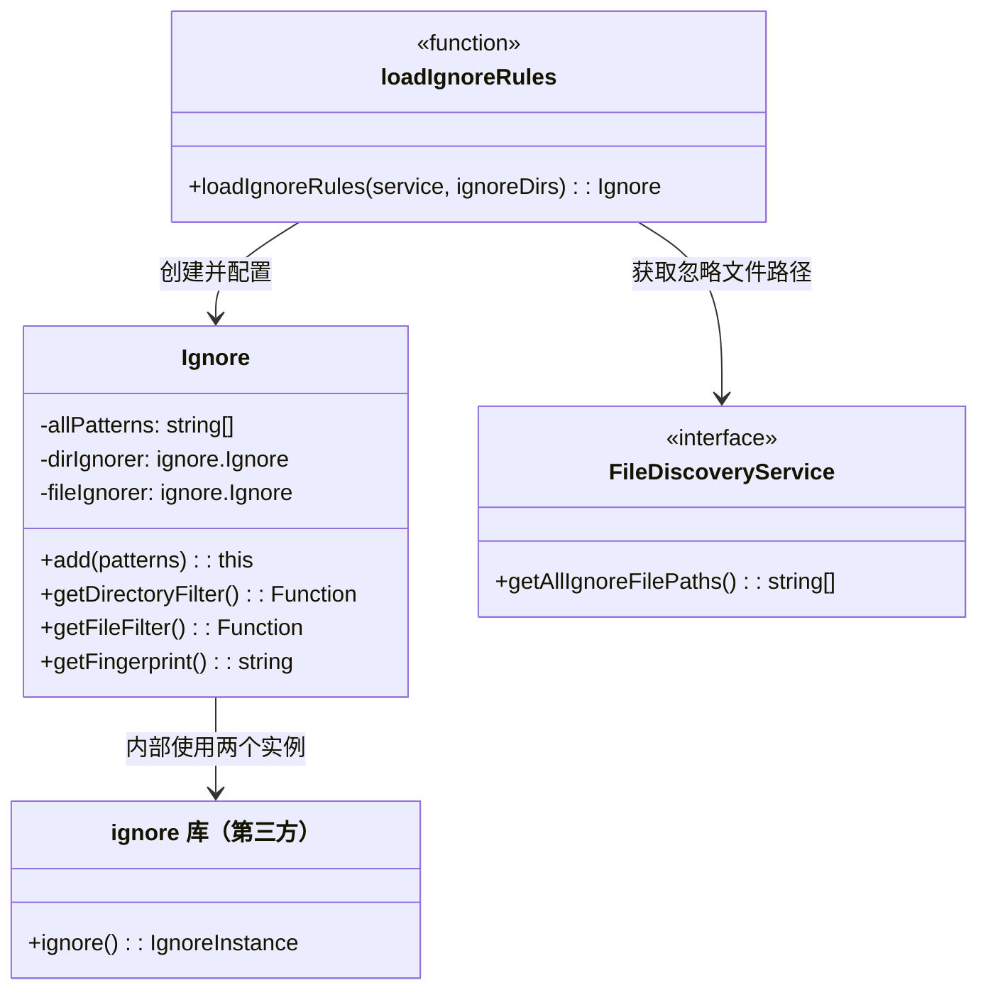

# ignore.ts

## 概述

`ignore.ts` 是文件搜索子系统中的忽略规则管理模块，负责解析、存储和应用类似 `.gitignore` 格式的忽略规则。它将忽略规则分为两类——**目录级忽略**和**文件级忽略**，分别用于爬取阶段的目录过滤和搜索阶段的文件过滤。该模块还提供了 `loadIgnoreRules` 工厂函数，用于从文件发现服务加载忽略规则文件并构建 `Ignore` 实例。

## 架构图（Mermaid）

```mermaid
flowchart TD
    subgraph loadIgnoreRules 函数
        A[获取忽略文件路径列表] --> B[遍历每个忽略文件]
        B --> C{文件存在?}
        C -->|是| D[读取文件内容]
        D --> E[ignorer.add 添加规则]
        C -->|否| F[跳过]
        E --> G[添加固定目录: .git + 自定义 ignoreDirs]
        G --> H[确保目录规则有尾部斜杠]
        H --> I[返回配置好的 Ignore 实例]
    end

    subgraph Ignore.add 规则分类
        J[输入规则] --> K[按换行符拆分]
        K --> L[遍历每行]
        L --> M{空行或注释?}
        M -->|是| N[跳过]
        M -->|否| O[记录到 allPatterns]
        O --> P{以 / 结尾且非否定?}
        P -->|是: 目录规则| Q[仅添加到 dirIgnorer]
        P -->|否: 模糊/文件规则| R[添加到 fileIgnorer]
        R --> S{末尾段无文件扩展名?}
        S -->|是: 可能是目录| T[同时添加到 dirIgnorer]
        S -->|否: 确定是文件| U[仅在 fileIgnorer]
    end

    subgraph 双过滤器输出
        V[getDirectoryFilter] --> W[返回 dirIgnorer.ignores 谓词]
        X[getFileFilter] --> Y[返回 fileIgnorer.ignores 谓词]
    end
```

## 核心组件

### 模块级常量

| 名称 | 类型 | 说明 |
|------|------|------|
| `hasFileExtension` | `picomatch.Matcher` | 预编译的 picomatch 匹配器，模式 `**/*[*.]*`，用于判断一个模式的最后一段是否包含文件扩展名（即是否含有 `.`） |

### 工厂函数

#### `loadIgnoreRules(service, ignoreDirs): Ignore`

从文件发现服务加载忽略规则并创建配置好的 `Ignore` 实例。

**参数**：
- `service: FileDiscoveryService` — 文件发现服务，通过 `getAllIgnoreFilePaths()` 获取所有忽略文件的路径列表
- `ignoreDirs: string[]`（默认 `[]`） — 额外的忽略目录列表

**执行流程**：
1. 创建新的 `Ignore` 实例
2. 获取所有忽略文件路径（如 `.gitignore`、`.geminiignore` 等）
3. 遍历每个路径，若文件存在则读取内容并通过 `ignorer.add()` 添加规则
4. 将 `.git` 目录和 `ignoreDirs` 中的目录合并，确保每个都以 `/` 结尾后添加
5. 返回配置好的 `Ignore` 实例

### Ignore 类

#### 私有属性

| 属性 | 类型 | 说明 |
|------|------|------|
| `allPatterns` | `string[]` | 所有已添加的有效模式（去除空行和注释后），用于生成指纹 |
| `dirIgnorer` | `ignore.Ignore` | 目录级忽略器，包含显式目录规则和启发式推断的目录规则 |
| `fileIgnorer` | `ignore.Ignore` | 文件级忽略器，包含所有非显式目录规则（包括否定规则） |

#### 公开方法

##### `add(patterns: string | string[]): this`

添加忽略规则，支持链式调用。

**参数**：
- `patterns` — 单个规则字符串（可包含多行）或规则字符串数组

**规则分类逻辑**：

1. 若输入为字符串，按换行符（`\r?\n`）拆分为数组
2. 遍历每条规则：
   - 空行或以 `#` 开头的注释行 → 跳过
   - 记录有效规则到 `allPatterns`
   - **显式目录规则**（以 `/` 结尾且不以 `!` 开头）→ 仅添加到 `dirIgnorer`
   - **其他规则** → 添加到 `fileIgnorer`，并通过启发式判断是否也添加到 `dirIgnorer`：
     - 若规则不含文件扩展名（`hasFileExtension` 返回 `false`）→ 可能是目录名，同时添加到 `dirIgnorer`
     - 若规则含文件扩展名 → 视为纯文件规则，仅在 `fileIgnorer`

##### `getDirectoryFilter(): (dirPath: string) => boolean`

返回目录过滤谓词函数。调用时传入目录路径，返回 `true` 表示该目录应被忽略。

##### `getFileFilter(): (filePath: string) => boolean`

返回文件过滤谓词函数。调用时传入文件路径，返回 `true` 表示该文件应被忽略。

##### `getFingerprint(): string`

返回所有有效规则的拼接字符串（以换行符连接），用作缓存键的一部分，确保规则变化时缓存自动失效。

## 依赖关系

### 内部依赖

| 模块 | 导入内容 | 用途 |
|------|----------|------|
| `../../services/fileDiscoveryService.js` | `FileDiscoveryService`（类型） | 文件发现服务接口，用于获取忽略文件路径列表 |

### 外部依赖

| 模块 | 导入内容 | 用途 |
|------|----------|------|
| `node:fs` | `fs`（默认导入） | 检查忽略文件是否存在（`existsSync`）、读取文件内容（`readFileSync`） |
| `ignore` | `ignore`（默认导入） | `.gitignore` 风格的规则匹配库，用于创建 `dirIgnorer` 和 `fileIgnorer` 实例 |
| `picomatch` | `picomatch`（默认导入） | Glob 模式匹配，用于创建 `hasFileExtension` 匹配器 |

## 关键实现细节

1. **双忽略器架构**：将规则分为 `dirIgnorer` 和 `fileIgnorer` 两个独立的 `ignore` 实例，分别在不同阶段使用：
   - `dirIgnorer`：在爬取阶段由 `crawler.ts` 的 `exclude` 回调调用，可以跳过整个被忽略的目录子树，极大提升性能
   - `fileIgnorer`：在搜索阶段由 `fileSearch.ts` 的搜索方法调用，过滤单个文件

2. **启发式目录推断**：对于模糊规则（如 `build`、`dist`），无法确定它匹配的是文件还是目录。模块通过 `hasFileExtension` 判断规则最后一段是否包含 `.`（文件扩展名标志）：
   - 无扩展名（如 `build`、`node_modules`）→ 可能是目录，同时加入 `dirIgnorer`
   - 有扩展名（如 `*.log`、`config.json`）→ 大概率是文件，仅在 `fileIgnorer`
   - **注意**：这是一个启发式规则，可能误判。例如名为 `my.assets` 的目录不会被加入 `dirIgnorer`，导致该目录被爬取（降低效率但不影响正确性，因为最终的 `fileIgnorer` 仍会过滤它）

3. **正确性保证**：即使启发式目录推断失败（如含 `.` 的目录名），正确性仍然得到保证。被多余爬取的目录中的文件最终会被 `fileIgnorer` 过滤掉，只是浪费了爬取时间。

4. **否定规则处理**：以 `!` 开头的否定规则（即使以 `/` 结尾）不会被归类为目录规则，而是归入 `fileIgnorer`。这确保了否定规则的语义正确性——否定规则用于"恢复"被前面规则忽略的文件，应在文件级别生效。

5. **固定忽略 `.git` 目录**：`loadIgnoreRules` 始终将 `.git/` 加入忽略列表，这是一个硬编码的安全措施，确保 Git 内部文件不会出现在搜索结果中。

6. **尾部斜杠规范化**：`loadIgnoreRules` 在添加自定义忽略目录时，自动为没有尾部斜杠的目录名添加 `/`，确保它们被正确识别为目录规则。

7. **指纹机制**：`getFingerprint()` 返回所有有效规则的拼接字符串，用于 `crawlCache` 的缓存键生成。当忽略规则发生任何变化（添加、删除、修改规则），指纹也会变化，触发缓存失效。
