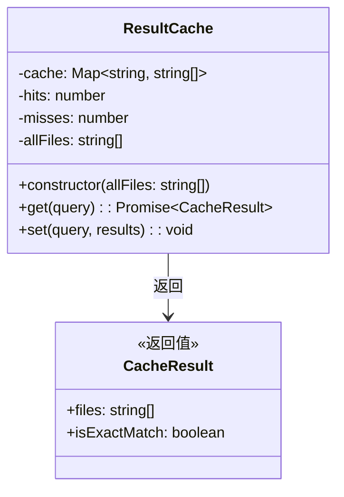
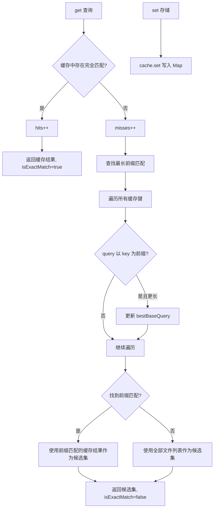
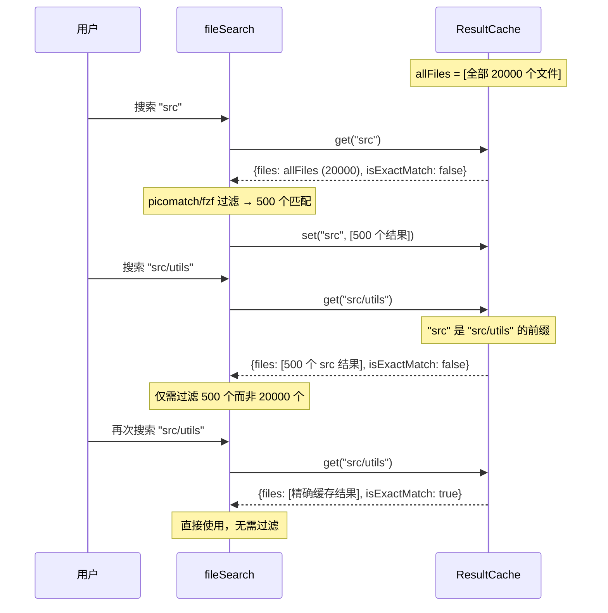

# result-cache.ts

## 概述

`ResultCache` 是文件搜索子系统中的搜索结果内存缓存，用于优化连续搜索场景下的性能。它的核心创新在于**前缀匹配优化**：当新查询是某个已缓存查询的延伸（例如先搜索 `"foo"` 再搜索 `"foobar"`）时，可以从前一次的结果集（更小的子集）开始搜索，而不是从全部文件列表重新搜索。这种增量式搜索特别适合用户逐字输入搜索关键词的交互场景。

## 架构图（Mermaid）







## 核心组件

### ResultCache 类

#### 私有属性

| 属性 | 类型 | 说明 |
|------|------|------|
| `cache` | `Map<string, string[]>` | 搜索结果缓存，键为查询模式，值为匹配的文件路径数组 |
| `hits` | `number` | 缓存命中次数计数器 |
| `misses` | `number` | 缓存未命中次数计数器 |
| `allFiles` | `string[]`（readonly） | 全部文件列表，作为缓存未命中时的兜底候选集 |

#### 构造函数

```typescript
constructor(private readonly allFiles: string[])
```

- **参数**：`allFiles` — 全部文件路径列表（通常由 `crawl` 爬取得到）
- 初始化空的 `cache` Map 和计数器

#### 公开方法

##### `get(query): Promise<{ files: string[]; isExactMatch: boolean }>`

获取搜索候选集。

**返回值**：
- `files: string[]` — 候选文件列表
- `isExactMatch: boolean` — 是否为精确缓存命中

**执行逻辑**：

1. **精确匹配**：若 `cache` 中存在该查询键，递增 `hits`，返回缓存结果并标记 `isExactMatch: true`

2. **前缀匹配**（核心优化）：若无精确匹配，递增 `misses`，然后遍历所有缓存键，找到满足以下条件的最长键：
   - 当前查询 `query` 以该键为前缀（`query.startsWith(key)`）
   - 该键比目前找到的最佳前缀更长（`key.length > bestBaseQuery.length`）

3. **返回候选集**：
   - 若找到前缀匹配 → 返回该前缀对应的缓存结果（更小的子集）
   - 若未找到 → 返回 `allFiles`（完整文件列表）
   - 两种情况均标记 `isExactMatch: false`

##### `set(query, results): void`

存储搜索结果到缓存。

- **参数**：
  - `query: string` — 搜索查询模式
  - `results: string[]` — 匹配的文件路径列表

## 依赖关系

### 内部依赖

无内部模块依赖。本模块是一个自包含的缓存数据结构。

### 外部依赖

无外部依赖。完全基于 JavaScript/TypeScript 标准库实现。

## 关键实现细节

1. **前缀匹配优化原理**：这是该缓存的核心设计。搜索通常是增量式的——用户先输入 `"f"`，然后 `"fo"`、`"foo"`、`"foobar"`。每次新查询都是前一次的超集条件（更严格的匹配），因此前一次的结果集一定包含新查询的所有匹配项。通过从更小的子集开始搜索，可以显著减少需要评估的文件数量。

2. **最长前缀策略**：在多个前缀候选中选择最长的（`key.length > bestBaseQuery.length`），因为最长前缀对应最精确的先前搜索，其结果集最小，搜索效率最高。例如对于查询 `"src/utils/path"`，若缓存中同时有 `"src"` 和 `"src/utils"` 的结果，选择 `"src/utils"` 的结果更优。

3. **异步接口设计**：`get` 方法返回 `Promise`，尽管当前实现是同步的。这为未来可能的异步扩展（如磁盘持久化缓存）预留了接口兼容性。

4. **命中/未命中统计**：`hits` 和 `misses` 计数器虽然在当前代码中未被外部使用，但为缓存性能监控和调试提供了基础设施。

5. **无自动失效机制**：与 `crawlCache`（有 TTL）不同，`ResultCache` 没有自动过期机制。它的生命周期与 `RecursiveFileSearch` 实例绑定，在每次 `initialize()` 时重新创建。这种设计是合理的，因为搜索结果缓存依赖于文件列表 `allFiles`，而 `allFiles` 在初始化时确定且不会变化。

6. **缓存一致性假设**：前缀优化基于一个重要假设——如果查询 B 是查询 A 的延伸（B 以 A 为前缀），那么 B 的结果一定是 A 结果的子集。这在文件路径搜索场景下通常成立（更长的搜索模式匹配更少的文件），但在某些边缘情况下（如带有否定模式的搜索）可能不完全准确。

7. **线性扫描前缀查找**：当前使用简单的 `for...of` 遍历所有缓存键来查找最长前缀。在缓存条目较少的典型场景下性能足够。若缓存条目极多，可考虑用 Trie（前缀树）优化，但目前的简单实现更符合实际使用场景的性能需求。

8. **安全的可选链**：`this.cache?.keys?.()` 中使用了可选链操作符，这是一种防御性编程，确保即使 `cache` 在某些异常情况下为 `undefined` 也不会崩溃，会回退到空数组迭代。
