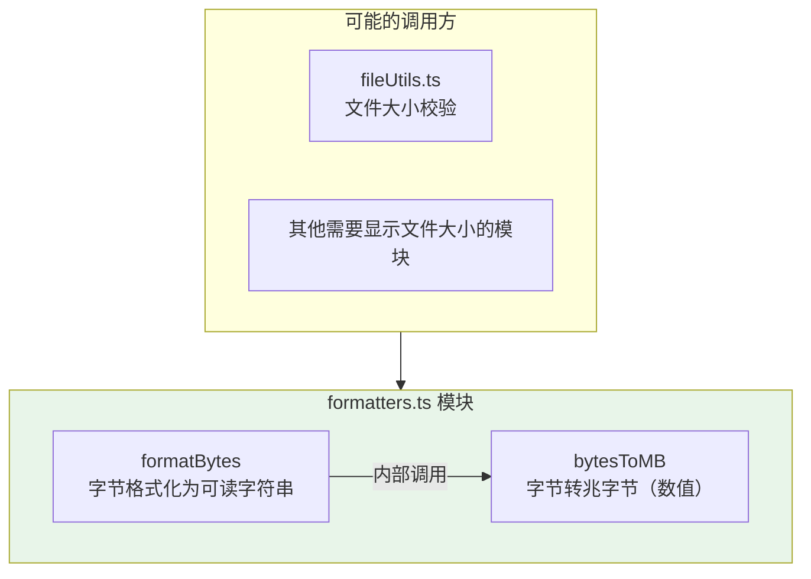

# formatters.ts

## 概述

`formatters.ts` 是 Gemini CLI 核心包中的数据格式化工具模块，提供字节数值到人类可读字符串的转换功能。该模块非常轻量，仅包含两个导出函数，专注于文件大小的单位换算与格式化显示。

该文件位于 `packages/core/src/utils/formatters.ts`，共 19 行代码。

## 架构图（Mermaid）



## 核心组件

### 1. `bytesToMB(bytes: number): number`

- **功能**：将字节数转换为兆字节（MB）数值
- **参数**：`bytes` - 字节数
- **返回**：浮点数，表示对应的 MB 值
- **计算公式**：`bytes / (1024 * 1024)`，即 `bytes / 1,048,576`
- **示例**：
  ```typescript
  bytesToMB(1048576)  // => 1
  bytesToMB(5242880)  // => 5
  bytesToMB(512000)   // => 0.48828125
  ```

### 2. `formatBytes(bytes: number): string`

- **功能**：将字节数格式化为人类可读的文件大小字符串，自动选择合适的单位
- **参数**：`bytes` - 字节数
- **返回**：格式化后的字符串，包含数值和单位
- **单位选择规则**：

  | 字节范围 | 输出单位 | 小数精度 | 示例 |
  |---|---|---|---|
  | < 1 MB (1,048,576 字节) | KB | 1 位小数 | `"512.0 KB"` |
  | >= 1 MB 且 < 1 GB (1,073,741,824 字节) | MB | 1 位小数 | `"25.5 MB"` |
  | >= 1 GB | GB | 2 位小数 | `"1.50 GB"` |

- **实现细节**：
  - KB 范围：`(bytes / 1024).toFixed(1)`
  - MB 范围：内部复用 `bytesToMB()` 函数
  - GB 范围：`(bytes / (1024 * 1024 * 1024)).toFixed(2)`
- **示例**：
  ```typescript
  formatBytes(500000)       // => "488.3 KB"
  formatBytes(5242880)      // => "5.0 MB"
  formatBytes(1073741824)   // => "1.00 GB"
  formatBytes(2684354560)   // => "2.50 GB"
  ```

## 依赖关系

### 内部依赖

无。`formatters.ts` 是一个零依赖的纯工具模块，不依赖项目中的任何其他模块。

### 外部依赖

无。该模块仅使用 JavaScript 原生的数学运算和 `Number.prototype.toFixed()` 方法，不需要任何外部库。

## 关键实现细节

1. **纯函数设计**：两个函数都是纯函数，没有副作用，输入相同的参数总是返回相同的结果，非常适合单元测试。

2. **二进制单位制**：使用 1024 进制（IEC 标准），即 1 KB = 1024 字节、1 MB = 1024 KB、1 GB = 1024 MB，而非 1000 进制的 SI 标准。这与操作系统和大多数开发工具的习惯一致。

3. **精度差异**：KB 和 MB 保留 1 位小数，而 GB 保留 2 位小数。这是合理的设计选择 -- GB 级别的文件大小变化更需要精确显示。

4. **`bytesToMB` 的复用**：`formatBytes` 在 MB 范围内复用了 `bytesToMB` 函数，体现了 DRY（Don't Repeat Yourself）原则。`bytesToMB` 同时也被独立导出，供其他模块直接使用（如文件大小限制校验中需要进行数值比较而非格式化显示的场景）。

5. **边界行为注意**：
   - 当 `bytes` 为 0 时，`formatBytes(0)` 返回 `"0.0 KB"`
   - 当 `bytes` 为负数时，函数仍会计算，但返回负数字符串（如 `"-1.0 KB"`），调用方应确保传入非负值
   - `bytesToMB` 不做任何边界检查，纯粹做数学除法
