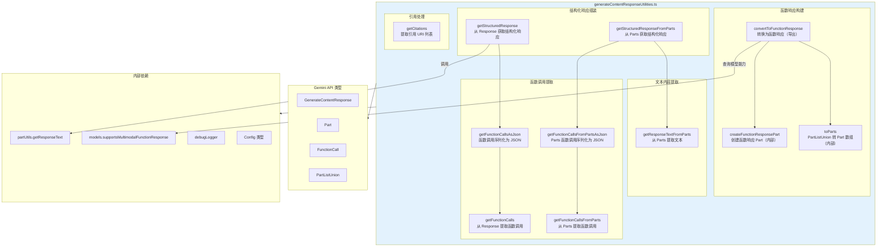
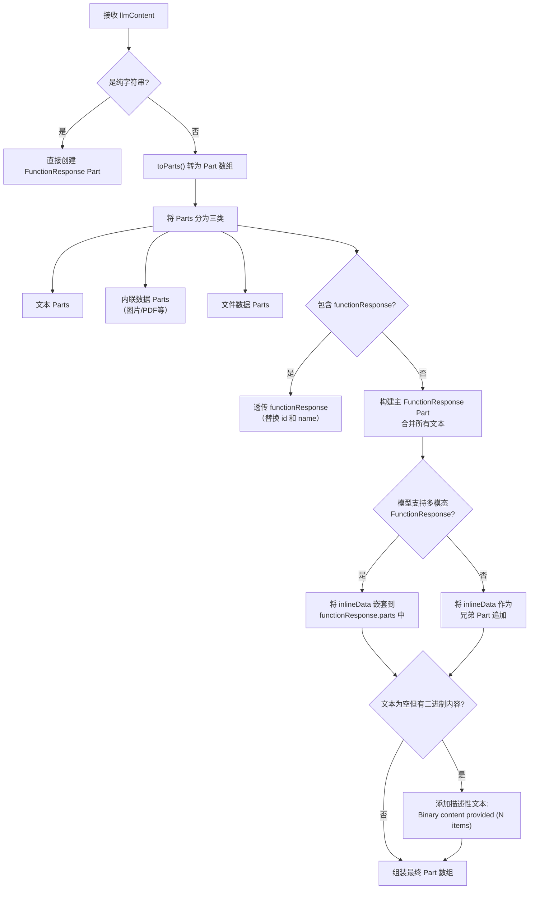

# generateContentResponseUtilities.ts

## 概述

`generateContentResponseUtilities.ts` 是 Gemini CLI 核心包中处理 Gemini API 响应数据的工具模块。该模块提供了一整套函数，用于解析、转换和格式化 `GenerateContentResponse`（Gemini API 的内容生成响应）中的各种数据结构，包括文本内容提取、函数调用（Function Call）解析、工具响应（Function Response）构建以及引用（Citation）提取。

该文件位于 `packages/core/src/utils/generateContentResponseUtilities.ts`，共 244 行代码，是 Gemini CLI 与 Gemini API 交互的关键数据处理层。

## 架构图（Mermaid）



## 核心组件

### 1. 函数响应构建

#### `createFunctionResponsePart(callId, toolName, output): Part`（内部函数）
- **功能**：创建一个标准的 Gemini `FunctionResponse` Part 对象
- **参数**：
  - `callId` - 函数调用的唯一标识符
  - `toolName` - 工具/函数名称
  - `output` - 工具执行的文本输出
- **返回结构**：
  ```typescript
  {
    functionResponse: {
      id: callId,
      name: toolName,
      response: { output }
    }
  }
  ```

#### `toParts(input: PartListUnion): Part[]`（内部函数）
- **功能**：将 `PartListUnion`（可以是字符串、Part 对象或它们的数组）统一转换为 `Part[]` 数组
- **转换规则**：
  - 字符串 -> `{ text: string }`
  - Part 对象 -> 保持原样
  - `null`/`undefined` 元素 -> 过滤掉
  - 非数组输入 -> 包装为单元素数组后处理

#### `convertToFunctionResponse(toolName, callId, llmContent, model, config?): Part[]`（导出）
- **功能**：将工具执行结果转换为 Gemini API 所需的函数响应格式。这是本模块最核心且最复杂的函数。
- **参数**：
  - `toolName` - 工具名称
  - `callId` - 调用 ID
  - `llmContent` - 工具输出内容（可以是字符串或混合 Part 列表）
  - `model` - 当前使用的模型名称
  - `config` - 可选的配置对象
- **处理逻辑**：



- **关键特性**：
  - **多模态支持**：根据模型能力决定内联数据的处理方式。支持多模态函数响应的模型会将 `inlineData` 嵌套在 `functionResponse` 内部；不支持的模型则将其作为兄弟 Part 放置
  - **透传机制**：如果输入已经包含 `functionResponse` Part，会直接透传其 `response` 内容，仅替换 `id` 和 `name`
  - **空响应保护**：当没有文本但有二进制内容时，自动添加描述性文本，避免返回空响应

### 2. 文本内容提取

#### `getResponseTextFromParts(parts: Part[]): string | undefined`
- **功能**：从 Part 数组中提取并拼接所有文本内容
- **实现**：过滤出所有 `part.text` 非空的 Part，将文本段连接（无分隔符）后返回
- **返回**：拼接后的文本字符串，无文本时返回 `undefined`

### 3. 函数调用提取

#### `getFunctionCalls(response: GenerateContentResponse): FunctionCall[] | undefined`
- **功能**：从完整的 `GenerateContentResponse` 中提取所有函数调用
- **数据路径**：`response.candidates[0].content.parts` -> 过滤 `functionCall` 非空的 Part
- **返回**：`FunctionCall` 数组，无函数调用时返回 `undefined`

#### `getFunctionCallsFromParts(parts: Part[]): FunctionCall[] | undefined`
- **功能**：与 `getFunctionCalls` 相同逻辑，但直接接收 `Part[]` 数组而非完整 Response
- **用途**：在已经拥有 Parts 数组时避免重复访问 Response 结构

#### `getFunctionCallsAsJson(response: GenerateContentResponse): string | undefined`
- **功能**：将函数调用列表序列化为格式化的 JSON 字符串
- **格式**：使用 2 空格缩进的 `JSON.stringify`

#### `getFunctionCallsFromPartsAsJson(parts: Part[]): string | undefined`
- **功能**：同上，但接收 `Part[]` 作为输入

### 4. 结构化响应组装

#### `getStructuredResponse(response: GenerateContentResponse): string | undefined`
- **功能**：从完整响应中提取文本内容和函数调用，组合为结构化字符串
- **输出格式**：
  - 有文本 + 有函数调用：`"{textContent}\n{functionCallsJson}"`
  - 仅有文本：`"{textContent}"`
  - 仅有函数调用：`"{functionCallsJson}"`
  - 都没有：`undefined`
- **依赖**：调用 `partUtils.getResponseText` 提取文本（注意不是本模块的 `getResponseTextFromParts`）

#### `getStructuredResponseFromParts(parts: Part[]): string | undefined`
- **功能**：同上，但基于 `Part[]` 输入
- **依赖**：使用本模块的 `getResponseTextFromParts` 和 `getFunctionCallsFromPartsAsJson`

### 5. 引用处理

#### `getCitations(resp: GenerateContentResponse): string[]`
- **功能**：从响应中提取引用信息列表
- **数据路径**：`resp.candidates[0].citationMetadata.citations`
- **输出格式**：
  - 有标题：`"(title) uri"`
  - 无标题：`"uri"`
- **过滤**：仅返回包含 `uri` 的引用条目

## 依赖关系

### 内部依赖

| 依赖模块 | 导入内容 | 用途 |
|---|---|---|
| `./partUtils.js` | `getResponseText` | 从 `GenerateContentResponse` 中提取文本内容 |
| `../config/models.js` | `supportsMultimodalFunctionResponse` | 检查指定模型是否支持多模态函数响应 |
| `./debugLogger.js` | `debugLogger` | 记录调试警告信息 |
| `../config/config.js` | `Config`（类型） | 配置对象类型定义 |

### 外部依赖

| 依赖包 | 导入内容 | 用途 |
|---|---|---|
| `@google/genai` | `GenerateContentResponse`（类型） | Gemini API 的内容生成响应类型 |
| `@google/genai` | `Part`（类型） | 响应内容的基本单元类型 |
| `@google/genai` | `FunctionCall`（类型） | 函数调用描述类型 |
| `@google/genai` | `PartListUnion`（类型） | Part 列表的联合类型（字符串、Part 或数组） |

## 关键实现细节

1. **Response vs Parts 的双套 API**：模块为大部分功能提供了两套接口 -- 一套接收完整的 `GenerateContentResponse`，另一套直接接收 `Part[]` 数组。这种设计提供了灵活性：在流式处理或已经解析出 Parts 的场景中可以使用 Parts 版本，避免重复的对象访问。

2. **多模态函数响应的模型适配**：`convertToFunctionResponse` 根据模型能力动态调整输出格式。支持多模态函数响应的模型（通过 `supportsMultimodalFunctionResponse` 查询）可以在 `functionResponse` 内部嵌套 `inlineData`，而不支持的模型则将二进制数据作为独立的兄弟 Part。这确保了不同模型版本之间的兼容性。

3. **`functionResponse` 透传机制**：当输入的 `llmContent` 已经包含预构建的 `functionResponse` Part 时，函数会直接透传其 `response` 字段，仅替换 `id` 和 `name` 以确保调用链的一致性。同时会发出调试警告，提醒可能的多 Part 数据丢失。

4. **空响应保护**：当工具输出只包含二进制数据（图片、PDF 等）但没有文本时，函数会自动生成描述性文本 `"Binary content provided (N item(s))."`，确保 `functionResponse.response` 不为空对象，避免 API 侧的潜在问题。

5. **类型断言的使用**：代码中多处使用 `as FunctionCall` 和 `as unknown as { parts: Part[] }` 类型断言，并标注了 `eslint-disable` 注释。这是因为 `@google/genai` 的类型定义可能不完全匹配实际运行时结构，特别是多模态函数响应的 `parts` 字段可能尚未在类型定义中体现。

6. **安全的可选链访问**：所有从 `GenerateContentResponse` 提取数据的函数都使用了可选链（`?.`）和空值合并（`??`）操作符，确保在响应结构不完整时不会抛出异常，而是优雅地返回 `undefined`。

7. **引用格式化的容错设计**：`getCitations` 函数先过滤掉没有 `uri` 的引用条目，然后对有 `title` 和无 `title` 的情况分别格式化，确保输出的引用列表中每一项都有有效的 URI。
