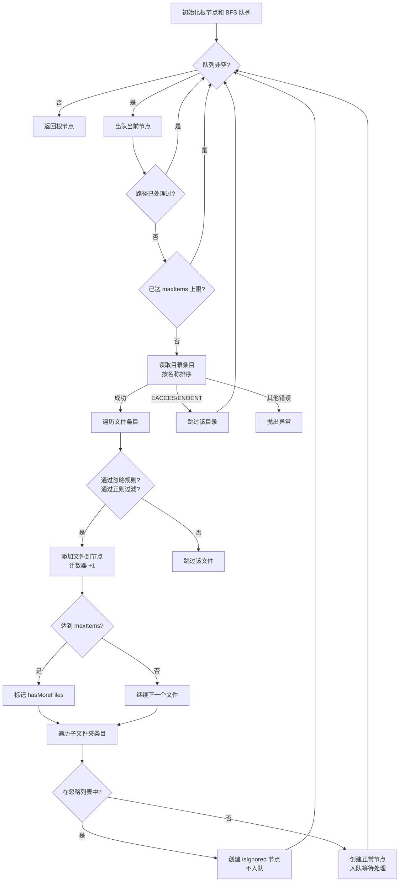

# getFolderStructure.ts

## 概述

`getFolderStructure.ts` 是 Gemini CLI 核心包中的目录结构可视化模块。该模块的核心功能是遍历指定目录，生成树状的文本表示（类似 Unix `tree` 命令的输出），用于向 LLM 展示项目的文件系统结构。模块采用广度优先搜索（BFS）算法遍历目录，支持条目数量限制、忽略特定文件夹、文件名正则过滤以及与 `.gitignore`/`.geminiignore` 的集成。

该文件位于 `packages/core/src/utils/getFolderStructure.ts`，共 359 行代码。

## 架构图（Mermaid）

```mermaid
graph TB
    subgraph 模块["getFolderStructure.ts"]
        direction TB

        subgraph 常量与配置["常量与配置"]
            MAX_ITEMS["MAX_ITEMS = 200<br/>最大条目数"]
            TRUNCATION_INDICATOR["TRUNCATION_INDICATOR = '...'<br/>截断指示符"]
            DEFAULT_IGNORED_FOLDERS["DEFAULT_IGNORED_FOLDERS<br/>默认忽略文件夹集合"]
        end

        subgraph 接口定义["接口定义"]
            FolderStructureOptions["FolderStructureOptions<br/>文件夹结构选项"]
            MergedFolderStructureOptions["MergedFolderStructureOptions<br/>合并后的选项（完整类型）"]
            FullFolderInfo["FullFolderInfo<br/>完整文件夹信息节点"]
        end

        subgraph 核心函数["核心函数"]
            readFullStructure["readFullStructure<br/>BFS 遍历读取目录结构（内部）"]
            formatStructure["formatStructure<br/>递归格式化为树形文本（内部）"]
            getFolderStructure_fn["getFolderStructure<br/>主入口函数（导出）"]
        end
    end

    getFolderStructure_fn -->|"1. 合并选项"| MergedFolderStructureOptions
    getFolderStructure_fn -->|"2. BFS 遍历"| readFullStructure
    getFolderStructure_fn -->|"3. 格式化输出"| formatStructure
    readFullStructure -->|"构建"| FullFolderInfo
    formatStructure -->|"读取"| FullFolderInfo
    readFullStructure -->|"使用"| MAX_ITEMS
    readFullStructure -->|"使用"| DEFAULT_IGNORED_FOLDERS

    subgraph 内部依赖模块["内部依赖"]
        errors["errors.js<br/>getErrorMessage / isNodeError"]
        fileDiscoveryService["FileDiscoveryService<br/>文件发现服务"]
        configConstants["config/constants.js<br/>默认文件过滤选项"]
        debugLoggerDep["debugLogger<br/>调试日志"]
    end

    subgraph Node原生模块["Node.js 原生模块"]
        fsPromises["node:fs/promises<br/>异步目录读取"]
        pathModule["node:path<br/>路径处理"]
        DirentType["Dirent 类型<br/>目录条目"]
    end

    readFullStructure --> fileDiscoveryService
    readFullStructure --> errors
    readFullStructure --> fsPromises
    getFolderStructure_fn --> debugLoggerDep
    getFolderStructure_fn --> errors

    style 模块 fill:#f3e5f5
```



## 核心组件

### 1. 常量

| 常量名 | 值 | 说明 |
|---|---|---|
| `MAX_ITEMS` | `200` | 默认最大显示条目数（文件 + 文件夹总和） |
| `TRUNCATION_INDICATOR` | `'...'` | 内容被截断或文件夹被忽略时的指示符 |
| `DEFAULT_IGNORED_FOLDERS` | `Set{'node_modules', '.git', 'dist', '__pycache__'}` | 默认忽略的文件夹名称集合 |

### 2. 接口定义

#### `FolderStructureOptions`
用户可配置的选项接口：

```typescript
interface FolderStructureOptions {
  maxItems?: number;                         // 最大条目数，默认 200
  ignoredFolders?: Set<string>;              // 忽略的文件夹名称集合
  fileIncludePattern?: RegExp;               // 文件名包含模式正则
  fileService?: FileDiscoveryService;        // 文件发现服务（用于 gitignore 等过滤）
  fileFilteringOptions?: FileFilteringOptions; // 文件过滤选项
}
```

#### `MergedFolderStructureOptions`
内部使用的合并选项类型，将 `maxItems` 和 `ignoredFolders` 标记为必需，其余保持可选：

```typescript
type MergedFolderStructureOptions = Required<
  Omit<FolderStructureOptions, 'fileIncludePattern' | 'fileService'>
> & {
  fileIncludePattern?: RegExp;
  fileService?: FileDiscoveryService;
  fileFilteringOptions?: FileFilteringOptions;
};
```

#### `FullFolderInfo`
目录树节点的数据结构：

```typescript
interface FullFolderInfo {
  name: string;              // 文件夹名称
  path: string;              // 绝对路径
  files: string[];           // 该文件夹下的文件名列表
  subFolders: FullFolderInfo[]; // 子文件夹节点列表
  totalChildren: number;     // BFS 扫描期间包含的文件和子文件夹总数
  totalFiles: number;        // BFS 扫描期间包含的文件数
  isIgnored?: boolean;       // 是否为被忽略的文件夹
  hasMoreFiles?: boolean;    // 该文件夹的文件是否被截断
  hasMoreSubfolders?: boolean; // 该文件夹的子文件夹是否被截断
}
```

### 3. `readFullStructure(rootPath, options): Promise<FullFolderInfo | null>`（内部函数）

- **功能**：使用 BFS 算法遍历目录结构，构建完整的 `FullFolderInfo` 树
- **算法流程**：



- **关键设计**：
  - **BFS 而非 DFS**：广度优先确保浅层目录优先被收录，在达到 `maxItems` 限制时，深层嵌套的内容会被自然截断
  - **符号链接环保护**：维护 `processedPaths` Set，防止符号链接导致的无限循环
  - **先处理文件后处理目录**：在每个目录中，先处理所有文件条目，再处理子目录条目，确保文件优先占用配额
  - **字母排序**：目录条目按名称字母序排列，保证输出一致性
  - **条目级忽略**：被忽略的文件夹会创建一个 `isIgnored: true` 的节点但不会入队遍历其子内容
  - **错误容错**：`EACCES`（权限不足）和 `ENOENT`（不存在）错误会跳过对应目录而非中断整个遍历；根目录 `ENOENT` 返回 `null`

### 4. `formatStructure(node, currentIndent, isLastChildOfParent, isProcessingRootNode, builder): void`（内部函数）

- **功能**：将 `FullFolderInfo` 树递归格式化为树形文本
- **树形符号**：
  | 符号 | 含义 |
  |---|---|
  | `├───` | 非最后一个兄弟节点的连接符 |
  | `└───` | 最后一个兄弟节点的连接符 |
  | `│   ` | 垂直连接线（父级非最后兄弟节点时的缩进） |
  | `    ` | 空白缩进（父级是最后兄弟节点时的缩进） |
- **渲染顺序**：
  1. 渲染当前节点自身（非根节点时显示连接符和文件夹名 + `/`）
  2. 渲染当前节点下的文件
  3. 如果文件被截断，显示 `...` 指示符
  4. 递归渲染子文件夹
  5. 如果子文件夹被截断，显示 `...` 指示符
- **被忽略文件夹**：显示为 `├───foldername/...`，文件夹名后附带截断指示符
- **根节点特殊处理**：根节点不显示连接符，其子节点从零缩进开始

### 5. `getFolderStructure(directory, options?): Promise<string>`（主导出函数）

- **功能**：生成目录结构的完整文本表示
- **处理流程**：
  1. 解析目录路径为绝对路径
  2. 合并用户选项与默认值
  3. 调用 `readFullStructure` 执行 BFS 遍历
  4. 调用 `formatStructure` 生成树形文本
  5. 通过递归 `isTruncated` 函数检查结构是否有截断
  6. 生成摘要行和最终输出
- **输出格式示例**：
  ```
  Showing up to 200 items (files + folders). Folders or files indicated with ... contain more items not shown, were ignored, or the display limit (200 items) was reached.

  /absolute/path/to/project/
  ├───src/
  │   ├───index.ts
  │   ├───utils/
  │   │   ├───helper.ts
  │   │   └───config.ts
  │   └───components/
  │       └───...
  ├───package.json
  ├───node_modules/...
  └───dist/...
  ```
- **错误处理**：
  - 根目录不存在：返回 `Error: Could not read directory...` 消息
  - 其他异常：记录调试日志并返回 `Error processing directory...` 消息

## 依赖关系

### 内部依赖

| 依赖模块 | 导入内容 | 用途 |
|---|---|---|
| `./errors.js` | `getErrorMessage`, `isNodeError` | 错误消息提取和 Node.js 错误类型判断 |
| `../services/fileDiscoveryService.js` | `FileDiscoveryService`（类型）, `FilterFilesOptions`（类型） | 文件发现服务接口，用于 `.gitignore` / `.geminiignore` 等过滤 |
| `../config/constants.js` | `DEFAULT_FILE_FILTERING_OPTIONS`, `FileFilteringOptions`（类型） | 默认文件过滤选项配置 |
| `./debugLogger.js` | `debugLogger` | 调试日志记录 |

### 外部依赖

| 依赖包 | 导入内容 | 用途 |
|---|---|---|
| `node:fs/promises` | `fs`（模块） | 异步目录读取（`readdir`） |
| `node:fs` | `Dirent`（类型） | 目录条目类型定义 |
| `node:path` | `path`（模块） | 路径处理（`resolve`, `basename`, `join`, `sep`） |

## 关键实现细节

1. **BFS 策略的优势**：选择 BFS 而非 DFS 遍历是经过深思熟虑的设计决策。BFS 保证了浅层目录结构优先被展示，当达到 `maxItems` 限制时，被截断的是深层嵌套的内容。这对于 LLM 理解项目结构来说更为有效 -- 顶层目录结构通常比深层文件细节更重要。

2. **符号链接环检测**：`processedPaths` Set 记录了所有已处理的路径，防止符号链接创建的循环导致无限遍历。这是一种简单但有效的环检测机制。

3. **双层过滤机制**：
   - **文件夹名忽略**（`ignoredFolders`）：基于文件夹名称的快速过滤，不需要文件系统服务
   - **文件服务过滤**（`fileService.shouldIgnoreFile`）：基于 `.gitignore`、`.geminiignore` 等规则的高级过滤
   - 两层过滤独立运作，任一层匹配即忽略

4. **先文件后目录的处理顺序**：在每个目录中，先遍历所有文件条目再遍历子目录。这确保在接近 `maxItems` 限制时，当前目录的文件信息优先于子目录的递归内容被保留。

5. **截断标记的精确定位**：`hasMoreFiles` 和 `hasMoreSubfolders` 标记分别设置在实际发生截断的节点上，使 `formatStructure` 能够在正确的位置显示 `...` 指示符。

6. **根目录 ENOENT 特殊处理**：如果根目录本身不存在，函数返回 `null` 而非继续处理，这与子目录 ENOENT（仅跳过该子目录）的处理方式不同，体现了错误严重程度的区分。

7. **递归截断检测**：`isTruncated` 函数在最终输出前递归检查整个树，确定是否需要在摘要中附加截断说明。这是一个输出级别的检查，与遍历时的截断标记设置分离，保持了关注点分离。

8. **格式化的连接符逻辑**：`formatStructure` 中的连接符选择（`├───` vs `└───`）取决于当前条目是否是其父节点的最后一个子节点。这不仅要考虑同级的文件和子文件夹，还要考虑可能的截断指示符，确保树形结构的视觉连贯性。

9. **配额共享**：文件和文件夹共享同一个 `maxItems` 配额（`currentItemCount`），被忽略的文件夹虽然不遍历子内容，但仍然消耗一个配额位，因为它们在输出中仍然可见。
