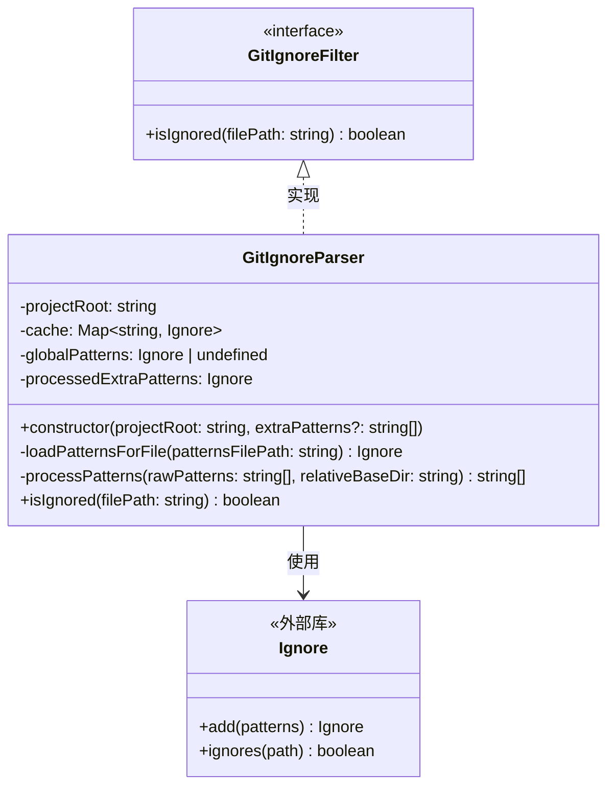
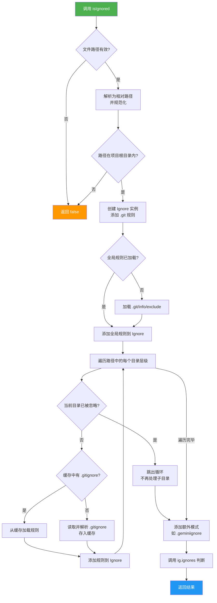

# gitIgnoreParser.ts

## 概述

`gitIgnoreParser.ts` 是 Gemini CLI 核心包中的 `.gitignore` 规则解析与文件过滤模块。该模块的核心职责是**精确模拟 Git 的 ignore 行为**，判断给定路径是否应该被忽略。

该模块的设计亮点在于：
1. **层级式 `.gitignore` 支持**：不仅解析项目根目录的 `.gitignore`，还递归处理各子目录中的 `.gitignore` 文件，完全符合 Git 的规范行为。
2. **全局排除文件支持**：加载 `.git/info/exclude` 中的全局排除规则。
3. **额外模式支持**：可以注入自定义的忽略模式（如 `.geminiignore`），并赋予其最高优先级。
4. **缓存机制**：对已解析的 `.gitignore` 文件进行缓存，避免重复读取和解析。

## 架构图（Mermaid）





## 核心组件

### 1. 接口：`GitIgnoreFilter`

```typescript
export interface GitIgnoreFilter {
  isIgnored(filePath: string): boolean;
}
```

简单的过滤器接口，定义了唯一的 `isIgnored` 方法。这种接口设计使得上层代码可以**面向接口编程**，方便替换不同的过滤实现（如测试 mock）。

### 2. 类：`GitIgnoreParser`

#### 私有属性

| 属性 | 类型 | 说明 |
|------|------|------|
| `projectRoot` | `string` | 项目根目录的绝对路径，通过 `path.resolve` 确保路径规范化 |
| `cache` | `Map<string, Ignore>` | 以目录绝对路径为 key，缓存已解析的 `.gitignore` 规则集 |
| `globalPatterns` | `Ignore \| undefined` | `.git/info/exclude` 中的全局排除规则，首次调用 `isIgnored` 时懒加载 |
| `processedExtraPatterns` | `Ignore` | 额外的忽略模式（如 `.geminiignore` 中的规则），构造时即处理 |

#### 构造函数

```typescript
constructor(projectRoot: string, private readonly extraPatterns?: string[])
```

- 将 `projectRoot` 通过 `path.resolve` 转换为绝对路径
- 如果传入了 `extraPatterns`，立即通过 `processPatterns` 处理，并以项目根目录（`'.'`）作为基准目录

#### 私有方法：`loadPatternsForFile`

```typescript
private loadPatternsForFile(patternsFilePath: string): Ignore
```

从指定路径的文件中加载忽略模式：
- 同步读取文件内容（`fs.readFileSync`）
- 判断是否为 `.git/info/exclude` 文件，若是则基准目录为 `'.'`
- 否则根据文件相对于项目根目录的位置计算基准目录
- 将原始模式行按换行分割后交给 `processPatterns` 处理

#### 私有方法：`processPatterns`

```typescript
private processPatterns(rawPatterns: string[], relativeBaseDir: string): string[]
```

这是模块中**最核心的模式处理逻辑**，将原始的 `.gitignore` 模式转换为可以从项目根目录统一判断的规范化模式：

**处理步骤：**

1. **去除前导空白并过滤**：移除空行和注释行（`#` 开头）
2. **处理否定模式**：识别并记录 `!` 前缀
3. **处理锚定模式**：识别并记录 `/` 前缀（表示仅匹配当前目录）
4. **嵌套目录模式转换**（当 `relativeBaseDir` 非 `'.'` 时）：
   - `c`（无斜杠、非锚定）→ `/a/b/**/c`（匹配任意子目录下的文件）
   - `/c`（锚定）→ `/a/b/c`（仅匹配指定位置）
   - `c/d`（包含斜杠）→ `/a/b/c/d`（保持路径关系）
5. **还原否定前缀**

#### 公有方法：`isIgnored`

```typescript
public isIgnored(filePath: string): boolean
```

判断给定文件路径是否应被忽略的核心方法，完整模拟了 Git 的 ignore 行为：

**处理步骤：**

1. **输入验证**：检查路径是否为有效字符串且在项目根目录内
2. **路径规范化**：转换为相对路径，将反斜杠替换为正斜杠（兼容 Windows）
3. **初始化规则集**：创建 `Ignore` 实例，默认添加 `.git` 目录忽略
4. **加载全局规则**：首次调用时懒加载 `.git/info/exclude`
5. **层级遍历**：沿路径的每个目录层级，依次加载对应的 `.gitignore`
   - **短路优化**：如果某个中间目录已被忽略，则直接跳出循环（Git 行为：被忽略目录中的文件不可被子 `.gitignore` 重新包含）
   - **缓存加速**：已解析的 `.gitignore` 存入 `cache` 避免重复读取
6. **追加额外模式**：最后添加 `extraPatterns`，确保其**优先级最高**
7. **最终判断**：调用 `ig.ignores()` 返回结果

## 依赖关系

### 内部依赖

该模块不依赖项目内部的其他模块。

### 外部依赖

| 依赖 | 类型 | 说明 |
|------|------|------|
| `node:fs` | Node.js 内置 | 同步读取文件（`readFileSync`）和检查文件存在（`existsSync`） |
| `node:path` | Node.js 内置 | 路径拼接、解析、相对路径计算等 |
| `ignore` | 第三方库 | `.gitignore` 模式匹配引擎，提供 `Ignore` 类型和 `add`/`ignores` 方法 |

## 关键实现细节

### 1. 层级式 `.gitignore` 加载策略

Git 的 `.gitignore` 规则具有层级性：子目录中的 `.gitignore` 可以覆盖父目录的规则。该模块通过**路径分解 + 逐层加载**的方式精确模拟了这一行为。例如对于路径 `a/b/c/file.txt`，会依次加载：

```
项目根/.gitignore
项目根/a/.gitignore
项目根/a/b/.gitignore
项目根/a/b/c/.gitignore
```

### 2. 已忽略目录的短路优化

```typescript
if (igPlusExtras.ignores(normalizedRelativeDir)) {
  break;
}
```

当遍历到某个中间目录时，如果该目录已被忽略，则立即停止遍历。这不仅是性能优化，更是对 Git 行为的正确模拟——被忽略目录内部的 `.gitignore` 文件不会被 Git 读取，其中的否定模式也不会生效。

### 3. 额外模式的优先级设计

`extraPatterns`（如 `.geminiignore` 中的规则）被添加了**两次**：
- **第一次**：在遍历过程中用于判断中间目录是否被忽略（`igPlusExtras`），确保 `.geminiignore` 的忽略规则能阻止遍历
- **第二次**：在遍历完成后最后一次添加到 `ig`，确保其最终优先级最高

### 4. 跨平台路径处理

```typescript
const normalizedPath = relativePath.replace(/\\/g, '/');
```

`ignore` 库要求使用正斜杠（POSIX 路径分隔符）。该模块在所有涉及路径传递给 `ignore` 的地方都做了反斜杠到正斜杠的转换，确保在 Windows 平台上也能正确工作。

### 5. 懒加载全局规则

```typescript
if (this.globalPatterns === undefined) {
  // 加载 .git/info/exclude
}
```

`.git/info/exclude` 只在第一次调用 `isIgnored` 时加载，使用 `undefined` 作为"未加载"的哨兵值。这避免了在构造 `GitIgnoreParser` 时就读取文件系统，适合在某些场景下构造但不一定使用的情况。

### 6. 模式处理的路径合并

嵌套目录中的 `.gitignore` 模式需要重新映射到项目根目录的视角。代码使用 `path.posix.join` 而非 `path.join` 来确保始终使用正斜杠拼接：

```typescript
newPattern = path.posix.join(relativeBaseDir, newPattern);
```

这是因为 `ignore` 库内部统一使用 POSIX 风格路径。
