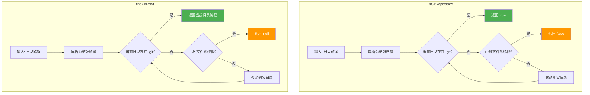
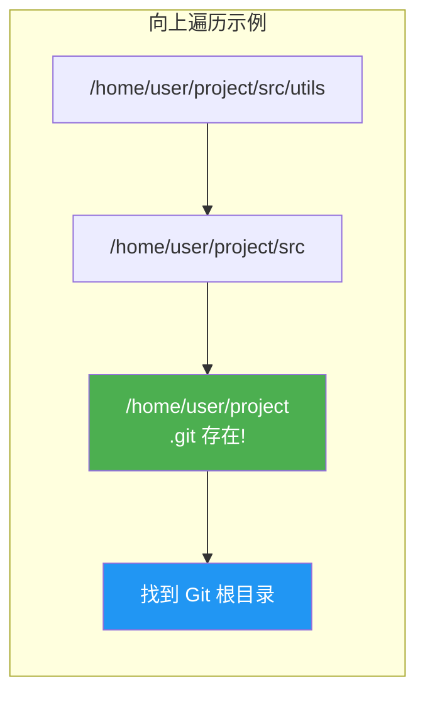

# gitUtils.ts

## 概述

`gitUtils.ts` 是 Gemini CLI 核心包中的 Git 仓库检测工具模块。该模块提供两个简洁的工具函数，用于**检测当前目录是否位于 Git 仓库内**以及**查找 Git 仓库的根目录**。

两个函数都采用**向上遍历（Bottom-Up Traversal）**的策略：从指定目录出发，逐级向父目录搜索，直到找到 `.git` 目录或到达文件系统根目录。这与 `git` 命令本身的仓库查找行为一致。

模块设计简洁，无外部第三方依赖，仅使用 Node.js 内置的 `fs` 和 `path` 模块。

## 架构图（Mermaid）





## 核心组件

### 1. 函数：`isGitRepository`

```typescript
export function isGitRepository(directory: string): boolean
```

**功能**：判断指定目录是否位于一个 Git 仓库中。

**参数：**

| 参数 | 类型 | 说明 |
|------|------|------|
| `directory` | `string` | 要检查的目录路径（可以是相对路径或绝对路径） |

**返回值：**

| 返回值 | 说明 |
|--------|------|
| `true` | 该目录位于某个 Git 仓库内（自身或祖先目录包含 `.git`） |
| `false` | 该目录不在任何 Git 仓库内，或发生文件系统错误 |

**执行流程：**

1. 使用 `path.resolve` 将输入路径转换为绝对路径
2. 检查当前目录下是否存在 `.git`（目录或文件，文件形式用于 Git worktree）
3. 若找到则返回 `true`
4. 若未找到，获取父目录路径
5. 若父目录与当前目录相同（到达文件系统根），停止搜索并返回 `false`
6. 否则继续向上遍历
7. 任何文件系统异常都被捕获并返回 `false`

### 2. 函数：`findGitRoot`

```typescript
export function findGitRoot(directory: string): string | null
```

**功能**：从指定目录开始，查找所属 Git 仓库的根目录。

**参数：**

| 参数 | 类型 | 说明 |
|------|------|------|
| `directory` | `string` | 起始搜索目录路径 |

**返回值：**

| 返回值 | 说明 |
|--------|------|
| `string` | Git 仓库根目录的绝对路径（包含 `.git` 的目录） |
| `null` | 未找到 Git 仓库，或发生文件系统错误 |

**执行流程：** 与 `isGitRepository` 几乎相同，唯一区别是找到 `.git` 后返回的是**包含 `.git` 的目录路径**而非布尔值。

## 依赖关系

### 内部依赖

该模块不依赖项目内部的其他模块，是一个**独立的工具模块**。

### 外部依赖

| 依赖 | 类型 | 说明 |
|------|------|------|
| `node:fs` | Node.js 内置 | 使用 `existsSync` 检查 `.git` 是否存在 |
| `node:path` | Node.js 内置 | 使用 `resolve`、`join`、`dirname` 进行路径操作 |

## 关键实现细节

### 1. Git Worktree 兼容性

```typescript
// Check if .git exists (either as directory or file for worktrees)
if (fs.existsSync(gitDir)) {
  return true;
}
```

代码注释明确指出 `.git` 可能是**目录**也可能是**文件**。在标准 Git 仓库中，`.git` 是一个目录；但在 Git worktree（工作树）中，`.git` 是一个文件，其内容是指向实际 `.git` 目录的路径引用（形如 `gitdir: /path/to/.git/worktrees/xxx`）。`fs.existsSync` 对两种情况都返回 `true`，因此代码天然兼容 Git worktree。

### 2. 根目录检测机制

```typescript
const parentDir = path.dirname(currentDir);
if (parentDir === currentDir) {
  break;
}
```

当 `path.dirname` 返回的父目录与当前目录相同时，说明已到达文件系统根目录：
- Unix/macOS: `path.dirname('/') === '/'`
- Windows: `path.dirname('C:\\') === 'C:\\'`

这种检测方式**跨平台兼容**，无需硬编码特定的根路径模式。

### 3. 防御性错误处理

两个函数都用 `try/catch` 包裹整个逻辑，在发生任何文件系统错误时安静地返回安全默认值（`false` 或 `null`）。这使得调用方无需担心权限问题、符号链接循环等边界情况。

### 4. 两个函数的代码结构高度相似

`isGitRepository` 和 `findGitRoot` 的实现逻辑几乎完全相同，仅返回值不同。这种设计选择**牺牲了 DRY 原则以换取清晰度和简洁性**——每个函数都是自包含的，易于理解和维护，不需要引入额外的抽象层。

### 5. 同步 API 的选择

两个函数都使用了同步的 `fs.existsSync`，而非异步的 `fs.promises.access`。这是因为 Git 仓库检测通常发生在应用启动的初始化阶段，且 `.git` 目录通常在本地文件系统上（I/O 延迟极低），同步操作的性能影响可以忽略不计，同时让调用方代码更简洁。
