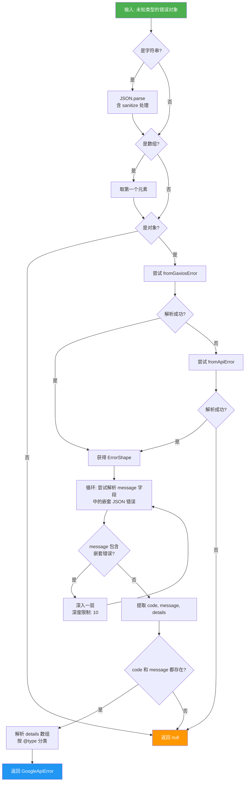
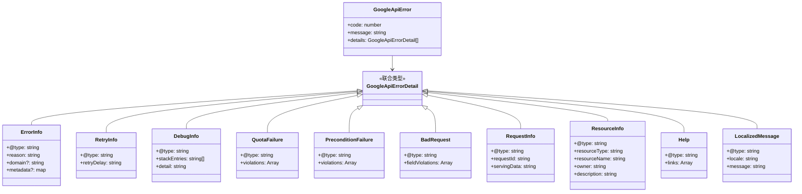

# googleErrors.ts

## 概述

`googleErrors.ts` 是 Gemini CLI 核心包中的 **Google API 错误解析模块**。该模块的核心职责是将各种格式的 Google API 错误响应统一解析为结构化的 `GoogleApiError` 对象，以便上层代码可以基于错误码、错误类型和详细信息做出精确的错误处理决策。

该模块面对的核心挑战是 **Google API 错误格式的多样性和不一致性**：
1. 错误可能来自 Gaxios HTTP 客户端（嵌套在 `response.data.error` 中）
2. 错误可能直接以对象形式存在（`error` 字段在顶层）
3. 错误内容可能被序列化为 JSON 字符串嵌入 `message` 字段中，且可能存在多层嵌套
4. JSON 字符串可能因 SSE（Server-Sent Events）流解析而损坏（如出现重复逗号）

该模块基于 `google/rpc/error_details.proto` 协议定义了完整的错误详情类型体系。

## 架构图（Mermaid）





## 核心组件

### 1. 类型定义

#### 错误详情类型（基于 `google/rpc/error_details.proto`）

| 类型 | `@type` 标识 | 说明 |
|------|-------------|------|
| `ErrorInfo` | `type.googleapis.com/google.rpc.ErrorInfo` | 通用错误信息，包含原因（reason）、域名（domain）和元数据（metadata） |
| `RetryInfo` | `type.googleapis.com/google.rpc.RetryInfo` | 重试信息，包含建议的重试延迟时间（如 `"51820.638305887s"`） |
| `DebugInfo` | `type.googleapis.com/google.rpc.DebugInfo` | 调试信息，包含堆栈条目和详细描述 |
| `QuotaFailure` | `type.googleapis.com/google.rpc.QuotaFailure` | 配额超限信息，包含违规列表（涉及的服务、指标、配额ID 等） |
| `PreconditionFailure` | `type.googleapis.com/google.rpc.PreconditionFailure` | 前置条件失败，包含违规的类型、主体和描述 |
| `LocalizedMessage` | `type.googleapis.com/google.rpc.LocalizedMessage` | 本地化消息，包含语言区域和消息内容 |
| `BadRequest` | `type.googleapis.com/google.rpc.BadRequest` | 错误请求，包含字段违规列表 |
| `RequestInfo` | `type.googleapis.com/google.rpc.RequestInfo` | 请求信息，包含请求 ID 和服务数据 |
| `ResourceInfo` | `type.googleapis.com/google.rpc.ResourceInfo` | 资源信息，包含资源类型、名称、所有者和描述 |
| `Help` | `type.googleapis.com/google.rpc.Help` | 帮助链接列表 |

#### `GoogleApiErrorDetail`（联合类型）

```typescript
export type GoogleApiErrorDetail =
  | ErrorInfo | RetryInfo | DebugInfo | QuotaFailure
  | PreconditionFailure | BadRequest | RequestInfo
  | ResourceInfo | Help | LocalizedMessage;
```

所有错误详情类型的联合，消费者通过 `@type` 字段进行类型判别（Discriminated Union）。

#### `GoogleApiError`（主结构）

```typescript
export interface GoogleApiError {
  code: number;       // HTTP 状态码（如 429、500）
  message: string;    // 人类可读的错误描述
  details: GoogleApiErrorDetail[];  // 结构化的错误详情列表
}
```

#### `ErrorShape`（内部类型）

```typescript
type ErrorShape = {
  message?: string;
  details?: unknown[];
  code?: number;
};
```

内部使用的宽松类型，用于在解析过程中表示可能的错误对象结构。

### 2. 核心函数：`parseGoogleApiError`

```typescript
export function parseGoogleApiError(error: unknown): GoogleApiError | null
```

**功能**：将任意类型的错误对象解析为结构化的 `GoogleApiError`。

**接受的输入格式：**
1. JSON 字符串
2. 数组（取第一个元素）
3. Gaxios 错误对象（`{ response: { data: { error: {...} } } }`）
4. API 错误对象（`{ message: "{\"error\": {...}}" }`）
5. 上述格式的嵌套组合

**详细处理流程：**

1. **空值检查**：`null`/`undefined` 直接返回 `null`
2. **字符串解析**：如果是字符串，先经过 `sanitizeJsonString` 清理后 `JSON.parse`
3. **数组展开**：如果是数组，取第一个元素
4. **对象类型检查**：非对象直接返回 `null`
5. **错误提取**：依次尝试 `fromGaxiosError` 和 `fromApiError` 两种策略
6. **嵌套解析循环**：最多 10 层深度，尝试解析 `message` 字段中的 JSON 嵌套错误
   - 清理不间断空格（`\u00A0`）和换行符
   - 应用 `sanitizeJsonString` 清理
   - 如果解析出的 JSON 包含 `error` 字段，继续深入
7. **详情提取**：遍历 `details` 数组，通过 `@type` 字段识别和分类每个详情项
   - 处理 `@type` 键可能包含前后空白的情况
8. **最终校验**：`code` 和 `message` 必须同时存在

### 3. 辅助函数：`sanitizeJsonString`

```typescript
function sanitizeJsonString(jsonStr: string): string
```

**功能**：清理 SSE 流解析过程中可能引入的重复逗号。

**问题背景**：SSE 流解析器在拼接数据块时，可能在 JSON 中引入多余的逗号，例如：
```json
"domain": "cloudcode-pa.googleapis.com",
 ,       "metadata": {
```

**实现方式**：使用正则表达式 `/,(\s*),/g` 匹配由空白分隔的连续逗号，将其合并为单个逗号。通过 `do...while` 循环确保处理 `,,,` 等多个连续逗号的情况。

### 4. 辅助函数：`fromGaxiosError`

```typescript
function fromGaxiosError(errorObj: object): ErrorShape | undefined
```

**功能**：从 Gaxios HTTP 客户端的错误格式中提取 `ErrorShape`。

Gaxios 是 Google 官方的 HTTP 客户端库，其错误格式为：
```typescript
{
  response: {
    status: number,
    data: { error: ErrorShape } | string
  },
  error?: ErrorShape,
  code?: number
}
```

**处理步骤：**
1. 优先从 `response.data.error` 提取（data 可能是字符串需要 JSON.parse）
2. 若 `response.data` 是数组，取第一个元素
3. 如果 Gaxios 结构不匹配，回退检查顶层 `error` 属性

### 5. 辅助函数：`fromApiError`

```typescript
function fromApiError(errorObj: object): ErrorShape | undefined
```

**功能**：从通用 API 错误格式中提取 `ErrorShape`。

处理 `message` 字段中嵌入的 JSON 错误：
```typescript
{
  message: '{"error": {...}}' | { error: ErrorShape },
  code?: number
}
```

**特殊处理**：当 `message` 是字符串但 `JSON.parse` 失败时，尝试**提取花括号内的 JSON 子串**（从第一个 `{` 到最后一个 `}`），作为最后的兜底策略。

### 6. 辅助函数：`isErrorShape`

```typescript
function isErrorShape(obj: unknown): obj is ErrorShape
```

**功能**：类型守卫（Type Guard），判断对象是否符合 `ErrorShape` 结构。

**判断条件**（满足其一即可）：
- 具有 `string` 类型的 `message` 属性
- 具有 `number` 类型的 `code` 属性

## 依赖关系

### 内部依赖

该模块不依赖项目内部的其他模块。它是错误处理链的**最底层模块**，被其他错误处理模块（如 `googleQuotaErrors.ts`）所依赖。

### 外部依赖

该模块**无任何外部依赖**，仅使用 JavaScript 内置的 `JSON.parse`、`String.prototype.replace` 等标准 API。

## 关键实现细节

### 1. SSE 流损坏的 JSON 修复

```typescript
function sanitizeJsonString(jsonStr: string): string {
  let prev: string;
  do {
    prev = jsonStr;
    jsonStr = jsonStr.replace(/,(\s*),/g, ',$1');
  } while (jsonStr !== prev);
  return jsonStr;
}
```

这是一个巧妙的**不动点循环（Fixed-Point Iteration）**：持续替换直到字符串不再变化。这确保了 `,,,` 这样的连续多逗号（正则单次替换会遗漏中间的逗号）也能被完全清理。

例如：`,,,` 经过第一次替换变为 `,,`，第二次变为 `,`，此时不再变化，循环结束。

### 2. 嵌套错误的递归解析

```typescript
let depth = 0;
const maxDepth = 10;
while (currentError && typeof currentError.message === 'string' && depth < maxDepth) {
  // 尝试 JSON.parse(currentError.message) ...
}
```

Google API 的错误可能存在多层嵌套——一个错误的 `message` 字段中包含另一个序列化的错误。代码通过 `while` 循环逐层剥离，但设置了 **10 层深度限制**防止恶意或异常数据导致无限循环。

### 3. 不间断空格和换行符清理

```typescript
currentError.message.replace(/\u00A0/g, '').replace(/\n/g, ' ')
```

在解析嵌套的 JSON 消息之前，代码会：
- 删除不间断空格（`\u00A0`），这可能来自某些 API 的格式化输出
- 将换行符替换为空格，防止 JSON 跨行导致解析失败

### 4. `@type` 键的容错处理

```typescript
const typeKey = Object.keys(detailObj).find((key) => key.trim() === '@type');
if (typeKey) {
  if (typeKey !== '@type') {
    detailObj['@type'] = detailObj[typeKey];
    delete detailObj[typeKey];
  }
}
```

详情对象的 `@type` 键可能包含前后空白（如 `" @type"`），代码通过 `trim()` 查找匹配的键，并在必要时将其规范化为 `'@type'`。这体现了**防御性编程**的理念。

### 5. 花括号提取的兜底策略

```typescript
const firstBrace = data.indexOf('{');
const lastBrace = data.lastIndexOf('}');
if (firstBrace !== -1 && lastBrace !== -1 && lastBrace > firstBrace) {
  data = JSON.parse(sanitizeJsonString(data.substring(firstBrace, lastBrace + 1)));
}
```

当 `message` 字段是一个包含 JSON 的混合文本时（例如 `"Error occurred: {\"error\": {...}}`），代码会尝试提取第一个 `{` 到最后一个 `}` 之间的内容进行解析。这是一种**最大努力（Best-Effort）**的解析策略。

### 6. 类型安全与 ESLint 抑制

代码中大量使用 `@typescript-eslint/no-unsafe-assignment` 和 `@typescript-eslint/no-unsafe-type-assertion` 抑制注释。这是因为错误解析本质上涉及大量 `unknown` 到具体类型的转换，在保证运行时安全的前提下，TypeScript 的严格类型检查在此场景下过于保守。
