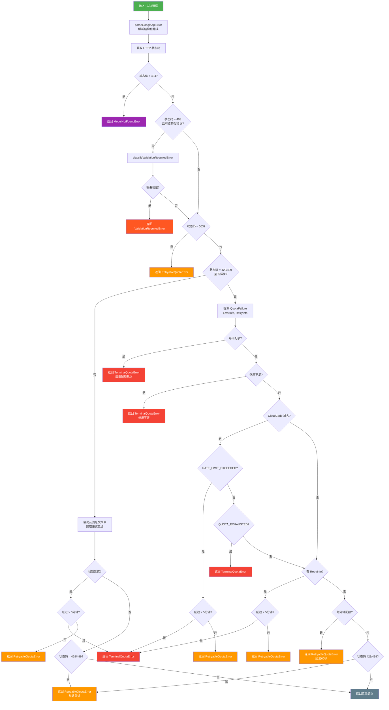
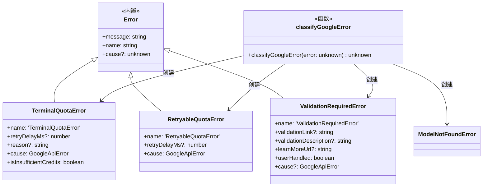
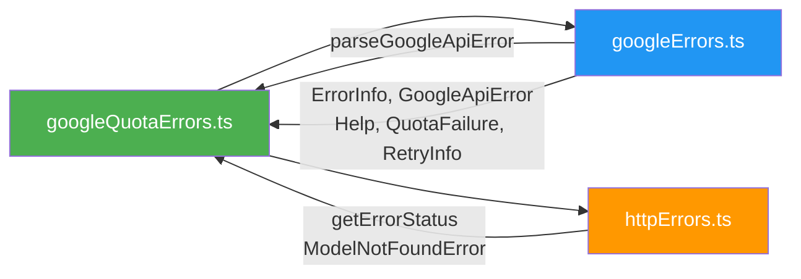

# googleQuotaErrors.ts

## 概述

`googleQuotaErrors.ts` 是 Gemini CLI 核心包中的 **Google API 配额与限流错误分类模块**。该模块建立在 `googleErrors.ts` 的结构化错误解析能力之上，进一步将解析出的 Google API 错误**分类为具体的业务语义错误类型**，以驱动上层的重试策略、用户提示和降级流程。

该模块的核心设计理念是将模糊的 HTTP 错误码（如 429、403、404、503）转化为**可操作的错误分类**：
- **终端配额错误（TerminalQuotaError）**：不可重试，如每日配额耗尽、信用额度不足
- **可重试配额错误（RetryableQuotaError）**：可以在延迟后重试，如每分钟限流
- **验证需求错误（ValidationRequiredError）**：需要用户完成验证操作才能继续
- **模型未找到错误（ModelNotFoundError）**：从外部模块导入，处理 404 场景

## 架构图（Mermaid）





## 核心组件

### 1. 错误类：`TerminalQuotaError`

```typescript
export class TerminalQuotaError extends Error {
  retryDelayMs?: number;
  reason?: string;
  get isInsufficientCredits(): boolean;
}
```

**终端配额错误**——表示不可通过简单重试恢复的硬性限制。

| 属性 | 类型 | 说明 |
|------|------|------|
| `name` | `string` | 固定为 `'TerminalQuotaError'`，方便 `instanceof` 之外的类型判断 |
| `retryDelayMs` | `number \| undefined` | 服务器建议的重试延迟（毫秒），由构造函数中 `retryDelaySeconds * 1000` 转换而来 |
| `reason` | `string \| undefined` | 错误原因标识，如 `'QUOTA_EXHAUSTED'`、`'INSUFFICIENT_G1_CREDITS_BALANCE'` |
| `cause` | `GoogleApiError` | 原始的结构化 Google API 错误，通过 `override readonly` 覆盖 `Error.cause` |
| `isInsufficientCredits` | `boolean`（getter） | 计算属性，判断是否为信用额度不足错误 |

**触发场景：**
- 每日配额耗尽（QuotaFailure 中 quotaId 包含 `PerDay` 或 `Daily`）
- 信用额度不足（`INSUFFICIENT_G1_CREDITS_BALANCE`）
- CloudCode API 配额耗尽（`QUOTA_EXHAUSTED`）
- 重试延迟超过 5 分钟（被视为等同于不可重试）
- CloudCode API 限流但延迟超过 5 分钟

### 2. 错误类：`RetryableQuotaError`

```typescript
export class RetryableQuotaError extends Error {
  retryDelayMs?: number;
}
```

**可重试配额错误**——表示临时性的限流，等待一段时间后可重试。

| 属性 | 类型 | 说明 |
|------|------|------|
| `name` | `string` | 固定为 `'RetryableQuotaError'` |
| `retryDelayMs` | `number \| undefined` | 建议的重试延迟（毫秒） |
| `cause` | `GoogleApiError` | 原始结构化错误 |

**触发场景：**
- CloudCode API 限流（`RATE_LIMIT_EXCEEDED`，延迟 <= 5 分钟）
- 每分钟配额超限（quotaId 包含 `PerMinute`）
- 有 RetryInfo 且延迟 <= 5 分钟
- 错误消息中包含 `Please retry in Xs` 且延迟 <= 5 分钟
- 503 服务不可用
- 429/499 无特定分类的兜底处理

### 3. 错误类：`ValidationRequiredError`

```typescript
export class ValidationRequiredError extends Error {
  validationLink?: string;
  validationDescription?: string;
  learnMoreUrl?: string;
  userHandled: boolean = false;
}
```

**验证需求错误**——用户需要完成某种验证操作（如身份验证、条款同意等）才能继续使用服务。

| 属性 | 类型 | 说明 |
|------|------|------|
| `name` | `string` | 固定为 `'ValidationRequiredError'` |
| `validationLink` | `string \| undefined` | 用户需要访问的验证链接 URL |
| `validationDescription` | `string \| undefined` | 验证操作的描述文本 |
| `learnMoreUrl` | `string \| undefined` | "了解更多" 帮助链接 |
| `userHandled` | `boolean` | 标志位，初始为 `false`，上层代码处理后可设为 `true` |
| `cause` | `GoogleApiError \| undefined` | 原始结构化错误（可选） |

### 4. 核心函数：`classifyGoogleError`

```typescript
export function classifyGoogleError(error: unknown): unknown
```

**功能**：将任意错误对象分类为具体的业务错误类型。

**返回值类型为 `unknown`**——因为当错误不匹配任何已知分类时，原样返回原始错误。

**分类优先级链（从高到低）：**

| 优先级 | 条件 | 分类结果 |
|--------|------|----------|
| 1 | HTTP 404 | `ModelNotFoundError` |
| 2 | HTTP 403 + `VALIDATION_REQUIRED` + CloudCode 域名 | `ValidationRequiredError` |
| 3 | HTTP 503 | `RetryableQuotaError` |
| 4 | HTTP 429/499 + QuotaFailure 包含 PerDay/Daily | `TerminalQuotaError` |
| 5 | HTTP 429/499 + `INSUFFICIENT_G1_CREDITS_BALANCE` | `TerminalQuotaError` |
| 6 | HTTP 429/499 + CloudCode + `RATE_LIMIT_EXCEEDED` | `RetryableQuotaError`（延迟<=5分钟）或 `TerminalQuotaError`（延迟>5分钟） |
| 7 | HTTP 429/499 + CloudCode + `QUOTA_EXHAUSTED` | `TerminalQuotaError` |
| 8 | HTTP 429/499 + RetryInfo 延迟 <= 5 分钟 | `RetryableQuotaError` |
| 9 | HTTP 429/499 + RetryInfo 延迟 > 5 分钟 | `TerminalQuotaError` |
| 10 | HTTP 429/499 + QuotaFailure 包含 PerMinute | `RetryableQuotaError`（60秒延迟） |
| 11 | HTTP 429/499 + ErrorInfo metadata 包含 PerMinute | `RetryableQuotaError`（60秒延迟） |
| 12 | 消息文本匹配 `Please retry in Xs` | 根据延迟长短分类 |
| 13 | HTTP 429/499 无其他匹配 | `RetryableQuotaError`（无延迟） |
| 14 | 以上均不匹配 | 返回原始错误 |

### 5. 辅助函数：`parseDurationInSeconds`

```typescript
function parseDurationInSeconds(duration: string): number | null
```

解析 Google API 返回的持续时间字符串：

| 输入格式 | 示例 | 返回值 |
|----------|------|--------|
| 秒（`s` 后缀） | `"34.074824224s"` | `34.074824224` |
| 毫秒（`ms` 后缀） | `"900ms"` | `0.9` |
| 无法解析 | `"unknown"` | `null` |

### 6. 辅助函数：`classifyValidationRequiredError`

```typescript
function classifyValidationRequiredError(googleApiError: GoogleApiError): ValidationRequiredError | null
```

专门处理 403 错误中的 `VALIDATION_REQUIRED` 场景：

1. 从 `details` 中查找 `ErrorInfo`，检查 `reason === 'VALIDATION_REQUIRED'` 且 `domain` 属于 CloudCode
2. 从 `Help` 详情中提取验证链接：
   - 第一个链接视为验证链接
   - 描述为 "Learn more" 或 hostname 为 `support.google.com` 的链接视为帮助链接
3. 如果 `Help` 中没有找到验证链接，回退从 `ErrorInfo.metadata.validation_link` 获取

### 7. 辅助函数：`isCloudCodeDomain`

```typescript
function isCloudCodeDomain(domain: string): boolean
```

检查域名是否属于 CloudCode API 端点，支持三个域名：
- `cloudcode-pa.googleapis.com`（生产环境）
- `staging-cloudcode-pa.googleapis.com`（预发布环境）
- `autopush-cloudcode-pa.googleapis.com`（自动推送环境）

域名在匹配前会通过正则 `/[^a-zA-Z0-9.-]/g` 清除非法字符，以处理 SSE 流解析可能引入的杂质字符。

### 8. 常量：`MAX_RETRYABLE_DELAY_SECONDS`

```typescript
const MAX_RETRYABLE_DELAY_SECONDS = 300; // 5 分钟
```

可重试的最大延迟阈值。如果服务器建议的重试延迟超过 5 分钟，则将错误升级为 `TerminalQuotaError`，因为让用户等待超过 5 分钟是不合理的体验。

### 9. 常量：`CLOUDCODE_DOMAINS`

```typescript
const CLOUDCODE_DOMAINS = [
  'cloudcode-pa.googleapis.com',
  'staging-cloudcode-pa.googleapis.com',
  'autopush-cloudcode-pa.googleapis.com',
];
```

有效的 Cloud Code API 域名列表，涵盖生产、预发布和自动推送三个环境。

## 依赖关系

### 内部依赖

| 模块 | 导入项 | 说明 |
|------|--------|------|
| `./googleErrors.js` | `parseGoogleApiError`, `ErrorInfo`, `GoogleApiError`, `Help`, `QuotaFailure`, `RetryInfo` | 结构化错误解析和类型定义 |
| `./httpErrors.js` | `getErrorStatus`, `ModelNotFoundError` | HTTP 状态码提取和模型未找到错误类 |



### 外部依赖

该模块无第三方外部依赖，仅使用 JavaScript 内置的 `URL.parse`、`parseFloat`、正则表达式等标准 API。

## 关键实现细节

### 1. 5 分钟阈值的设计哲学

```typescript
const MAX_RETRYABLE_DELAY_SECONDS = 300; // 5 minutes
```

这个阈值是用户体验与技术准确性的权衡：
- **技术角度**：服务器返回的长延迟通常意味着用户已接近或达到硬性配额限制
- **体验角度**：让用户无声地等待超过 5 分钟是不可接受的
- 超过此阈值时，错误从 `RetryableQuotaError` 升级为 `TerminalQuotaError`，触发更积极的用户提示或降级流程

### 2. 多层次的分类策略

错误分类采用**多层级优先级策略**，从最确定到最模糊：
1. 首先检查 HTTP 状态码（最可靠的信号）
2. 然后检查结构化的 `details`（QuotaFailure、ErrorInfo、RetryInfo）
3. 最后通过正则匹配错误消息文本（最不可靠但最灵活的兜底）

```typescript
const match = errorMessage.match(/Please retry in ([0-9.]+(?:ms|s))/);
```

这个正则兜底策略处理那些没有结构化 details 但消息中包含重试提示的情况。

### 3. CloudCode 域名的特殊处理

CloudCode API 的错误分类逻辑与通用 Google API 不同：
- `RATE_LIMIT_EXCEEDED`：限流，默认 10 秒重试（若无 RetryInfo）
- `QUOTA_EXHAUSTED`：配额用尽，不可重试
- `VALIDATION_REQUIRED`：需要用户验证

这种域名级别的差异化处理反映了 Gemini CLI 作为 CloudCode 客户端的核心身份。

### 4. 验证链接提取的双重来源

```typescript
// 优先从 Help 详情提取
const helpDetail = googleApiError.details.find(...);
// 回退到 ErrorInfo metadata
if (!validationLink) {
  validationLink = errorInfo.metadata?.['validation_link'];
}
```

验证链接可能存在于两个位置：`Help` 详情的 `links` 数组或 `ErrorInfo` 的 `metadata` 字段。代码优先使用前者（信息更丰富，包含描述和帮助链接），回退使用后者。

### 5. `userHandled` 标志位

```typescript
userHandled: boolean = false;
```

`ValidationRequiredError` 中的 `userHandled` 标志位设计用于**跨组件的状态协调**：当用户在 UI 层完成验证操作后，上层代码可以将此标志设为 `true`，防止错误被重复处理或重复提示。

### 6. 499 状态码的处理

代码除了处理标准的 HTTP 429（Too Many Requests）外，还处理 **499 状态码**。499 不是标准 HTTP 状态码，而是某些 Google 服务使用的自定义状态码，通常表示"客户端关闭连接"或类似的限流场景。将其与 429 同等对待体现了对 Google API 实际行为的了解。

### 7. SSE 流损坏的域名清理

```typescript
function isCloudCodeDomain(domain: string): boolean {
  const sanitized = domain.replace(/[^a-zA-Z0-9.-]/g, '');
  return CLOUDCODE_DOMAINS.includes(sanitized);
}
```

与 `googleErrors.ts` 中的 JSON 清理类似，域名比较前也进行了字符清理。SSE 流解析可能在域名字符串中注入不可见字符或特殊字符，通过正则只保留合法的域名字符来确保匹配的可靠性。
