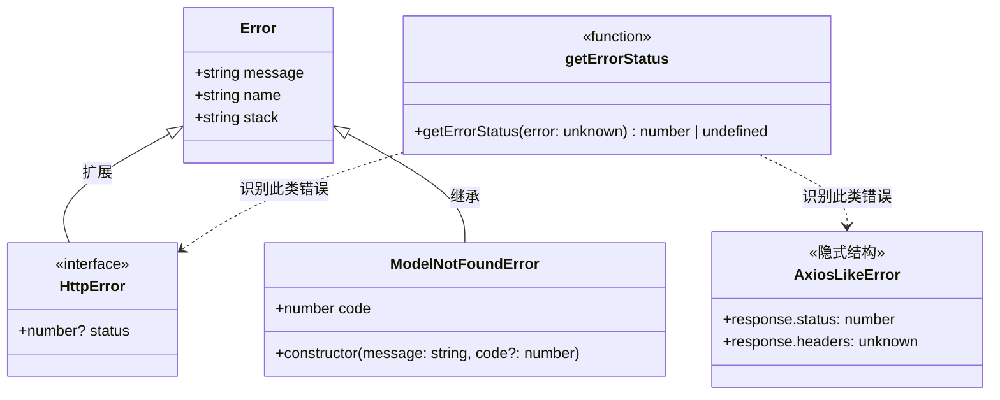
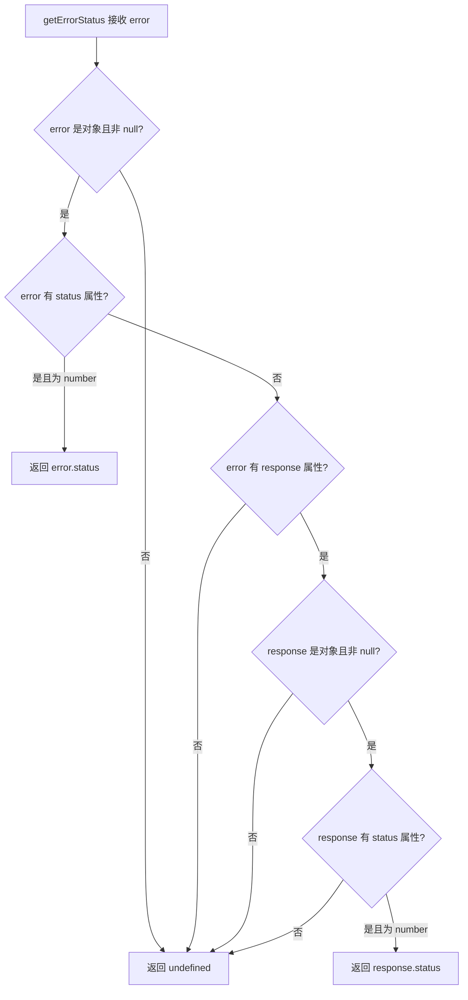

# httpErrors.ts

## 概述

`httpErrors.ts` 是 Gemini CLI 核心包中的 HTTP 错误处理工具模块。它提供了一套用于处理和识别 HTTP 错误的基础设施，包括：

- `HttpError` 接口：扩展标准 `Error`，增加可选的 HTTP 状态码属性
- `getErrorStatus` 函数：从各种形态的错误对象中安全地提取 HTTP 状态码
- `ModelNotFoundError` 类：专用于表示模型未找到的自定义错误类

该模块解决了一个常见的工程问题：不同的 HTTP 客户端库（如 `fetch`、`axios`、自定义封装）产生的错误对象结构各异，需要一个统一的工具来提取状态码信息。

## 架构图（Mermaid）





## 核心组件

### 1. `HttpError` 接口

```typescript
export interface HttpError extends Error {
  status?: number;
}
```

| 属性 | 类型 | 说明 |
|------|------|------|
| `status` | `number \| undefined` | 可选的 HTTP 状态码（如 400、401、403、404、500 等） |

继承自标准 `Error` 接口，在其基础上增加了 `status` 属性。该接口主要用于类型约束和文档化，表示一个携带了 HTTP 状态码的错误对象。

### 2. `getErrorStatus` 函数

```typescript
export function getErrorStatus(error: unknown): number | undefined
```

核心工具函数，从任意类型的错误对象中安全提取 HTTP 状态码。支持两种错误结构：

#### 结构一：直接携带 `status` 的错误

```typescript
// 例如原生 fetch 或自定义错误
{ message: "Not Found", status: 404 }
```

检查 `error.status` 是否存在且类型为 `number`，若是则直接返回。

#### 结构二：Axios 风格的嵌套 `response` 错误

```typescript
// Axios 抛出的错误结构
{
  message: "Request failed with status code 404",
  response: {
    status: 404,
    headers: { ... },
    data: { ... }
  }
}
```

当第一层检查未命中时，进一步检查 `error.response.status`。此路径专门处理 Axios 等库将 HTTP 响应嵌套在 `response` 字段中的模式。

#### 防御式编程细节

- 入参类型为 `unknown`，接受任何值
- 先通过 `typeof error === 'object' && error !== null` 确保基本安全
- 使用 `'status' in error` 进行属性存在性检查
- 使用 `typeof ... === 'number'` 确保类型正确
- 对 `response` 的检查同样逐层验证对象存在性和属性类型
- 所有路径都有明确返回，不可能抛出异常

### 3. `ModelNotFoundError` 类

```typescript
export class ModelNotFoundError extends Error {
  code: number;
  constructor(message: string, code?: number) {
    super(message);
    this.name = 'ModelNotFoundError';
    this.code = code ? code : 404;
  }
}
```

| 属性/方法 | 类型 | 说明 |
|-----------|------|------|
| `code` | `number` | HTTP 错误码，默认值为 `404` |
| `name` | `string` | 固定为 `'ModelNotFoundError'`，用于错误类型识别 |
| `constructor` | `(message: string, code?: number)` | 接收错误消息和可选状态码 |

专门用于表示请求的 AI 模型不存在的错误场景。例如，当用户指定了一个不存在的模型名称时，API 会返回 404，此错误类可精确表达这种语义。

注意 `code` 属性默认值为 `404`，但允许自定义。这使得该类也可以用于表示模型相关的其他 HTTP 错误（如 403 权限不足导致无法访问模型）。

## 依赖关系

### 内部依赖

无。该模块是一个独立的错误处理工具，不依赖项目内其他模块。

### 外部依赖

无。该模块仅使用 TypeScript/JavaScript 原生的 `Error` 类，无任何外部包依赖。

## 关键实现细节

1. **类型安全的错误提取**：`getErrorStatus` 函数面对 `unknown` 类型的输入，通过逐层类型收窄（type narrowing）安全地访问嵌套属性，完全避免了 `as any` 的使用（仅在必要处使用了类型断言，且有 eslint 注释标注）。

2. **多协议兼容**：该函数兼容两种主流的 HTTP 错误格式——直接携带 `status` 的错误（如 `fetch` API 风格）和嵌套 `response.status` 的错误（如 `axios` 风格），使得上层调用者无需关心底层 HTTP 客户端的实现细节。

3. **显式设置 `name` 属性**：`ModelNotFoundError` 构造函数中显式设置 `this.name = 'ModelNotFoundError'`。这一做法非常重要，因为在代码打包（bundling）和压缩（minification）过程中，类名可能被重命名，而显式设置 `name` 确保了错误类型在运行时的可识别性。从最近的提交记录 `aca8e1af0` 可见，这正是该项目重视的问题。

4. **宽松的 `code` 默认值策略**：`ModelNotFoundError` 使用 `code ? code : 404` 而非 `code ?? 404`，这意味着当 `code` 传入 `0` 时也会回退到 `404`。由于 HTTP 状态码不可能为 `0`，这个行为在实际使用中是合理的。

5. **接口与类的分工**：`HttpError` 作为接口定义了错误的形状约束，`ModelNotFoundError` 作为具体类提供了可实例化的错误类型。两者互补——接口用于类型检查，类用于错误创建。
