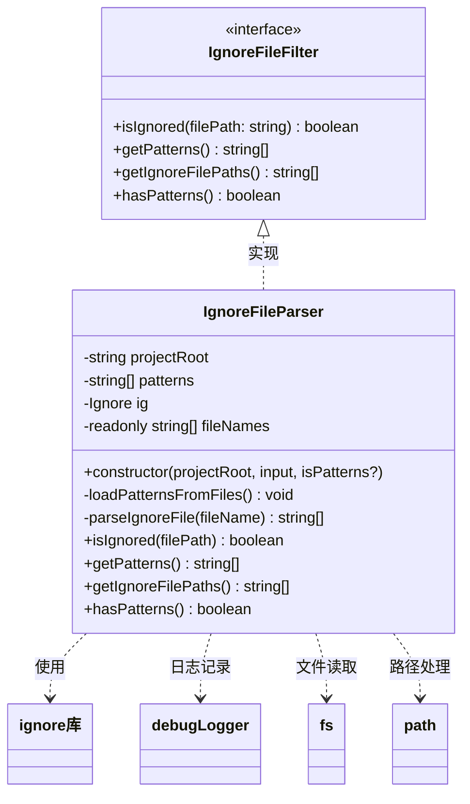
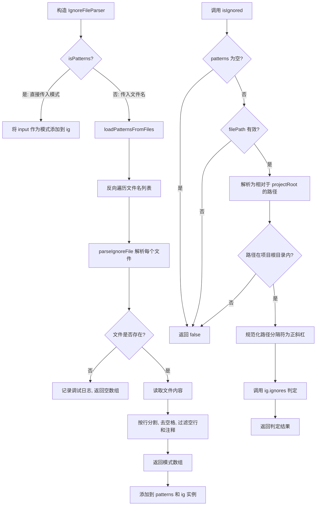

# ignoreFileParser.ts

## 概述

`ignoreFileParser.ts` 是 Gemini CLI 核心包中的忽略文件解析模块。它实现了类似 `.gitignore` 的文件/目录忽略机制，允许用户通过配置文件（如 `.geminiignore`、`.gitignore`）或直接传入匹配模式来排除特定文件和目录。

该模块的核心是 `IgnoreFileParser` 类，它封装了 `ignore` 库（一个 `.gitignore` 规范的完整实现），提供了统一的文件忽略判定接口。在文件搜索、代码分析、上下文收集等场景中，该模块确保被忽略的文件不会被处理，从而提升效率并尊重用户的配置意图。

## 架构图（Mermaid）





## 核心组件

### 1. `IgnoreFileFilter` 接口

```typescript
export interface IgnoreFileFilter {
  isIgnored(filePath: string): boolean;
  getPatterns(): string[];
  getIgnoreFilePaths(): string[];
  hasPatterns(): boolean;
}
```

| 方法 | 返回类型 | 说明 |
|------|----------|------|
| `isIgnored(filePath)` | `boolean` | 判断给定文件路径是否应被忽略 |
| `getPatterns()` | `string[]` | 获取所有已加载的忽略模式 |
| `getIgnoreFilePaths()` | `string[]` | 获取所有实际存在的忽略文件的完整路径 |
| `hasPatterns()` | `boolean` | 是否存在至少一个忽略模式 |

该接口定义了忽略文件过滤器的标准契约，方便测试中使用 mock 实现或未来扩展其他实现。

### 2. `IgnoreFileParser` 类

#### 构造函数

```typescript
constructor(
  projectRoot: string,
  input: string | string[],
  isPatterns = false,
)
```

| 参数 | 类型 | 说明 |
|------|------|------|
| `projectRoot` | `string` | 项目根目录路径，所有相对路径都基于此解析 |
| `input` | `string \| string[]` | 忽略文件名（如 `['.gitignore', '.geminiignore']`）或忽略模式数组 |
| `isPatterns` | `boolean` | 默认 `false`。为 `true` 时，`input` 被视为模式而非文件名 |

构造函数支持两种模式：
- **文件模式**（默认）：`input` 为文件名，从项目根目录读取并解析这些文件
- **模式模式**：`input` 直接是 glob 匹配模式字符串，跳过文件读取

#### `loadPatternsFromFiles()` 私有方法

```typescript
private loadPatternsFromFiles(): void
```

**关键细节：反向遍历文件列表。** 文件名列表被反转后遍历，使得列表中排在前面的文件最后被处理，从而获得更高的优先级。这是因为 `ignore` 库中后添加的模式会覆盖先添加的模式。

例如，`['.geminiignore', '.gitignore']` 中 `.geminiignore` 排在前面，具有更高优先级。

#### `parseIgnoreFile()` 私有方法

```typescript
private parseIgnoreFile(fileName: string): string[]
```

解析单个忽略文件的内容：
1. 使用 `fs.readFileSync` 同步读取文件
2. 文件不存在时静默失败，记录调试日志并返回空数组
3. 对内容进行处理：按换行符分割 -> 去除每行首尾空白 -> 过滤掉空行和以 `#` 开头的注释行

#### `isIgnored()` 方法

```typescript
isIgnored(filePath: string): boolean
```

判断文件是否应被忽略，包含多重安全检查：

1. **快速路径**：无模式时直接返回 `false`
2. **输入验证**：空值、非字符串类型检查
3. **危险路径检测**：以反斜杠开头、根路径 `/`、包含空字符 `\0` 的路径均返回 `false`
4. **路径解析**：将输入路径解析为相对于 `projectRoot` 的相对路径
5. **边界检查**：空相对路径或 `..` 开头的路径（即在项目根目录之外）返回 `false`
6. **路径规范化**：将反斜杠替换为正斜杠（`ignore` 库要求）
7. **最终判定**：委托给 `ig.ignores()` 进行模式匹配

#### `getIgnoreFilePaths()` 方法

```typescript
getIgnoreFilePaths(): string[]
```

返回实际存在的忽略文件完整路径列表。使用 `.slice().reverse()` 反转列表顺序，使返回的顺序与文件优先级一致（最高优先级的文件排在最前）。通过 `fs.existsSync` 过滤掉不存在的文件。

## 依赖关系

### 内部依赖

| 模块 | 导入路径 | 说明 |
|------|----------|------|
| `debugLogger` | `./debugLogger.js` | 调试日志记录器，用于记录忽略文件加载信息和文件未找到警告 |

### 外部依赖

| 依赖 | 说明 |
|------|------|
| `node:fs` | Node.js 文件系统模块，用于 `readFileSync` 读取忽略文件和 `existsSync` 检查文件存在性 |
| `node:path` | Node.js 路径模块，用于 `resolve`、`join`、`relative` 等路径操作 |
| `ignore` | 第三方库，完整实现了 `.gitignore` 规范的模式匹配引擎。支持通配符、否定模式、目录匹配等全部 gitignore 语法 |

## 关键实现细节

1. **优先级反转机制**：`loadPatternsFromFiles` 中的反向遍历是该模块最精妙的设计之一。`ignore` 库的行为是后添加的规则覆盖先添加的规则，因此要让列表中第一个文件（如 `.geminiignore`）拥有最高优先级，就必须让它最后被添加。这实现了"项目特定配置优先于通用配置"的语义。

2. **路径安全的多层防御**：`isIgnored` 方法对输入路径进行了 6 层验证，防止路径遍历攻击和异常输入：
   - 空值/类型检查防止 `undefined`/`null`/非字符串
   - 反斜杠开头检查防止 Windows UNC 路径
   - 空字符检查防止空字节注入
   - `..` 前缀检查防止路径逃逸到项目根目录之外

3. **跨平台兼容**：在 `isIgnored` 中，路径分隔符被显式替换为正斜杠 (`/`)。这是因为 `ignore` 库内部使用正斜杠匹配，而 Windows 系统的 `path.relative` 会返回反斜杠路径。

4. **静默失败策略**：当忽略文件不存在时，`parseIgnoreFile` 不会抛出错误，而是记录调试日志并返回空数组。这使得配置忽略文件成为完全可选的——项目可以没有 `.geminiignore` 文件，CLI 仍能正常运行。

5. **双模式构造**：构造函数通过 `isPatterns` 参数支持两种初始化方式，提供了灵活性。文件模式适用于读取用户配置文件，模式模式适用于程序化地创建过滤器（如单元测试或内部组件传递预定义模式）。

6. **同步 I/O**：文件读取使用 `readFileSync` 而非异步 API。这是一个有意的设计选择——忽略文件通常很小（几十行），且在初始化阶段一次性读取，同步 I/O 简化了调用方的代码逻辑，避免了异步传播。
