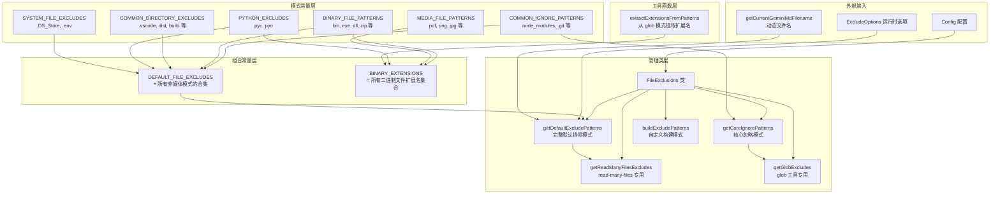

# ignorePatterns.ts

## 概述

`ignorePatterns.ts` 是 Gemini CLI 核心包中的文件排除模式管理模块。它是整个文件过滤系统的**模式定义中心**，提供了一套分层的、可组合的 glob 排除模式常量和一个集中式的排除模式管理类 `FileExclusions`。

该模块解决的核心问题是：CLI 的不同工具（如 `glob`、`read-many-files` 等）需要排除不同类别的文件（版本控制目录、二进制文件、媒体文件、系统文件等），同时还需要支持用户自定义和运行时动态配置。`ignorePatterns.ts` 将所有排除模式集中管理，避免了模式散落在各处导致的不一致性。

## 架构图（Mermaid）



## 核心组件

### 1. 模式常量

#### `COMMON_IGNORE_PATTERNS`

```typescript
export const COMMON_IGNORE_PATTERNS: string[] = [
  '**/node_modules/**',
  '**/.git/**',
  '**/bower_components/**',
  '**/.svn/**',
  '**/.hg/**',
];
```

最基础的忽略模式，覆盖所有主流版本控制系统目录和包管理器目录。这些目录在几乎所有开发项目中都应被排除。

#### `BINARY_FILE_PATTERNS`

```typescript
export const BINARY_FILE_PATTERNS: string[]
```

包含 20 种二进制文件扩展名的排除模式，覆盖以下类别：
- **可执行文件/库**：`.bin`, `.exe`, `.dll`, `.so`, `.dylib`, `.class`, `.jar`, `.war`
- **压缩包**：`.zip`, `.tar`, `.gz`, `.bz2`, `.rar`, `.7z`
- **Office 文档**：`.doc`, `.docx`, `.xls`, `.xlsx`, `.ppt`, `.pptx`, `.odt`, `.ods`, `.odp`

#### `MEDIA_FILE_PATTERNS`

```typescript
export const MEDIA_FILE_PATTERNS: string[]
```

媒体文件排除模式，包括 PDF 和图片格式（`.pdf`, `.png`, `.jpg`, `.jpeg`, `.gif`, `.webp`, `.bmp`, `.svg`）。

**重要设计决策**：媒体文件模式 **没有** 被包含在 `DEFAULT_FILE_EXCLUDES` 中，因为这些文件在 `read-many-files` 工具中可以作为 `inlineData` 被特殊处理（如图片识别、PDF 解析），需要保留访问能力。

#### `COMMON_DIRECTORY_EXCLUDES`

```typescript
export const COMMON_DIRECTORY_EXCLUDES: string[]
```

常见的开发工具和构建产物目录：`.vscode`, `.idea`, `dist`, `build`, `coverage`, `__pycache__`。

#### `PYTHON_EXCLUDES` 和 `SYSTEM_FILE_EXCLUDES`

Python 编译产物（`.pyc`, `.pyo`）和系统/环境文件（`.DS_Store`, `.env`）。

#### `DEFAULT_FILE_EXCLUDES`

```typescript
export const DEFAULT_FILE_EXCLUDES: string[] = [
  ...COMMON_IGNORE_PATTERNS,
  ...COMMON_DIRECTORY_EXCLUDES,
  ...BINARY_FILE_PATTERNS,
  ...PYTHON_EXCLUDES,
  ...SYSTEM_FILE_EXCLUDES,
];
```

所有非媒体排除模式的合集，作为大多数文件操作的默认排除列表。

### 2. `ExcludeOptions` 接口

```typescript
export interface ExcludeOptions {
  includeDefaults?: boolean;
  customPatterns?: string[];
  runtimePatterns?: string[];
  includeDynamicPatterns?: boolean;
}
```

| 属性 | 类型 | 默认值 | 说明 |
|------|------|--------|------|
| `includeDefaults` | `boolean` | `true` | 是否包含 `DEFAULT_FILE_EXCLUDES` |
| `customPatterns` | `string[]` | `[]` | 用户自定义的额外排除模式 |
| `runtimePatterns` | `string[]` | `[]` | 运行时（如 CLI 参数）提供的额外排除模式 |
| `includeDynamicPatterns` | `boolean` | `true` | 是否包含动态模式（如当前的 Gemini MD 文件名） |

### 3. `FileExclusions` 类

```typescript
export class FileExclusions {
  constructor(private config?: Config) {}
}
```

集中式文件排除管理器，接受可选的 `Config` 对象以获取用户配置中的自定义排除模式。

#### `getCoreIgnorePatterns()`

返回 `COMMON_IGNORE_PATTERNS` 的副本。这是最小化的排除集，仅包含几乎所有场景都需要排除的目录。

#### `getDefaultExcludePatterns(options?)`

最核心的方法，按以下优先级叠加排除模式：

1. **默认模式**（`DEFAULT_FILE_EXCLUDES`）—— 当 `includeDefaults=true` 时
2. **动态模式**（当前 Gemini MD 文件名）—— 当 `includeDynamicPatterns=true` 时
3. **配置模式**（`config.getCustomExcludes()`）—— 当 `config` 存在时
4. **自定义模式**（`customPatterns`）
5. **运行时模式**（`runtimePatterns`）

#### `getReadManyFilesExcludes(additionalExcludes?)`

`read-many-files` 工具的专用方法，是 `getDefaultExcludePatterns` 的便捷封装，保持了向后兼容。

#### `getGlobExcludes(additionalExcludes?)`

`glob` 工具的专用方法，使用更轻量的核心模式（`COMMON_IGNORE_PATTERNS`）而非完整默认排除列表，因为 glob 操作通常不需要排除二进制文件。

#### `buildExcludePatterns(options)`

最灵活的方法，直接代理到 `getDefaultExcludePatterns`，供高级用例使用。

### 4. `extractExtensionsFromPatterns()` 函数

```typescript
export function extractExtensionsFromPatterns(patterns: string[]): string[]
```

从 glob 模式数组中提取文件扩展名。支持三种模式格式：

| 输入模式 | 输出 | 说明 |
|----------|------|------|
| `**/*.exe` | `.exe` | 简单扩展名 |
| `**/*.{jpg,png}` | `.jpg`, `.png` | 花括号展开 |
| `**/*.tar.gz` | `.gz` | 复合扩展名（使用 `path.extname` 提取最后一个） |

返回值经过 `Set` 去重和 `sort()` 排序。

### 5. `BINARY_EXTENSIONS` 常量

```typescript
export const BINARY_EXTENSIONS: string[]
```

通过 `extractExtensionsFromPatterns` 从 `BINARY_FILE_PATTERNS`、`MEDIA_FILE_PATTERNS`、`PYTHON_EXCLUDES` 中提取所有扩展名，并追加额外的二进制扩展名（`.dat`, `.obj`, `.o`, `.a`, `.lib`, `.wasm`），最终排序。用于需要基于扩展名快速判定文件是否为二进制的场景。

## 依赖关系

### 内部依赖

| 模块 | 导入路径 | 说明 |
|------|----------|------|
| `Config` | `../config/config.js` | 配置接口类型，用于 `FileExclusions` 获取用户自定义排除模式 |
| `getCurrentGeminiMdFilename` | `../tools/memoryTool.js` | 获取当前 Gemini 记忆文件名（如 `GEMINI.md`），用作动态排除模式 |

### 外部依赖

| 依赖 | 说明 |
|------|------|
| `node:path` | Node.js 路径模块，在 `extractExtensionsFromPatterns` 中使用 `path.extname` 提取文件扩展名 |

## 关键实现细节

1. **媒体文件的特殊地位**：`MEDIA_FILE_PATTERNS` 被有意排除在 `DEFAULT_FILE_EXCLUDES` 之外。这是因为图片和 PDF 虽然是二进制文件，但 Gemini 模型可以通过多模态能力处理它们。`read-many-files` 工具需要能够访问这些文件并将其转换为 `inlineData`。而 `BINARY_EXTENSIONS` 中则包含了媒体文件扩展名，用于其他场景（如文本处理时的快速排除）。

2. **分层模式设计**：模式被分为 6 个细粒度常量数组，而非一个巨大的列表。这使得不同的工具可以灵活选择需要的排除类别。例如 `getGlobExcludes` 只使用 `COMMON_IGNORE_PATTERNS`，而 `getReadManyFilesExcludes` 使用完整的 `DEFAULT_FILE_EXCLUDES`。

3. **Config 集成的渐进式设计**：代码中有两处 `TODO` 注释标记了 `getCustomExcludes` 方法需要在 `Config` 接口中实现。当前使用可选链 `this.config?.getCustomExcludes?.()` 安全调用，确保即使该方法尚未实现也不会报错。这是一种渐进式开发策略。

4. **动态排除模式**：`getCurrentGeminiMdFilename()` 返回 Gemini CLI 的记忆文件名（运行时可能变化），自动将其加入排除列表，防止 CLI 在文件操作中处理自己的状态文件。

5. **`extractExtensionsFromPatterns` 的巧妙实现**：该函数使用 `path.extname(`dummy${extPart}`)` 的技巧来处理复合扩展名。例如 `.tar.gz` 被构造为 `dummy.tar.gz`，`path.extname` 正确返回 `.gz`。同时，花括号展开（`*.{jpg,png}`）通过字符串切割手动处理，因为 `path.extname` 无法理解 glob 语法。

6. **不可变的返回值**：`getCoreIgnorePatterns` 返回 `[...COMMON_IGNORE_PATTERNS]`（展开副本），确保调用方对返回数组的修改不会影响原始常量。其他方法也遵循同样的模式，通过 `patterns.push(...)` 构建新数组。
