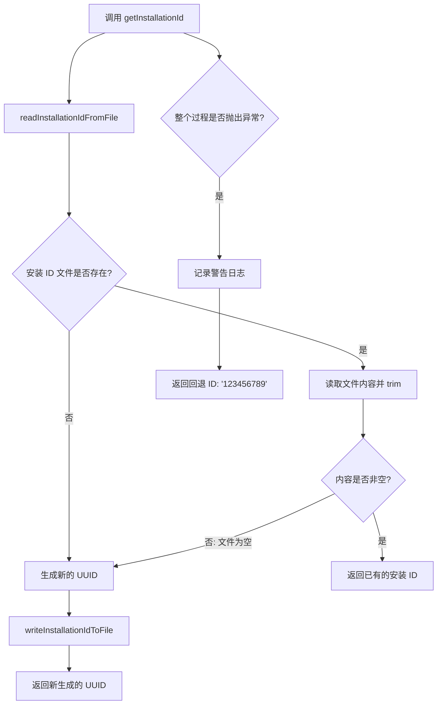
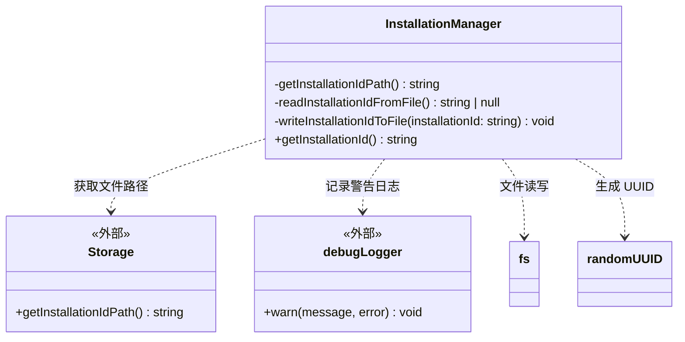

# installationManager.ts

## 概述

`installationManager.ts` 是 Gemini CLI 核心包中的安装标识管理模块。它的唯一职责是为每个 CLI 安装实例生成并持久化一个唯一标识符（UUID），用于安装追踪和遥测（telemetry）目的。

该模块的核心逻辑是一个经典的 **"读取或创建"（Read-or-Create）** 模式：首次运行时生成一个 UUID 并写入本地文件，后续运行时从文件中读取已有的 UUID。这确保了同一安装实例在多次运行之间具有稳定的标识。

## 架构图（Mermaid）





## 核心组件

### `InstallationManager` 类

#### 私有方法：`getInstallationIdPath()`

```typescript
private getInstallationIdPath(): string {
  return Storage.getInstallationIdPath();
}
```

委托给 `Storage` 类获取安装 ID 文件的存储路径。这个间接层使得存储路径的确定逻辑集中在 `Storage` 模块中，`InstallationManager` 无需关心具体路径（通常是用户 home 目录下的某个配置子目录）。

#### 私有方法：`readInstallationIdFromFile()`

```typescript
private readInstallationIdFromFile(): string | null
```

从文件系统读取已有的安装 ID：

1. 通过 `fs.existsSync` 检查文件是否存在
2. 若存在，使用 `fs.readFileSync` 同步读取并 `trim()` 去除首尾空白
3. 若文件内容为空字符串，返回 `null`（触发重新生成）
4. 若文件不存在，直接返回 `null`

#### 私有方法：`writeInstallationIdToFile(installationId)`

```typescript
private writeInstallationIdToFile(installationId: string): void
```

将安装 ID 写入文件：

1. 使用 `path.dirname` 获取文件所在目录
2. 使用 `fs.mkdirSync(dir, { recursive: true })` 确保目录存在（支持递归创建）
3. 使用 `fs.writeFileSync` 同步写入 ID

`recursive: true` 参数确保即使多级父目录不存在也能一次性创建完整路径。

#### 公有方法：`getInstallationId()`

```typescript
public getInstallationId(): string
```

核心公开接口，获取安装 ID 的完整流程：

1. 尝试从文件读取已有的 ID
2. 若不存在（返回 `null`），生成新的 UUID 并写入文件
3. 返回 ID（无论是已有的还是新生成的）
4. 若整个过程中发生任何异常（如权限不足、磁盘满等），捕获错误并：
   - 通过 `debugLogger.warn` 记录警告日志
   - 返回硬编码的回退 ID `'123456789'`

## 依赖关系

### 内部依赖

| 模块 | 导入路径 | 说明 |
|------|----------|------|
| `Storage` | `../config/storage.js` | 配置存储管理类，提供 `getInstallationIdPath()` 方法获取安装 ID 文件的存储路径 |
| `debugLogger` | `./debugLogger.js` | 调试日志记录器，用于在 ID 文件访问失败时记录警告信息 |

### 外部依赖

| 依赖 | 说明 |
|------|------|
| `node:fs` | Node.js 文件系统模块，用于文件的存在性检查 (`existsSync`)、读取 (`readFileSync`)、写入 (`writeFileSync`) 和目录创建 (`mkdirSync`) |
| `node:crypto` | Node.js 加密模块，使用 `randomUUID()` 函数生成符合 RFC 4122 的 v4 UUID |
| `node:path` | Node.js 路径模块，使用 `path.dirname` 提取文件所在目录路径 |

## 关键实现细节

1. **Read-or-Create 模式**：`getInstallationId` 实现了经典的延迟初始化模式——首次调用时创建，后续调用时读取。这确保了：
   - 无需显式的"初始化安装"步骤
   - 同一安装在多次 CLI 调用之间保持一致的 ID
   - ID 的生成对调用方完全透明

2. **硬编码回退 ID**：当文件操作失败时，函数返回固定值 `'123456789'` 而非抛出错误。这是一个**优雅降级**策略——安装 ID 主要用于遥测和追踪，不应因为文件系统问题而导致 CLI 崩溃。使用固定值而非每次随机 UUID，可以避免在遥测数据中产生大量"虚假"的唯一安装。但值得注意的是，所有无法访问文件系统的安装都会共享同一个 ID，可能导致追踪数据的轻微偏差。

3. **目录自动创建**：`writeInstallationIdToFile` 使用 `mkdirSync(dir, { recursive: true })`，即使配置目录尚未创建，也能自动递归建立完整的目录结构。这消除了对初始化顺序的依赖。

4. **空文件保护**：`readInstallationIdFromFile` 在读取内容后检查 `installationid || null`，如果文件存在但内容为空（例如被意外清空），返回 `null` 触发重新生成。这避免了使用空字符串作为 ID 的问题。

5. **同步 I/O 的合理性**：所有文件操作均为同步。安装 ID 的读写是启动阶段的一次性操作，涉及的数据量极小（一个 36 字符的 UUID 字符串），同步操作简化了流程且不会对性能产生可感知的影响。

6. **职责分离**：`InstallationManager` 不直接决定文件存储在哪里——它通过 `Storage.getInstallationIdPath()` 获取路径。这使得存储路径策略（如跨平台的 XDG 目录规范）集中在 `Storage` 模块中管理，`InstallationManager` 只关注 ID 的生命周期管理。
