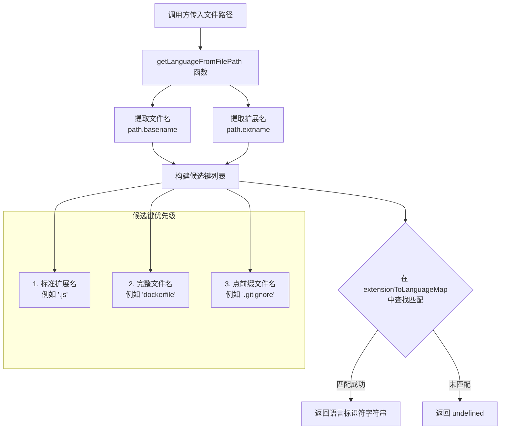

# language-detection.ts

## 概述

`language-detection.ts` 是一个**编程语言检测工具模块**，其核心功能是根据文件路径（文件扩展名或文件名）推断出对应的编程语言标识符。该模块遵循 [LSP 3.18 规范](https://microsoft.github.io/language-server-protocol/specifications/lsp/3.18/specification/#textDocumentItem) 中定义的语言标识符标准，确保与语言服务器协议（Language Server Protocol）兼容。

该模块在整个 Gemini CLI 项目中扮演着基础工具角色，可用于代码高亮、文件类型识别、编辑器集成等场景。

## 架构图（Mermaid）



## 核心组件

### 1. `extensionToLanguageMap` 常量

**类型**: `{ [key: string]: string }`

这是一个**静态映射表**，将文件扩展名或特殊文件名映射到 LSP 3.18 标准的语言标识符。该映射表涵盖了以下类别的语言/文件类型：

| 类别 | 支持的语言/格式 | 对应扩展名示例 |
|------|---------------|---------------|
| **JavaScript 生态** | javascript, typescriptreact, javascriptreact, typescript | `.js`, `.mjs`, `.cjs`, `.jsx`, `.ts`, `.tsx` |
| **后端语言** | python, java, go, ruby, php, csharp, rust, kotlin, swift | `.py`, `.java`, `.go`, `.rb`, `.php`, `.cs`, `.rs`, `.kt`, `.swift` |
| **C/C++ 系列** | c, cpp, objective-c, objective-cpp | `.c`, `.h`, `.cpp`, `.cxx`, `.cc`, `.hpp`, `.m`, `.mm` |
| **脚本语言** | shellscript, powershell, bat, perl, lua, groovy | `.sh`, `.ps1`, `.bat`, `.cmd`, `.pl`, `.pm`, `.lua`, `.groovy` |
| **函数式语言** | haskell, fsharp, clojure, elixir, erlang, scala, lisp, racket, julia | `.hs`, `.fs`, `.clj`, `.cljs`, `.ex`, `.erl`, `.scala`, `.lisp`, `.rkt`, `.jl` |
| **Web 前端** | html, css, less, sass, scss, vue, svelte | `.html`, `.htm`, `.css`, `.less`, `.sass`, `.scss`, `.vue`, `.svelte` |
| **模板引擎** | handlebars, ejs, erb, jsp, gohtml | `.hbs`, `.ejs`, `.erb`, `.jsp`, `.gohtml` |
| **数据/配置格式** | json, xml, yaml, toml, sql, graphql, proto, properties | `.json`, `.xml`, `.yaml`, `.yml`, `.toml`, `.sql`, `.graphql`, `.proto` |
| **文档/标记** | markdown, latex | `.md`, `.markdown`, `.tex` |
| **其他** | dockerfile, vim, vb, arduino, assembly, ignore | `.dockerfile`, `.vim`, `.vb`, `.ino`, `.asm`, `.s`, `.gitignore` 等 |
| **配置文件** | json（映射） | `.prettierrc`, `.eslintrc`, `.babelrc`, `.tsconfig` |

总计支持约 **80+ 种文件扩展名/文件名**，映射到约 **50+ 种语言标识符**。

### 2. `getLanguageFromFilePath(filePath: string): string | undefined` 函数

**导出方式**: `export function`（命名导出）

**功能**: 根据给定文件路径，推断其对应的编程语言标识符。

**参数**:
- `filePath: string` — 文件的完整路径或相对路径

**返回值**:
- `string` — 匹配到的 LSP 语言标识符
- `undefined` — 未能识别文件类型时返回

**查找策略**（按优先级从高到低）:

1. **标准扩展名匹配**: 提取文件扩展名（如 `.js`），在映射表中查找
2. **完整文件名匹配**: 使用完整文件名（如 `dockerfile`），在映射表中查找
3. **点前缀文件名匹配**: 在文件名前添加点号（如 `.gitignore`），在映射表中查找

这种三层查找策略的设计意图：
- **优先级 1** 处理绝大多数标准文件（如 `app.js` → `javascript`）
- **优先级 2** 处理无扩展名但有特定文件名的文件（如 `Dockerfile`）
- **优先级 3** 处理以点号开头的隐藏配置文件（如 `.gitignore` → `ignore`）

**实现细节**:
```typescript
const filename = path.basename(filePath).toLowerCase();
const extension = path.extname(filePath).toLowerCase();

const candidates = [
    extension,        // 1. 标准扩展名
    filename,         // 2. 完整文件名
    `.${filename}`,   // 3. 点前缀文件名
];
const match = candidates.find((key) => key in extensionToLanguageMap);
return match ? extensionToLanguageMap[match] : undefined;
```

注意所有比较均使用 `.toLowerCase()` 进行**大小写不敏感匹配**，这意味着 `FILE.JS`、`file.js`、`File.Js` 都会被正确识别为 `javascript`。

## 依赖关系

### 内部依赖

无内部模块依赖。该模块是一个**纯工具模块**，不依赖项目中的其他模块。

### 外部依赖

| 依赖 | 来源 | 用途 |
|------|------|------|
| `path` | `node:path`（Node.js 内置模块） | 使用 `path.basename()` 提取文件名，使用 `path.extname()` 提取扩展名 |

## 关键实现细节

1. **LSP 3.18 规范兼容**: 映射表中的语言标识符严格遵循 LSP 3.18 规范中定义的 `TextDocumentItem` 语言标识符，这确保了与各种 IDE 和编辑器的语言服务器的兼容性。

2. **大小写不敏感**: 文件名和扩展名在查找前均转换为小写，避免因操作系统文件系统大小写差异导致的识别失败（例如 Windows 下可能出现 `.JS` 扩展名）。

3. **三层候选键策略**: 使用 `Array.find()` 方法在候选键数组中按顺序查找第一个匹配项，确保优先级正确。扩展名优先于文件名匹配，避免了某些边缘情况下的误判。

4. **非标准扩展名支持**: 映射表中包含了一些非 LSP 标准但在实际项目中常见的语言标识符，如 `.gohtml` 映射到 `gohtml`，代码注释中明确标注了这一点："Not in standard LSP well-known list but kept for compatibility"。

5. **配置文件特殊处理**: `.prettierrc`、`.eslintrc`、`.babelrc`、`.tsconfig` 等配置文件被映射为 `json` 类型，因为这些文件通常采用 JSON 格式。

6. **忽略文件统一处理**: `.dockerignore`、`.gitignore`、`.npmignore` 等忽略规则文件统一映射为 `ignore` 类型。

7. **模块纯度**: 该模块没有副作用，不维护任何状态，所有函数调用均为纯函数，适合在任何上下文中安全调用。
