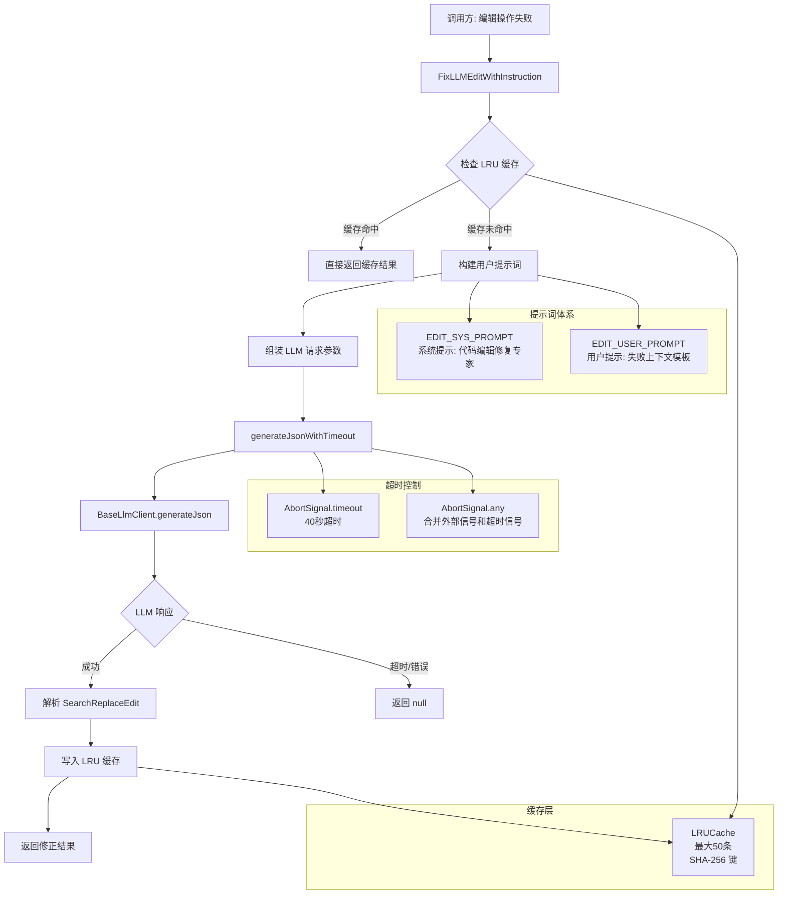

# llm-edit-fixer.ts

## 概述

`llm-edit-fixer.ts` 是一个**基于 LLM 的代码编辑修复模块**，专门用于修复失败的搜索-替换（search-and-replace）操作。当 Gemini CLI 执行代码编辑时，如果原始的搜索字符串无法在文件中精确匹配（可能因为缩进、空白、行尾差异等原因），该模块会调用一个辅助 LLM 模型来分析失败原因，并生成一个修正后的搜索字符串，从而实现"自动修复编辑失败"的能力。

该模块采用了 **LRU 缓存机制** 和 **超时控制** 来优化性能和可靠性，是 Gemini CLI 代码编辑功能的关键容错组件。

## 架构图（Mermaid）



## 核心组件

### 1. 常量配置

| 常量 | 值 | 说明 |
|------|-----|------|
| `MAX_CACHE_SIZE` | `50` | LRU 缓存最大容量，最多缓存 50 条修复结果 |
| `GENERATE_JSON_TIMEOUT_MS` | `40000`（40秒） | LLM 生成 JSON 响应的超时时间 |

### 2. `EDIT_SYS_PROMPT` 系统提示词

这是发送给辅助 LLM 的系统级指令，定义了 LLM 的角色和行为规则：

- **角色定位**: 代码编辑调试和修正专家
- **核心任务**: 分析失败的编辑尝试，提供修正后的 `search` 字符串
- **修正规则**:
  1. **最小修正原则**: 新的 `search` 字符串必须是原始字符串的近似变体，只修复空白、缩进、行尾等问题
  2. **解释修复原因**: 必须说明原始搜索失败的确切原因以及新字符串如何解决该问题
  3. **保留 `replace` 字符串**: 除非指令明确要求，否则不修改替换字符串
  4. **无需更改的情况**: 如果更改已存在于文件中，设置 `noChangesRequired` 为 `true`
  5. **精确匹配**: 最终的 `search` 字段必须是文件中的精确文本

### 3. `EDIT_USER_PROMPT` 用户提示词模板

模板中包含以下占位符，在运行时被实际值替换：

| 占位符 | 替换内容 |
|--------|----------|
| `{instruction}` | 原始编辑的高层指令说明 |
| `{old_string}` | 原始的搜索字符串（失败的） |
| `{new_string}` | 原始的替换字符串 |
| `{error}` | 编辑失败时产生的错误消息 |
| `{current_content}` | 文件的最新完整内容 |

### 4. `SearchReplaceEdit` 接口

```typescript
export interface SearchReplaceEdit {
  search: string;           // 修正后的搜索字符串
  replace: string;          // 替换字符串（通常保持不变）
  noChangesRequired: boolean; // 是否已无需更改
  explanation: string;      // 修复原因的说明
}
```

这是 LLM 返回结果的类型定义，也是模块的核心输出数据结构。

### 5. `SearchReplaceEditSchema` JSON Schema

用于约束 LLM 输出的 JSON Schema，使用 `@google/genai` 提供的 `Type` 枚举定义字段类型。必填字段为 `search`、`replace` 和 `explanation`，`noChangesRequired` 为可选字段。

### 6. `editCorrectionWithInstructionCache` LRU 缓存

```typescript
const editCorrectionWithInstructionCache = new LRUCache<string, SearchReplaceEdit>(MAX_CACHE_SIZE);
```

使用 `mnemonist` 库的 `LRUCache` 实现，最大容量 50 条。缓存键为将 `[current_content, old_string, new_string, instruction, error]` 五元组 JSON 序列化后的 SHA-256 哈希值。

### 7. `generateJsonWithTimeout<T>` 函数（内部）

**签名**: `async function generateJsonWithTimeout<T>(client, params, timeoutMs): Promise<T | null>`

**功能**: 对 `BaseLlmClient.generateJson` 调用添加超时控制的包装函数。

**实现要点**:
- 使用 `AbortSignal.timeout(timeoutMs)` 创建超时信号
- 使用 `AbortSignal.any()` 将外部传入的中止信号和超时信号合并
- 超时或其他错误时返回 `null`，不抛出异常
- 错误信息通过 `debugLogger` 记录到调试日志

### 8. `FixLLMEditWithInstruction` 函数（主入口，导出）

**签名**:
```typescript
export async function FixLLMEditWithInstruction(
  instruction: string,
  old_string: string,
  new_string: string,
  error: string,
  current_content: string,
  baseLlmClient: BaseLlmClient,
  abortSignal: AbortSignal,
): Promise<SearchReplaceEdit | null>
```

**功能**: 尝试通过 LLM 修复失败的代码编辑操作。

**执行流程**:
1. 通过 `getPromptIdWithFallback('llm-fixer')` 获取提示词 ID
2. 将五元组 `[current_content, old_string, new_string, instruction, error]` 计算 SHA-256 哈希作为缓存键
3. 检查 LRU 缓存，命中则直接返回
4. 构建用户提示词（替换模板中的占位符）
5. 调用 `generateJsonWithTimeout`，设置 40 秒超时
6. 成功时将结果写入缓存并返回
7. 失败时返回 `null`

**LLM 调用参数说明**:
- `modelConfigKey`: `{ model: 'llm-edit-fixer' }` — 使用专门的编辑修复模型配置
- `maxAttempts`: `1` — 仅尝试一次 LLM 调用
- `role`: `LlmRole.UTILITY_EDIT_CORRECTOR` — 标识为工具类编辑修正角色（用于遥测）

### 9. `resetLlmEditFixerCaches_TEST_ONLY` 函数（测试专用，导出）

**功能**: 清空 LRU 缓存，仅供测试使用。函数名中的 `_TEST_ONLY` 后缀表明这是测试辅助函数。

## 依赖关系

### 内部依赖

| 模块 | 导入内容 | 用途 |
|------|----------|------|
| `../core/baseLlmClient.js` | `BaseLlmClient`（类型） | LLM 客户端接口，用于调用 LLM 生成 JSON |
| `./promptIdContext.js` | `getPromptIdWithFallback` | 获取或生成提示词追踪 ID |
| `./debugLogger.js` | `debugLogger` | 调试日志记录 |
| `../telemetry/types.js` | `LlmRole` | LLM 角色枚举，用于遥测标识 |

### 外部依赖

| 依赖 | 来源 | 用途 |
|------|------|------|
| `createHash` | `node:crypto`（Node.js 内置） | 生成 SHA-256 缓存键 |
| `Content`, `Type` | `@google/genai` | Google GenAI SDK 类型定义和 JSON Schema 类型枚举 |
| `LRUCache` | `mnemonist` | 高性能 LRU 缓存实现 |

## 关键实现细节

1. **SHA-256 缓存键生成**: 缓存键由五个输入参数的 JSON 序列化结果计算 SHA-256 哈希得到。这确保了相同的编辑失败场景不会重复调用 LLM，显著降低了延迟和 API 成本。缓存粒度精确到文件内容、搜索/替换字符串、指令和错误消息的组合。

2. **双重中止信号机制**: `generateJsonWithTimeout` 使用 `AbortSignal.any()` 将外部传入的 `abortSignal`（用户主动取消）和内部的超时信号（40秒限制）合并。任一信号触发都会终止 LLM 调用。当外部没有传入 `abortSignal` 时，会创建一个空的 `AbortController().signal` 作为占位。

3. **优雅的错误处理**: LLM 调用失败（超时、网络错误等）不会抛出异常，而是返回 `null`。调用方可以根据 `null` 返回值决定是否回退到其他策略。

4. **最小修正哲学**: 系统提示词中反复强调"最小修正"原则，防止 LLM 过度发挥或重新解释编辑意图。LLM 的角色被严格限制在"修复搜索字符串匹配问题"，而不是"理解并改进编辑指令"。

5. **提示词 ID 追踪**: 使用 `getPromptIdWithFallback('llm-fixer')` 为每次调用分配一个可追踪的提示词 ID，便于在遥测数据中关联和分析修复请求。

6. **模型配置解耦**: LLM 模型通过 `modelConfigKey: { model: 'llm-edit-fixer' }` 指定，允许项目在配置层面单独调整编辑修复模型的参数（如使用更快但更便宜的模型），而不影响主对话模型。

7. **LRU 缓存容量限制**: 最大 50 条的缓存容量在内存占用和命中率之间取得了平衡。考虑到每条缓存值包含完整的搜索/替换字符串和解释文本，50 条是一个合理的上限。
