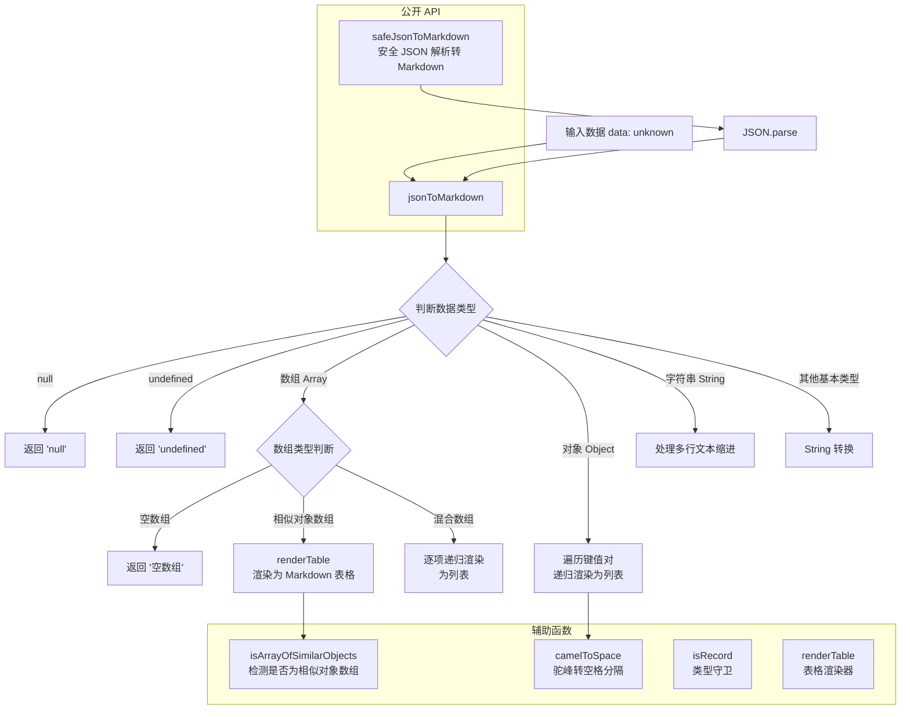

# markdownUtils.ts

## 概述

`markdownUtils.ts` 是一个 **JSON 到 Markdown 转换工具模块**，提供将任意 JSON 兼容数据结构递归转换为可读性良好的 Markdown 文本的能力。该模块能够智能识别数据结构的类型（对象、数组、基本类型），并根据不同类型选择最合适的 Markdown 呈现方式——对于结构相似的对象数组，自动生成 Markdown 表格；对于嵌套对象和混合数组，生成层级缩进的列表。

该模块主要用于 Gemini CLI 中将结构化数据（如 API 返回结果、工具输出等）转换为用户友好的 Markdown 格式展示。

## 架构图（Mermaid）



## 核心组件

### 1. `camelToSpace(text: string): string` (内部函数)

**功能**: 将 camelCase（驼峰命名）字符串转换为 Space Case（空格分隔、首字母大写）字符串。

**示例**:
- `"camelCaseString"` -> `"Camel Case String"`
- `"firstName"` -> `"First Name"`
- `"userID"` -> `"User I D"`

**实现**: 使用正则表达式 `/([A-Z])/g` 在每个大写字母前插入空格，然后将首字母大写。

### 2. `jsonToMarkdown(data: unknown, indent = 0): string` (导出函数)

**功能**: 将任意 JSON 兼容数据递归转换为 Markdown 字符串。

**参数**:
- `data: unknown` — 待转换的数据，可以是任意类型
- `indent: number` — 当前缩进层级（用于递归），默认为 0

**返回值**: Markdown 格式的字符串

**处理逻辑（按类型分支）**:

| 数据类型 | 处理方式 | 输出示例 |
|----------|----------|----------|
| `null` | 直接返回字符串 `'null'` | `null` |
| `undefined` | 直接返回字符串 `'undefined'` | `undefined` |
| 空数组 `[]` | 返回 `'[]'` | `[]` |
| 相似对象数组 | 调用 `renderTable()` 生成 Markdown 表格 | `\| Name \| Age \|...` |
| 混合数组 | 逐项递归，生成列表项（`- `前缀） | `- item1\n- item2` |
| 空对象 `{}` | 返回 `'{}'` | `{}` |
| 非空对象 | 遍历键值对，键名驼峰转空格并加粗，递归渲染值 | `- **First Name**: John` |
| 字符串 | 多行文本按缩进对齐 | 保持原始换行并缩进 |
| 其他类型 | `String()` 转换 | `true`, `42` 等 |

**缩进机制**: 使用 `'  '.repeat(indent)` 生成两个空格为单位的缩进，确保嵌套结构的层次关系清晰。

**数组元素处理的细节**:
- 如果数组元素是非空对象：渲染为 `- \n` 后跟递归内容（换行显示）
- 如果数组元素是基本类型或空对象：渲染为 `- value`（同行显示）

**对象键值对处理的细节**:
- 键名通过 `camelToSpace()` 转换为可读格式并加粗（`**Key Name**`）
- 如果值是非空对象：键值分行显示
- 如果值是基本类型：键值同行显示

### 3. `safeJsonToMarkdown(text: string): string` (导出函数)

**功能**: 安全地尝试将字符串解析为 JSON 并转换为 Markdown。如果 JSON 解析失败，返回原始字符串。

**参数**:
- `text: string` — 待处理的文本（可能是 JSON 字符串，也可能不是）

**返回值**: Markdown 格式字符串（成功解析时）或原始文本（解析失败时）

**实现**: `try-catch` 包裹 `JSON.parse()`，成功则调用 `jsonToMarkdown()`，失败则直接返回原文。

### 4. `isRecord(value: unknown): value is Record<string, unknown>` (导出函数)

**功能**: TypeScript 类型守卫函数，判断一个值是否为普通的键值对象（非 null、非数组的 object）。

**判断条件**:
1. `typeof value === 'object'` — 是对象类型
2. `value !== null` — 不是 null
3. `!Array.isArray(value)` — 不是数组

### 5. `isArrayOfSimilarObjects(data: unknown[]): data is Array<Record<string, unknown>>` (内部函数)

**功能**: 类型守卫函数，判断一个数组是否由具有相同键集合的对象组成（即"结构相似的对象数组"）。

**判断逻辑**:
1. 数组不能为空
2. 每个元素都必须是 `Record` 类型（通过 `isRecord` 检查）
3. 所有元素的键集合排序后拼接的字符串必须与第一个元素相同

**用途**: 用于决定是否将数组渲染为表格。只有当数组中所有对象的键完全一致时，才能生成有意义的表格。

### 6. `renderTable(data: Array<Record<string, unknown>>, indent = 0): string` (内部函数)

**功能**: 将结构相似的对象数组渲染为 Markdown 表格。

**参数**:
- `data` — 对象数组（所有对象键集合相同）
- `indent` — 缩进级别

**输出格式**:
```markdown
| Header1 | Header2 |
| --- | --- |
| val1 | val2 |
| val3 | val4 |
```

**表头处理**: 从第一个对象的键名通过 `camelToSpace()` 转换为可读标题。

**单元格值处理**:
- **对象/数组类型值**: `JSON.stringify()` 序列化，并转义反斜杠和管道符
- **基本类型值**: `String()` 转换，转义反斜杠和管道符，将换行符替换为空格

**特殊字符转义**:
- `\` -> `\\`（防止 Markdown 解析错误）
- `|` -> `\|`（防止破坏表格结构）
- `\n` -> ` `（防止换行破坏表格行）

## 依赖关系

### 内部依赖

无内部模块依赖。该模块是一个**纯工具模块**，不依赖项目中的其他模块。

### 外部依赖

无外部依赖。该模块仅使用 JavaScript/TypeScript 内置 API（`JSON.parse`、`String`、`Array` 方法等）。

## 关键实现细节

1. **智能表格检测**: 模块能够自动检测"相似对象数组"（所有对象键集合完全一致的数组），并将其渲染为 Markdown 表格。这比简单的列表渲染信息密度更高、可读性更好。检测算法通过排序和字符串比较实现，时间复杂度为 O(n * k * log(k))，其中 n 为数组长度，k 为键的数量。

2. **递归深度控制**: 虽然代码中没有显式的最大深度限制，但缩进机制（`indent` 参数）会自然地跟踪递归深度。在实际使用中，由于 JSON 数据通常不会嵌套过深，栈溢出的风险较低。

3. **驼峰命名的人性化处理**: 对象键名自动从 camelCase 转换为 Space Case 并加粗显示，使输出更适合人类阅读。例如 `firstName` 显示为 **First Name**。

4. **多行字符串的缩进对齐**: 字符串类型的值如果包含换行符，除第一行外的所有行都会添加当前缩进级别的空格前缀，确保在嵌套结构中多行文本的对齐正确。

5. **安全的 JSON 解析**: `safeJsonToMarkdown` 提供了 try-catch 包裹的安全解析能力，适用于不确定输入是否为合法 JSON 的场景。解析失败时优雅降级，返回原始文本。

6. **表格单元格的字符转义**: `renderTable` 中对管道符 `|` 和反斜杠 `\` 进行了转义处理，防止特殊字符破坏 Markdown 表格的结构。同时将换行符替换为空格，确保表格行的完整性。

7. **零外部依赖**: 该模块不依赖任何外部库或 Node.js 内置模块，是一个完全自包含的纯 JavaScript 实现，可在任何 JavaScript 运行时环境中使用。
