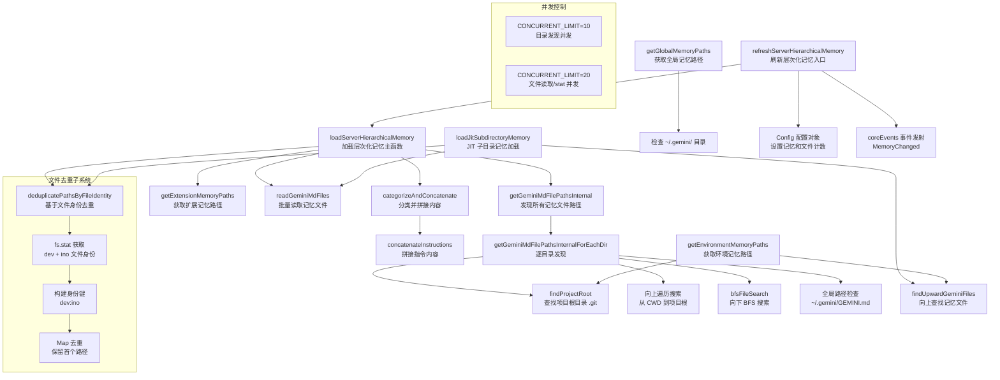

# memoryDiscovery.ts

## 概述

`memoryDiscovery.ts` 是 Gemini CLI 的 **记忆文件发现与加载模块**，负责在整个文件系统层次结构中发现、读取、去重和组织 `GEMINI.md` 记忆文件。这些记忆文件包含用户为项目或全局配置的上下文信息（指令、偏好、项目约定等），供 LLM 在对话中参考。

该模块实现了一套完整的**层次化记忆系统**，将记忆文件分为三个层级：
1. **全局记忆（Global）**: 位于用户主目录下 `~/.gemini/` 目录中的 GEMINI.md 文件
2. **扩展记忆（Extension）**: 由已激活的扩展提供的上下文文件
3. **项目记忆（Project）**: 分布在项目目录树中的 GEMINI.md 文件（通过向上遍历和向下 BFS 搜索发现）

该模块还支持 **JIT（即时）子目录记忆加载**，在工具操作特定子目录时按需加载该路径上的记忆文件。

## 架构图（Mermaid）



## 核心组件

### 1. 接口定义

#### `GeminiFileContent`
```typescript
export interface GeminiFileContent {
  filePath: string;        // 文件路径
  content: string | null;  // 文件内容（读取失败时为 null）
}
```
表示一个已读取的 GEMINI.md 文件及其内容。

#### `MemoryLoadResult`
```typescript
export interface MemoryLoadResult {
  files: Array<{ path: string; content: string }>;  // 加载的文件列表
  fileIdentities?: string[];                         // 文件身份标识列表
}
```
JIT 记忆加载的返回结果。

#### `LoadServerHierarchicalMemoryResponse`
```typescript
export interface LoadServerHierarchicalMemoryResponse {
  memoryContent: HierarchicalMemory;  // 分层的记忆内容
  fileCount: number;                   // 成功读取的文件数
  filePaths: string[];                 // 所有文件路径
}
```
服务端层次化记忆加载的完整响应。

### 2. `deduplicatePathsByFileIdentity(filePaths)` — 基于文件身份的路径去重

**导出**: `export async function`

**功能**: 通过文件系统的设备号（`dev`）和 inode 号（`ino`）对文件路径进行去重。这对于大小写不敏感的文件系统（如 macOS 的 APFS）至关重要，因为 `GEMINI.md` 和 `gemini.md` 可能指向同一个物理文件。

**实现要点**:
- 先通过 `Set` 进行字符串级别的快速去重，避免冗余的 `stat` 调用
- 使用 `fs.stat()`（而非 `fs.lstat()`）以跟随符号链接获取目标文件的真实身份
- 并发限制为 20，通过批处理 `Promise.allSettled` 防止 EMFILE 错误
- 身份键格式为 `"dev:ino"`
- `stat` 失败的文件仍然保留（保守策略）

**返回**:
- `paths`: 去重后的路径数组
- `identityMap`: 路径到身份键的映射

### 3. `findProjectRoot(startDir)` — 查找项目根目录（内部函数）

**功能**: 从指定目录向上遍历，查找包含 `.git` 的目录作为项目根。

**特殊处理**:
- `.git` 可以是目录（普通仓库）或文件（子模块/工作树）
- `ENOENT` 错误不记录日志（因为这是正常的查找过程）
- 测试环境中不记录警告日志
- 到达文件系统根目录时返回 `null`

### 4. `getGeminiMdFilePathsInternal(...)` — 发现所有记忆文件路径（内部函数）

**功能**: 扫描当前工作目录和额外包含的目录，收集所有 GEMINI.md 文件路径，分为全局和项目两类。

**参数**:
- `currentWorkingDirectory` — 当前工作目录
- `includeDirectoriesToReadGemini` — 额外需要扫描的目录列表
- `userHomePath` — 用户主目录路径
- `fileService` — 文件发现服务
- `folderTrust` — 是否信任当前文件夹
- `fileFilteringOptions` — 文件过滤选项
- `maxDirs` — BFS 搜索的最大目录数

**并发控制**: 批次大小为 10，使用 `Promise.allSettled` 处理。

### 5. `getGeminiMdFilePathsInternalForEachDir(...)` — 逐目录发现（内部函数）

**功能**: 针对单个目录执行完整的记忆文件发现流程。

**发现策略（三步）**:
1. **全局路径检查**: 检查 `~/.gemini/GEMINI.md` 是否存在且可读
2. **向上遍历**: 从当前目录向上到项目根目录（或主目录的父目录），查找每一级目录中的 GEMINI.md
3. **向下 BFS 搜索**: 使用 `bfsFileSearch` 从当前目录向下搜索子目录中的 GEMINI.md

**信任检查**: 只有在 `folderTrust` 为 `true` 时才执行向上和向下搜索（步骤 2 和 3）。

**停止条件**: 向上遍历在以下情况停止：
- 到达项目根目录的父目录
- 到达用户主目录的父目录（无 git 根时）
- 到达全局 GEMINI 目录
- 到达文件系统根目录

### 6. `readGeminiMdFiles(filePaths, importFormat)` — 批量读取记忆文件

**导出**: `export async function`

**功能**: 并发读取多个 GEMINI.md 文件，并处理其中的 import 语句。

**参数**:
- `filePaths` — 要读取的文件路径数组
- `importFormat` — import 处理格式，`'flat'` 或 `'tree'`（默认 `'tree'`）

**实现要点**:
- 并发限制为 20（文件读取比目录发现更快，因此限制更高）
- 读取后调用 `processImports()` 处理文件中的 import 指令
- 读取失败的文件仍然包含在结果中（content 为 null）
- 测试环境中抑制警告日志

### 7. `concatenateInstructions(instructionContents)` — 拼接指令内容

**导出**: `export function`

**功能**: 将多个 `GeminiFileContent` 的内容拼接为带有文件来源标记的单一字符串。

**输出格式**:
```
--- Context from: /path/to/file ---
[文件内容]
--- End of Context from: /path/to/file ---
```

**过滤规则**: 跳过 `content` 为 `null` 或 `trim()` 后为空的内容。

### 8. `getGlobalMemoryPaths()` — 获取全局记忆路径

**导出**: `export async function`

**功能**: 检查用户主目录下所有可能的 GEMINI.md 文件名变体，返回存在且可读的路径。

### 9. `getExtensionMemoryPaths(extensionLoader)` — 获取扩展记忆路径

**导出**: `export function`

**功能**: 从扩展加载器获取所有已激活扩展的上下文文件路径。

**处理**: 收集所有活跃扩展的 `contextFiles`，路径规范化，去重后排序。

### 10. `getEnvironmentMemoryPaths(trustedRoots)` — 获取环境记忆路径

**导出**: `export async function`

**功能**: 从受信任的根目录向上遍历，收集环境级别的记忆文件路径。

**遍历上限**: 到达 git 根目录或受信任根目录本身。

### 11. `categorizeAndConcatenate(paths, contentsMap)` — 分类并拼接

**导出**: `export function`

**功能**: 将路径按类别（global/extension/project）分组，并拼接各类别下的文件内容。

**返回**: `HierarchicalMemory` 对象，包含三个层级的拼接字符串。

### 12. `findUpwardGeminiFiles(startDir, stopDir)` — 向上查找记忆文件（内部函数）

**功能**: 从起始目录向上遍历到停止目录，查找所有 GEMINI.md 变体文件。

**文件顺序**: 按目录层级排列（根到叶），每个目录中所有文件名变体分组在一起。

**实现**: 使用 `unshift` 将更深层级的文件插入数组前端，确保最终顺序为根在前、叶在后。

### 13. `loadServerHierarchicalMemory(...)` — 加载服务端层次化记忆（主入口）

**导出**: `export async function`

**功能**: 完整的记忆加载流程，是模块的核心编排函数。

**执行流程（三阶段）**:

**第一阶段：SCATTER（分散收集路径）**
1. 通过 `getGeminiMdFilePathsInternal` 发现全局和项目记忆文件路径
2. 通过 `getExtensionMemoryPaths` 获取扩展记忆文件路径
3. 字符串去重后，通过 `deduplicatePathsByFileIdentity` 进行文件身份去重

**第二阶段：GATHER（并行读取文件）**
4. 通过 `readGeminiMdFiles` 批量读取所有去重后的文件

**第三阶段：CATEGORIZE（分类组织）**
5. 通过 `categorizeAndConcatenate` 将内容按全局/扩展/项目分类并拼接

**特殊处理**: 当工作目录是用户主目录时，跳过工作区搜索（传空字符串），避免扫描整个主目录。

### 14. `refreshServerHierarchicalMemory(config)` — 刷新记忆（高层入口）

**导出**: `export async function`

**功能**: 包装 `loadServerHierarchicalMemory`，并将结果写入 Config 对象，同时发射 `MemoryChanged` 事件。

**额外处理**: 将 MCP 客户端的指令追加到项目记忆的末尾。

### 15. `loadJitSubdirectoryMemory(...)` — JIT 子目录记忆加载

**导出**: `export async function`

**功能**: 当工具操作特定路径时，按需加载该路径到受信任根之间的记忆文件。

**参数**:
- `targetPath` — 目标路径（文件或目录）
- `trustedRoots` — 受信任的根目录列表
- `alreadyLoadedPaths` — 已加载的路径集合（避免重复）
- `alreadyLoadedIdentities` — 已加载文件的身份集合（可选，避免冗余 stat 调用）

**执行流程**:
1. 找到包含目标路径的最深受信任根
2. 确定遍历上限（git 根或受信任根）
3. 将目标路径解析为目录（如果是文件则取父目录）
4. 向上遍历查找记忆文件
5. 基于文件身份去重（批内和已加载文件之间）
6. 读取新发现的文件

## 依赖关系

### 内部依赖

| 模块 | 导入内容 | 用途 |
|------|----------|------|
| `./bfsFileSearch.js` | `bfsFileSearch` | 广度优先搜索子目录中的文件 |
| `../tools/memoryTool.js` | `getAllGeminiMdFilenames` | 获取所有可能的 GEMINI.md 文件名变体 |
| `../services/fileDiscoveryService.js` | `FileDiscoveryService`（类型） | 文件发现服务接口 |
| `./memoryImportProcessor.js` | `processImports` | 处理记忆文件中的 import 语句 |
| `../config/constants.js` | `DEFAULT_MEMORY_FILE_FILTERING_OPTIONS`, `FileFilteringOptions` | 默认文件过滤选项和类型 |
| `./paths.js` | `GEMINI_DIR`, `homedir`, `normalizePath` | 路径常量和工具函数 |
| `./extensionLoader.js` | `ExtensionLoader`（类型） | 扩展加载器接口 |
| `./debugLogger.js` | `debugLogger` | 调试日志 |
| `../config/config.js` | `Config`（类型） | 配置对象接口 |
| `../config/memory.js` | `HierarchicalMemory`（类型） | 层次化记忆数据结构 |
| `./events.js` | `CoreEvent`, `coreEvents` | 核心事件系统 |
| `./errors.js` | `getErrorMessage` | 错误消息提取工具 |

### 外部依赖

| 依赖 | 来源 | 用途 |
|------|------|------|
| `fs/promises` | `node:fs/promises`（Node.js 内置） | 异步文件系统操作（stat, access, readFile, realpath） |
| `fs` | `node:fs`（Node.js 内置） | 文件系统常量（如 `R_OK`） |
| `path` | `node:path`（Node.js 内置） | 路径操作（join, dirname, basename, resolve, sep） |

## 关键实现细节

1. **基于 inode 的文件去重**: 这是该模块最关键的技术点之一。在 macOS（APFS 默认大小写不敏感）等文件系统上，`GEMINI.md` 和 `gemini.md` 是同一个物理文件但路径字符串不同。通过 `fs.stat()` 获取 `dev`（设备号）和 `ino`（inode 号）的组合来唯一标识物理文件，彻底解决了大小写不敏感文件系统和符号链接场景下的重复加载问题。

2. **分层并发控制**: 模块在不同层级使用不同的并发限制——目录发现操作并发限制为 10（因为涉及更多的文件系统操作），文件读取和 stat 操作并发限制为 20（单次操作更快）。所有并发操作都使用 `Promise.allSettled` 而非 `Promise.all`，确保单个失败不会影响其他操作。

3. **向上遍历 + 向下 BFS 双向搜索**: 项目记忆文件的发现采用双向策略——向上遍历从 CWD 到项目根（或用户主目录），发现层次结构中的记忆文件；向下 BFS 搜索发现子目录中的记忆文件。两种策略互补，确保完整覆盖。

4. **JIT 记忆加载的增量去重**: `loadJitSubdirectoryMemory` 不仅对新发现的文件进行批内去重，还与已加载文件进行交叉去重。支持传入已缓存的文件身份集合（`alreadyLoadedIdentities`），避免对已加载文件重复执行 `fs.stat()`。

5. **主目录安全检查**: 当工作目录恰好是用户主目录时，跳过工作区搜索。这避免了对整个主目录进行 BFS 扫描，这在主目录包含大量文件时可能导致严重的性能问题。

6. **文件路径规范化**: 所有路径在使用前都通过 `normalizePath()` 进行规范化，确保跨平台一致性和比较的正确性。同时使用 `fs.realpath()` 解析符号链接。

7. **import 处理集成**: 读取文件后立即调用 `processImports()` 处理文件中的 import 语句，支持记忆文件之间的模块化引用。支持 `'flat'` 和 `'tree'` 两种格式。

8. **事件驱动的记忆更新**: `refreshServerHierarchicalMemory` 在加载完成后通过 `coreEvents.emit(CoreEvent.MemoryChanged)` 发射事件，允许其他模块响应记忆变化。

9. **优雅的错误处理策略**: stat 失败的文件在去重时保留（保守策略），读取失败的文件在结果中保留但 content 为 null。这确保了部分失败不会导致整体功能中断。

10. **信任机制**: 只有在文件夹被标记为受信任时（`folderTrust`），才会执行工作区范围的搜索。这是一个安全措施，防止在不受信任的目录中自动读取可能包含恶意指令的记忆文件。
