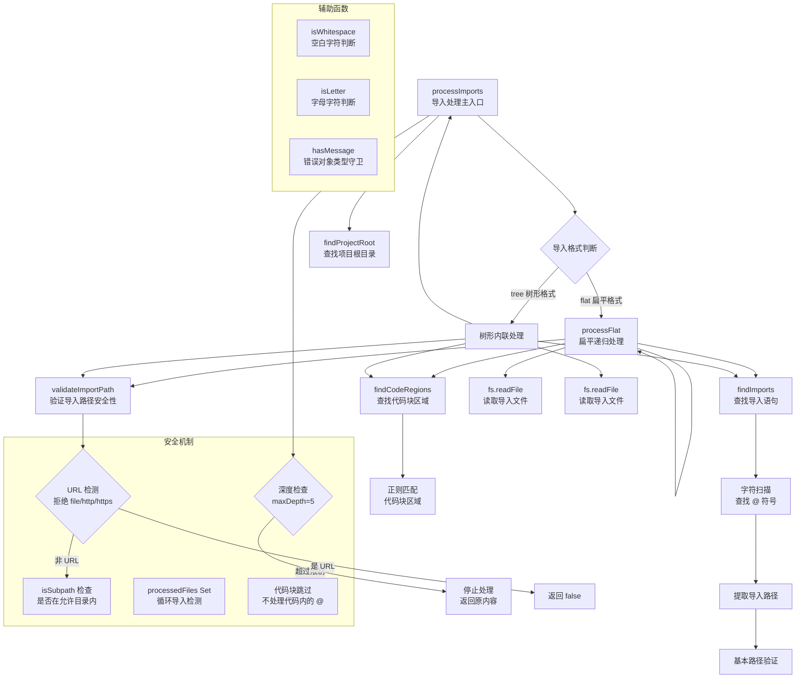

# memoryImportProcessor.ts

## 概述

`memoryImportProcessor.ts` 是 Gemini CLI 的 **记忆文件导入处理模块**，负责解析和处理 `GEMINI.md` 记忆文件中的 `@path/to/file` 导入语句。该模块允许用户在记忆文件中通过 `@` 语法引用其他文件的内容，实现记忆文件的模块化组织。

该模块支持两种导入格式：
1. **树形格式（tree）**: 在原始位置内联展开导入内容，保留层次结构，使用 HTML 注释标记导入边界
2. **扁平格式（flat）**: 将所有文件按首次发现顺序拼接为平铺列表，每个文件只出现一次

模块内建了完善的安全机制，包括**循环导入检测**、**最大递归深度限制**、**路径遍历攻击防护**和**代码块内导入跳过**等特性。

## 架构图（Mermaid）



## 核心组件

### 1. 接口定义

#### `ImportState`（内部接口）
```typescript
interface ImportState {
  processedFiles: Set<string>;  // 已处理文件路径集合（防止循环导入）
  maxDepth: number;             // 最大递归深度（默认 5）
  currentDepth: number;         // 当前递归深度
  currentFile?: string;         // 当前正在处理的文件路径
}
```
用于在递归处理过程中跟踪状态，防止循环导入和过深递归。

#### `MemoryFile`（导出接口）
```typescript
export interface MemoryFile {
  path: string;                 // 文件路径
  imports?: MemoryFile[];       // 直接导入的子文件（按导入顺序）
}
```
表示导入树中的一个文件节点，通过 `imports` 数组构成树形结构。

#### `ProcessImportsResult`（导出接口）
```typescript
export interface ProcessImportsResult {
  content: string;              // 处理后的最终内容
  importTree: MemoryFile;       // 导入关系树
}
```
导入处理的返回结果，包含展开后的完整内容和导入依赖关系树。

### 2. `findProjectRoot(startDir)` — 查找项目根目录（内部函数）

**功能**: 从指定目录向上遍历，查找包含 `.git` 的目录作为项目根。

**与 memoryDiscovery 中的同名函数区别**:
- 此版本返回 `string`（始终有值，找不到时回退到 `startDir`）
- memoryDiscovery 版本返回 `string | null`（找不到时返回 null）

**用途**: 确定项目根目录，用于限制导入路径的安全边界。

### 3. `hasMessage(err)` — 错误对象类型守卫（内部函数）

**功能**: 判断一个未知值是否具有 `message: string` 属性，用于安全地从错误对象中提取错误信息。

### 4. `findImports(content)` — 查找导入语句（内部函数）

**功能**: 在文本内容中查找所有 `@path/to/file` 格式的导入语句。

**返回**: `Array<{ start: number; _end: number; path: string }>`
- `start` — `@` 符号的位置索引
- `_end` — 导入路径结束位置的索引
- `path` — 提取的导入路径字符串

**解析算法（逐字符扫描）**:
1. 查找 `@` 符号
2. 检查 `@` 前一个字符是否为空白（确保是独立的导入语句，不是单词的一部分）
3. 从 `@` 后开始，持续扫描直到遇到空白或换行符
4. 基本路径验证：路径必须以 `.`、`/` 或字母开头

**设计决策**: 该函数不使用正则表达式，而是使用手动的字符扫描。这种方式在处理大量文本时性能更可控，且更容易处理边界条件。

### 5. `isWhitespace(char)` 和 `isLetter(char)` — 字符判断辅助函数（内部）

- `isWhitespace`: 判断字符是否为空格、制表符、换行符或回车符
- `isLetter`: 判断字符是否为 ASCII 字母（A-Z 或 a-z），通过字符码判断

### 6. `findCodeRegions(content)` — 查找代码块区域（内部函数）

**功能**: 使用正则表达式 `` /(`+)([\s\S]*?)\1/g `` 查找内容中所有的代码块和行内代码区域。

**返回**: `Array<[number, number]>` — 每个代码区域的起止索引对。

**正则解释**: 匹配一个或多个反引号开头，任意内容（惰性匹配），然后以相同数量的反引号结束。这同时覆盖了行内代码（`` `code` ``）和代码块（` ```code``` `）。

**用途**: 确保代码块内的 `@` 符号不会被误识别为导入语句。

### 7. `processImports(...)` — 导入处理主函数（导出）

**签名**:
```typescript
export async function processImports(
  content: string,
  basePath: string,
  debugMode?: boolean,
  importState?: ImportState,
  projectRoot?: string,
  importFormat?: 'flat' | 'tree',
): Promise<ProcessImportsResult>
```

**参数**:
| 参数 | 类型 | 默认值 | 说明 |
|------|------|--------|------|
| `content` | `string` | — | 待处理的文件内容 |
| `basePath` | `string` | — | 当前文件所在目录路径 |
| `debugMode` | `boolean` | `false` | 是否启用调试日志 |
| `importState` | `ImportState` | `{processedFiles: new Set(), maxDepth: 5, currentDepth: 0}` | 递归状态追踪 |
| `projectRoot` | `string` | 自动检测 | 项目根目录（导入安全边界） |
| `importFormat` | `'flat' \| 'tree'` | `'tree'` | 导入格式模式 |

#### 扁平格式（flat）处理流程

1. 从根文件开始，维护一个 `flatFiles` 数组和 `processedFiles` 集合
2. 对每个文件：
   - 路径规范化后检查是否已处理（防止循环）
   - 标记为已处理
   - 加入 `flatFiles` 列表
   - 查找文件中的导入语句
   - 对每个有效导入（不在代码块中、路径合法、未处理过）递归处理
3. 最终将所有文件拼接，每个文件用标记包裹：
```
--- File: /path/to/file ---
[文件内容]
--- End of File: /path/to/file ---
```

**特点**: 所有文件扁平排列，按首次发现顺序，每个文件只出现一次。

#### 树形格式（tree）处理流程

1. 查找内容中的所有代码区域和导入语句
2. 按导入语句在文本中的位置逐个处理：
   - **代码块内的导入**: 保持原样（`@path` 不展开）
   - **路径验证失败**: 替换为 HTML 注释 `<!-- Import failed: path - Path traversal attempt -->`
   - **循环导入检测**: 替换为 `<!-- File already processed: path -->`
   - **成功导入**: 读取文件内容，递归处理其导入，然后内联展开：
     ```
     <!-- Imported from: path -->
     [递归处理后的内容]
     <!-- End of import from: path -->
     ```
   - **读取失败**: 替换为错误注释 `<!-- Import failed: path - error message -->`
3. 同时构建 `MemoryFile` 导入依赖树

**状态传递**: 树形模式创建新的 `ImportState` 副本（包括新的 `processedFiles` Set 副本），确保不同分支的处理互不干扰。

### 8. `validateImportPath(importPath, basePath, allowedDirectories)` — 路径安全验证（导出）

**功能**: 验证导入路径是否安全合法。

**验证规则**:
1. **URL 拒绝**: 使用正则 `/^(file|https?):\/\//` 拒绝所有 `file://`、`http://`、`https://` URL
2. **目录限制**: 将路径解析为绝对路径后，检查是否在至少一个允许目录之下（通过 `isSubpath` 函数）

**安全意义**: 防止通过 `@../../etc/passwd` 等路径遍历攻击读取项目外部的敏感文件。

## 依赖关系

### 内部依赖

| 模块 | 导入内容 | 用途 |
|------|----------|------|
| `./paths.js` | `isSubpath` | 检查路径是否为指定目录的子路径 |
| `./debugLogger.js` | `debugLogger` | 调试日志记录 |

### 外部依赖

| 依赖 | 来源 | 用途 |
|------|------|------|
| `fs/promises` | `node:fs/promises`（Node.js 内置） | 异步文件操作（access, readFile） |
| `path` | `node:path`（Node.js 内置） | 路径解析和操作（resolve, join, dirname, normalize） |

## 关键实现细节

1. **双模式导入处理**: 模块支持两种完全不同的导入展开策略。树形模式（tree）保留了文件在原始位置的嵌入关系，使用 HTML 注释作为边界标记；扁平模式（flat）将所有文件去重后扁平排列，更适合作为 LLM 上下文（避免嵌套导致的重复和混淆）。

2. **循环导入防护**: 两种模式都实现了循环导入检测。树形模式通过 `importState.processedFiles` Set 跟踪当前导入链中已处理的文件；扁平模式通过全局 `processedFiles` Set 跟踪所有已处理文件。注意树形模式为每个递归分支创建 Set 的浅拷贝，这意味着同一文件可以在不同的导入链中各出现一次（菱形依赖场景），而扁平模式中每个文件全局只处理一次。

3. **递归深度限制**: 默认最大递归深度为 5 层（`maxDepth: 5`）。达到限制时停止处理并返回原始内容，防止过深的嵌套导致性能问题或栈溢出。

4. **代码块感知**: 通过 `findCodeRegions` 预先标记所有代码块和行内代码的区域，在处理导入时跳过这些区域内的 `@` 符号。这确保了代码示例中的 `@decorator` 或 `@annotation` 不会被误解为导入语句。

5. **手动字符扫描 vs 正则表达式**: `findImports` 函数使用逐字符扫描而非正则表达式来查找导入语句。这种设计在处理边界条件（如 `@` 在单词中间、路径包含特殊字符等）时更加可控和精确。

6. **路径遍历攻击防护**: `validateImportPath` 函数实现了两层防护——首先拒绝 URL 格式的路径，然后通过 `isSubpath` 确保解析后的绝对路径位于项目根目录之下。这防止了恶意的 `@../../sensitive/file` 路径读取项目外部文件。

7. **词边界检查**: `findImports` 在匹配 `@` 时检查前一个字符是否为空白，确保只匹配独立的导入声明，不会将电子邮件地址（`user@domain.com`）中的 `@` 误识别为导入。

8. **扁平模式中的逆序处理**: 在扁平模式的 `processFlat` 内部循环中，导入列表按逆序处理（`for (let i = imports.length - 1; i >= 0; i--)`）。这是因为如果按正序处理，在替换内容后可能改变后续导入语句的索引位置。虽然扁平模式下实际上不修改原始内容，但保留了这一安全做法。

9. **项目根目录自动检测**: 如果未传入 `projectRoot` 参数，模块会自动通过 `findProjectRoot` 向上查找 `.git` 目录来确定项目根。找不到时回退到 `basePath`，确保功能不会因缺少 git 仓库而完全失败。

10. **导入依赖树构建**: 树形模式在处理导入的同时构建 `MemoryFile` 导入依赖树，记录了每个文件及其直接导入关系。这个树结构可用于后续的依赖分析或可视化，但在扁平模式下该树没有实际意义（仅包含根节点）。

11. **优雅的错误隔离**: 单个导入失败不会中断整个处理过程。失败的导入会被替换为包含错误信息的 HTML 注释（树形模式）或直接跳过（扁平模式），其他导入继续正常处理。
