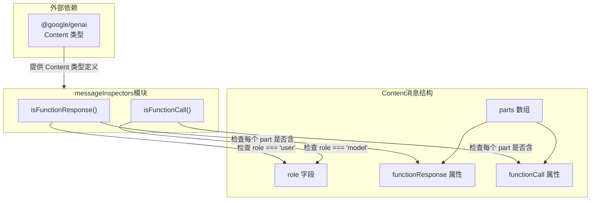

# messageInspectors.ts

## 概述

`messageInspectors.ts` 是一个轻量级的消息内容检查工具模块，用于判断 Gemini API 对话中的 `Content` 对象属于哪种消息类型。该模块提供两个纯函数：`isFunctionResponse` 和 `isFunctionCall`，分别用于判断一条消息是否为**函数响应**（由用户角色发出的、包含函数执行结果的消息）或**函数调用**（由模型角色发出的、请求执行函数的消息）。

这两个函数在整个 Gemini CLI 核心流程中被广泛用于消息路由和流程控制，是函数调用（Function Calling）机制的基础判断工具。

## 架构图（Mermaid）



## 核心组件

### 1. `isFunctionResponse(content: Content): boolean`

判断一条消息是否为**函数响应**消息。

**判断逻辑：**
- `content.role` 必须是 `'user'`（函数响应由用户端发送给模型）
- `content.parts` 必须存在且非空
- `content.parts` 中的**每一个** part 都必须包含 `functionResponse` 属性

**使用场景：** 当工具/函数执行完毕后，执行结果会被封装为 `functionResponse` 类型的消息发回给模型，此函数用于识别这类消息。

```typescript
export function isFunctionResponse(content: Content): boolean {
  return (
    content.role === 'user' &&
    !!content.parts &&
    content.parts.every((part) => !!part.functionResponse)
  );
}
```

### 2. `isFunctionCall(content: Content): boolean`

判断一条消息是否为**函数调用**消息。

**判断逻辑：**
- `content.role` 必须是 `'model'`（函数调用由模型发出）
- `content.parts` 必须存在且非空
- `content.parts` 中的**每一个** part 都必须包含 `functionCall` 属性

**使用场景：** 模型在推理过程中决定需要调用外部工具时，会生成 `functionCall` 类型的消息，此函数用于识别这类消息，以便系统执行相应的工具调用。

```typescript
export function isFunctionCall(content: Content): boolean {
  return (
    content.role === 'model' &&
    !!content.parts &&
    content.parts.every((part) => !!part.functionCall)
  );
}
```

## 依赖关系

### 内部依赖

无。该模块是一个纯工具模块，不依赖项目内部的其他模块。

### 外部依赖

| 依赖包 | 导入内容 | 用途 |
|--------|---------|------|
| `@google/genai` | `Content` (类型) | Gemini API 的消息内容类型定义，包含 `role`、`parts` 等字段 |

## 关键实现细节

1. **严格的 `every` 检查：** 两个函数都使用 `Array.prototype.every()` 来确保消息中的**所有** part 都符合条件，而非仅检查是否存在某个符合条件的 part。这意味着一条混合了普通文本和函数调用的消息**不会**被识别为函数调用消息。这种设计保证了消息类型判断的严格性和一致性。

2. **角色与内容的双重校验：** 函数不仅检查 parts 的内容类型，还检查 `role` 字段。`functionResponse` 必须来自 `'user'` 角色，`functionCall` 必须来自 `'model'` 角色。这与 Gemini API 的协议约定一致：模型发出调用请求（model），客户端返回执行结果（user）。

3. **防御性编程：** 使用 `!!content.parts` 进行空值/假值检查，确保在 `parts` 为 `undefined` 或 `null` 时不会抛出异常，而是安全地返回 `false`。

4. **纯函数设计：** 两个函数都是无副作用的纯函数，仅依赖输入参数，不修改任何外部状态，适合在任何上下文中安全调用。

5. **类型仅导入（type-only import）：** 使用 `import type` 语法导入 `Content`，确保该导入仅用于 TypeScript 类型检查，不会在编译后的 JavaScript 中产生运行时导入开销。
