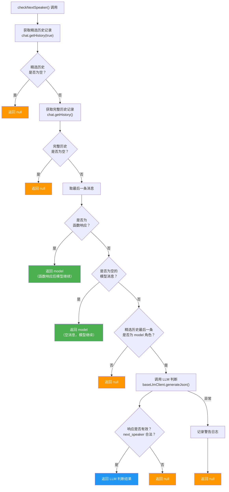

# nextSpeakerChecker.ts

## 概述

`nextSpeakerChecker.ts` 实现了一个**下一发言者判断器**，用于在多轮对话中确定下一步应该由谁发言：用户（`user`）还是模型（`model`）。这是 Gemini CLI 对话循环的关键控制组件。

该模块的核心思路是：在模型完成一次响应后，通过分析对话历史（特别是模型的最后一条消息）来判断对话是否应该继续（模型继续发言）还是应该等待用户输入。判断逻辑分为两层：

1. **快速路径（硬编码规则）：** 对于明确场景（如函数响应、空消息）直接返回结果，无需 LLM 调用。
2. **LLM 判断路径：** 对于复杂场景，将对话历史和判断提示词发送给 LLM，让模型自行分析应该由谁继续发言。

## 架构图（Mermaid）



## 核心组件

### 1. `CHECK_PROMPT` 常量

用于发送给 LLM 的判断提示词。它要求模型**仅基于自己上一轮的回复内容和结构**来判断下一发言者，并提供了三条按优先级排列的决策规则：

| 规则编号 | 规则名称 | 条件 | 结论 |
|---------|---------|------|------|
| 1 | 模型继续 | 模型明确表示了下一步要执行的动作，或回复明显不完整（中途截断） | `model` 继续发言 |
| 2 | 向用户提问 | 模型的回复以直接面向用户的问题结尾 | `user` 发言 |
| 3 | 等待用户 | 模型完成了一个完整的思考/陈述/任务，且不满足规则1和2 | `user` 发言 |

### 2. `RESPONSE_SCHEMA` 常量

定义了 LLM 返回结果的 JSON Schema，确保 LLM 返回结构化的响应：

```typescript
{
  reasoning: string;      // 判断理由
  next_speaker: 'user' | 'model';  // 下一发言者
}
```

通过 `generateJson` 方法配合此 schema，强制 LLM 返回符合预期格式的 JSON 结果。

### 3. `NextSpeakerResponse` 接口

```typescript
export interface NextSpeakerResponse {
  reasoning: string;
  next_speaker: 'user' | 'model';
}
```

定义了函数返回值的 TypeScript 类型，包含判断理由和下一发言者。

### 4. `checkNextSpeaker()` 异步函数

**签名：**
```typescript
export async function checkNextSpeaker(
  chat: GeminiChat,
  baseLlmClient: BaseLlmClient,
  abortSignal: AbortSignal,
  promptId: string,
): Promise<NextSpeakerResponse | null>
```

**参数说明：**

| 参数 | 类型 | 说明 |
|------|------|------|
| `chat` | `GeminiChat` | 当前对话实例，用于获取对话历史 |
| `baseLlmClient` | `BaseLlmClient` | LLM 客户端，用于发送判断请求 |
| `abortSignal` | `AbortSignal` | 中止信号，用于取消正在进行的请求 |
| `promptId` | `string` | 提示 ID，用于遥测追踪 |

**返回值：** `NextSpeakerResponse | null`，当无法判断时返回 `null`。

**完整执行流程：**

1. 获取**精选历史**（curated history）——经过过滤的、不含无效消息的历史
2. 如果精选历史为空，返回 `null`
3. 获取**完整历史**（comprehensive history）——包含所有消息的原始历史
4. 如果完整历史也为空，返回 `null`
5. 取完整历史的最后一条消息，进行快速路径判断：
   - 如果是**函数响应**（`isFunctionResponse`），直接返回 `model`（模型需要处理函数结果）
   - 如果是**空的模型消息**（parts 数组为空），直接返回 `model`（空消息无意义，模型应继续）
6. 检查精选历史的最后一条消息是否为 `model` 角色，如果不是则返回 `null`
7. 构造 LLM 请求：将精选历史 + 判断提示词作为 contents 发送
8. 调用 `baseLlmClient.generateJson()` 获取结构化响应
9. 验证响应格式，返回有效结果或 `null`
10. 如果请求异常，记录警告日志并返回 `null`

## 依赖关系

### 内部依赖

| 模块 | 导入内容 | 用途 |
|------|---------|------|
| `../core/baseLlmClient.js` | `BaseLlmClient` (类型) | LLM 客户端抽象基类，用于发送 JSON 格式的生成请求 |
| `../core/geminiChat.js` | `GeminiChat` (类型) | Gemini 对话实例，提供 `getHistory()` 方法获取对话历史 |
| `./messageInspectors.js` | `isFunctionResponse` | 判断消息是否为函数响应 |
| `./debugLogger.js` | `debugLogger` | 调试日志工具，用于记录警告信息 |
| `../telemetry/types.js` | `LlmRole` | 遥测角色枚举，标记此次 LLM 调用为 `UTILITY_NEXT_SPEAKER` |

### 外部依赖

| 依赖包 | 导入内容 | 用途 |
|--------|---------|------|
| `@google/genai` | `Content` (类型) | Gemini API 消息内容类型定义 |

## 关键实现细节

1. **双重历史机制：** 函数同时使用了两种历史记录：
   - **精选历史**（`getHistory(true)`）：经过清洗和过滤的历史，用于发送给 LLM 进行判断。这避免了将包含空 parts 等无效消息发送给 API 导致 400 错误。
   - **完整历史**（`getHistory()`）：包含所有原始消息的历史，用于快速路径的规则判断（如检测函数响应、空模型消息）。

2. **快速路径优化：** 对于明确场景（函数响应、空消息）直接返回结果，避免不必要的 LLM API 调用，节省延迟和成本。

3. **空消息处理：** 当模型返回 `parts` 为空数组的消息时，这种消息对用户没有意义，因此直接判定模型应继续发言。注释中特别说明了这是因为将空 parts 发回服务器会导致 400 错误。

4. **优雅降级：** 所有异常路径都返回 `null` 而非抛出错误。调用方可以根据 `null` 结果自行决定默认行为，这确保了对话循环不会因为判断失败而崩溃。

5. **结构化输出：** 使用 `generateJson()` 配合 `RESPONSE_SCHEMA` 强制 LLM 返回结构化 JSON，避免了解析自由文本的复杂性和不确定性。返回后还进行了额外的验证（检查 `next_speaker` 是否为有效枚举值）。

6. **遥测集成：** 通过 `LlmRole.UTILITY_NEXT_SPEAKER` 和 `promptId` 参数，该 LLM 调用会被纳入遥测系统追踪，方便分析该功能的调用频次和性能。

7. **可中止设计：** 通过 `AbortSignal` 参数支持取消正在进行的 LLM 请求，确保在用户中断操作时能够及时释放资源。
