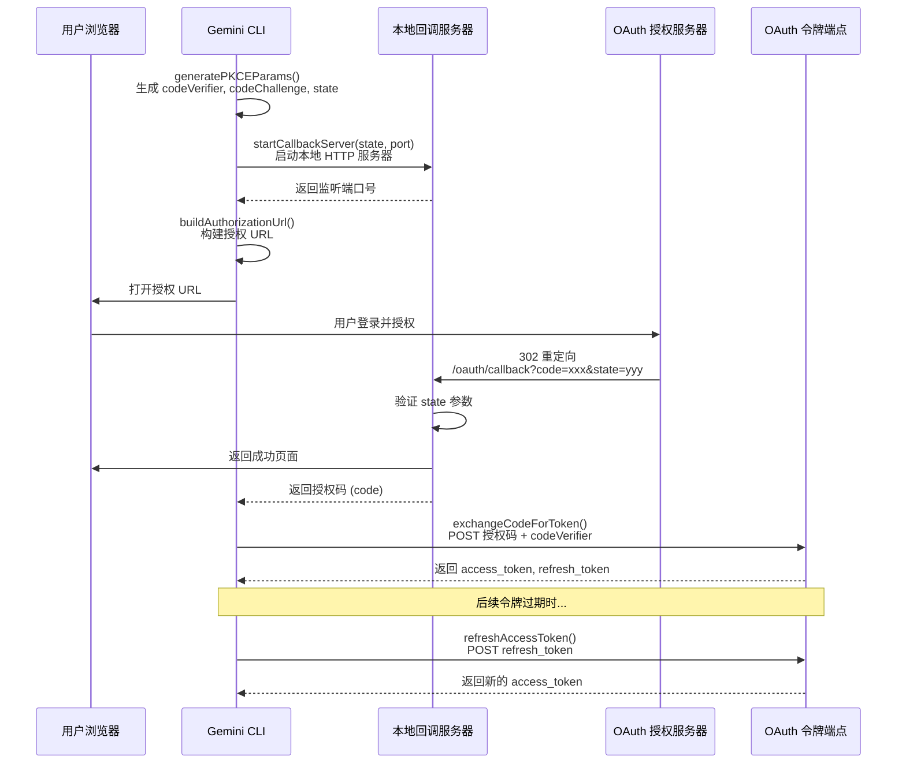
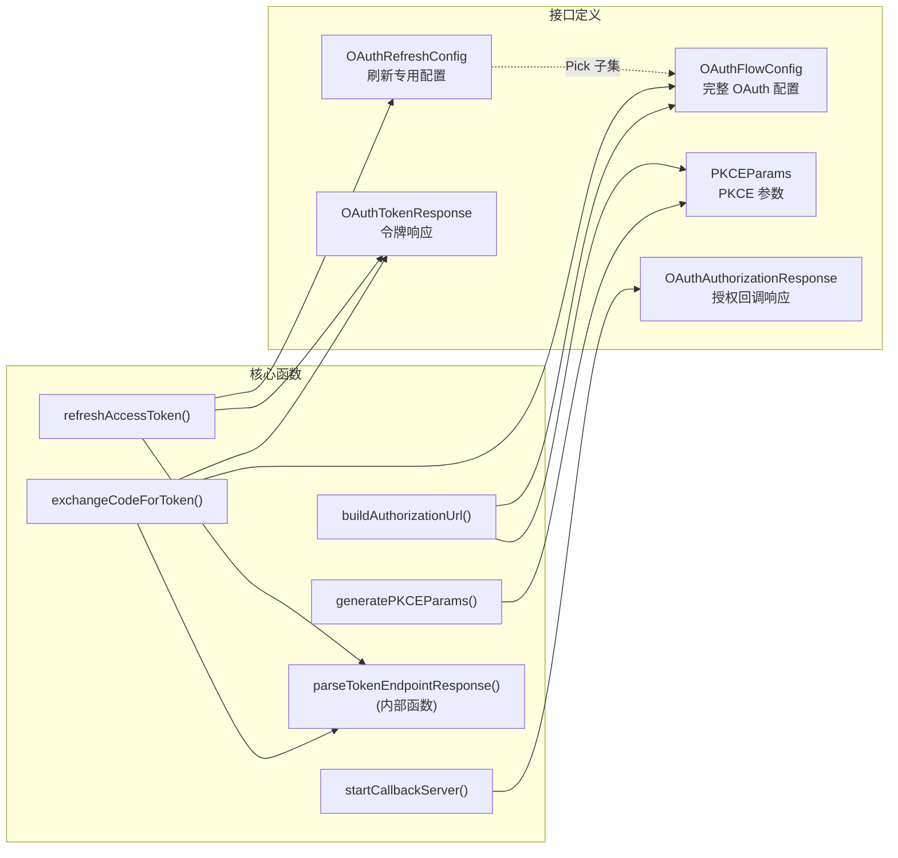

# oauth-flow.ts

## 概述

`oauth-flow.ts` 实现了一套完整的 **OAuth 2.0 授权码流程（Authorization Code Flow）** 工具集，并支持 **PKCE（Proof Key for Code Exchange）** 增强安全机制。该模块是协议无关的共享基础设施，可被 MCP OAuth 和 A2A OAuth 等不同认证提供者复用。

模块的核心功能包括：
- **PKCE 参数生成：** 生成 code_verifier、code_challenge 和防 CSRF 的 state 参数
- **本地回调服务器：** 启动临时 HTTP 服务器接收授权服务器的回调
- **授权 URL 构建：** 根据配置和 PKCE 参数拼装完整的授权请求 URL
- **令牌交换：** 用授权码换取 access_token 和 refresh_token
- **令牌刷新：** 使用 refresh_token 获取新的 access_token
- **响应解析：** 兼容 JSON 和 form-urlencoded 两种令牌端点响应格式

## 架构图（Mermaid）





## 核心组件

### 1. 接口定义

#### `OAuthFlowConfig`

OAuth 2.0 授权码流程的完整配置接口。

| 字段 | 类型 | 必填 | 说明 |
|------|------|------|------|
| `clientId` | `string` | 是 | OAuth 客户端 ID |
| `clientSecret` | `string` | 否 | OAuth 客户端密钥（公共客户端可省略） |
| `authorizationUrl` | `string` | 是 | 授权端点 URL |
| `tokenUrl` | `string` | 是 | 令牌端点 URL |
| `scopes` | `string[]` | 否 | 请求的权限范围列表 |
| `audiences` | `string[]` | 否 | 目标受众列表 |
| `redirectUri` | `string` | 否 | 自定义重定向 URI（默认使用本地回调服务器地址） |

#### `OAuthRefreshConfig`

令牌刷新操作所需的配置子集，通过 `Pick` 从 `OAuthFlowConfig` 中提取 `clientId`、`clientSecret`、`scopes`、`audiences` 四个字段。

#### `PKCEParams`

| 字段 | 类型 | 说明 |
|------|------|------|
| `codeVerifier` | `string` | PKCE 码验证器（原始随机字符串） |
| `codeChallenge` | `string` | PKCE 码挑战（codeVerifier 的 SHA256 哈希） |
| `state` | `string` | 防 CSRF 攻击的随机状态参数 |

#### `OAuthAuthorizationResponse`

| 字段 | 类型 | 说明 |
|------|------|------|
| `code` | `string` | 授权码 |
| `state` | `string` | 状态参数（需与请求时的 state 匹配） |

#### `OAuthTokenResponse`

| 字段 | 类型 | 必填 | 说明 |
|------|------|------|------|
| `access_token` | `string` | 是 | 访问令牌 |
| `token_type` | `string` | 是 | 令牌类型（通常为 `Bearer`） |
| `expires_in` | `number` | 否 | 过期时间（秒） |
| `refresh_token` | `string` | 否 | 刷新令牌 |
| `scope` | `string` | 否 | 实际授予的权限范围 |

### 2. `generatePKCEParams(): PKCEParams`

生成 PKCE 流程所需的三个参数。

**实现细节：**
- **codeVerifier：** 使用 `crypto.randomBytes(64)` 生成 64 字节随机数据，然后转为 base64url 编码（约 86 个字符），满足 OAuth 规范要求的 43-128 字符范围
- **codeChallenge：** 对 codeVerifier 进行 SHA256 哈希后再 base64url 编码，使用 `S256` 方法
- **state：** 使用 `crypto.randomBytes(16)` 生成 16 字节随机数据，base64url 编码后用于 CSRF 防护

### 3. `startCallbackServer(expectedState, port?)`

启动一个临时的本地 HTTP 服务器用于接收 OAuth 回调。

**返回值：**
```typescript
{
  port: Promise<number>;                     // 服务器实际监听的端口号
  response: Promise<OAuthAuthorizationResponse>; // 授权回调的响应
}
```

**端口选择优先级：**
1. 环境变量 `OAUTH_CALLBACK_PORT`（最高优先级）
2. 函数参数 `port`
3. 系统自动分配（端口 0）

**请求处理逻辑：**
- 仅处理 `/oauth/callback` 路径的请求，其他路径返回 404
- 检查 `error` 参数：有错误时返回 HTML 错误页面并拒绝 Promise
- 检查 `code` 和 `state` 参数是否存在：缺失时返回 400
- 验证 `state` 参数：与预期不匹配时返回 400 并报告 CSRF 攻击可能性
- 一切正常时：返回成功 HTML 页面（带自动关闭脚本），关闭服务器，解析授权码

**安全措施：**
- HTML 输出中对错误信息进行了 XSS 转义（`<` 和 `>` 替换）
- 5 分钟超时自动关闭服务器，防止资源泄漏

### 4. `getPortFromUrl(urlString?): number | undefined`

从 URL 字符串中提取端口号。解析失败或端口无效时返回 `undefined`。会验证端口在 1-65535 有效范围内。

### 5. `buildAuthorizationUrl(config, pkceParams, redirectPort, resource?): string`

构建完整的 OAuth 授权请求 URL。

**URL 参数：**

| 参数 | 来源 | 说明 |
|------|------|------|
| `client_id` | config.clientId | 客户端标识 |
| `response_type` | 固定值 `'code'` | 授权码模式 |
| `redirect_uri` | config.redirectUri 或自动生成 | 回调地址 |
| `state` | pkceParams.state | CSRF 防护 |
| `code_challenge` | pkceParams.codeChallenge | PKCE 码挑战 |
| `code_challenge_method` | 固定值 `'S256'` | SHA256 挑战方法 |
| `scope` | config.scopes（可选） | 权限范围，空格分隔 |
| `audience` | config.audiences（可选） | 目标受众 |
| `resource` | 参数（可选） | RFC 8707 资源参数 |

### 6. `exchangeCodeForToken(config, code, codeVerifier, redirectPort, resource?): Promise<OAuthTokenResponse>`

将授权码交换为令牌。通过 POST 请求发送到令牌端点，内容类型为 `application/x-www-form-urlencoded`，Accept 头同时接受 JSON 和 form-urlencoded 响应。

**请求参数：**
- `grant_type`: `authorization_code`
- `code`: 授权码
- `redirect_uri`: 与授权请求一致的重定向 URI
- `code_verifier`: PKCE 码验证器
- `client_id`: 客户端 ID
- `client_secret`（可选）
- `audience`（可选）
- `resource`（可选，RFC 8707）

### 7. `refreshAccessToken(config, refreshToken, tokenUrl, resource?): Promise<OAuthTokenResponse>`

使用刷新令牌获取新的访问令牌。

**请求参数：**
- `grant_type`: `refresh_token`
- `refresh_token`: 刷新令牌
- `client_id`: 客户端 ID
- `client_secret`（可选）
- `scope`（可选）
- `audience`（可选）
- `resource`（可选，RFC 8707）

### 8. `parseTokenEndpointResponse(response, operationName, defaultErrorCode): Promise<OAuthTokenResponse>`（内部函数）

解析令牌端点的 HTTP 响应，是 `exchangeCodeForToken` 和 `refreshAccessToken` 的共享内部实现。

**解析策略：**
1. 如果 HTTP 状态非 2xx：尝试从 form-urlencoded 格式中提取错误信息，抛出详细错误
2. 检查 Content-Type：如果既不是 JSON 也不是 form-urlencoded，记录警告但仍尝试解析
3. 首先尝试作为 JSON 解析：验证是否包含 `access_token` 字段，对每个字段进行类型安全的提取
4. JSON 解析失败则尝试 form-urlencoded 解析：从 URLSearchParams 中提取各字段
5. 如果都没有 `access_token`：检查是否有错误信息并抛出异常

## 依赖关系

### 内部依赖

| 模块 | 导入内容 | 用途 |
|------|---------|------|
| `./debugLogger.js` | `debugLogger` | 调试日志，用于记录回调服务器启动信息和解析警告 |

### 外部依赖

| 依赖包 | 导入内容 | 用途 |
|--------|---------|------|
| `node:http` | `http`（命名空间） | 创建本地 HTTP 回调服务器 |
| `node:crypto` | `crypto`（命名空间） | 生成 PKCE 随机参数（randomBytes）和 SHA256 哈希 |
| `node:net` | `net`（类型） | `AddressInfo` 类型，用于获取服务器实际监听端口 |
| `node:url` | `URL` | URL 解析和构建 |
| 全局 `fetch` | — | 发送 HTTP POST 请求到令牌端点（Node.js 内置） |

## 关键实现细节

1. **PKCE 安全增强：** 采用 S256 方法（SHA256 哈希）而非明文方式传递 code_challenge，符合 OAuth 2.0 for Native Apps（RFC 8252）和 PKCE（RFC 7636）最佳实践。codeVerifier 使用 64 字节熵源确保足够的随机性。

2. **双 Promise 模式：** `startCallbackServer` 返回两个独立的 Promise：`port`（端口号，服务器启动后立即解析）和 `response`（授权响应，用户完成授权后解析）。这种设计允许调用方在服务器启动后立即获得端口号来构建授权 URL，而不必等待整个授权流程完成。

3. **端口灵活配置：** 支持三种端口配置方式（环境变量 > 参数 > 自动分配），满足不同部署环境的需求。环境变量优先级最高，方便在容器化或受限网络环境中使用固定端口。

4. **双格式响应兼容：** `parseTokenEndpointResponse` 同时支持 JSON 和 form-urlencoded 两种令牌响应格式。这是因为 OAuth 规范允许不同实现使用不同的响应格式（例如早期 GitHub 使用 form-urlencoded）。解析时采用"先尝试 JSON，失败则尝试 form-urlencoded"的降级策略。

5. **XSS 防护：** 回调服务器返回的 HTML 页面中，对错误信息中的 `<` 和 `>` 进行了转义，防止恶意授权服务器通过错误描述注入 HTML/JavaScript。

6. **超时保护：** 回调服务器设有 5 分钟超时，避免因用户未完成授权而导致服务器和 Promise 永久挂起。

7. **RFC 8707 资源指示器支持：** `buildAuthorizationUrl`、`exchangeCodeForToken` 和 `refreshAccessToken` 都支持可选的 `resource` 参数，符合 RFC 8707 资源指示器规范，允许客户端指定目标资源服务器。

8. **State 参数 CSRF 防护：** 回调服务器严格验证 `state` 参数与预期值的匹配，不匹配时明确报告"possible CSRF attack"，防止跨站请求伪造攻击。

9. **类型安全的字段提取：** 在 `parseTokenEndpointResponse` 中，JSON 解析后对每个字段都进行了 `typeof` 检查，确保类型安全，不会因为服务器返回意外类型而导致运行时错误。
