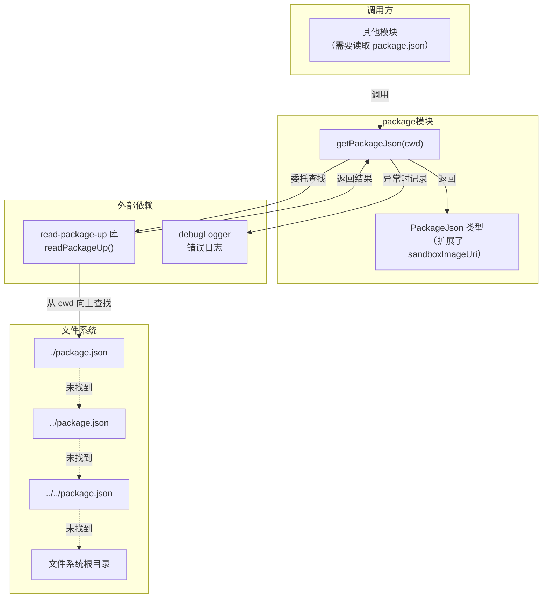

# package.ts

## 概述

`package.ts` 是一个用于读取和获取 `package.json` 文件内容的工具模块。它封装了 `read-package-up` 库，提供从指定目录开始**向上遍历目录树**查找最近的 `package.json` 文件的能力。

该模块还扩展了标准的 `PackageJson` 类型，增加了 Gemini CLI 特有的 `config.sandboxImageUri` 配置字段，用于支持沙箱镜像配置。

这是一个基础设施工具，在项目中被用于获取版本号、包名称以及自定义配置等元信息。

## 架构图（Mermaid）



## 核心组件

### 1. `PackageJson` 类型

```typescript
export type PackageJson = BasePackageJson & {
  config?: {
    sandboxImageUri?: string;
  };
};
```

在 `read-package-up` 库提供的标准 `PackageJson` 类型（`BasePackageJson`）基础上，通过交叉类型（`&`）扩展了一个可选的 `config` 字段，其中包含：

| 字段 | 类型 | 说明 |
|------|------|------|
| `config.sandboxImageUri` | `string` (可选) | 沙箱容器镜像的 URI 地址，用于指定 Gemini CLI 执行代码时使用的沙箱环境镜像 |

这种类型扩展方式既保留了标准 `package.json` 的所有字段（如 `name`、`version`、`dependencies` 等），又添加了项目特有的配置。

### 2. `getPackageJson(cwd: string): Promise<PackageJson | undefined>`

异步函数，从指定目录开始向上查找 `package.json` 文件。

**参数：**

| 参数 | 类型 | 说明 |
|------|------|------|
| `cwd` | `string` | 起始搜索目录，会从此目录开始向上逐级查找直到文件系统根目录 |

**返回值：** `Promise<PackageJson | undefined>`
- 找到时返回解析后的 `PackageJson` 对象
- 未找到或发生错误时返回 `undefined`

**执行流程：**
1. 调用 `readPackageUp({ cwd, normalize: false })` 执行实际查找
2. 如果返回 `null`/`undefined`（未找到），返回 `undefined`
3. 如果查找成功，返回 `result.packageJson`
4. 如果发生异常，通过 `debugLogger.error` 记录错误，返回 `undefined`

**关键配置：** `normalize: false` 参数确保返回原始的 `package.json` 内容，不进行 `normalize-package-data` 库的标准化处理（如自动补全字段、修正格式等）。

## 依赖关系

### 内部依赖

| 模块 | 导入内容 | 用途 |
|------|---------|------|
| `./debugLogger.js` | `debugLogger` | 错误日志记录，在读取 package.json 失败时输出错误信息 |

### 外部依赖

| 依赖包 | 导入内容 | 用途 |
|--------|---------|------|
| `read-package-up` | `readPackageUp` (函数), `PackageJson` (类型，别名为 `BasePackageJson`) | 核心依赖，提供向上查找 package.json 的功能和基础类型定义 |

## 关键实现细节

1. **向上遍历查找：** `read-package-up` 库的核心行为是从 `cwd` 指定的目录开始，逐级向上遍历父目录，直到找到 `package.json` 或到达文件系统根目录。这种行为类似于 Node.js 的模块解析机制，确保无论当前工作目录在项目的哪个子目录中，都能找到项目根目录的 `package.json`。

2. **不标准化处理（`normalize: false`）：** 明确禁用了 `read-package-up` 的标准化功能。标准化会自动补全缺失字段、转换格式等，这里选择保留原始内容，确保读取到的就是文件中实际存在的内容，避免引入不必要的副作用。

3. **优雅降级：** 函数不会抛出异常。无论是找不到 `package.json`（正常场景，如在非 Node.js 项目目录中运行）还是读取过程中发生错误，都返回 `undefined`。调用方通过可选链（`?.`）或空值合并（`??`）安全地处理缺失情况。

4. **沙箱镜像配置扩展：** `sandboxImageUri` 字段位于 `config` 命名空间下，遵循了 `package.json` 中自定义配置的惯例。这允许项目在 `package.json` 中直接配置沙箱环境，无需额外的配置文件。

5. **类型重导出：** 通过 `export type PackageJson` 将扩展后的类型导出，使其他模块可以直接使用这个包含自定义字段的类型定义，保持类型一致性。
