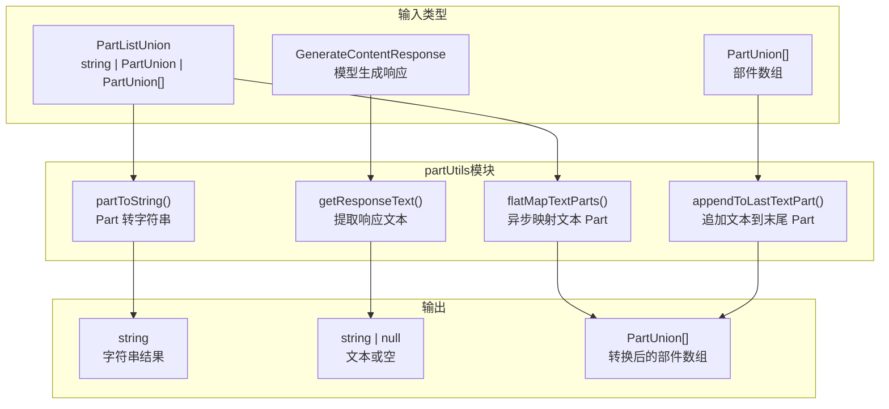
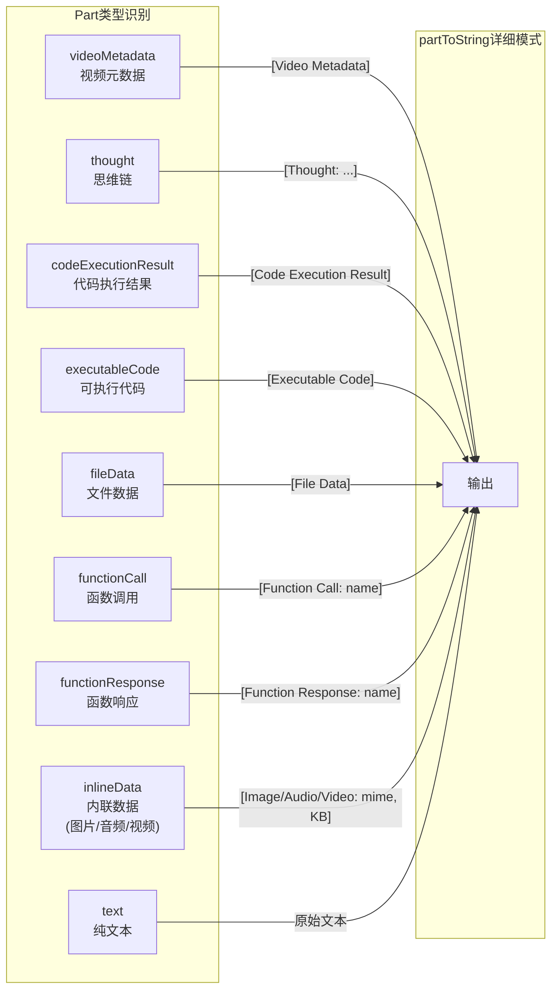

# partUtils.ts

## 概述

`partUtils.ts` 是一个处理 Gemini API **消息部件（Part）** 的工具模块，提供了一系列用于转换、提取、映射和拼接消息部件的实用函数。在 Gemini API 中，一条消息（`Content`）包含多个部件（`Part`），每个部件可以是文本、函数调用、函数响应、内联数据（图片/音频/视频）、代码执行结果等不同类型。

该模块的四个核心函数覆盖了对 Part 的常见操作：
- **`partToString`：** 将任意类型的 Part 转换为字符串表示
- **`getResponseText`：** 从模型响应中提取纯文本内容（排除思维链）
- **`flatMapTextParts`：** 异步转换文本类型的 Part（保留非文本 Part 不变）
- **`appendToLastTextPart`：** 向提示词的最后一个文本 Part 追加内容

## 架构图（Mermaid）

## 核心组件

### 1. `partToString(value: PartListUnion, options?: { verbose?: boolean }): string`

将 `PartListUnion`（可以是字符串、单个 Part 或 Part 数组）转换为字符串。

**参数：**

| 参数 | 类型 | 说明 |
|------|------|------|
| `value` | `PartListUnion` | 要转换的部件，可以是 `string`、`PartUnion` 或 `PartUnion[]` |
| `options.verbose` | `boolean` (可选) | 详细模式，为非文本 Part 生成摘要描述 |

**处理逻辑：**

1. **空值处理：** `value` 为 falsy 时返回空字符串
2. **字符串类型：** 直接返回原字符串
3. **数组类型：** 递归处理每个元素并拼接
4. **单个 Part 对象：**
   - **非详细模式**（默认）：仅返回 `part.text`（文本内容），非文本 Part 返回空字符串
   - **详细模式**（`verbose: true`）：为各种 Part 类型生成可读的摘要描述

**详细模式下的 Part 类型摘要：**

| Part 类型 | 输出格式 | 示例 |
|-----------|---------|------|
| videoMetadata | `[Video Metadata]` | `[Video Metadata]` |
| thought | `[Thought: {内容}]` | `[Thought: 让我分析一下...]` |
| codeExecutionResult | `[Code Execution Result]` | `[Code Execution Result]` |
| executableCode | `[Executable Code]` | `[Executable Code]` |
| fileData | `[File Data]` | `[File Data]` |
| functionCall | `[Function Call: {函数名}]` | `[Function Call: search_files]` |
| functionResponse | `[Function Response: {函数名}]` | `[Function Response: search_files]` |
| inlineData | `[{类别}: {MIME类型}, {大小} KB]` | `[Image: image/png, 45.2 KB]` |

**inlineData 的类别判断：**
- MIME 类型以 `audio/` 开头 → `Audio`
- MIME 类型以 `video/` 开头 → `Video`
- MIME 类型以 `image/` 开头 → `Image`
- 其他 → `Media`

**inlineData 大小计算：** 通过 base64 编码长度反推原始字节数：`bytes = ceil(base64Length * 3 / 4)`，然后转换为 KB。

### 2. `getResponseText(response: GenerateContentResponse): string | null`

从 Gemini API 的生成响应中提取纯文本内容。

**参数：**

| 参数 | 类型 | 说明 |
|------|------|------|
| `response` | `GenerateContentResponse` | Gemini API 的完整生成响应对象 |

**返回值：** `string | null`，提取到的文本内容，无内容时返回 `null`。

**处理逻辑：**
1. 检查 `response.candidates` 是否存在且非空
2. 取第一个候选结果（`candidates[0]`）
3. 检查该候选结果的 `content.parts` 是否存在且非空
4. **过滤掉 `thought` 类型的 Part**（`!part.thought`），仅保留纯文本
5. 提取所有文本 Part 的 `text` 字段并拼接

**关键行为：** 此函数会**排除思维链（thought）内容**。在 Gemini API 中，模型可能会返回 `thought` 类型的 Part 来展示推理过程，但 `getResponseText` 只关注最终的文本输出。

### 3. `flatMapTextParts(parts: PartListUnion, transform: (text: string) => Promise<PartUnion[]>): Promise<PartUnion[]>`

异步地对 `PartListUnion` 中的文本部件执行 flatMap 转换操作。

**参数：**

| 参数 | 类型 | 说明 |
|------|------|------|
| `parts` | `PartListUnion` | 要处理的部件集合 |
| `transform` | `(text: string) => Promise<PartUnion[]>` | 异步转换函数，接收文本返回新的部件数组 |

**返回值：** `Promise<PartUnion[]>`，转换后的部件数组。

**处理逻辑：**
1. **统一输入格式：** 将 `PartListUnion` 统一转为数组
   - 数组 → 直接使用
   - 字符串 → 包装为 `[{ text: string }]`
   - 单个 Part → 包装为 `[part]`
2. **遍历每个 Part：**
   - 如果是字符串 → 提取文本内容
   - 如果包含 `text` 属性 → 提取 `part.text`
   - 有文本内容 → 调用 `transform` 函数，将结果展开到结果数组
   - 无文本内容（非文本 Part）→ 原样保留到结果数组

**使用场景示例：** 可用于对提示词中的文本部分执行模板替换、变量展开、引用注入等操作，同时保持图片、函数调用等非文本部件不受影响。

### 4. `appendToLastTextPart(prompt: PartUnion[], textToAppend: string, separator?: string): PartUnion[]`

向提示词数组的最后一个文本 Part 追加文本，如果最后一个 Part 不是文本类型，则新增一个文本 Part。

**参数：**

| 参数 | 类型 | 默认值 | 说明 |
|------|------|--------|------|
| `prompt` | `PartUnion[]` | — | 原始提示词部件数组 |
| `textToAppend` | `string` | — | 要追加的文本内容 |
| `separator` | `string` | `'\n\n'` | 现有文本与新文本之间的分隔符 |

**返回值：** `PartUnion[]`，修改后的提示词数组（新数组，不修改原数组）。

**处理逻辑：**
1. 如果 `textToAppend` 为空/falsy → 返回原数组不变
2. 如果 `prompt` 为空数组 → 返回 `[{ text: textToAppend }]`
3. 获取最后一个 Part：
   - 如果是字符串 → 拼接为 `${lastPart}${separator}${textToAppend}`
   - 如果是含 `text` 的对象 → 展开原对象并更新 `text` 字段
   - 如果是非文本类型 → 在数组末尾 push 新的文本 Part

**不可变性：** 函数通过 `[...prompt]` 创建浅拷贝，确保不修改原始数组。对于对象类型的 Part，也使用展开运算符 `{...lastPart, text: ...}` 创建新对象。

## 依赖关系

### 内部依赖

无。该模块是一个纯工具模块，不依赖项目内部的其他模块。

### 外部依赖

| 依赖包 | 导入内容 | 用途 |
|--------|---------|------|
| `@google/genai` | `GenerateContentResponse` (类型) | Gemini API 生成内容的响应类型 |
| `@google/genai` | `PartListUnion` (类型) | Part 的联合列表类型：`string \| PartUnion \| PartUnion[]` |
| `@google/genai` | `Part` (类型) | 单个消息部件的基础类型 |
| `@google/genai` | `PartUnion` (类型) | 单个消息部件的联合类型 |

## 关键实现细节

1. **扩展类型断言：** 在 `partToString` 中，将 `value` 断言为 `Part & { videoMetadata?, thought?, codeExecutionResult?, executableCode? }` 的扩展类型。这是因为 `@google/genai` SDK 的 `Part` 类型定义可能尚未包含这些实验性或项目特有的字段（如 `thought`），通过类型交叉实现了对额外字段的支持。

2. **思维链过滤：** `getResponseText` 中通过 `filter((part) => part.text && !part.thought)` 明确过滤掉了思维链内容。这表明在 Gemini API 中，一个 Part 可能同时具有 `text` 和 `thought` 属性，`thought` 为真时表示该文本是推理过程而非最终输出。

3. **Base64 大小估算：** 对 `inlineData` 的大小计算使用了 `Math.ceil((data.length * 3) / 4)` 公式。这是 Base64 编码的反向计算：每 4 个 Base64 字符编码 3 个字节。虽然没有考虑 padding 字符（`=`）的影响，但作为摘要显示已足够准确。

4. **递归处理：** `partToString` 对数组类型使用递归处理，通过 `value.map((part) => partToString(part, options)).join('')` 将数组中的每个元素分别转换后拼接。

5. **不可变操作：** `appendToLastTextPart` 和 `flatMapTextParts` 都不修改输入参数，返回全新的数组和对象。这种函数式编程风格避免了意外的副作用，使函数在各种上下文中都可以安全使用。

6. **顺序异步处理：** `flatMapTextParts` 使用 `for...of` 循环配合 `await`，对每个文本 Part **串行**执行异步转换。这保证了转换结果的顺序与输入一致，但如果转换函数耗时较长且 Part 较多，可能成为性能瓶颈。

7. **优雅的 MIME 类型分类：** `partToString` 在详细模式下通过检查 MIME 类型前缀将内联数据分为 Audio、Video、Image 和通用 Media 四类，提供了直观的人类可读摘要。

8. **仅取第一个候选：** `getResponseText` 仅处理 `candidates[0]`，即第一个候选结果。Gemini API 支持返回多个候选，但在 CLI 场景下通常只关注最佳结果。
