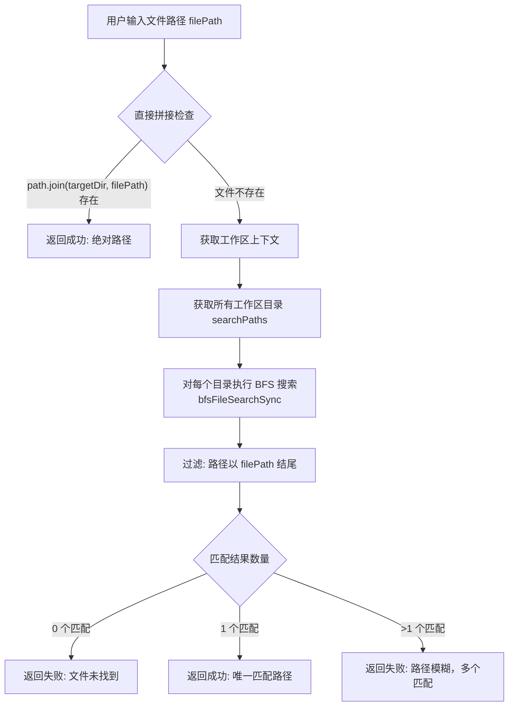

# pathCorrector.ts

## 概述

`pathCorrector.ts` 是一个路径纠正工具模块，其核心功能是将用户提供的相对路径或模糊路径纠正为工作区内唯一的绝对路径。该模块在 AI 助手解析用户输入的文件路径时起到关键作用——当用户给出不完整或相对的文件路径时，本模块会尝试在工作区目录中定位到正确的文件。

路径纠正采用两阶段策略：
1. **直接拼接**：首先将路径与主目标目录 (`targetDir`) 直接拼接，检查文件是否存在。
2. **广度优先搜索（BFS）**：如果直接拼接不匹配，则在整个工作区目录中执行广度优先文件搜索，查找匹配的文件。

## 架构图（Mermaid）



## 核心组件

### 类型定义

#### `SuccessfulPathCorrection`

```typescript
type SuccessfulPathCorrection = {
  success: true;
  correctedPath: string;
};
```

表示路径纠正成功的结果。`correctedPath` 为纠正后的绝对路径。

#### `FailedPathCorrection`

```typescript
type FailedPathCorrection = {
  success: false;
  error: string;
};
```

表示路径纠正失败的结果。`error` 包含失败原因的描述信息。

#### `PathCorrectionResult`

```typescript
export type PathCorrectionResult =
  | SuccessfulPathCorrection
  | FailedPathCorrection;
```

联合类型（Discriminated Union），通过 `success` 字段区分成功与失败，便于调用方进行类型收窄。

### 核心函数

#### `correctPath(filePath: string, config: Config): PathCorrectionResult`

**参数：**

| 参数 | 类型 | 说明 |
|------|------|------|
| `filePath` | `string` | 待纠正的文件路径（通常是相对路径或模糊路径） |
| `config` | `Config` | 应用配置对象，提供目标目录、工作区上下文、文件服务和文件过滤选项 |

**返回值：** `PathCorrectionResult` —— 成功时包含 `correctedPath`，失败时包含 `error`。

**执行逻辑：**

1. **直接路径检查**：使用 `path.join(config.getTargetDir(), filePath)` 拼接出候选绝对路径，通过 `fs.existsSync()` 检查是否存在。若存在则立即返回成功。

2. **工作区广度优先搜索**：
   - 从 `config.getWorkspaceContext().getDirectories()` 获取所有工作区搜索目录。
   - 提取 `filePath` 的 `basename` 作为搜索目标文件名。
   - 将 `filePath` 中的反斜杠 `\` 统一替换为正斜杠 `/`（跨平台兼容）。
   - 对每个搜索目录调用 `bfsFileSearchSync()`，限制最大搜索目录数为 50（防止深层目录导致卡顿）。
   - 过滤结果：只保留路径末尾与 `normalizedTarget` 匹配的文件。

3. **结果判断**：
   - **0 个匹配**：返回失败，提示文件未找到。
   - **1 个匹配**：返回成功，给出唯一匹配路径。
   - **多个匹配**：返回失败，提示路径模糊并列出所有匹配的文件路径，建议用户提供更精确的路径。

## 依赖关系

### 内部依赖

| 模块 | 导入内容 | 用途 |
|------|---------|------|
| `../config/config.js` | `Config` (类型) | 获取目标目录、工作区上下文、文件服务及文件过滤选项 |
| `./bfsFileSearch.js` | `bfsFileSearchSync` | 在指定目录中执行广度优先同步文件搜索 |

### 外部依赖

| 模块 | 导入内容 | 用途 |
|------|---------|------|
| `node:fs` | `fs` | 使用 `existsSync()` 检查文件是否存在 |
| `node:path` | `path` | 使用 `join()` 拼接路径、`basename()` 提取文件名 |

## 关键实现细节

1. **两阶段搜索策略**：先快后慢。直接路径拼接是 O(1) 操作，只有失败后才启动更昂贵的 BFS 搜索，保证了大多数场景下的高效响应。

2. **BFS 搜索深度限制**：`maxDirs: 50` 参数限制了每个搜索路径最多遍历 50 个目录，防止在大型项目中因目录树过深而导致长时间阻塞。

3. **跨平台路径兼容**：通过 `replace(/\\/g, '/')` 将 Windows 风格的反斜杠统一转换为正斜杠，确保在不同操作系统上路径匹配的一致性。

4. **模糊匹配的精确判断**：使用 `endsWith(normalizedTarget)` 进行后缀匹配，这意味着用户可以提供部分路径（如 `src/utils/foo.ts`），系统会匹配所有以该片段结尾的文件路径。

5. **歧义处理**：当多个文件匹配时不会随意选择一个，而是返回错误并列出所有候选路径，要求用户消除歧义。这是一种安全的设计策略，避免对错误文件进行操作。

6. **类型安全的结果模式**：使用 TypeScript 的可辨别联合类型（Discriminated Union），调用方可以通过检查 `result.success` 进行类型收窄，安全地访问 `correctedPath` 或 `error`。

7. **同步 API 设计**：`correctPath` 是同步函数（内部使用 `existsSync` 和 `bfsFileSearchSync`），适用于需要立即获得结果的场景，但在大型工作区中可能造成主线程阻塞。
