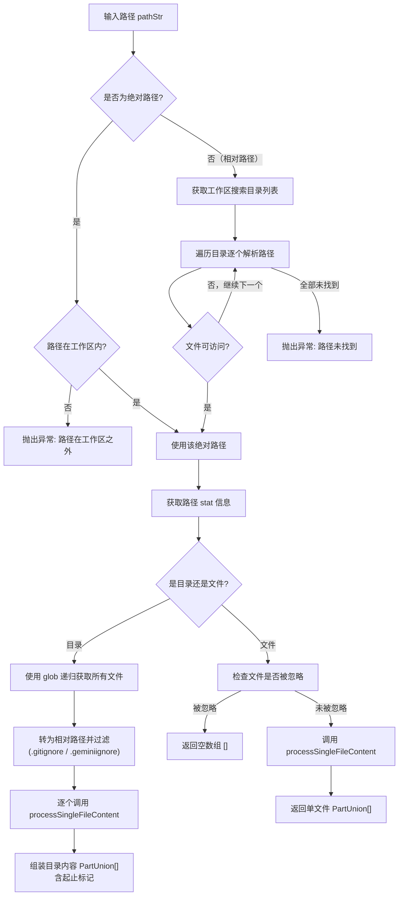

# pathReader.ts

## 概述

`pathReader.ts` 是一个工作区路径内容读取模块，核心功能是从工作区中读取文件或目录的内容，并将其转换为适合 LLM（大语言模型）输入的格式（`PartUnion[]`）。该模块支持读取单个文件以及递归展开整个目录。

主要特性：
- 支持**绝对路径**和**相对路径**两种输入方式。
- **工作区安全检查**：绝对路径必须在工作区范围内，防止越界读取。
- **相对路径优先搜索**：在所有工作区目录中按优先级查找文件。
- **目录递归展开**：自动将目录递归展开为所有子文件的内容。
- **文件过滤**：遵循 `.gitignore` 和 `.geminiignore` 规则过滤文件。
- **异步设计**：全部 I/O 操作采用异步 API。

## 架构图（Mermaid）

## 核心组件

### 导出函数

#### `readPathFromWorkspace(pathStr: string, config: Config): Promise<PartUnion[]>`

异步读取工作区内指定路径的内容，返回适合 LLM 消费的内容片段数组。

**参数：**

| 参数 | 类型 | 说明 |
|------|------|------|
| `pathStr` | `string` | 待读取的路径，可以是绝对路径或相对路径 |
| `config` | `Config` | 应用配置对象，提供工作区上下文、文件服务等 |

**返回值：** `Promise<PartUnion[]>` —— LLM 可消费的内容片段数组。

**异常：**
- 绝对路径在工作区之外时抛出 `Error`。
- 路径在工作区中不存在时抛出 `Error`。

**详细处理流程：**

##### 1. 路径解析阶段

- **绝对路径处理**：调用 `workspace.isPathWithinWorkspace(pathStr)` 验证安全性。若在工作区内则直接使用；否则抛出异常。
- **相对路径处理**：获取 `workspace.getDirectories()` 返回的搜索目录列表，按优先级逐个尝试 `path.resolve(dir, pathStr)`，通过 `fs.access()` 检测可访问性，找到第一个即停止搜索。

##### 2. 路径类型判断

使用 `fs.stat()` 获取路径信息，根据 `stats.isDirectory()` 判断是目录还是文件。

##### 3a. 目录处理

- 插入目录起始标记：`--- Start of content for directory: ${pathStr} ---`
- 使用 `glob('**/*', { cwd, nodir: true, dot: true, absolute: true })` 递归获取目录下所有文件（包含点文件）。
- 将绝对路径转为相对于 `targetDir` 的相对路径。
- 通过 `fileService.filterFiles()` 过滤被 `.gitignore` 和 `.geminiignore` 忽略的文件。
- 将过滤后的相对路径重新转为绝对路径。
- 对每个文件：
  - 插入文件分隔标记：`--- ${relativePathForDisplay} ---`
  - 调用 `processSingleFileContent()` 获取 LLM 内容。
  - 插入换行分隔符。
- 插入目录结束标记：`--- End of content for directory: ${pathStr} ---`

##### 3b. 单文件处理

- 将绝对路径转为相对路径，通过 `fileService.filterFiles()` 检查是否被忽略。
- 若被忽略，返回空数组 `[]`（静默跳过）。
- 若未被忽略，调用 `processSingleFileContent()` 获取内容并返回。

## 依赖关系

### 内部依赖

| 模块 | 导入内容 | 用途 |
|------|---------|------|
| `./fileUtils.js` | `processSingleFileContent` | 处理单个文件内容，将其转换为 LLM 可消费的 `PartUnion` 格式 |
| `../config/config.js` | `Config` (类型) | 提供工作区上下文、目标目录、文件服务、文件系统服务及文件过滤选项 |

`Config` 对象提供的关键方法：
- `getWorkspaceContext()` —— 获取工作区上下文（`isPathWithinWorkspace`、`getDirectories`）
- `getFileService()` —— 获取文件服务（`filterFiles`）
- `getTargetDir()` —— 获取主目标目录
- `getFileSystemService()` —— 获取文件系统服务
- `getFileFilteringRespectGitIgnore()` —— 是否遵守 `.gitignore`
- `getFileFilteringRespectGeminiIgnore()` —— 是否遵守 `.geminiignore`

### 外部依赖

| 模块 | 导入内容 | 用途 |
|------|---------|------|
| `node:fs` | `promises as fs` | 异步文件操作：`fs.access()`（检查可访问性）、`fs.stat()`（获取路径元信息） |
| `node:path` | `path` | 路径操作：`isAbsolute()`、`resolve()`、`relative()` |
| `glob` | `glob` | 递归匹配目录下的所有文件 |
| `@google/genai` | `PartUnion` (类型) | Google Generative AI SDK 的内容片段类型定义 |

## 关键实现细节

1. **工作区安全边界**：绝对路径输入必须通过 `isPathWithinWorkspace()` 检查，防止 LLM 诱导系统读取工作区外的敏感文件（如 `/etc/passwd`、`~/.ssh/`），这是一项重要的安全防线。

2. **相对路径优先搜索机制**：工作区可以包含多个目录（通过 `getDirectories()` 获取），搜索按列表顺序进行，采用"先命中即停止"策略。这意味着目录列表的排序隐含了优先级语义。

3. **异步非阻塞设计**：与 `pathCorrector.ts` 的同步设计不同，本模块全面采用 `async/await` 模式。文件存在性检查使用 `fs.access()` 而非 `fs.existsSync()`，避免阻塞事件循环。

4. **目录递归与文件过滤**：目录展开时使用 `glob` 的 `**/*` 模式，并启用 `dot: true` 包含隐藏文件。但在展开后会经过 `filterFiles()` 过滤，确保 `.gitignore` 和 `.geminiignore` 中的文件不会被送入 LLM 上下文。

5. **路径转换的三次变换**：目录处理中，文件路径经历了三次变换：(1) glob 返回绝对路径 -> (2) 转为相对于 `targetDir` 的相对路径用于过滤 -> (3) 再转回绝对路径用于读取。这种设计是因为 `filterFiles` 接口要求相对路径输入。

6. **被忽略文件的静默跳过**：单文件如果被 `.gitignore` 或 `.geminiignore` 忽略，函数返回空数组 `[]` 而不是抛出异常。这是一种"安静失败"策略，避免因忽略文件而中断整个操作流程。

7. **LLM 友好的输出格式**：目录内容输出时使用 `--- Start of content ---` 和 `--- End of content ---` 等文本标记包裹，每个文件使用 `--- filename ---` 分隔。这种结构化文本格式帮助 LLM 理解文件边界。
