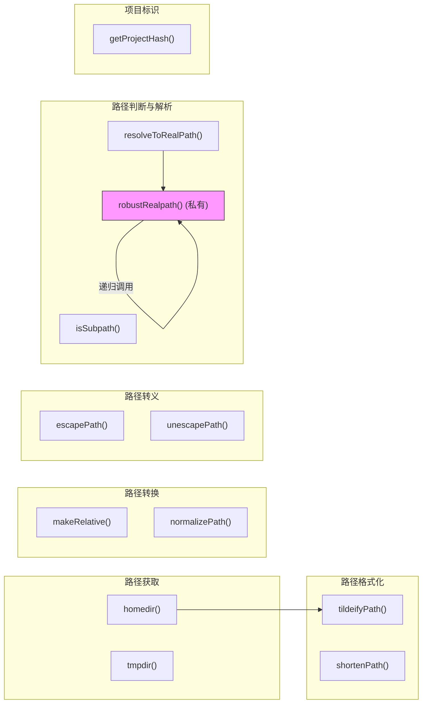

# paths.ts

## 概述

`paths.ts` 是一个路径工具集模块，提供了一系列与文件路径操作相关的实用函数。该模块是整个项目中最基础的路径处理层，被其他模块广泛依赖。

主要功能涵盖以下几大类别：

- **路径获取**：获取 home 目录、临时目录。
- **路径格式化与显示**：波浪线路径化（tildeify）、路径缩短（shortenPath）。
- **路径转换**：绝对路径到相对路径的转换、路径标准化。
- **路径转义与反转义**：用于 at-commands 的路径转义处理，区分 Windows 和 POSIX 系统。
- **路径比较与判断**：子路径判断、路径标准化用于跨平台比较。
- **路径解析**：将 `file://` URL 或编码路径解析为真实文件系统路径。
- **项目标识**：基于项目根路径生成 SHA256 哈希值。

## 架构图（Mermaid）



## 核心组件

### 常量

#### `GEMINI_DIR`
```typescript
export const GEMINI_DIR = '.gemini';
```
Gemini CLI 的配置目录名称，用于存储项目级别的配置文件。

#### `GOOGLE_ACCOUNTS_FILENAME`
```typescript
export const GOOGLE_ACCOUNTS_FILENAME = 'google_accounts.json';
```
Google 账户信息的文件名，用于存储认证相关的账户数据。

### 导出函数

---

#### `homedir(): string`

返回用户的 home 目录路径。

**行为：**
- 优先检查环境变量 `GEMINI_CLI_HOME`，若已设置则返回其值。
- 否则回退到 `os.homedir()` 返回系统默认 home 目录。

**用途：** 允许用户通过环境变量自定义 Gemini CLI 的 home 目录位置，便于测试和非标准部署场景。

---

#### `tmpdir(): string`

返回操作系统默认的临时文件目录路径。

**实现：** 直接调用 `os.tmpdir()`。

---

#### `tildeifyPath(path: string): string`

将路径中的 home 目录部分替换为波浪线 `~`，用于简化显示。

**参数：**

| 参数 | 类型 | 说明 |
|------|------|------|
| `path` | `string` | 待处理的路径 |

**示例：** `/Users/john/projects/foo` -> `~/projects/foo`

**逻辑：** 如果路径以 `homedir()` 开头，则替换为 `~`；否则原样返回。

---

#### `shortenPath(filePath: string, maxLen: number = 35): string`

将超长路径缩短为指定最大长度，优先保留路径的首尾部分。

**参数：**

| 参数 | 类型 | 默认值 | 说明 |
|------|------|--------|------|
| `filePath` | `string` | - | 待缩短的文件路径 |
| `maxLen` | `number` | `35` | 最大允许长度 |

**示例：** `/path/to/a/very/long/file.txt` -> `/path/.../long/file.txt`

**缩短策略（详细）：**

1. **快速返回**：路径长度未超过 `maxLen` 时直接返回。
2. **路径解析**：使用 `path.parse()` 提取根目录（root），然后按路径分隔符拆分为各段（segments）。
3. **段数不足时回退**：路径段数 <= 1 时使用简单首尾截断（`simpleTruncate`）。
4. **贪心尾部保留**：从路径的倒数第二段开始向前遍历，尽量多地保留末尾的段（采用 `startComponent/.../{endSegments}` 的结构），直到超过 `maxLen` 为止。
5. **预算分配**：计算各组件的可用字符预算（`availableForComponents`），通过 `pickIndexToReduce()` 评分函数选择要缩减的组件（优先缩减非末尾组件）。
6. **组件截断**：根据各组件的位置选择不同的截断模式（`start`/`end`/`center`），使用 `truncateComponent()` 执行截断。
7. **多重回退**：当预算不足时调用 `trailingFallback()`，尝试多种降级格式：
   - `.../{lastSegment}`
   - `{root}.../{lastSegment}`
   - `{root}{lastSegment}`
   - `{lastSegment}`
   - 最终回退到 `simpleTruncate()`

**内部辅助函数：**

- `simpleTruncate()`：简单的首尾截断，保留前半和后半，中间用 `...` 连接。
- `truncateComponent(component, targetLength, mode)`：按指定模式（`start`/`end`/`center`）截断单个组件。
- `trailingFallback()`：多级回退策略，尽可能保留最后一个路径段（文件名）。
- `pickIndexToReduce()`：评分函数，选择最适合缩减的组件索引（非末尾组件优先）。

---

#### `makeRelative(targetPath: string, rootDirectory: string): string`

计算从 `rootDirectory` 到 `targetPath` 的相对路径。

**参数：**

| 参数 | 类型 | 说明 |
|------|------|------|
| `targetPath` | `string` | 目标路径（绝对或相对） |
| `rootDirectory` | `string` | 根目录（绝对路径） |

**行为：**
- 若 `targetPath` 是相对路径，原样返回。
- 若两个路径相同，返回 `'.'`（而非 `path.relative()` 默认返回的空字符串）。
- 否则返回 `path.relative(rootDirectory, targetPath)` 的结果。

---

#### `escapePath(filePath: string): string`

为 at-commands 转义路径中的特殊字符。

**跨平台行为：**
- **Windows**：如果路径包含空格、`&`、`()`、`[]`、`{}`、`^` 等特殊字符，用双引号包裹整个路径。
- **POSIX**（Linux/macOS）：使用反斜杠 `\` 转义路径中的特殊字符（空格、制表符、括号、引号、通配符等）。

---

#### `unescapePath(filePath: string): string`

`escapePath()` 的逆操作，还原被转义的路径。

**跨平台行为：**
- **Windows**：去除路径两端的双引号。
- **POSIX**：去除反斜杠转义符。

---

#### `getProjectHash(projectRoot: string): string`

根据项目根路径生成唯一的 SHA256 哈希值。

**参数：**

| 参数 | 类型 | 说明 |
|------|------|------|
| `projectRoot` | `string` | 项目根目录的绝对路径 |

**返回值：** 64 字符的十六进制 SHA256 哈希字符串。

**用途：** 为每个项目生成唯一标识符，可用于缓存键、会话目录名等场景。

---

#### `normalizePath(p: string): string`

将路径标准化以便进行跨平台可靠比较。

**处理步骤：**
1. 使用 `path.resolve()` 解析为绝对路径。
2. 将所有反斜杠 `\` 替换为正斜杠 `/`。
3. 在 Windows 上额外转为小写（因为 Windows 文件系统不区分大小写）。

---

#### `isSubpath(parentPath: string, childPath: string): boolean`

判断 `childPath` 是否是 `parentPath` 的子路径。

**参数：**

| 参数 | 类型 | 说明 |
|------|------|------|
| `parentPath` | `string` | 父路径 |
| `childPath` | `string` | 子路径 |

**判断逻辑：**
- 使用 `path.relative()` 计算相对路径。
- 如果相对路径不以 `../` 开头、不等于 `..`、且不是绝对路径，则认为是子路径。
- 在 Windows 上使用 `path.win32` 模块以正确处理大小写不敏感的路径。

---

#### `resolveToRealPath(pathStr: string): string`

将路径字符串解析为真实的文件系统路径。

**处理步骤：**
1. 如果路径以 `file://` 开头，使用 `fileURLToPath()` 转换为文件路径。
2. 使用 `decodeURIComponent()` 解码 URI 编码字符（如 `%20` -> 空格）。
3. 使用 `path.resolve()` 解析为绝对路径。
4. 调用 `robustRealpath()` 解析符号链接。

### 私有函数

#### `robustRealpath(p: string, visited?: Set<string>): string`

一个健壮的 `realpath` 实现，能处理符号链接和部分不存在的路径。

**设计特点：**
- **循环检测**：通过 `visited` 集合跟踪已访问的路径，检测到循环引用时抛出异常（`Infinite recursion detected`）。
- **符号链接处理**：当 `fs.realpathSync()` 因 `ENOENT` 或 `EISDIR` 失败时，检查路径是否为符号链接，如果是则手动解析链接目标并递归调用。
- **逐级向上回退**：如果路径不存在且不是符号链接，递归解析父目录，然后拼接当前路径的 `basename`。
- **终止条件**：当 `parent === p` 时（已到达文件系统根目录）停止递归。

## 依赖关系

### 内部依赖

无。本模块是纯工具模块，不依赖项目中的其他模块。

### 外部依赖

| 模块 | 导入内容 | 用途 |
|------|---------|------|
| `node:path` | `path` | 路径解析、拼接、相对路径计算等核心路径操作 |
| `node:os` | `os` | 获取 home 目录 (`homedir()`) 和临时目录 (`tmpdir()`) |
| `node:crypto` | `crypto` | SHA256 哈希计算（`getProjectHash`） |
| `node:fs` | `fs` | 同步文件系统操作：`realpathSync()`、`lstatSync()`、`readlinkSync()` |
| `node:url` | `fileURLToPath` | 将 `file://` 协议 URL 转换为文件路径 |

## 关键实现细节

1. **环境变量覆盖机制**：`homedir()` 支持通过 `GEMINI_CLI_HOME` 环境变量覆盖默认 home 目录。这为测试隔离和自定义部署提供了灵活性，避免硬编码系统路径。

2. **`shortenPath` 的复杂缩短算法**：这是本模块中最复杂的函数（约 200 行），实现了一个多策略的路径缩短算法：
   - 采用"保留首尾、省略中间"的原则。
   - 使用贪心算法从末尾向前尽量多保留路径段。
   - 通过评分函数 `pickIndexToReduce()` 智能选择需要缩减的组件（优先缩减非末尾组件，以保留文件名完整性）。
   - 提供多级回退策略确保在各种极端情况下都能产生有效输出。

3. **跨平台路径处理**：多个函数都针对 Windows 和 POSIX 系统做了差异化处理：
   - `escapePath`/`unescapePath`：Windows 使用双引号，POSIX 使用反斜杠转义。
   - `normalizePath`：Windows 上额外转为小写。
   - `isSubpath`：Windows 上使用 `path.win32` 模块。
   - `robustRealpath`：Windows 上路径比较不区分大小写。

4. **`robustRealpath` 的健壮性设计**：
   - 能够处理"部分存在"的路径（如路径中间某一级目录不存在或是断链的符号链接）。
   - 通过 `visited` 集合防止符号链接循环导致的无限递归。
   - 逐级向上解析父目录，确保即使中间路径不存在也能返回有意义的结果。
   - 只对预期的错误码 (`ENOENT`, `EISDIR`) 进行回退处理，其他错误（如权限问题）会正常抛出。

5. **可辨别联合类型的正则表达式**：`escapePath` 和 `unescapePath` 使用了精心设计的正则表达式来匹配需要转义的特殊字符，涵盖了 shell 中常见的所有特殊字符（空格、通配符、括号、引号、美元符号等）。

6. **`makeRelative` 的空字符串修正**：`path.relative()` 在两个路径相同时返回空字符串 `''`，本函数将其修正为 `'.'`，避免下游代码处理空字符串时出现问题。
