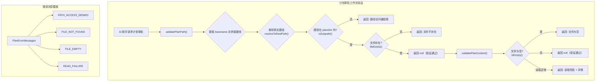

# planUtils.ts

## 概述

`planUtils.ts` 是计划（Plan）审批工作流的验证工具模块。在 Gemini CLI 中，"计划（Plan）"是 AI 助手在执行复杂操作前需要创建并经用户审批的文件。本模块提供了计划文件路径安全验证和内容有效性验证的功能，确保计划工作流中的文件操作安全可靠。

主要职责：
- **路径安全验证**：防止路径遍历攻击（path traversal），确保计划文件路径在指定的 `plansDir` 目录内。
- **文件存在性验证**：确认计划文件确实已被创建。
- **内容非空验证**：确保计划文件包含实际内容，不允许提交空的计划文件。
- **标准化错误消息**：提供统一的错误消息模板，供后端工具和 CLI UI 共同使用，保持一致性。

## 架构图（Mermaid）



## 核心组件

### 常量

#### `PlanErrorMessages`

```typescript
export const PlanErrorMessages = {
  PATH_ACCESS_DENIED: (planPath: string, plansDir: string) => string,
  FILE_NOT_FOUND: (path: string) => string,
  FILE_EMPTY: string,
  READ_FAILURE: (detail: string) => string,
} as const;
```

标准化的错误消息模板集合，使用 `as const` 断言确保类型不可变。

| 消息键 | 类型 | 说明 |
|--------|------|------|
| `PATH_ACCESS_DENIED` | 函数 | 计划文件路径不在指定目录内时的拒绝消息，包含实际路径和允许目录 |
| `FILE_NOT_FOUND` | 函数 | 计划文件不存在时的错误消息，提示用户必须先创建文件 |
| `FILE_EMPTY` | 字符串 | 计划文件为空时的错误消息，提示用户必须写入内容 |
| `READ_FAILURE` | 函数 | 读取计划文件失败时的错误消息，附带错误详情 |

**设计意图：** 将错误消息集中管理，便于后端工具和 CLI UI 层共享同一套消息，避免消息不一致的问题。

### 导出函数

---

#### `validatePlanPath(planPath: string, plansDir: string): Promise<string | null>`

验证计划文件路径的安全性和文件存在性。

**参数：**

| 参数 | 类型 | 说明 |
|------|------|------|
| `planPath` | `string` | 不受信任的计划文件路径（可能包含路径遍历攻击） |
| `plansDir` | `string` | 授权的计划目录路径（安全边界） |

**返回值：** `Promise<string | null>`
- 验证成功返回 `null`。
- 验证失败返回错误消息字符串。

**详细验证流程：**

1. **安全 basename 提取**：使用 `path.basename(planPath)` 提取文件名部分，忽略任何目录层级信息。这是防止路径遍历的第一道防线——即使用户输入 `../../etc/passwd`，也只会提取 `passwd`。
2. **路径拼接**：将安全的 `basename` 与 `plansDir` 拼接为 `resolvedPath`。
3. **真实路径解析**：对 `resolvedPath` 和 `plansDir` 分别调用 `resolveToRealPath()` 解析符号链接，获取真实的文件系统路径。
4. **子路径检查**：使用 `isSubpath(realPlansDir, realPath)` 验证解析后的真实路径确实在计划目录之内。这是防止通过符号链接绕过安全检查的第二道防线。
5. **文件存在性检查**：使用 `fileExists(resolvedPath)` 验证文件确实存在。

---

#### `validatePlanContent(planPath: string): Promise<string | null>`

验证计划文件的内容是否非空。

**参数：**

| 参数 | 类型 | 说明 |
|------|------|------|
| `planPath` | `string` | 计划文件路径 |

**返回值：** `Promise<string | null>`
- 文件非空时返回 `null`（验证通过）。
- 文件为空时返回 `FILE_EMPTY` 错误消息。
- 读取失败时返回 `READ_FAILURE` 错误消息（附带错误详情）。

**行为：**
- 调用 `isEmpty(planPath)` 检查文件是否为空。
- 使用 try-catch 包裹，异常时返回可读的错误消息而非抛出异常。

## 依赖关系

### 内部依赖

| 模块 | 导入内容 | 用途 |
|------|---------|------|
| `./fileUtils.js` | `isEmpty` | 检查文件内容是否为空 |
| `./fileUtils.js` | `fileExists` | 检查文件是否存在 |
| `./paths.js` | `isSubpath` | 判断路径是否为指定目录的子路径 |
| `./paths.js` | `resolveToRealPath` | 解析符号链接，获取路径的真实文件系统位置 |

### 外部依赖

| 模块 | 导入内容 | 用途 |
|------|---------|------|
| `node:path` | `path` | 使用 `basename()` 提取文件名、`join()` 拼接路径 |

## 关键实现细节

1. **双重路径遍历防护**：
   - **第一层**（`path.basename`）：无论用户传入什么路径（如 `../../../secret.txt`），都只提取最后的文件名部分（`secret.txt`），然后将其与 `plansDir` 拼接。这确保了构造的路径始终以 `plansDir` 为前缀。
   - **第二层**（`resolveToRealPath` + `isSubpath`）：即使文件名本身是一个符号链接（指向计划目录外的文件），解析符号链接后再次验证真实路径是否在 `plansDir` 内，防止通过符号链接绕过安全检查。

2. **错误返回而非异常抛出**：两个验证函数的返回值设计为 `string | null`（null 表示成功，字符串表示错误消息），而非使用异常机制。这种设计使调用方可以更优雅地处理验证失败的情况，避免 try-catch 嵌套。

3. **`as const` 断言的错误消息**：`PlanErrorMessages` 使用 `as const` 断言，使得 TypeScript 能够推导出每个属性的字面量类型（而非宽泛的 `string` 或 `Function`），有利于类型安全和代码补全。

4. **关注点分离**：路径验证 (`validatePlanPath`) 和内容验证 (`validatePlanContent`) 被拆分为两个独立函数。这种设计允许调用方根据场景选择性地执行验证步骤，也使得每个函数的职责更加清晰。

5. **异常安全的内容读取**：`validatePlanContent` 使用 try-catch 捕获 `isEmpty()` 可能抛出的任何异常（如文件权限问题、磁盘 I/O 错误等），将其转化为友好的错误消息，确保验证流程不会因意外异常而崩溃。
