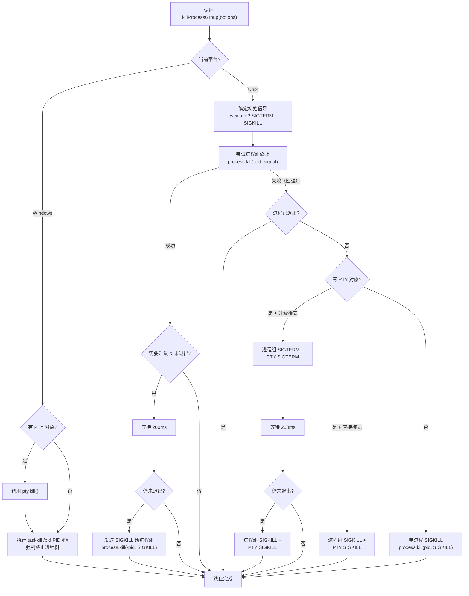

# process-utils.ts

## 概述

`process-utils.ts` 是一个跨平台的进程终止工具模块，提供了健壮的进程组（process group）终止功能。该模块在 Gemini CLI 中用于安全地终止子进程（如用户通过 shell 工具启动的命令），确保进程及其所有子进程都被正确清理，不留下孤儿进程。

主要特性：
- **跨平台支持**：针对 Windows 和 Unix (Linux/macOS) 系统分别实现了不同的终止策略。
- **进程组终止**：在 Unix 上使用 `-pid` 负号语法终止整个进程组，确保子进程也被一并清理。
- **信号升级机制**：支持从 `SIGTERM`（优雅终止）升级到 `SIGKILL`（强制终止）的渐进式终止策略。
- **PTY 支持**：兼容伪终端（PTY）场景，使用 PTY 对象的内置 `kill` 方法。
- **容错设计**：所有终止操作都包裹在 try-catch 中，确保即使部分操作失败也不会中断整体终止流程。

## 架构图（Mermaid）



## 核心组件

### 常量

#### `SIGKILL_TIMEOUT_MS`

```typescript
export const SIGKILL_TIMEOUT_MS = 200;
```

在 Unix 系统上，从 `SIGTERM` 升级到 `SIGKILL` 之间的等待时间（毫秒）。这个 200ms 的窗口期允许进程在接收到 `SIGTERM` 后有一小段时间进行优雅关闭（保存状态、关闭文件句柄等），如果超时仍未退出则强制终止。

### 接口

#### `KillOptions`

```typescript
export interface KillOptions {
  pid: number;
  escalate?: boolean;
  signal?: NodeJS.Signals | number;
  isExited?: () => boolean;
  pty?: { kill: (signal?: string) => void };
}
```

进程终止的配置选项。

| 属性 | 类型 | 必填 | 默认值 | 说明 |
|------|------|------|--------|------|
| `pid` | `number` | 是 | - | 要终止的进程 ID |
| `escalate` | `boolean` | 否 | `false` | 是否在 Unix 上尝试先 SIGTERM 再 SIGKILL 的渐进式终止 |
| `signal` | `NodeJS.Signals \| number` | 否 | 由 `escalate` 决定 | 初始终止信号。若 `escalate=true` 默认为 `SIGTERM`，否则为 `SIGKILL` |
| `isExited` | `() => boolean` | 否 | `() => false` | 回调函数，用于检查进程是否已经退出。避免向已退出进程发送信号 |
| `pty` | `{ kill: (signal?: string) => void }` | 否 | - | PTY（伪终端）对象，提供 PTY 特定的终止方法 |

### 导出函数

#### `killProcessGroup(options: KillOptions): Promise<void>`

健壮地终止一个进程或进程组，支持跨平台。

**参数：** `KillOptions` 对象（见上方接口定义）。

**返回值：** `Promise<void>` —— 异步操作，终止完成后 resolve。

**平台差异化处理：**

##### Windows 终止策略

1. 如果有 PTY 对象，先调用 `pty.kill()` 尝试终止。
2. 无论 PTY 是否成功，都执行 `taskkill /pid <PID> /f /t`：
   - `/f`：强制终止（Force）。
   - `/t`：终止整个进程树（Tree），包括所有子进程。
3. 这种"双保险"策略确保进程树被彻底清理。

##### Unix 终止策略

Unix 策略分为**主路径**和**回退路径**两个层次：

**主路径（进程组终止成功时）：**

1. 确定初始信号：`escalate=true` 时默认 `SIGTERM`，否则默认 `SIGKILL`。
2. 使用 `process.kill(-pid, signal)` 发送信号给**整个进程组**（负号 PID 表示进程组）。
3. 如果启用了 `escalate` 且进程未退出：
   - 等待 `SIGKILL_TIMEOUT_MS`（200ms）。
   - 如果仍未退出，发送 `SIGKILL` 给进程组。

**回退路径（进程组终止失败时）：**

当进程组终止抛出异常（例如进程不是组长导致 `-pid` 无效）时，进入回退逻辑：

- **有 PTY + 升级模式**：
  1. 尝试进程组 `SIGTERM` + PTY `SIGTERM`。
  2. 等待 200ms。
  3. 如果仍未退出，进程组 `SIGKILL` + PTY `SIGKILL`。

- **有 PTY + 直接模式**：
  1. 进程组 `SIGKILL` + PTY `SIGKILL`。

- **无 PTY**：
  1. 直接对单个进程发送 `SIGKILL`（使用正数 `pid`，不再尝试进程组）。

## 依赖关系

### 内部依赖

| 模块 | 导入内容 | 用途 |
|------|---------|------|
| `./shell-utils.js` | `spawnAsync` | 在 Windows 上异步执行 `taskkill` 命令 |

### 外部依赖

| 模块 | 导入内容 | 用途 |
|------|---------|------|
| `node:os` | `os` | 使用 `os.platform()` 检测操作系统平台 |

同时使用 Node.js 内置全局对象：
- `process.kill()` —— 向指定 PID 或进程组发送信号。

## 关键实现细节

1. **进程组终止（`-pid` 负号语法）**：Unix 系统中，`process.kill(-pid, signal)` 会将信号发送给以 `pid` 为组长的整个进程组中的所有进程。这对于清理子进程启动的后续子孙进程至关重要。例如，一个 shell 命令 `npm run build` 可能会启动多个子进程，进程组终止确保它们全部被清理。

2. **SIGTERM 到 SIGKILL 的升级机制**：`SIGTERM` 是一个可被捕获的信号，允许进程进行优雅关闭（清理临时文件、关闭数据库连接等）。如果进程在 200ms 内未响应 `SIGTERM`，则发送不可被捕获的 `SIGKILL` 强制终止。200ms 的超时时间在"给予进程足够清理时间"和"快速响应用户取消操作"之间取得了平衡。

3. **Windows 的 `taskkill` 方案**：Windows 没有 Unix 风格的进程信号机制，因此使用系统命令 `taskkill` 配合 `/f`（强制）和 `/t`（进程树）标志来终止进程。这是在 Windows 上终止进程树的标准做法。

4. **PTY 的特殊处理**：伪终端（PTY）场景下，进程可能不直接受 `process.kill()` 控制。回退路径中会同时调用 `process.kill(-pid, signal)` 和 `pty.kill(signal)`，采用"双管齐下"的策略确保终止成功。在升级模式中，先尝试通过进程组杀死子进程，再通过 PTY 杀死会话领导者（session leader）。

5. **全面的容错设计**：模块中几乎每个 `process.kill()` 和 `pty.kill()` 调用都被 try-catch 包裹，错误被静默忽略。这是因为：
   - 进程可能在信号发送前就已退出（竞态条件）。
   - 进程组可能不存在（进程不是组长）。
   - PTY 可能已经被销毁。
   在终止进程的场景中，这些错误都是预期内的，不应中断终止流程。

6. **`isExited` 回调的巧妙使用**：通过 `isExited` 回调函数，调用方可以在终止流程的各个检查点上报告进程是否已退出。这避免了向已退出进程发送不必要的信号，也避免了不必要的等待。默认实现 `() => false` 意味着如果调用方不提供此回调，终止流程会执行所有步骤。

7. **异步但非完全并行**：虽然函数返回 `Promise<void>`，但内部的终止步骤是按顺序执行的（先 SIGTERM -> 等待 -> 再 SIGKILL）。`spawnAsync` 在 Windows 上用于异步执行 `taskkill`，避免阻塞事件循环。
