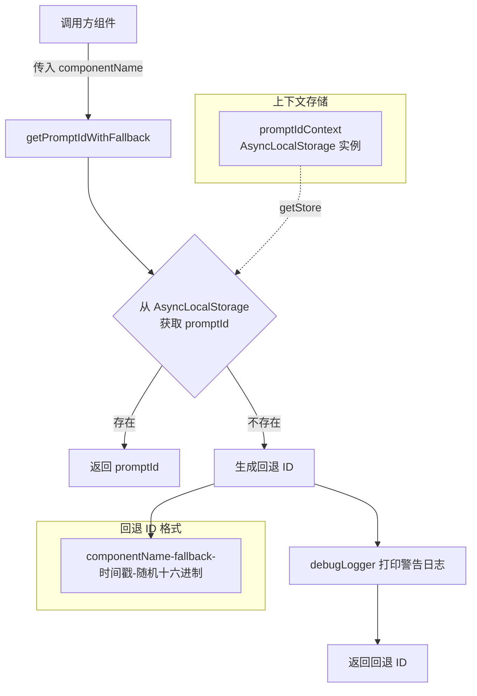

# promptIdContext.ts

## 概述

`promptIdContext.ts` 是 Gemini CLI 核心包中的一个工具模块，负责在异步调用链中管理和传播 **Prompt ID**（提示词标识符）。它基于 Node.js 的 `AsyncLocalStorage` 机制，为每一次用户提示（prompt）请求提供一个唯一的上下文标识，确保在整个异步调用链路中都能追踪到该请求的来源。当上下文中无法获取到 Prompt ID 时，模块提供了安全的回退机制，自动生成一个带有组件名前缀的唯一标识符。

## 架构图（Mermaid）



## 核心组件

### 1. `promptIdContext` — 异步上下文存储实例

```typescript
export const promptIdContext = new AsyncLocalStorage<string>();
```

- **类型**: `AsyncLocalStorage<string>`
- **作用**: 作为全局导出的异步上下文存储实例，在整个应用的异步调用链中传播 Prompt ID。
- **使用方式**: 上游调用方通过 `promptIdContext.run(promptId, callback)` 将 Prompt ID 注入到异步上下文中，下游的任何异步操作都可以通过 `promptIdContext.getStore()` 获取到该值。
- **存储类型**: `string`，存储的是字符串类型的 Prompt ID。

### 2. `getPromptIdWithFallback(componentName: string): string` — 安全获取 Prompt ID

```typescript
export function getPromptIdWithFallback(componentName: string): string {
  const promptId = promptIdContext.getStore();
  if (promptId) {
    return promptId;
  }
  const fallbackId = `${componentName}-fallback-${Date.now()}-${Math.random().toString(16).slice(2)}`;
  debugLogger.warn(
    `Could not find promptId in context for ${componentName}. This is unexpected. Using a fallback ID: ${fallbackId}`,
  );
  return fallbackId;
}
```

- **参数**: `componentName` — 请求 Prompt ID 的组件名称，用于生成回退 ID 的前缀，方便日志排查。
- **返回值**: 从上下文获取到的 Prompt ID，或者自动生成的回退 ID。
- **回退 ID 格式**: `{componentName}-fallback-{Date.now()}-{随机十六进制字符串}`
  - `Date.now()` 提供时间戳，保证时间维度的唯一性。
  - `Math.random().toString(16).slice(2)` 提供随机十六进制后缀，避免同一毫秒内的碰撞。
- **日志行为**: 当触发回退机制时，通过 `debugLogger.warn` 输出警告日志，表明这是一种非预期行为，便于开发者排查上下文丢失的问题。

## 依赖关系

### 内部依赖

| 依赖模块 | 导入方式 | 用途 |
|---------|---------|------|
| `./debugLogger.js` | `import { debugLogger } from './debugLogger.js'` | 在回退场景中输出警告日志，帮助开发者定位 Prompt ID 上下文丢失的问题 |

### 外部依赖

| 依赖模块 | 导入方式 | 用途 |
|---------|---------|------|
| `node:async_hooks` | `import { AsyncLocalStorage } from 'node:async_hooks'` | Node.js 内置模块，提供 `AsyncLocalStorage` 类，用于在异步调用链中传播上下文数据 |

## 关键实现细节

### 1. AsyncLocalStorage 的选择

模块使用 Node.js 内置的 `AsyncLocalStorage`（来自 `node:async_hooks`）作为上下文传播机制。这是 Node.js 官方推荐的异步上下文传播方案，具有以下优势：

- **零侵入性**: 不需要显式地在每个函数参数中传递 Prompt ID，减少了代码耦合。
- **自动传播**: 在 `run()` 内部启动的所有异步操作（Promise、setTimeout、I/O 回调等）都能自动继承上下文。
- **隔离性**: 不同的 `run()` 调用之间的上下文互不干扰，天然支持并发场景。

### 2. 回退机制的设计哲学

`getPromptIdWithFallback` 的设计遵循了 **"永不崩溃"** 原则：

- 即使上下文丢失（例如在异步边界未正确传播），函数也不会抛出异常。
- 而是生成一个格式化的回退 ID，确保下游逻辑依然可以正常运行。
- 通过 `debugLogger.warn` 记录警告，使得这种非预期行为可以被监控和排查，而不是静默失败。

### 3. 回退 ID 的唯一性保证

回退 ID 通过两个维度保证唯一性：

- **时间戳** (`Date.now()`): 毫秒级精度，不同时间生成的 ID 必然不同。
- **随机数** (`Math.random().toString(16).slice(2)`): 在同一毫秒内提供额外的随机性，`toString(16)` 将随机数转换为十六进制字符串，`slice(2)` 去除 `0.` 前缀。

### 4. 典型使用模式

```typescript
// 上游：注入 Prompt ID 到上下文
import { promptIdContext } from './promptIdContext.js';

promptIdContext.run('unique-prompt-id-123', async () => {
  // 在这个回调中的所有异步操作都能获取到 'unique-prompt-id-123'
  await someAsyncOperation();
});

// 下游：获取 Prompt ID
import { getPromptIdWithFallback } from './promptIdContext.js';

function processRequest() {
  const promptId = getPromptIdWithFallback('MyComponent');
  // 使用 promptId 进行日志记录、追踪等
}
```

### 5. 模块职责边界

该模块只负责 **存储和获取** Prompt ID，不负责：

- Prompt ID 的生成（由上游调用方负责）
- Prompt ID 的格式校验
- 上下文的生命周期管理（由 `AsyncLocalStorage.run()` 的回调范围自动管理）
