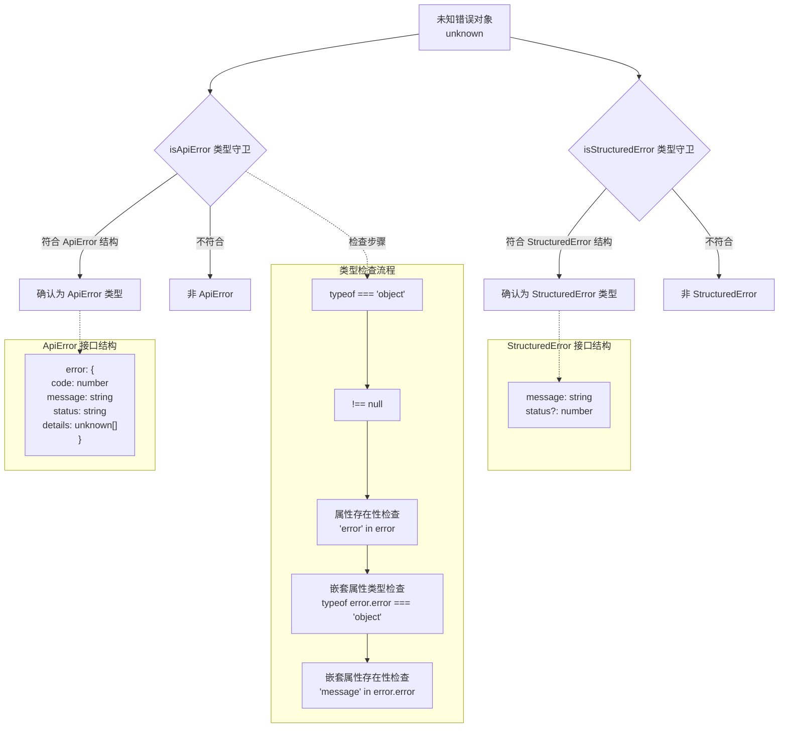

# quotaErrorDetection.ts

## 概述

`quotaErrorDetection.ts` 是 Gemini CLI 核心包中的错误类型检测工具模块。尽管文件名暗示其与"配额错误"有关，但该模块实际提供的是 **通用的 API 错误和结构化错误的类型守卫（Type Guard）函数**。它定义了 `ApiError` 接口，并导出两个类型守卫函数 `isApiError` 和 `isStructuredError`，用于在运行时安全地判断一个未知错误对象是否符合特定的错误结构。这些函数在错误处理链路中扮演关键角色，帮助上层代码根据不同的错误类型执行不同的处理策略（如配额超限提示、重试逻辑等）。

## 架构图（Mermaid）



## 核心组件

### 1. `ApiError` 接口 — API 错误结构定义

```typescript
export interface ApiError {
  error: {
    code: number;
    message: string;
    status: string;
    details: unknown[];
  };
}
```

- **用途**: 定义了 Google API 标准错误响应的 TypeScript 类型结构。
- **字段说明**:
  - `error.code` (`number`): HTTP 状态码，如 `429`（配额超限）、`500`（服务器内部错误）等。
  - `error.message` (`string`): 人类可读的错误描述信息。
  - `error.status` (`string`): 错误状态字符串，如 `"RESOURCE_EXHAUSTED"`、`"INTERNAL"` 等。
  - `error.details` (`unknown[]`): 附加的错误详情数组，内容结构不固定，因此类型为 `unknown[]`。
- **典型实例**: 当调用 Gemini API 返回 HTTP 错误时，响应体通常符合此结构。

### 2. `isApiError(error: unknown): error is ApiError` — API 错误类型守卫

```typescript
export function isApiError(error: unknown): error is ApiError {
  return (
    typeof error === 'object' &&
    error !== null &&
    'error' in error &&
    typeof (error as ApiError).error === 'object' &&
    'message' in (error as ApiError).error
  );
}
```

- **参数**: `error` (`unknown`) — 任意类型的错误对象。
- **返回值**: `boolean` — 如果返回 `true`，TypeScript 编译器会将 `error` 的类型缩窄为 `ApiError`。
- **检查步骤**:
  1. `typeof error === 'object'` — 确认是对象类型。
  2. `error !== null` — 排除 `null`（因为 `typeof null === 'object'`）。
  3. `'error' in error` — 确认存在顶层 `error` 属性。
  4. `typeof (error as ApiError).error === 'object'` — 确认 `error.error` 也是一个对象。
  5. `'message' in (error as ApiError).error` — 确认嵌套对象中存在 `message` 属性。
- **注意**: 该函数仅检查结构的"形状"，不验证每个字段的具体类型（如不检查 `code` 是否为 `number`）。这是一种宽松的鸭子类型检查策略。

### 3. `isStructuredError(error: unknown): error is StructuredError` — 结构化错误类型守卫

```typescript
export function isStructuredError(error: unknown): error is StructuredError {
  return (
    typeof error === 'object' &&
    error !== null &&
    'message' in error &&
    typeof (error as StructuredError).message === 'string'
  );
}
```

- **参数**: `error` (`unknown`) — 任意类型的错误对象。
- **返回值**: `boolean` — 如果返回 `true`，TypeScript 编译器会将 `error` 的类型缩窄为 `StructuredError`。
- **`StructuredError` 接口定义**（来自 `../core/turn.ts`）:
  ```typescript
  export interface StructuredError {
    message: string;
    status?: number;
  }
  ```
- **检查步骤**:
  1. `typeof error === 'object'` — 确认是对象类型。
  2. `error !== null` — 排除 `null`。
  3. `'message' in error` — 确认存在 `message` 属性。
  4. `typeof (error as StructuredError).message === 'string'` — 确认 `message` 属性为字符串类型。
- **与 `isApiError` 的区别**: `StructuredError` 是一个扁平结构（顶层即有 `message`），而 `ApiError` 是嵌套结构（`error.error.message`）。

## 依赖关系

### 内部依赖

| 依赖模块 | 导入方式 | 用途 |
|---------|---------|------|
| `../core/turn.js` | `import type { StructuredError } from '../core/turn.js'` | 导入 `StructuredError` 接口类型，用于 `isStructuredError` 类型守卫的返回类型标注 |

### 外部依赖

无外部依赖。该模块是纯 TypeScript 实现，不依赖任何 Node.js 内置模块或第三方库。

## 关键实现细节

### 1. 类型守卫（Type Guard）模式

两个函数都使用了 TypeScript 的 **类型谓词（Type Predicate）** 语法 `error is SomeType`。这使得在条件分支中，TypeScript 编译器能自动缩窄变量的类型：

```typescript
if (isApiError(unknownError)) {
  // 此处 unknownError 被自动推断为 ApiError 类型
  console.log(unknownError.error.code);    // 安全访问
  console.log(unknownError.error.message); // 安全访问
}
```

### 2. 防御性类型检查策略

两个函数都遵循从宽到窄的逐步检查策略：

1. 先检查最基本的类型约束（`typeof === 'object'`）
2. 排除 `null` 边界情况
3. 使用 `in` 操作符检查属性存在性
4. 对关键属性进行更精确的类型检查

这种逐步缩窄的方式确保了每一步的类型断言（`as`）都是安全的，不会在运行时抛出异常。

### 3. eslint 注释抑制

代码中多处使用了 `// eslint-disable-next-line @typescript-eslint/no-unsafe-type-assertion` 来抑制 TypeScript ESLint 的不安全类型断言警告。这是因为在类型守卫函数的实现中，必须使用 `as` 断言来访问尚未被证明存在的属性——但在断言之前已经通过 `in` 操作符验证了属性的存在性，所以这些断言在逻辑上是安全的。

### 4. 文件名与实际功能的差异

文件名为 `quotaErrorDetection`（配额错误检测），但实际导出的是通用的错误类型守卫函数，并不包含任何配额相关的特定逻辑（如检查 HTTP 429 状态码或 `RESOURCE_EXHAUSTED` 状态）。这暗示该模块可能最初是为配额错误检测场景而创建的，后来被泛化为通用的错误类型检测工具，但文件名未同步更新。上层调用方可能会结合这些类型守卫与具体的错误码判断来实现真正的配额错误检测逻辑。

### 5. 鸭子类型（Duck Typing）哲学

两个类型守卫都采用了鸭子类型的检查方式——只检查对象是否具有预期的"形状"（属性名和关键类型），而不检查对象是否真的是某个特定类的实例。这种方式更加灵活，能够处理来自不同来源（如 API 响应、序列化/反序列化后的对象）的错误数据。
