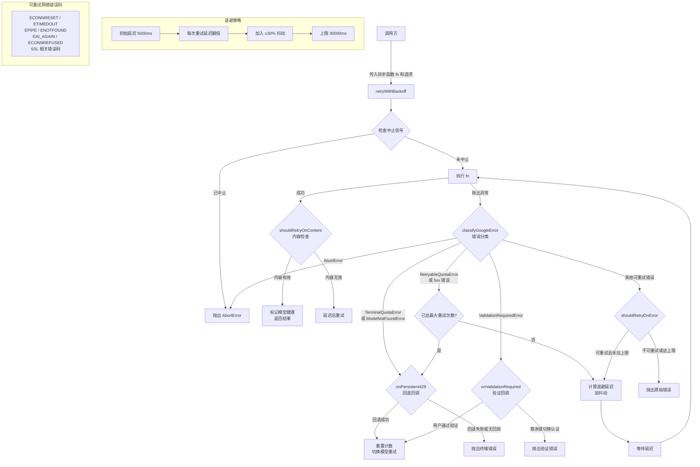

# retry.ts

## 概述

`retry.ts` 是 Gemini CLI 核心包中的 **重试机制模块**，提供了一个功能完备的指数退避重试框架。该模块是 API 调用可靠性的核心保障，能够处理多种错误场景：网络瞬态错误、HTTP 429 配额超限、5xx 服务器错误、流式传输中断等。它不仅实现了标准的指数退避加抖动（Exponential Backoff with Jitter）策略，还集成了配额错误分类、模型降级回退、用户验证交互、可用性上下文追踪等高级功能。

## 架构图（Mermaid）



## 核心组件

### 1. `RetryOptions` 接口 — 重试配置

```typescript
export interface RetryOptions {
  maxAttempts: number;
  initialDelayMs: number;
  maxDelayMs: number;
  shouldRetryOnError: (error: Error, retryFetchErrors?: boolean) => boolean;
  shouldRetryOnContent?: (content: GenerateContentResponse) => boolean;
  onPersistent429?: (authType?: string, error?: unknown) => Promise<string | boolean | null>;
  onValidationRequired?: (error: ValidationRequiredError) => Promise<'verify' | 'change_auth' | 'cancel'>;
  authType?: string;
  retryFetchErrors?: boolean;
  signal?: AbortSignal;
  getAvailabilityContext?: () => RetryAvailabilityContext | undefined;
  onRetry?: (attempt: number, error: unknown, delayMs: number) => void;
}
```

| 字段 | 类型 | 默认值 | 说明 |
|------|------|--------|------|
| `maxAttempts` | `number` | `10` | 最大重试次数 |
| `initialDelayMs` | `number` | `5000` | 初始退避延迟（毫秒） |
| `maxDelayMs` | `number` | `30000` | 最大退避延迟上限（毫秒） |
| `shouldRetryOnError` | 函数 | `isRetryableError` | 判断错误是否可重试的谓词函数 |
| `shouldRetryOnContent` | 函数 | `undefined` | 判断成功返回的内容是否需要重试的谓词函数 |
| `onPersistent429` | 函数 | `undefined` | 持续 429 错误时的回退回调，可返回备选模型名 |
| `onValidationRequired` | 函数 | `undefined` | 需要用户验证时的交互回调 |
| `authType` | `string` | `undefined` | 当前认证类型，传递给 `onPersistent429` |
| `retryFetchErrors` | `boolean` | `undefined` | 是否对 fetch 类错误进行重试 |
| `signal` | `AbortSignal` | `undefined` | 用于中止重试循环的信号 |
| `getAvailabilityContext` | 函数 | `undefined` | 获取可用性上下文，用于标记模型健康状态 |
| `onRetry` | 函数 | `undefined` | 每次重试前的回调，可用于遥测/日志 |

### 2. `retryWithBackoff<T>(fn, options)` — 核心重试函数

```typescript
export async function retryWithBackoff<T>(
  fn: () => Promise<T>,
  options?: Partial<RetryOptions>,
): Promise<T>
```

这是模块的核心导出函数，接受一个异步函数和可选的重试配置，返回异步函数的执行结果。其内部逻辑按以下优先级处理不同错误类型：

1. **AbortError**: 立即抛出，不重试。
2. **TerminalQuotaError / ModelNotFoundError**: 尝试模型降级回退（`onPersistent429`），回退失败则抛出。
3. **ValidationRequiredError**: 调用 `onValidationRequired` 交互回调，用户验证后重试或抛出。
4. **RetryableQuotaError / 5xx 错误**: 使用服务端建议的延迟（`retryDelayMs`）或标准指数退避进行重试。
5. **其他可重试错误**: 通过 `shouldRetryOnError` 判断，使用标准指数退避重试。
6. **不可重试错误**: 直接抛出原始错误。

### 3. `isRetryableError(error, retryFetchErrors?)` — 默认可重试判断

```typescript
export function isRetryableError(
  error: Error | unknown,
  retryFetchErrors?: boolean,
): boolean
```

默认的错误可重试性判断函数，检查以下条件：

- **网络错误码**: `ECONNRESET`、`ETIMEDOUT`、`EPIPE`、`ENOTFOUND`、`EAI_AGAIN`、`ECONNREFUSED` 以及多种 SSL/TLS 错误码。
- **Fetch 错误**（仅在 `retryFetchErrors` 为 `true` 时）: 错误消息包含 `"fetch failed"` 或 `"incomplete json segment"`。
- **ApiError 实例**: HTTP 429（配额超限）、499（客户端关闭请求）、5xx（服务器错误）可重试；400（错误请求）明确不可重试。
- **其他带状态码的错误**: 429、499、5xx 可重试。

### 4. `getRetryErrorType(error)` — 错误分类标识

```typescript
export function getRetryErrorType(error: unknown): string
```

将错误分类为安全的（无 PII）字符串标识，用于遥测和监控：

| 返回值 | 触发条件 |
|--------|---------|
| `'INVALID_CONTENT'` | 错误值为字符串 `"Invalid content"` |
| 网络错误码（如 `'ECONNRESET'`） | 错误具有可重试的网络错误码 |
| `'FETCH_FAILED'` | 错误消息包含 `"fetch failed"` |
| `'INCOMPLETE_JSON'` | 错误消息包含 `"incomplete json segment"` |
| `'QUOTA_EXCEEDED'` | HTTP 状态码 429 |
| `'SERVER_ERROR'` | HTTP 状态码 5xx |
| `'HTTP_{status}'` | 其他 HTTP 状态码 |
| 错误名称（`error.name`） | 标准 `Error` 实例的 `name` 属性 |
| `'UNKNOWN'` | 以上均不匹配 |

### 5. `getNetworkErrorCode(error)` — 网络错误码提取（内部函数）

```typescript
function getNetworkErrorCode(error: unknown): string | undefined
```

从错误对象中提取网络错误码（如 `ECONNRESET`）。该函数不仅检查错误对象自身的 `code` 属性，还会递归遍历 `cause` 链（最大深度 5），因为 SSL/TLS 错误通常嵌套在多层 `cause` 中。

### 6. `logRetryAttempt(attempt, error, errorStatus?)` — 重试日志记录（内部函数）

```typescript
function logRetryAttempt(
  attempt: number,
  error: unknown,
  errorStatus?: number,
): void
```

根据错误类型生成针对性的警告日志。区分 429 错误、5xx 错误和其他错误，生成不同的日志消息。

## 依赖关系

### 内部依赖

| 依赖模块 | 导入内容 | 用途 |
|---------|---------|------|
| `./googleQuotaErrors.js` | `TerminalQuotaError`, `RetryableQuotaError`, `ValidationRequiredError`, `classifyGoogleError` | 对 Google API 错误进行分类，区分终端错误、可重试配额错误和验证错误 |
| `./delay.js` | `delay`, `createAbortError` | 提供可中止的延迟函数和中止错误创建 |
| `./debugLogger.js` | `debugLogger` | 输出重试相关的调试/警告日志 |
| `./httpErrors.js` | `getErrorStatus`, `ModelNotFoundError` | 从错误对象提取 HTTP 状态码；模型不存在错误类型 |
| `../availability/modelPolicy.js` | `RetryAvailabilityContext` (类型) | 可用性上下文类型，用于标记模型健康状态 |

### 外部依赖

| 依赖模块 | 导入内容 | 用途 |
|---------|---------|------|
| `@google/genai` | `ApiError`, `GenerateContentResponse` (类型) | Google AI SDK 的 API 错误类和内容生成响应类型 |

## 关键实现细节

### 1. 指数退避加抖动（Exponential Backoff with Jitter）

重试延迟的计算公式为：

```
实际延迟 = max(0, 当前延迟 + 当前延迟 * 0.3 * (random() * 2 - 1))
下次延迟 = min(最大延迟, 当前延迟 * 2)
```

- **退避基数**: 每次重试后延迟翻倍（`currentDelay * 2`）。
- **抖动范围**: 在当前延迟基础上 **±30%** 随机浮动（`Math.random() * 2 - 1` 生成 -1 到 1 之间的随机数）。
- **延迟上限**: 由 `maxDelayMs`（默认 30 秒）限制，防止延迟无限增长。
- **下限保护**: `Math.max(0, ...)` 确保延迟永不为负。

对于配额错误（`RetryableQuotaError`），存在特殊的延迟策略：
- 使用服务端返回的 `retryDelayMs` 作为最小延迟：`Math.max(currentDelay, retryDelayMs)`
- 抖动改为 **仅向上 +20%**（`currentDelay * 0.2 * Math.random()`），尊重服务端的最小等待要求。

### 2. 多层错误处理优先级

错误处理按严格的优先级分层：

1. **AbortError**: 最高优先级，立即中断整个重试循环。
2. **终端错误**（`TerminalQuotaError` / `ModelNotFoundError`）: 不可通过简单重试解决，尝试模型降级。
3. **验证错误**（`ValidationRequiredError`）: 需要用户交互才能继续。
4. **可重试配额错误 / 5xx**: 标准重试流程，达到上限后尝试模型降级。
5. **其他可重试错误**: 由 `shouldRetryOnError` 判断，标准退避重试。
6. **不可重试错误**: 直接抛出。

### 3. 模型降级回退机制

当遇到持续的 429 错误或模型不存在时，通过 `onPersistent429` 回调实现模型降级：

- 回调返回新模型名（truthy 值）时，**重置重试计数器**（`attempt = 0`）和延迟（`currentDelay = initialDelayMs`），以全新状态对新模型进行重试。
- 回调返回 falsy 值或抛出异常时，抛出原始错误。
- 这一机制使得在 Pro 模型配额耗尽时，能自动降级到 Flash 模型。

### 4. 内容级重试（Content-Based Retry）

除了错误重试，模块还支持对"成功但内容无效"的响应进行重试：

```typescript
if (shouldRetryOnContent && shouldRetryOnContent(result as GenerateContentResponse)) {
  // 延迟后重试
}
```

这处理了 API 返回 200 但内容不完整或无效的边界情况。

### 5. 可用性标记

成功返回时，通过 `getAvailabilityContext` 获取可用性上下文，调用 `service.markHealthy(model)` 标记模型为健康状态：

```typescript
const successContext = getAvailabilityContext?.();
if (successContext) {
  successContext.service.markHealthy(successContext.policy.model);
}
```

### 6. 网络错误码的 cause 链遍历

`getNetworkErrorCode` 函数会遍历错误对象的 `cause` 链（最大深度 5）来查找网络错误码。这是因为 SSL/TLS 错误通常被包装在多层 `Error` 对象中，原始的错误码隐藏在 `cause` 链的深处。最大深度限制（5）防止了循环引用导致的无限循环。

### 7. `cleanOptions` 的 null/undefined 过滤

在合并选项时，代码先过滤掉值为 `null` 或 `undefined` 的条目：

```typescript
const cleanOptions = options
  ? Object.fromEntries(Object.entries(options).filter(([_, v]) => v != null))
  : {};
```

这确保了调用方传入 `{ maxAttempts: undefined }` 时不会覆盖默认值。

### 8. AbortSignal 集成

模块在两个层面检查中止信号：
1. **进入重试循环前**: `if (options?.signal?.aborted)` — 预检查。
2. **每次循环迭代开始时**: `if (signal?.aborted)` — 循环内检查。
3. **延迟等待期间**: 通过 `delay(delayWithJitter, signal)` 将信号传递给延迟函数，使等待期间也能响应中止。
