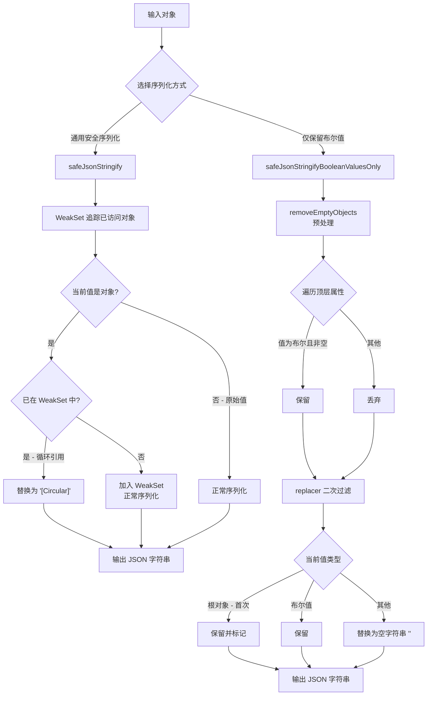

# safeJsonStringify.ts

## 概述

`safeJsonStringify.ts` 是 Gemini CLI 核心包中的 **安全 JSON 序列化工具模块**。它提供了两个序列化函数，解决了标准 `JSON.stringify` 的两大痛点：

1. **循环引用问题**: `safeJsonStringify` 使用 `WeakSet` 追踪已访问对象，将循环引用替换为 `"[Circular]"` 字符串，避免 `JSON.stringify` 抛出 `TypeError: Converting circular structure to JSON`。
2. **敏感信息过滤**: `safeJsonStringifyBooleanValuesOnly` 仅保留布尔值字段，过滤掉所有其他值（字符串、数字等），适用于将配置对象序列化为遥测数据时防止泄露敏感信息。

## 架构图（Mermaid）



## 核心组件

### 1. `safeJsonStringify(obj, space?)` — 安全 JSON 序列化

```typescript
export function safeJsonStringify(
  obj: unknown,
  space?: string | number,
): string {
  const seen = new WeakSet();
  return JSON.stringify(
    obj,
    (key, value) => {
      if (typeof value === 'object' && value !== null) {
        if (seen.has(value)) {
          return '[Circular]';
        }
        seen.add(value);
      }
      return value;
    },
    space,
  );
}
```

- **参数**:
  - `obj` (`unknown`): 待序列化的任意对象。
  - `space` (`string | number`, 可选): 格式化缩进参数，与 `JSON.stringify` 的第三个参数一致。
- **返回值**: `string` — 安全的 JSON 字符串，循环引用被替换为 `"[Circular]"`。
- **核心机制**: 使用 `WeakSet`（弱引用集合）追踪已访问的对象引用。当 `JSON.stringify` 的 `replacer` 回调遇到已访问过的对象时，返回 `"[Circular]"` 字符串替代，从而打破循环引用。
- **为何使用 `WeakSet` 而非 `Set`**: `WeakSet` 持有弱引用，不会阻止垃圾回收器回收被追踪的对象，避免在序列化大对象图时造成内存泄漏。

### 2. `removeEmptyObjects(data)` — 布尔值字段提取（内部函数）

```typescript
function removeEmptyObjects(data: any): object {
  const cleanedObject: { [key: string]: unknown } = {};
  for (const k in data) {
    const v = data[k];
    if (v !== null && v !== undefined && typeof v === 'boolean') {
      cleanedObject[k] = v;
    }
  }
  return cleanedObject;
}
```

- **参数**: `data` (`any`): 输入对象。
- **返回值**: `object` — 仅包含布尔值属性的新对象。
- **过滤逻辑**: 遍历输入对象的所有可枚举属性（包括原型链上的，因使用 `for...in`），仅保留值为非 `null`、非 `undefined` 且类型为 `boolean` 的属性。
- **注意**: 函数名 `removeEmptyObjects` 有一定误导性，实际功能是"仅保留布尔值字段"而非"移除空对象"。

### 3. `safeJsonStringifyBooleanValuesOnly(obj)` — 仅保留布尔值的序列化

```typescript
export function safeJsonStringifyBooleanValuesOnly(obj: any): string {
  let configSeen = false;
  return JSON.stringify(removeEmptyObjects(obj), (key, value) => {
    if ((value as Config) !== null && !configSeen) {
      configSeen = true;
      return value;
    }
    if (typeof value === 'boolean') {
      return value;
    }
    return '';
  });
}
```

- **参数**: `obj` (`any`): 待序列化的对象（通常是 `Config` 实例或类似结构）。
- **返回值**: `string` — JSON 字符串，仅包含布尔值字段，其他字段被替换为空字符串。
- **处理流程**:
  1. **第一步 — `removeEmptyObjects` 预处理**: 先从顶层过滤出仅含布尔值的字段。
  2. **第二步 — `replacer` 二次过滤**:
     - 根对象（第一次遇到的非 null 值）: 直接返回，设置 `configSeen = true` 标记。
     - 布尔值: 保留。
     - 其他值: 替换为空字符串 `''`。
- **使用场景**: 主要用于将 `Config` 对象序列化为遥测数据。通过只保留布尔类型的配置开关（如 `debugMode`、`toolSandboxing` 等），防止将字符串类型的敏感配置（如 API 密钥、模型名称等）发送到遥测系统。

## 依赖关系

### 内部依赖

| 依赖模块 | 导入方式 | 用途 |
|---------|---------|------|
| `../config/config.js` | `import type { Config } from '../config/config.js'` | 仅导入 `Config` 类型，用于 `safeJsonStringifyBooleanValuesOnly` 中的类型断言。运行时不使用。 |

### 外部依赖

无外部依赖。该模块仅使用 JavaScript 内置的 `JSON.stringify`、`WeakSet` 等标准 API。

## 关键实现细节

### 1. WeakSet 循环引用检测原理

`safeJsonStringify` 利用 `JSON.stringify` 的 `replacer` 回调机制，在序列化过程中对每个对象值进行拦截：

```
序列化开始
  → 遇到对象 A → 加入 WeakSet → 递归序列化 A 的属性
    → 遇到对象 B → 加入 WeakSet → 递归序列化 B 的属性
      → 遇到对象 A（循环引用！） → WeakSet 中已存在 → 返回 "[Circular]"
```

这种方式的优点是：
- **O(1) 查找**: `WeakSet.has()` 是常数时间操作。
- **自动清理**: 序列化完成后，`WeakSet` 和其中的引用可以被垃圾回收。
- **不修改原对象**: 完全非侵入式，不会给原对象添加标记属性。

### 2. configSeen 标志的作用

在 `safeJsonStringifyBooleanValuesOnly` 中，`configSeen` 标志用于区分"根对象"和"嵌套值"：

- **首次调用 `replacer`**: `value` 是整个预处理后的根对象，必须原样返回才能让 `JSON.stringify` 继续递归处理其属性。此时设置 `configSeen = true`。
- **后续调用**: 对每个属性值进行类型过滤，仅保留布尔值。

这是因为 `JSON.stringify` 的 `replacer` 的第一次调用（`key` 为空字符串时）传入的是整个对象本身，如果此时不返回原对象，整个序列化过程就会提前终止。

### 3. 两层过滤的冗余性

该模块对"仅保留布尔值"进行了两次过滤：

1. `removeEmptyObjects` 在序列化前过滤一次。
2. `replacer` 回调在序列化过程中再过滤一次。

第一层确保了进入 `JSON.stringify` 的对象已经是干净的；第二层作为安全网，处理 `JSON.stringify` 内部序列化过程中可能暴露的非布尔值（例如通过 `toJSON()` 方法动态生成的值）。

### 4. for...in 遍历的注意事项

`removeEmptyObjects` 使用 `for...in` 遍历对象属性，这会包含原型链上的可枚举属性。对于普通对象字面量和 `Config` 类实例来说，这通常不是问题，但如果传入的对象原型链上有可枚举的布尔属性，它们也会被包含在结果中。

### 5. 类型安全的妥协

模块中多处使用了 `any` 类型和 eslint 抑制注释，这是因为 `JSON.stringify` 的 `replacer` 回调的类型签名本身就使用了 `any`，在与之交互时难以保持完全的类型安全。代码通过 eslint 注释明确标记了这些妥协点。
