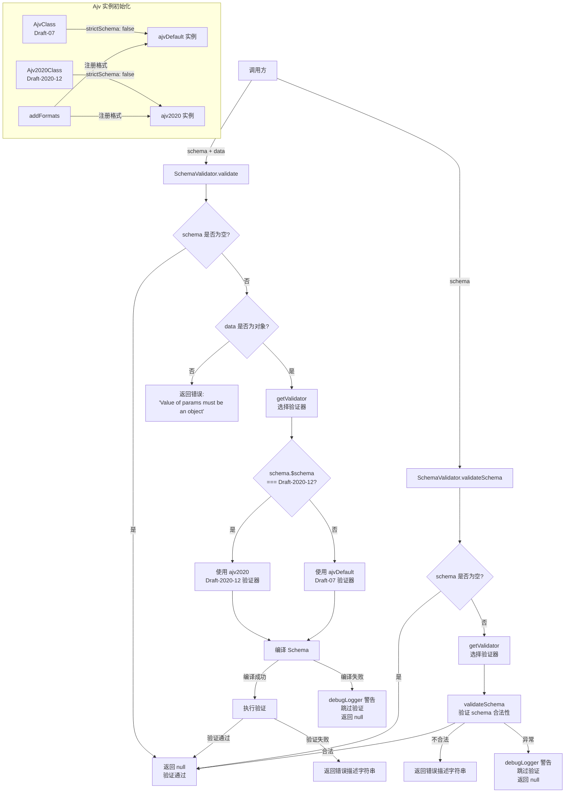

# schemaValidator.ts

## 概述

`schemaValidator.ts` 是 Gemini CLI 核心包中的 **JSON Schema 验证工具模块**。它封装了 [Ajv](https://ajv.js.org/) JSON Schema 验证库，提供了一个统一的 `SchemaValidator` 类来验证数据是否符合给定的 JSON Schema，以及验证 JSON Schema 自身的合法性。该模块的一大特点是 **同时支持 JSON Schema Draft-07 和 Draft-2020-12 两个版本**，并根据 schema 的 `$schema` 字段自动选择合适的验证器。它采用宽容（lenient）策略：当 schema 无法编译（如使用了不支持的 JSON Schema 版本）时，跳过验证而非阻断工具使用，保证了系统的鲁棒性。

## 架构图（Mermaid）



## 核心组件

### 1. `SchemaValidator` 类 — JSON Schema 验证器

该类提供两个静态方法，不需要实例化即可使用。

#### `SchemaValidator.validate(schema, data): string | null`

```typescript
static validate(schema: unknown | undefined, data: unknown): string | null
```

- **功能**: 验证 `data` 是否符合给定的 `schema`。
- **参数**:
  - `schema` (`unknown | undefined`): JSON Schema 对象。如果为 falsy，则跳过验证。
  - `data` (`unknown`): 待验证的数据。
- **返回值**:
  - `null`: 验证通过（或 schema 为空/无法编译）。
  - `string`: 验证失败时的错误描述，格式如 `"params/fieldName must be string"`。
- **处理流程**:
  1. schema 为空 → 返回 `null`（跳过验证）。
  2. data 不是对象或为 `null` → 返回 `"Value of params must be an object"`。
  3. 根据 schema 的 `$schema` 字段选择合适的 Ajv 实例。
  4. 尝试编译 schema → 编译失败则记录警告并返回 `null`（宽容策略）。
  5. 执行验证 → 返回 `null` 或错误描述字符串。

#### `SchemaValidator.validateSchema(schema): string | null`

```typescript
static validateSchema(schema: AnySchema | undefined): string | null
```

- **功能**: 验证 JSON Schema 自身是否合法（元验证）。
- **参数**: `schema` (`AnySchema | undefined`): 待验证的 JSON Schema。
- **返回值**:
  - `null`: schema 合法（或 schema 为空/验证异常）。
  - `string`: schema 不合法时的错误描述。
- **处理流程**:
  1. schema 为空 → 返回 `null`。
  2. 选择合适的 Ajv 实例。
  3. 调用 `validator.validateSchema()` 进行元验证。
  4. 异常 → 记录警告并返回 `null`（宽容策略）。

### 2. `getValidator(schema)` — 验证器选择器（内部函数）

```typescript
function getValidator(schema: AnySchema): Ajv {
  if (
    typeof schema === 'object' &&
    schema !== null &&
    '$schema' in schema &&
    schema.$schema === DRAFT_2020_12_SCHEMA
  ) {
    return ajv2020;
  }
  return ajvDefault;
}
```

- **功能**: 根据 schema 的 `$schema` 字段选择合适的 Ajv 验证器实例。
- **选择逻辑**:
  - `$schema === 'https://json-schema.org/draft/2020-12/schema'` → 使用 `ajv2020`（Draft-2020-12 验证器）。
  - 其他情况（包括无 `$schema` 字段） → 使用 `ajvDefault`（Draft-07 验证器，默认）。

### 3. 模块级 Ajv 实例 — 单例验证器

```typescript
const ajvDefault: Ajv = new AjvClass(ajvOptions);
const ajv2020: Ajv = new Ajv2020Class(ajvOptions);
```

模块在加载时创建两个 Ajv 单例实例，分别对应两个 JSON Schema 版本：

| 实例 | 类 | JSON Schema 版本 | 用途 |
|------|-----|-----------------|------|
| `ajvDefault` | `AjvClass` (Ajv) | Draft-07 | 默认验证器，处理大多数 schema |
| `ajv2020` | `Ajv2020Class` (Ajv2020) | Draft-2020-12 | 处理使用 rmcp 的 MCP 服务器提供的 schema |

两个实例共享相同的配置：

```typescript
const ajvOptions = {
  strictSchema: false,  // 允许 schema 中包含非标准关键字
};
```

### 4. 格式扩展注册

```typescript
const addFormatsFunc = (addFormats as any).default || addFormats;
addFormatsFunc(ajvDefault);
addFormatsFunc(ajv2020);
```

通过 `ajv-formats` 库为两个 Ajv 实例注册标准格式验证（如 `"date"`、`"email"`、`"uri"` 等），使得 schema 中可以使用 `"format"` 关键字进行格式校验。

## 依赖关系

### 内部依赖

| 依赖模块 | 导入方式 | 用途 |
|---------|---------|------|
| `./debugLogger.js` | `import { debugLogger } from './debugLogger.js'` | 在 schema 编译失败或验证异常时输出警告日志 |

### 外部依赖

| 依赖模块 | 导入方式 | 用途 |
|---------|---------|------|
| `ajv` | `import AjvPkg, { type AnySchema, type Ajv } from 'ajv'` | JSON Schema 验证核心库（Draft-07 验证器类和类型定义） |
| `ajv/dist/2020.js` | `import Ajv2020Pkg from 'ajv/dist/2020.js'` | Ajv 的 Draft-2020-12 子包，提供 JSON Schema 2020-12 版本的验证支持 |
| `ajv-formats` | `import * as addFormats from 'ajv-formats'` | Ajv 格式扩展插件，注册标准的 `format` 关键字支持（如 date、email、uri 等） |

## 关键实现细节

### 1. ESM/CJS 互操作处理

模块中多处使用了 `.default || Module` 的模式来处理 ESM 和 CJS 模块系统的互操作性问题：

```typescript
const AjvClass = (AjvPkg as any).default || AjvPkg;
const Ajv2020Class = (Ajv2020Pkg as any).default || Ajv2020Pkg;
const addFormatsFunc = (addFormats as any).default || addFormats;
```

这是因为：
- 在 **CJS** 环境中导入 ESM 模块时，实际构造函数/函数可能挂在 `.default` 属性上。
- 在 **ESM** 环境中，导入值直接就是目标模块。
- `|| Module` 作为回退，确保在两种模块系统中都能正确获取到构造函数。

这是 Ajv 官方文档推荐的处理方式。

### 2. 宽容验证策略（Lenient Validation）

模块在两个关键点采用了宽容策略：

**Schema 编译失败时**（`validate` 方法）：
```typescript
try {
  validate = validator.compile(anySchema);
} catch (error) {
  debugLogger.warn(`Failed to compile schema (...). Skipping parameter validation.`);
  return null; // 跳过验证，而非抛出异常
}
```

**Schema 自身验证失败时**（`validateSchema` 方法）：
```typescript
try {
  const isValid = validator.validateSchema(schema);
  return isValid ? null : validator.errorsText(validator.errors);
} catch (error) {
  debugLogger.warn(`Failed to validate schema (...). Skipping schema validation.`);
  return null; // 跳过验证
}
```

这种策略的设计理由（代码注释中有说明）：
- 对于 Ajv 不支持的 JSON Schema 版本（如 Draft-2019-09 或未来版本），编译会失败。
- 与其因 schema 兼容性问题阻断工具的正常使用，不如跳过验证并记录警告。
- 这与 `mcp-client.ts` 中的 `LenientJsonSchemaValidator` 行为保持一致。

### 3. strictSchema: false 的影响

```typescript
const ajvOptions = { strictSchema: false };
```

将 `strictSchema` 设为 `false` 有以下效果：
- **允许非标准关键字**: JSON Schema 规范允许自定义关键字，Ajv 默认的严格模式会拒绝包含未知关键字的 schema。关闭后，未知关键字会被忽略（符合规范行为）。
- **允许未知格式**: 当 schema 中使用了 `ajv-formats` 未注册的自定义 `format` 值时，不会报错，只会记录日志。
- 这提高了对来自不同 MCP 服务器的多样化 schema 的兼容性。

### 4. 双版本 Schema 支持的背景

模块同时支持 Draft-07 和 Draft-2020-12 两个版本，这是因为：
- **Draft-07**: 是最广泛使用的 JSON Schema 版本，大多数工具和库默认使用此版本。
- **Draft-2020-12**: 是较新的版本，被 `rmcp`（Rust MCP SDK）生成的 MCP 工具 schema 所使用。为了兼容使用 rmcp 的 MCP 服务器，必须支持此版本。

版本选择通过检查 schema 的 `$schema` 字段自动完成，对调用方完全透明。

### 5. 单例模式的性能考量

两个 Ajv 实例在模块加载时创建，之后所有验证操作共享同一对实例。这有两个好处：
- **避免重复初始化开销**: Ajv 实例创建和格式注册只发生一次。
- **编译缓存**: Ajv 内部会缓存已编译的 schema，如果同一个 schema 被多次验证，第二次及以后会直接使用缓存的编译结果，显著提升性能。

### 6. 错误消息格式化

验证失败时，使用 Ajv 的 `errorsText` 方法格式化错误消息：

```typescript
return validator.errorsText(validate.errors, { dataVar: 'params' });
```

`dataVar: 'params'` 使得错误消息中的数据路径以 `params` 为前缀（如 `"params/name must be string"`），这为上层调用方提供了更清晰的错误上下文——表明这些是参数验证错误。
