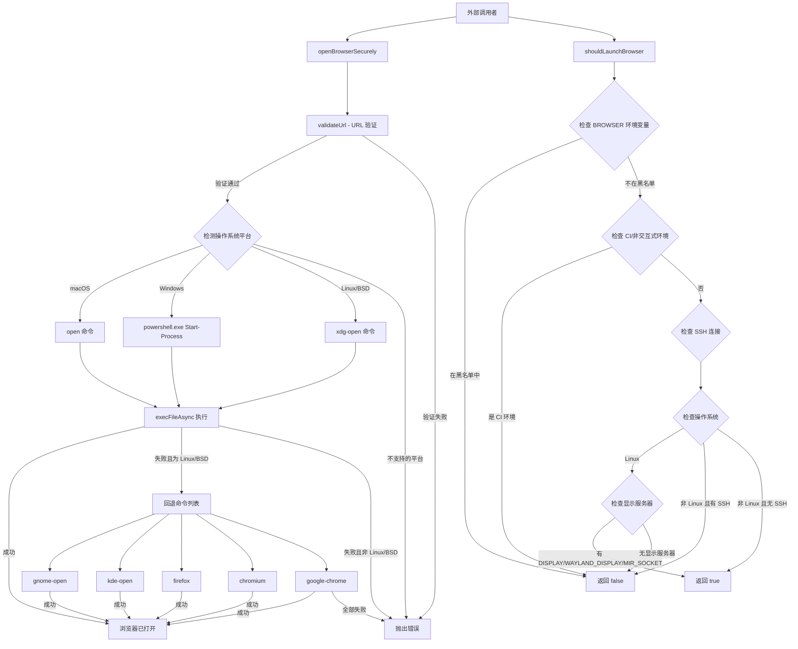

# secure-browser-launcher.ts

## 概述

`secure-browser-launcher.ts` 是一个安全的浏览器启动工具模块，负责在用户的默认浏览器中安全地打开 URL。该模块的核心设计目标是**防止命令注入攻击**，通过严格的 URL 验证、使用 `execFile` 代替 `exec`、以及跨平台的安全启动策略来实现。

该模块导出两个公共函数：
- `openBrowserSecurely(url)` - 安全地在默认浏览器中打开指定 URL
- `shouldLaunchBrowser()` - 检测当前环境是否适合启动浏览器（例如排除 CI/CD、SSH 远程会话等非交互式环境）

## 架构图（Mermaid）



## 核心组件

### 1. `validateUrl(url: string): void`（内部函数）

URL 安全验证函数，执行三层验证：

| 验证层级 | 检查内容 | 防御目标 |
|---------|---------|---------|
| URL 格式验证 | 使用 `new URL()` 解析 | 防止格式错误的 URL |
| 协议白名单 | 仅允许 `http:` 和 `https:` | 防止 `file:`、`javascript:` 等危险协议 |
| 字符过滤 | 拒绝包含 `\r`、`\n` 和控制字符（`\x00-\x1f`）的 URL | 防止 CRLF 注入和命令注入 |

```typescript
function validateUrl(url: string): void {
  let parsedUrl: URL;
  try {
    parsedUrl = new URL(url);
  } catch (_error) {
    throw new Error(`Invalid URL: ${url}`);
  }
  if (parsedUrl.protocol !== 'http:' && parsedUrl.protocol !== 'https:') {
    throw new Error(`Unsafe protocol: ${parsedUrl.protocol}. Only HTTP and HTTPS are allowed.`);
  }
  if (/[\r\n\x00-\x1f]/.test(url)) {
    throw new Error('URL contains invalid characters');
  }
}
```

### 2. `openBrowserSecurely(url: string): Promise<void>`（导出函数）

安全打开浏览器的主函数。关键安全设计：

- **使用 `execFile` 而非 `exec`**：避免 shell 解释特殊字符，防止命令注入
- **URL 作为参数传递**：不拼接命令字符串，而是作为数组元素传入
- **环境变量隔离**：将 `SHELL` 环境变量设为 `undefined`，避免 shell 解释
- **进程分离**：设置 `detached: true` 和 `stdio: 'ignore'`，浏览器进程不阻塞主进程

**平台支持：**

| 平台 | 命令 | 参数 | 备注 |
|------|------|------|------|
| macOS (`darwin`) | `open` | `[url]` | 使用系统原生 `open` 命令 |
| Windows (`win32`) | `powershell.exe` | `['-NoProfile', '-NonInteractive', '-WindowStyle', 'Hidden', '-Command', "Start-Process '...'"]` | 避免使用 `cmd.exe`，对 URL 中的单引号进行转义 |
| Linux/FreeBSD/OpenBSD | `xdg-open` | `[url]` | 失败后依次尝试回退命令 |

**Linux/BSD 回退策略：**
当 `xdg-open` 失败时，依次尝试以下命令：
1. `gnome-open`（GNOME 桌面环境）
2. `kde-open`（KDE 桌面环境）
3. `firefox`
4. `chromium`
5. `google-chrome`

### 3. `shouldLaunchBrowser(): boolean`（导出函数）

环境检测函数，判断当前环境是否适合启动浏览器。检测逻辑如下：

| 检测条件 | 结果 | 说明 |
|---------|------|------|
| `BROWSER` 环境变量在黑名单中（如 `www-browser`） | `false` | 已知不适合图形浏览的浏览器 |
| `CI` 环境变量存在 | `false` | CI/CD 环境 |
| `DEBIAN_FRONTEND=noninteractive` | `false` | Debian 系非交互式模式 |
| Linux 且无 `DISPLAY`/`WAYLAND_DISPLAY`/`MIR_SOCKET` | `false` | 无图形显示服务器 |
| SSH 会话 且非 Linux | `false` | 远程连接无 GUI |
| SSH 会话 且 Linux 且有显示服务器 | `true` | X11 转发场景 |
| 其他情况 | `true` | 假定有 GUI 可用 |

## 依赖关系

### 内部依赖

无内部模块依赖。该模块是一个独立的工具模块。

### 外部依赖

| 模块 | 导入内容 | 用途 |
|------|---------|------|
| `node:child_process` | `execFile` | 安全地执行系统命令（不经过 shell 解释） |
| `node:util` | `promisify` | 将 `execFile` 的回调模式转为 Promise 模式 |
| `node:os` | `platform` | 检测当前操作系统平台 |
| `node:url` | `URL` | URL 解析与验证 |

## 关键实现细节

### 安全防御策略

1. **命令注入防御**：使用 `execFile` 而非 `exec`。`exec` 会通过 shell 执行命令，攻击者可以通过精心构造的 URL（如包含 `;rm -rf /`）注入恶意命令。`execFile` 直接执行二进制文件，参数作为数组传递，不经过 shell 解释。

2. **协议限制**：仅允许 `http:` 和 `https:` 协议，防止 `file:///etc/passwd`、`javascript:alert(1)` 等攻击向量。

3. **控制字符过滤**：正则 `/[\r\n\x00-\x1f]/` 过滤所有 ASCII 控制字符，防止 CRLF 注入、空字节注入等攻击。

4. **Windows 特殊处理**：在 Windows 平台使用 PowerShell 的 `Start-Process` 而非 `cmd.exe` 的 `start` 命令，避免 `cmd.exe` 的 shell 注入风险。URL 中的单引号通过 `replace(/'/g, "''")` 进行转义。

5. **环境变量清理**：将 `SHELL` 环境变量设为 `undefined`，防止子进程被 shell 环境影响。

### 进程管理

- `detached: true`：浏览器进程与 Node.js 父进程分离，不会阻塞 CLI 工具
- `stdio: 'ignore'`：忽略子进程的标准输入/输出/错误流

### 错误处理

- URL 验证失败时立即抛出带有描述性信息的 `Error`
- 不支持的平台抛出 `Error`
- Linux/BSD 平台上主命令失败后逐个尝试回退命令，所有回退都失败后才抛出错误
- 错误信息中包含原始错误的 message 内容
