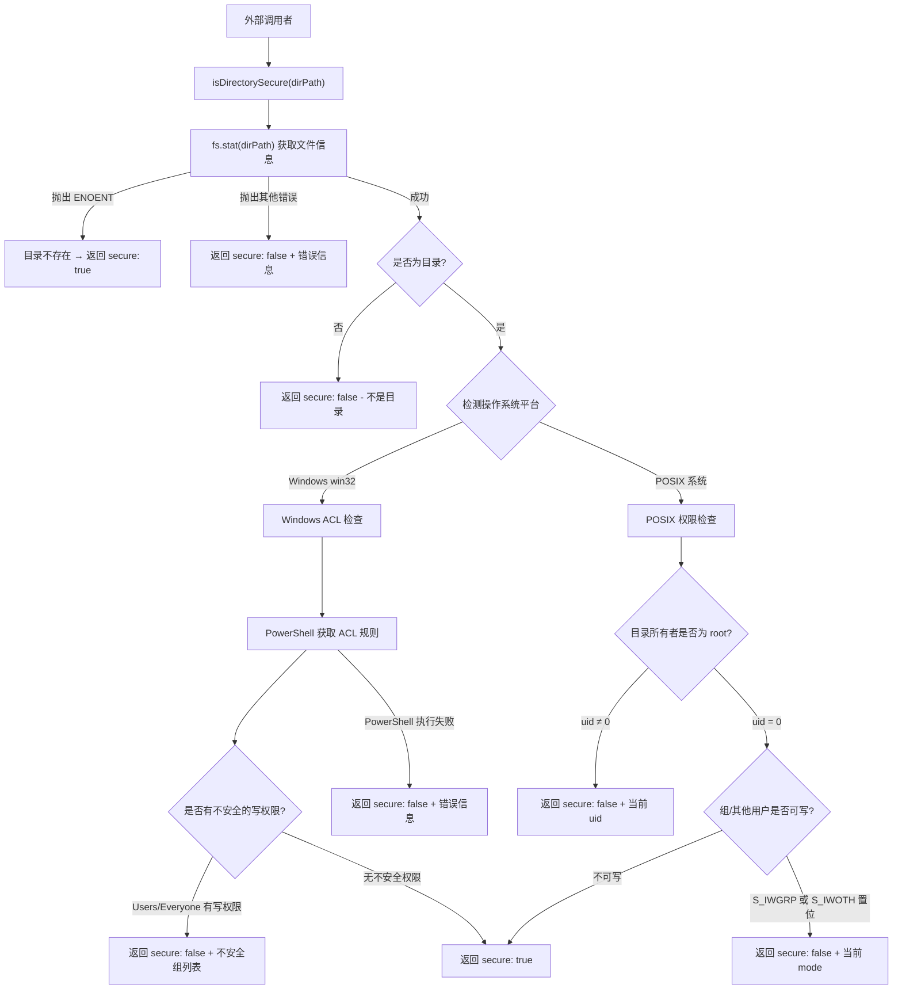

# security.ts

## 概述

`security.ts` 是一个目录安全性检查工具模块，用于验证系统目录是否具有安全的权限配置。该模块的核心功能是检测指定目录是否被 root 用户拥有，以及是否被非授权用户（如普通用户组或"所有人"）可写。

该模块主要用于检查**系统策略目录**的安全性，确保关键配置目录不会被非特权用户篡改。它支持跨平台操作（POSIX 系统和 Windows），并在不安全时提供详细的修复建议。

导出内容：
- `SecurityCheckResult` 接口 - 安全检查结果的类型定义
- `isDirectorySecure(dirPath)` 函数 - 异步检查目录安全性

## 架构图（Mermaid）



## 核心组件

### 1. `SecurityCheckResult` 接口

安全检查结果的类型定义：

```typescript
export interface SecurityCheckResult {
  secure: boolean;   // 目录是否安全
  reason?: string;   // 不安全时的原因说明（包含修复建议）
}
```

- `secure: true` 表示目录权限配置安全
- `secure: false` 时 `reason` 字段会包含详细的不安全原因及修复命令

### 2. `isDirectorySecure(dirPath: string): Promise<SecurityCheckResult>`

主要的安全检查函数，根据操作系统平台采用不同的检查策略：

#### POSIX 系统检查（Linux/macOS/BSD）

执行两项检查：

| 检查项 | 条件 | 修复建议 |
|--------|------|---------|
| 所有权检查 | `stats.uid === 0`（必须为 root 拥有） | `sudo chown root:root "<path>"` |
| 权限检查 | 不可被组用户（`S_IWGRP`）或其他用户（`S_IWOTH`）写入 | `sudo chmod g-w,o-w "<path>"` |

权限位检查使用位与运算：
```typescript
const mode = stats.mode;
if ((mode & (constants.S_IWGRP | constants.S_IWOTH)) !== 0) {
  // 不安全：组或其他用户有写权限
}
```

#### Windows 系统检查

通过 PowerShell 脚本检查 Windows ACL（访问控制列表）：

1. 使用 `Get-Acl` 获取目录的 ACL 规则
2. 筛选出 `Allow` 类型且包含 `Write`、`Modify` 或 `FullControl` 权限的规则
3. 进一步筛选出身份引用包含 `Users` 或 `Everyone` 的规则
4. 如果存在此类规则，报告不安全并列出相关用户组

PowerShell 脚本核心逻辑：
```powershell
$acl = Get-Acl -LiteralPath $path;
$rules = $acl.Access | Where-Object {
    $_.AccessControlType -eq 'Allow' -and
    (($_.FileSystemRights -match 'Write') -or
     ($_.FileSystemRights -match 'Modify') -or
     ($_.FileSystemRights -match 'FullControl'))
};
$insecureIdentity = $rules | Where-Object {
    $_.IdentityReference.Value -match 'Users' -or
    $_.IdentityReference.Value -eq 'Everyone'
};
```

### 错误处理策略

| 错误类型 | 处理方式 |
|---------|---------|
| `ENOENT`（目录不存在） | 返回 `secure: true` - 不存在的目录不构成安全威胁 |
| 其他文件系统错误 | 返回 `secure: false` + 错误信息 |
| PowerShell 执行失败 | 返回 `secure: false` + 建议提交 bug 报告 |

## 依赖关系

### 内部依赖

| 模块 | 导入内容 | 用途 |
|------|---------|------|
| `./shell-utils.js` | `spawnAsync` | 在 Windows 上安全地执行 PowerShell 命令 |

### 外部依赖

| 模块 | 导入内容 | 用途 |
|------|---------|------|
| `node:fs/promises` | `fs`（整体导入） | 异步获取目录元信息（`fs.stat`） |
| `node:fs` | `constants` | 文件权限常量（`S_IWGRP`、`S_IWOTH`） |
| `node:os` | `os`（整体导入） | 检测操作系统平台（`os.platform()`） |

## 关键实现细节

### 安全设计理念

该模块的设计遵循"**最小权限原则**"：系统策略目录应仅由 root/管理员拥有并控制写权限，普通用户不应具有修改这些目录的能力。

### ENOENT 返回 secure: true 的设计考虑

当目录不存在时返回 `secure: true`，这是因为：
- 该模块用于检查系统策略目录（如 `/etc/gemini` 之类的路径）
- 如果策略目录不存在，说明没有系统级策略被配置
- 不存在的目录不构成安全威胁，不需要阻止程序运行

### Windows 路径转义

在构造 PowerShell 脚本时，对目录路径中的单引号进行转义处理：
```typescript
const escapedPath = dirPath.replace(/'/g, "''");
```
这确保包含单引号的目录路径不会导致 PowerShell 脚本语法错误或注入攻击。

### 权限位运算

POSIX 权限检查使用的位常量：
- `constants.S_IWGRP`（`0o020`）：组用户写权限
- `constants.S_IWOTH`（`0o002`）：其他用户写权限

通过位或（`|`）组合后与文件模式进行位与（`&`）运算，如果结果非零则表示存在不安全的写权限。
