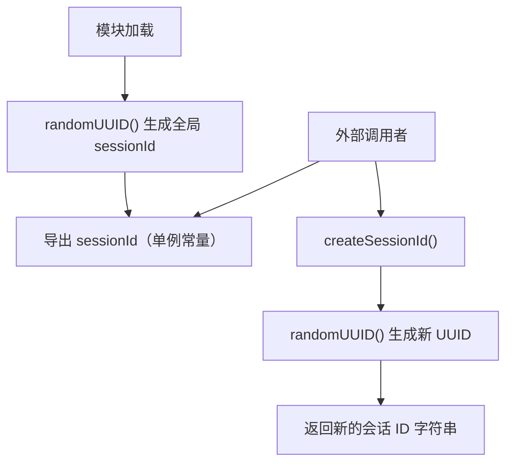

# session.ts

## 概述

`session.ts` 是一个极其简洁的会话标识符生成模块。它提供两种方式获取会话 ID：

1. **模块级单例 `sessionId`**：在模块首次被导入时自动生成的 UUID v4，整个应用生命周期内保持不变。适用于标识当前进程的全局会话。
2. **工厂函数 `createSessionId()`**：按需生成新的 UUID v4，适用于需要创建独立子会话的场景。

会话 ID 采用 UUID v4 格式（如 `550e8400-e29b-41d4-a716-446655440000`），基于加密安全的随机数生成。

## 架构图（Mermaid）



## 核心组件

### 1. `sessionId`（导出常量）

```typescript
export const sessionId = randomUUID();
```

- **类型**：`string`
- **生命周期**：模块加载时创建，进程结束时销毁
- **唯一性**：每次进程启动时生成新的 UUID，同一进程内所有导入者共享同一个值
- **用途**：作为当前 CLI 会话的全局唯一标识符，可能用于日志关联、遥测数据标记、API 请求追踪等

### 2. `createSessionId(): string`（导出函数）

```typescript
export function createSessionId(): string {
  return randomUUID();
}
```

- **返回值**：新生成的 UUID v4 字符串
- **无状态**：每次调用都生成全新的 UUID，不依赖任何外部状态
- **用途**：在需要为子任务、子代理或独立操作创建单独的会话标识时使用

## 依赖关系

### 内部依赖

无内部模块依赖。该模块完全自包含。

### 外部依赖

| 模块 | 导入内容 | 用途 |
|------|---------|------|
| `node:crypto` | `randomUUID` | 生成加密安全的 UUID v4 标识符 |

## 关键实现细节

### 模块级初始化模式

`sessionId` 利用了 ES 模块的特性：模块代码在首次 `import` 时执行，且后续导入会复用已缓存的模块实例。这意味着：

- 所有导入 `sessionId` 的模块获得的是**同一个值**
- 不需要额外的单例管理逻辑
- 值在模块加载时立即可用，无需异步初始化

### UUID v4 的安全性

`node:crypto` 的 `randomUUID()` 使用加密安全的随机数生成器（CSPRNG），确保生成的 UUID 具有：

- **不可预测性**：无法通过已知 UUID 推断其他会话的 UUID
- **极低碰撞概率**：UUID v4 提供 122 位随机性，碰撞概率约为 2^(-61)

### 设计简洁性

该模块仅 13 行代码（含注释），体现了"单一职责原则"。会话 ID 的生成逻辑被隔离在独立模块中，便于：

- 在测试中通过模块 mock 替换会话 ID
- 集中管理会话标识的生成策略
- 未来扩展（如添加会话元数据、持久化等）而不影响使用方
