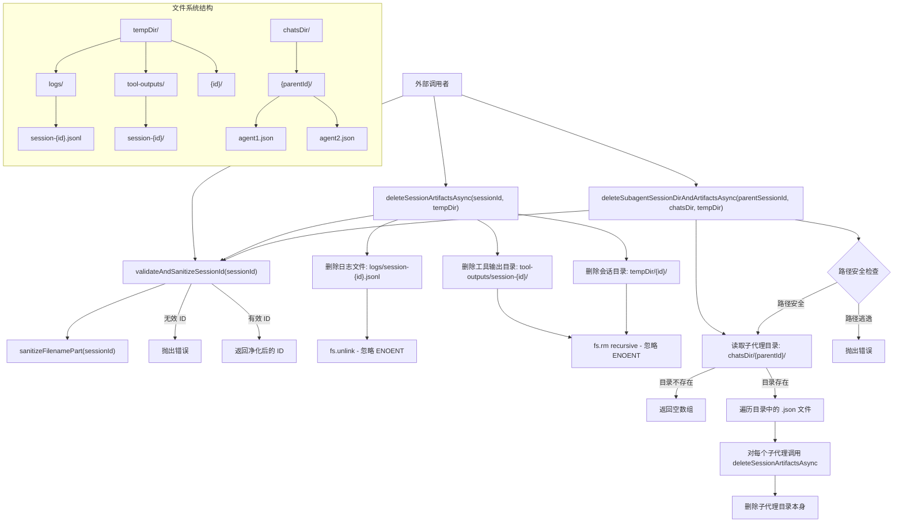

# sessionOperations.ts

## 概述

`sessionOperations.ts` 是一个会话资产（Artifacts）管理模块，负责安全地清理和删除与特定会话关联的所有文件系统资源。该模块处理的资源包括：

- **活动日志文件**（`logs/session-<id>.jsonl`）
- **工具输出目录**（`tool-outputs/session-<id>/`）
- **会话临时目录**（`<tempDir>/<id>/`）
- **子代理（Subagent）会话文件和关联资产**

该模块的设计重点是**安全性**和**健壮性**：通过会话 ID 的验证与净化防止路径遍历攻击，通过优雅的错误处理确保清理操作尽可能完成而不中断。

导出内容：
- `validateAndSanitizeSessionId(sessionId)` - 验证并净化会话 ID
- `deleteSessionArtifactsAsync(sessionId, tempDir)` - 删除单个会话的所有资产
- `deleteSubagentSessionDirAndArtifactsAsync(parentSessionId, chatsDir, tempDir)` - 删除父会话下所有子代理的资产

## 架构图（Mermaid）



## 核心组件

### 1. `validateAndSanitizeSessionId(sessionId: string): string`

会话 ID 的安全验证和净化函数，是其他两个操作函数的安全基础。

**验证规则：**

| 检查步骤 | 条件 | 结果 |
|---------|------|------|
| 空值检查 | `!sessionId` | 抛出 `Invalid sessionId` 错误 |
| 路径遍历检查 | `sessionId === '.'` 或 `'..'` | 抛出 `Invalid sessionId` 错误 |
| 文件名净化 | 调用 `sanitizeFilenamePart()` | 移除不安全字符 |
| 净化结果检查 | 净化后为空字符串 | 抛出 `Invalid sessionId after sanitization` 错误 |

```typescript
export function validateAndSanitizeSessionId(sessionId: string): string {
  if (!sessionId || sessionId === '.' || sessionId === '..') {
    throw new Error(`Invalid sessionId: ${sessionId}`);
  }
  const sanitized = sanitizeFilenamePart(sessionId);
  if (!sanitized) {
    throw new Error(`Invalid sessionId after sanitization: ${sessionId}`);
  }
  return sanitized;
}
```

### 2. `deleteSessionArtifactsAsync(sessionId: string, tempDir: string): Promise<void>`

异步删除指定会话的所有文件系统资产。按顺序清理三类资源：

| 步骤 | 目标路径 | 删除方式 | 错误处理 |
|------|---------|---------|---------|
| 1 | `<tempDir>/logs/session-<id>.jsonl` | `fs.unlink` | 忽略 `ENOENT` |
| 2 | `<tempDir>/tool-outputs/session-<id>/` | `fs.rm` (recursive) | 忽略 `ENOENT` |
| 3 | `<tempDir>/<id>/` | `fs.rm` (recursive) | 忽略 `ENOENT` |

**常量定义：**
```typescript
const LOGS_DIR = 'logs';           // 日志文件目录名
const TOOL_OUTPUTS_DIR = 'tool-outputs';  // 工具输出目录名
```

**错误处理策略：**
- 单个文件/目录删除失败（非 `ENOENT`）时向上抛出
- 整体操作被外层 try-catch 捕获，错误通过 `debugLogger.error` 记录但不会抛出到调用者
- 这种设计确保清理操作是"尽力而为"的，不会因清理失败而中断主业务流程

### 3. `deleteSubagentSessionDirAndArtifactsAsync(parentSessionId, chatsDir, tempDir): Promise<void>`

删除父会话下所有子代理（Subagent）的会话资产及其目录。工作流程：

1. **验证并净化**父会话 ID
2. **安全路径检查**：确保构造的子代理目录路径不会逃逸出 `chatsDir`
3. **读取子代理目录**：列出 `chatsDir/<parentId>/` 下所有 `.json` 文件
4. **逐个清理子代理**：对每个 `.json` 文件，提取代理 ID（文件名去掉 `.json` 扩展名），调用 `deleteSessionArtifactsAsync` 删除其关联资产
5. **删除子代理目录本身**

**路径安全检查：**
```typescript
if (!subagentDir.startsWith(chatsDir + path.sep)) {
  throw new Error(`Dangerous subagent directory path: ${subagentDir}`);
}
```
这防止了通过构造特殊的 `parentSessionId`（如含有 `../` 的值）来进行路径遍历攻击，确保操作范围始终在 `chatsDir` 内。

**错误处理策略：**
- 目录不存在时返回空数组，优雅跳过
- 清理过程中出错时记录日志，并尝试强制删除子代理目录
- 最后的 `fs.rm` 失败会被静默忽略（`catch(() => {})`），确保不会因清理失败而抛出异常

## 依赖关系

### 内部依赖

| 模块 | 导入内容 | 用途 |
|------|---------|------|
| `./fileUtils.js` | `sanitizeFilenamePart` | 净化文件名中的不安全字符（防止路径遍历和注入） |
| `./debugLogger.js` | `debugLogger` | 记录调试级别的错误日志 |

### 外部依赖

| 模块 | 导入内容 | 用途 |
|------|---------|------|
| `node:fs/promises` | `fs`（整体导入） | 异步文件系统操作（`unlink`、`rm`、`readdir`） |
| `node:path` | `path`（默认导入） | 路径拼接与操作（`join`、`basename`、`sep`） |

## 关键实现细节

### 幂等的删除操作

所有删除操作都遵循"忽略 ENOENT"的模式：

```typescript
await fs.unlink(logPath).catch((err: NodeJS.ErrnoException) => {
  if (err.code !== 'ENOENT') throw err;
});
```

这意味着删除操作是**幂等的**——多次调用同一会话 ID 的删除不会报错。对于文件不存在的情况（`ENOENT`），视为"已经被删除"而非错误。

### 防御性路径构造

目录路径通过 `path.join` 构造，并使用净化后的会话 ID：
```typescript
const logPath = path.join(logsDir, `session-${safeSessionId}.jsonl`);
```

文件名前缀 `session-` 进一步降低了与其他非会话文件冲突的可能性。

### 子代理级联清理

子代理清理采用**级联删除**模式：
1. 先删除每个子代理的独立资产（日志、工具输出、临时目录）
2. 再删除包含子代理文件的目录

这确保了即使子代理的 `.json` 文件丢失，关联的日志和工具输出仍会被清理。

### 错误日志与静默策略

该模块使用 `debugLogger.error` 而非 `console.error` 记录错误，这意味着：
- 在正常运行模式下，清理错误不会显示给用户
- 在调试模式下，可以追踪清理过程中的问题
- 清理操作不会因错误而阻断主流程

### 文件系统资产组织结构

```
tempDir/
├── logs/
│   ├── session-<id1>.jsonl
│   └── session-<id2>.jsonl
├── tool-outputs/
│   ├── session-<id1>/
│   │   └── (工具输出文件)
│   └── session-<id2>/
│       └── (工具输出文件)
├── <id1>/
│   └── (会话临时文件)
└── <id2>/
    └── (会话临时文件)

chatsDir/
└── <parentSessionId>/
    ├── subagent1.json
    ├── subagent2.json
    └── ...
```
