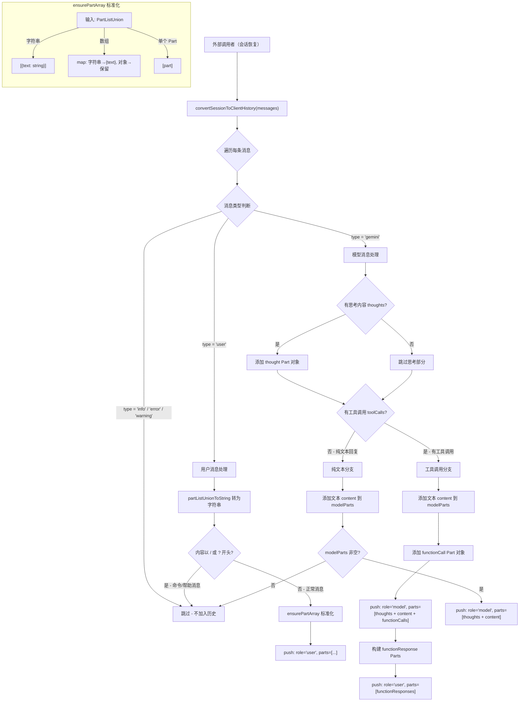

# sessionUtils.ts

## 概述

`sessionUtils.ts` 是一个会话数据转换工具模块，负责将内部的会话/对话记录格式（`ConversationRecord`）转换为 Gemini API 客户端所需的历史消息格式。这个转换过程是恢复（Resume）或继续之前会话时的关键步骤。

该模块的核心功能是将应用层的消息记录（包含用户消息、模型回复、工具调用、思考过程等）映射为 Gemini API 可理解的 `{ role, parts }` 格式的消息数组。

导出内容：
- `convertSessionToClientHistory(messages)` - 将会话消息记录转换为 Gemini 客户端历史格式

## 架构图（Mermaid）



## 核心组件

### 1. `ensurePartArray(content: PartListUnion): Part[]`（内部函数）

将 `PartListUnion` 类型统一转换为 `Part[]` 数组。`PartListUnion` 可以是以下三种形式之一：

| 输入类型 | 转换逻辑 | 输出 |
|---------|---------|------|
| `string` | 包装为 `{ text: string }` | `[{ text: content }]` |
| `Array<string \| Part>` | 遍历数组，字符串包装为 `{ text }` | `Part[]` |
| `Part`（单个对象） | 直接包装为数组 | `[content]` |

```typescript
function ensurePartArray(content: PartListUnion): Part[] {
  if (Array.isArray(content)) {
    return content.map((part) =>
      typeof part === 'string' ? { text: part } : part,
    );
  }
  if (typeof content === 'string') {
    return [{ text: content }];
  }
  return [content];
}
```

### 2. `convertSessionToClientHistory(messages): Array<{ role: 'user' | 'model'; parts: Part[] }>`

会话格式转换的核心函数。处理逻辑按消息类型分为多个分支：

#### 消息过滤规则

| 消息类型 | 处理方式 | 原因 |
|---------|---------|------|
| `info` | 跳过 | 系统信息消息，不属于对话内容 |
| `error` | 跳过 | 错误消息，不属于对话内容 |
| `warning` | 跳过 | 警告消息，不属于对话内容 |
| `user`（以 `/` 开头） | 跳过 | 斜杠命令（如 `/help`、`/clear`），不应传给 API |
| `user`（以 `?` 开头） | 跳过 | 帮助查询，不应传给 API |
| `user`（其他） | 处理 | 正常的用户输入 |
| `gemini` | 处理 | 模型回复（含文本、思考、工具调用） |

#### 用户消息处理（`type === 'user'`）

1. 使用 `partListUnionToString` 将内容转为字符串进行命令检测
2. 过滤掉以 `/` 或 `?` 开头的命令消息
3. 使用 `ensurePartArray` 标准化 `msg.content` 为 `Part[]`
4. 生成 `{ role: 'user', parts: [...] }` 格式的历史记录项

#### 模型消息处理（`type === 'gemini'`）

模型消息处理更为复杂，分为以下阶段：

**阶段 1 - 思考内容（Thoughts）处理：**
```typescript
if (msg.thoughts && msg.thoughts.length > 0) {
  for (const thought of msg.thoughts) {
    const thoughtText = thought.subject
      ? `**${thought.subject}** ${thought.description}`
      : thought.description;
    modelParts.push({ text: thoughtText, thought: true } as Part);
  }
}
```
- 将思考内容转为带 `thought: true` 标记的 Part 对象
- 如果思考有 `subject`，格式化为 `**subject** description`

**阶段 2a - 有工具调用的消息：**

生成两条历史记录项：

1. **模型回复**（`role: 'model'`）：包含思考内容 + 文本内容 + `functionCall` Part
   ```typescript
   {
     functionCall: {
       name: toolCall.name,
       args: toolCall.args,
       ...(toolCall.id && { id: toolCall.id }),
     }
   }
   ```

2. **工具执行结果**（`role: 'user'`）：包含 `functionResponse` Part
   ```typescript
   {
     functionResponse: {
       id: toolCall.id,
       name: toolCall.name,
       response: { output: toolCall.result },
     }
   }
   ```

**工具结果（`toolCall.result`）的三种处理方式：**

| 结果类型 | 处理逻辑 |
|---------|---------|
| `string` | 包装为 `functionResponse` 对象，包含 `id`、`name`、`response.output` |
| `Array` | 通过 `ensurePartArray` 标准化后直接添加到响应 Parts |
| `Part` 对象 | 直接使用（假设已经是正确的 `functionResponse` 格式） |

**阶段 2b - 无工具调用的纯文本消息：**

将思考内容 + 文本内容合并为单条 `{ role: 'model', parts: [...] }` 记录。

## 依赖关系

### 内部依赖

| 模块 | 导入内容 | 用途 |
|------|---------|------|
| `../services/chatRecordingService.js` | `ConversationRecord`（类型） | 会话记录的类型定义，提供 `messages` 的类型结构 |
| `../core/geminiRequest.js` | `partListUnionToString` | 将 `PartListUnion` 转为纯文本字符串，用于命令检测 |

### 外部依赖

| 模块 | 导入内容 | 用途 |
|------|---------|------|
| `@google/genai` | `Part`（类型）、`PartListUnion`（类型） | Gemini API 的核心数据类型定义 |

## 关键实现细节

### Gemini API 的消息格式要求

Gemini API 的对话历史采用严格的 `role` 交替格式：
- `role: 'user'` - 用户端消息（包括用户输入和工具执行结果）
- `role: 'model'` - 模型端消息（包括文本回复和工具调用请求）

工具调用遵循以下模式：
```
user: "请帮我执行..."
model: [文本内容] + [functionCall: {name, args}]
user: [functionResponse: {name, response}]
model: "执行结果是..."
```

注意：工具执行结果使用 `role: 'user'` 角色，这是 Gemini API 的设计约定。

### 命令消息的过滤

以 `/` 或 `?` 开头的用户输入被视为客户端命令（如 `/help`、`/clear`、`?search`），这些命令是本地处理的，不应出现在发送给 API 的对话历史中。检测时使用 `trim()` 去除前后空白。

### 思考内容的保留

模型的"思考过程"（thoughts）被保留在历史记录中，并通过 `thought: true` 属性标记。这使得 Gemini API 在后续对话中能够理解模型之前的推理过程。思考格式化为：
- 有主题时：`**主题** 描述内容`
- 无主题时：直接使用描述内容

### 多模态完整性

在有工具调用的消息中，原始的 `msg.content`（可能包含图片、代码等多模态内容）被完整保留在 `modelParts` 中，与 `functionCall` Parts 并存。代码注释明确标注了这一设计意图：
```typescript
// Preserve original parts to maintain multimodal integrity
if (msg.content) {
  modelParts.push(...ensurePartArray(msg.content));
}
```

### 工具调用 ID 的可选性

工具调用的 `id` 字段是可选的，通过条件展开运算符处理：
```typescript
...(toolCall.id && { id: toolCall.id }),
```
这确保了向后兼容性——旧版本的会话记录可能不包含工具调用 ID。

### 空消息的过滤

在纯文本分支中，如果 `modelParts` 为空（即没有思考内容也没有文本内容），则不会生成历史记录项。这防止了空的模型消息被插入到对话历史中：
```typescript
if (modelParts.length > 0) {
  clientHistory.push({ role: 'model', parts: modelParts });
}
```
