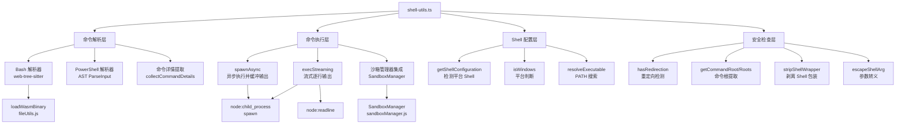

# shell-utils.ts

## 概述

`shell-utils.ts` 是 Gemini CLI 核心包中的 Shell 命令工具模块，提供跨平台（Bash / PowerShell / cmd）的命令解析、执行、安全检查等功能。该模块是 CLI 工具执行用户 Shell 命令的基础设施层，负责：

1. **命令解析**：使用 `web-tree-sitter`（Bash）和 PowerShell AST 进行精准的命令语法解析
2. **命令执行**：提供异步 spawn 和流式输出两种执行模式，并集成沙箱管理器
3. **安全检查**：重定向检测、命令名提取、Shell 包装器剥离等安全防护机制
4. **跨平台适配**：自动检测并配置 Bash / PowerShell / cmd 的 Shell 环境

## 架构图（Mermaid）



## 核心组件

### 1. 类型定义

#### `ShellType`
```typescript
export type ShellType = 'cmd' | 'powershell' | 'bash';
```
Shell 类型标识符，用于区分不同平台的 Shell 环境。

#### `ShellConfiguration`
```typescript
export interface ShellConfiguration {
  executable: string;      // Shell 可执行文件路径
  argsPrefix: string[];    // 执行命令的参数前缀
  shell: ShellType;        // Shell 类型标识
}
```
定义了在特定 Shell 中执行命令字符串所需的配置，配合 `spawn(executable, [...argsPrefix, commandString], { shell: false })` 模式使用。

#### `ParsedCommandDetail`
```typescript
export interface ParsedCommandDetail {
  name: string;        // 命令名称（如 "ls"、"git"）
  text: string;        // 命令完整文本
  startIndex: number;  // 在原始字符串中的起始位置
}
```
解析后的命令详情，用于安全检查和权限判断。

#### `CommandParseResult`
```typescript
interface CommandParseResult {
  details: ParsedCommandDetail[];  // 所有解析出的命令
  hasError: boolean;               // 是否存在解析错误
  hasRedirection?: boolean;        // 是否包含重定向
}
```

### 2. Shell 配置与平台检测

#### `isWindows()`
检测当前运行平台是否为 Windows（`os.platform() === 'win32'`）。

#### `getShellConfiguration()`
根据当前平台自动选择 Shell 配置：
- **Windows**：优先使用 `ComSpec` 环境变量指定的 Shell（支持 PowerShell/pwsh），默认回退到 `powershell.exe`
- **Unix/macOS**：使用 `bash -c` 模式

#### `resolveExecutable(exe: string)`
异步解析可执行文件的完整路径：
- 如果是绝对路径，直接检查可执行权限
- 否则遍历 `PATH` 环境变量搜索（Windows 额外检查 `.exe`、`.cmd`、`.bat` 扩展名）

### 3. Tree-Sitter Bash 解析器

#### 初始化机制
```
全局状态变量:
  - bashLanguage: Language | null         -- 加载的 Bash 语言实例
  - treeSitterInitialization: Promise     -- 初始化 Promise（单例）
  - treeSitterInitializationError: Error  -- 初始化错误
```

#### `initializeShellParsers()`
采用单例模式初始化 tree-sitter 解析器，加载 `tree-sitter.wasm` 和 `tree-sitter-bash.wasm` 二进制文件。初始化失败时不抛出异常，而是记录调试日志，允许应用回退到安全默认值（ASK_USER）或正则检查。

#### `loadBashLanguage()`
并行加载两个 WASM 二进制：
1. `web-tree-sitter/tree-sitter.wasm` — tree-sitter 运行时
2. `tree-sitter-bash/tree-sitter-bash.wasm` — Bash 语法定义

#### `parseCommandTree(command, timeoutMicros)`
使用 tree-sitter 解析命令字符串为语法树，内置 **1 秒超时保护**（通过 `progressCallback` 实现）。超时返回 `null` 避免部分语法树带来的安全风险。

#### `collectCommandDetails(root, source)`
深度优先遍历语法树，提取所有命令节点的详细信息，支持的节点类型包括：
- `command` — 普通命令
- `declaration_command` — 声明命令（如 `export`、`local`）
- `unset_command` — unset 命令
- `test_command` — 测试命令（`[`、`[[`）
- `file_redirect` — 文件重定向（`<`、`>`）
- `heredoc_redirect` — Here Document（`<<`）
- `herestring_redirect` — Here String（`<<<`）

#### `hasPromptCommandTransform(root)`
检测 Bash 扩展中的 `@P`（Prompt Command Transform）模式，这是一个潜在的安全风险点，会导致命令被标记为有错误。

### 4. PowerShell 解析器

#### `POWERSHELL_PARSER_SCRIPT`
预编码为 UTF-16LE Base64 的 PowerShell 脚本，通过 `-EncodedCommand` 标志传递，避免引号/转义的脆弱性问题。

该脚本的核心逻辑：
1. 从环境变量 `__GCLI_POWERSHELL_COMMAND__` 读取命令文本
2. 使用 `[System.Management.Automation.Language.Parser]::ParseInput()` 进行 AST 解析
3. 遍历所有 `CommandAst` 节点，提取命令名称和文本
4. 以 JSON 格式输出结果

#### `parsePowerShellCommandDetails(command, executable)`
通过 `spawnSync` 同步调用 PowerShell 进程执行解析脚本，返回解析结果。

### 5. 命令解析统一入口

#### `parseCommandDetails(command)`
根据当前 Shell 配置，分发到对应的解析器：
- PowerShell → `parsePowerShellCommandDetails()`
- Bash → `parseBashCommandDetails()`
- 其他 → 返回 `null`

#### `getCommandName(command, args)`
提取命令的主要名称，过滤掉 `shopt`、`set` 等 Shell 内建命令。

#### `getCommandRoot(command)` / `getCommandRoots(command)`
提取命令根名称（单个/多个），用于权限检查。过滤掉重定向相关的伪命令名。

#### `splitCommands(command)`
将链式命令（`&&`、`||`、`;`）拆分为独立命令列表。

### 6. 安全工具函数

#### `stripShellWrapper(command)`
剥离外层 Shell 包装器，支持模式：
- `sh/bash/zsh -c "..."`
- `cmd.exe /c "..."`
- `powershell.exe [-NoProfile] -Command "..."`
- `pwsh.exe [-NoProfile] -Command "..."`

#### `hasRedirection(command)`
检测命令是否包含重定向操作符，优先使用解析器精确检测，回退到正则匹配 `/[><]/`。

#### `escapeShellArg(arg, shell)`
Shell 参数转义：
- **PowerShell**：单引号包裹，内部单引号双写
- **cmd**：双引号包裹，内部双引号双写
- **Bash**：使用 `shell-quote` 库的 POSIX 转义

#### `extractStringFromParseEntry(entry)`
从 `shell-quote` 库的 `ParseEntry` 类型中提取字符串表示。

### 7. 命令执行

#### `spawnAsync(command, args, options)`
异步执行命令并缓冲全部输出：
- 集成 `SandboxManager` 预处理命令
- 返回 `{ stdout, stderr }` 结果
- 非零退出码时 reject

#### `execStreaming(command, args, options)`
流式执行命令，逐行 yield 输出（`AsyncGenerator`）：
- 通过 `readline.createInterface` 将 stdout 按行分割
- 支持 `AbortSignal` 取消
- 支持 `allowedExitCodes` 自定义合法退出码
- stderr 最多缓冲 20KB
- 消费方提前 break 时自动 kill 子进程
- 集成 `SandboxManager` 沙箱执行

### 8. 常量定义

#### `SHELL_TOOL_NAMES`
```typescript
export const SHELL_TOOL_NAMES = ['run_shell_command', 'ShellTool'];
```
Shell 工具名称常量，用于标识 Shell 执行工具。

#### `PARSE_TIMEOUT_MICROS`
```typescript
const PARSE_TIMEOUT_MICROS = 1000 * 1000; // 1 秒
```
tree-sitter 解析超时阈值。

#### `REDIRECTION_NAMES`
```typescript
const REDIRECTION_NAMES = new Set([
  'redirection (<)', 'redirection (>)',
  'heredoc (<<)', 'herestring (<<<)',
]);
```
重定向操作名称集合，用于在命令拆分和根命令提取时过滤。

## 依赖关系

### 内部依赖

| 模块 | 用途 |
|------|------|
| `./fileUtils.js` | `loadWasmBinary()` — 加载 WASM 二进制文件 |
| `./debugLogger.js` | `debugLogger` — 调试日志记录 |
| `../services/sandboxManager.js` | `SandboxManager` / `NoopSandboxManager` — 沙箱命令预处理 |

### 外部依赖

| 包名 | 用途 |
|------|------|
| `node:os` | 平台检测（`os.platform()`） |
| `node:fs` | 文件系统访问（检查可执行权限） |
| `node:path` | 路径操作（`path.join`、`path.basename`、`path.delimiter`） |
| `node:child_process` | 进程管理（`spawn`、`spawnSync`） |
| `node:readline` | 流式输出按行读取 |
| `shell-quote` | Shell 参数转义（`quote`）和解析入口类型（`ParseEntry`） |
| `web-tree-sitter` | 通用语法树解析器（`Language`、`Parser`、`Query`、`Node`、`Tree`） |

## 关键实现细节

1. **Tree-Sitter 单例初始化**：`initializeShellParsers()` 使用 Promise 缓存模式确保 WASM 加载只执行一次。初始化失败时将 `treeSitterInitialization` 置为 `null`，允许后续重试。错误被记录但不抛出，保证应用不会因解析器初始化失败而崩溃。

2. **解析超时保护**：`parseCommandTree()` 通过 `progressCallback` 实现 1 秒超时检查。超时后返回 `null` 而非部分语法树，这是一个重要的安全决策——部分语法树可能遗漏危险命令。

3. **PowerShell 编码命令**：将解析脚本预编码为 UTF-16LE Base64 并通过 `-EncodedCommand` 传递，这是 PowerShell 推荐的避免引号转义问题的方式。命令文本通过环境变量 `__GCLI_POWERSHELL_COMMAND__` 传入，进一步避免命令行注入。

4. **流式执行的资源管理**：`execStreaming()` 中精心处理了多种终止场景：
   - `AbortSignal` 中断 → 立即 kill 子进程
   - 消费方提前 break → 自动 kill 子进程（`killedByGenerator`）
   - 正常结束 → 检查退出码
   - stderr 缓冲限制 20KB 防止内存溢出

5. **命令名规范化**：`normalizeCommandName()` 处理了引号包裹的命令名（如 `"git"` → `git`），这在某些 Shell 环境中是合法的语法。

6. **Prompt Command Transform 检测**：`hasPromptCommandTransform()` 检测 `${var@P}` 模式，该 Bash 特性会将变量值按 PS1 格式展开，可能触发命令执行，因此被标记为潜在危险。

7. **沙箱集成**：`spawnAsync` 和 `execStreaming` 都通过 `SandboxManager.prepareCommand()` 对命令进行预处理，默认使用 `NoopSandboxManager`（无操作沙箱），允许上层注入实际的沙箱策略。

8. **跨平台 Shell 配置**：Windows 下优先检查 `ComSpec` 环境变量以尊重用户配置的默认 Shell，支持 PowerShell 和 pwsh（PowerShell Core）。Unix 下统一使用 Bash。
